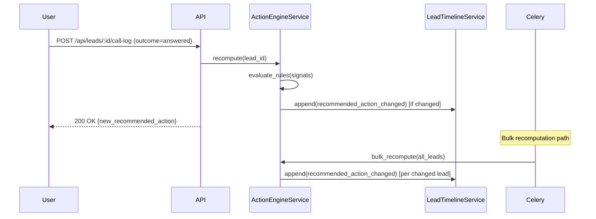

# Design Document: Actionable Lead Command Center

## Overview

The Actionable Lead Command Center transforms the existing real estate deal sourcing platform into the user's primary day-to-day CRM. The platform already holds leads, HubSpot history, property analysis data, and basic scoring — but provides no guidance on what to do next. This feature closes that gap.

The design introduces three new backend constructs — a **Lead Status model** (expanded enum), a **Task model** (CRM-specific, distinct from the existing generic Task), and a **Timeline model** (append-only activity log) — plus a deterministic **Action Engine** that assigns a single `Recommended_Action` to every active lead. These power seven queue views and a Lead Command Center detail page.

### Key Design Decisions

**Extend the existing `leads` table rather than create a new one.** The existing `Property`/`Lead` model already holds all signal data. New columns (`lead_status`, `recommended_action`, `last_contact_date`, etc.) are added via Alembic migration. This avoids a data migration and keeps the existing lead list, scoring, and import flows intact.

**Introduce a new `LeadTask` model separate from the existing generic `Task` model.** The existing `Task` model is a generic CRM task tied to any target via `TaskAssociation`. The new `LeadTask` is a first-class CRM construct with typed task types, a direct `lead_id` foreign key, and lifecycle semantics (open → completed, snooze, overdue) required by the requirements. This avoids polluting the generic task model with CRM-specific fields.

**Introduce a new `LeadTimelineEntry` model separate from the existing `Interaction` model.** The existing `Interaction` model covers notes and calls but lacks the event-type vocabulary (status_changed, recommended_action_changed, task_completed, etc.) required by the Timeline spec. A new append-only model is cleaner than retrofitting the existing one.

**Action Engine as a pure Python service + Celery task.** The engine is a stateless function: `compute_recommended_action(signals: LeadSignals) -> RecommendedAction | None`. It is called synchronously on signal changes and dispatched as a Celery task for bulk recomputation. This matches the existing `DeterministicScoringEngine` pattern.

**Queue endpoints as filtered SQL queries, not materialized views.** Queue membership is computed on-demand via indexed SQL queries. This avoids cache invalidation complexity while meeting the 5-second update requirement. Indexes on `lead_status`, `recommended_action`, `has_property_match`, and `follow_up_overdue` make these queries fast.

---

## Architecture

The feature follows the existing monorepo architecture: Flask backend with SQLAlchemy models, service classes, and Blueprint controllers; React/TypeScript frontend with React Query and MUI.

```mermaid
graph TD
    subgraph Frontend
        A[App.tsx / Router] --> B[QueueSidebar]
        A --> C[TodaysActionQueue]
        A --> D[LeadCommandCenter]
        A --> E[PreviouslyWarmQueue]
        A --> F[FollowUpOverdueQueue]
        A --> G[NoNextActionQueue]
        A --> H[NeedsReviewQueue]
        A --> I[DoNotContactQueue]
        A --> J[MissingPropertyMatchQueue]
        D --> K[RecommendedActionPanel]
        D --> L[LeadTaskList]
        D --> M[LeadTimeline]
        D --> N[LogNoteForm]
        D --> O[LogCallForm]
    end

    subgraph Backend API
        P[queue_controller.py] --> Q[QueueService]
        R[command_center_controller.py] --> S[ActionEngineService]
        R --> T[LeadTaskService]
        R --> U[LeadTimelineService]
        R --> V[CallLogService]
        W[hubspot_controller.py] --> X[HubSpotTimelineImportService]
    end

    subgraph Data Layer
        S --> Y[(leads table - extended)]
        T --> Z[(lead_tasks table)]
        U --> AA[(lead_timeline_entries table)]
        X --> AA
        Q --> Y
        Q --> Z
        Q --> AA
    end

    subgraph Async
        S --> AB[Celery: action_engine_bulk_task]
        AB --> Y
    end

    Frontend -->|React Query + Axios| Backend API
```

### Data Flow: Signal Change → Recommended Action Update



---

## Components and Interfaces

### Backend Controllers (Flask Blueprints)

**`backend/app/controllers/queue_controller.py`** — `queue_bp`, prefix `/api/queues`

| Method | Path | Description |
|--------|------|-------------|
| GET | `/api/queues/counts` | Returns badge counts for all 7 queues |
| GET | `/api/queues/todays-action` | Paginated Today's Action Queue |
| GET | `/api/queues/previously-warm` | Paginated Previously Warm Queue |
| GET | `/api/queues/follow-up-overdue` | Paginated Follow-Up Overdue Queue |
| GET | `/api/queues/no-next-action` | Paginated No Next Action Queue |
| GET | `/api/queues/needs-review` | Paginated Needs Review Queue |
| GET | `/api/queues/do-not-contact` | Paginated Do Not Contact Queue |
| GET | `/api/queues/missing-property-match` | Paginated Missing Property Match Queue |

All queue endpoints accept `page`, `per_page`, `sort_by`, `sort_order` query params. Queue rows include lead summary fields plus `recommended_action`, `lead_status`, and queue-specific fields (e.g., `days_overdue`, `last_hubspot_activity_date`).

**`backend/app/controllers/command_center_controller.py`** — `command_center_bp`, prefix `/api/leads`

| Method | Path | Description |
|--------|------|-------------|
| GET | `/api/leads/:id/command-center` | Full command center payload for a lead |
| GET | `/api/leads/:id/recommended-action` | Current RA + signal breakdown |
| PATCH | `/api/leads/:id/status` | Update Lead_Status |
| POST | `/api/leads/:id/tasks` | Create a LeadTask |
| PATCH | `/api/leads/:id/tasks/:task_id` | Update a LeadTask (snooze, edit) |
| POST | `/api/leads/:id/tasks/:task_id/complete` | Complete a LeadTask |
| GET | `/api/leads/:id/timeline` | Paginated timeline (25/page) |
| POST | `/api/leads/:id/notes` | Log a note |
| POST | `/api/leads/:id/calls` | Log a call |
| POST | `/api/leads/:id/do-not-contact` | Mark as Do Not Contact |
| POST | `/api/leads/:id/park` | Park a lead (set to nurture) |
| POST | `/api/leads/:id/reactivate` | Reactivate a DNC or suppressed lead |
| POST | `/api/leads/:id/suppress` | Suppress a lead |

**`backend/app/controllers/bulk_action_controller.py`** — `bulk_action_bp`, prefix `/api/leads/bulk`

| Method | Path | Description |
|--------|------|-------------|
| POST | `/api/leads/bulk/suppress` | Suppress multiple leads |
| POST | `/api/leads/bulk/create-task` | Create a task for multiple leads |
| POST | `/api/leads/bulk/do-not-contact` | Mark multiple leads as DNC |

### Backend Services

**`backend/app/services/action_engine_service.py`** — `ActionEngineService`

Core methods:
- `compute_recommended_action(lead: Lead) -> str | None` — pure function, evaluates 11-priority rule chain
- `recompute_and_persist(lead_id: int) -> Lead` — fetches lead, runs engine, persists RA, appends timeline entry if changed
- `bulk_recompute(lead_ids: list[int] | None = None)` — batch recomputation, used by Celery task

**`backend/app/services/lead_task_service.py`** — `LeadTaskService`

Core methods:
- `create(lead_id, data) -> LeadTask`
- `complete(task_id, lead_id) -> LeadTask` — sets status=completed, appends timeline entry, triggers RA recomputation
- `snooze(task_id, lead_id, new_due_date) -> LeadTask` — validates future date, updates due_date
- `list_open(lead_id) -> list[LeadTask]` — ordered by due_date asc, nulls last

**`backend/app/services/lead_timeline_service.py`** — `LeadTimelineService`

Core methods:
- `append(lead_id, event_type, actor, summary, metadata) -> LeadTimelineEntry`
- `get_page(lead_id, page, per_page) -> (list[LeadTimelineEntry], int)`
- `soft_delete(entry_id, actor)` — replaces summary with `[deleted]`, preserves entry

**`backend/app/services/call_log_service.py`** — `CallLogService`

Core methods:
- `log_call(lead_id, outcome, duration_minutes, notes, actor) -> LeadTimelineEntry` — persists call, updates signals, triggers RA recomputation
- `log_note(lead_id, body, actor) -> LeadTimelineEntry`

**`backend/app/services/queue_service.py`** — `QueueService`

Core methods:
- `get_counts() -> dict[str, int]` — returns badge counts for all 7 queues
- `get_todays_action(page, per_page) -> (list, int)`
- `get_previously_warm(page, per_page) -> (list, int)`
- `get_follow_up_overdue(page, per_page) -> (list, int)`
- `get_no_next_action(page, per_page) -> (list, int)`
- `get_needs_review(page, per_page) -> (list, int)`
- `get_do_not_contact(page, per_page) -> (list, int)`
- `get_missing_property_match(page, per_page) -> (list, int)`

**`backend/app/services/hubspot_timeline_import_service.py`** — `HubSpotTimelineImportService`

Core methods:
- `import_activities_for_lead(lead_id, hubspot_activities) -> int` — imports activities, deduplicates by hubspot_activity_id, returns count of new entries
- `derive_is_warm(lead_id) -> bool` — evaluates is_warm signal from imported call records

### Celery Tasks

**`backend/app/tasks/action_engine_tasks.py`**

- `recompute_recommended_action(lead_id: int)` — single-lead recomputation task
- `bulk_recompute_all_leads()` — processes all leads in batches of 500, target: 10,000 leads in 60 seconds

### Frontend Components

**`frontend/src/components/QueueSidebar.tsx`** — sidebar nav with 7 queue links and live badge counts (React Query polling every 60s)

**`frontend/src/components/LeadCommandCenter.tsx`** — main detail view at `/leads/:id/command-center`

**`frontend/src/components/RecommendedActionPanel.tsx`** — displays RA label, explanation, and action buttons

**`frontend/src/components/LeadTaskList.tsx`** — open tasks ordered by due_date, inline task creation form

**`frontend/src/components/LeadTimeline.tsx`** — paginated timeline with "Load more", HubSpot logo icon for hubspot-sourced entries

**`frontend/src/components/LogNoteForm.tsx`** — free-text note form (max 5,000 chars)

**`frontend/src/components/LogCallForm.tsx`** — call outcome + duration + notes form

**`frontend/src/components/QueueTable.tsx`** — reusable sortable table with bulk selection, optimistic updates, inline action buttons

**`frontend/src/components/TodaysActionQueue.tsx`**, **`PreviouslyWarmQueue.tsx`**, **`FollowUpOverdueQueue.tsx`**, **`NoNextActionQueue.tsx`**, **`NeedsReviewQueue.tsx`**, **`DoNotContactQueue.tsx`**, **`MissingPropertyMatchQueue.tsx`** — queue-specific wrappers around `QueueTable`

**`frontend/src/services/api.ts`** — extended with `commandCenterService`, `queueService`, `leadTaskService`, `callLogService`

---

## Data Models

### Extended `leads` Table (Alembic Migration)

New columns added to the existing `leads` table (the `Property` model):

```python
# backend/app/models/lead.py — new columns added via migration

# Lead lifecycle status
lead_status = db.Column(db.Enum(
    'new', 'active', 'follow_up', 'nurture',
    'under_contract', 'closed', 'suppressed', 'do_not_contact',
    name='lead_status_enum'
), nullable=False, default='new', server_default='new', index=True)

# Action Engine output
recommended_action = db.Column(db.Enum(
    'enrich_data', 'resolve_match', 'analyze_property', 'follow_up_now',
    'ready_for_outreach', 'add_contact_info', 'create_task', 'nurture',
    'suppress', 'do_not_contact',
    name='crm_recommended_action_enum'
), nullable=True, index=True)

# Action Engine signals (boolean/scalar fields evaluated by the engine)
has_phone = db.Column(db.Boolean, nullable=False, default=False)
has_email = db.Column(db.Boolean, nullable=False, default=False)
has_property_match = db.Column(db.Boolean, nullable=False, default=False)
analysis_complete = db.Column(db.Boolean, nullable=False, default=False)
follow_up_overdue = db.Column(db.Boolean, nullable=False, default=False)
is_warm = db.Column(db.Boolean, nullable=False, default=False)
data_completeness_score = db.Column(db.Float, nullable=False, default=0.0)
last_contact_date = db.Column(db.Date, nullable=True)
unanswered_call_count = db.Column(db.Integer, nullable=False, default=0)
hubspot_deal_stage = db.Column(db.String(100), nullable=True)
last_hubspot_sync_at = db.Column(db.DateTime, nullable=True)
follow_up_date = db.Column(db.Date, nullable=True)

# Needs Review flag (set by Action Engine, cleared when user opens Command Center)
review_required = db.Column(db.Boolean, nullable=False, default=False)
review_reason = db.Column(db.String(255), nullable=True)
review_triggered_at = db.Column(db.DateTime, nullable=True)
```

**Rationale for signal columns on the lead:** The Action Engine is a pure function of these signals. Storing them as columns (rather than computing them on-the-fly from related records) enables fast indexed queries for queue membership and bulk recomputation without N+1 queries. Signals are updated by the services that own the underlying data (call log service updates `last_contact_date`, HubSpot import service updates `is_warm`, etc.).

### New `lead_tasks` Table

```python
# backend/app/models/lead_task.py

class LeadTask(db.Model):
    __tablename__ = 'lead_tasks'

    id = db.Column(db.Integer, primary_key=True)
    lead_id = db.Column(db.Integer, db.ForeignKey('leads.id', ondelete='CASCADE'),
                        nullable=False, index=True)

    # Task type: built-in enum or 'custom' for free-text
    task_type = db.Column(db.Enum(
        'call_owner_today', 'research_missing_pin', 'match_hubspot_deal',
        'run_property_analysis', 'add_to_mail_batch', 'skip_trace_owner', 'custom',
        name='lead_task_type_enum'
    ), nullable=False, default='custom')

    # Title: required for custom tasks, auto-populated for built-in types
    title = db.Column(db.String(255), nullable=False)

    status = db.Column(db.Enum(
        'open', 'completed', 'cancelled',
        name='lead_task_status_enum'
    ), nullable=False, default='open', index=True)

    due_date = db.Column(db.Date, nullable=True)
    created_at = db.Column(db.DateTime, nullable=False, default=datetime.utcnow)
    completed_at = db.Column(db.DateTime, nullable=True)
    created_by = db.Column(db.String(100), nullable=False, default='anonymous')

    # Relationship
    lead = db.relationship('Lead', backref=db.backref('lead_tasks', lazy='dynamic'))

    __table_args__ = (
        db.Index('ix_lead_tasks_lead_status', 'lead_id', 'status'),
        db.Index('ix_lead_tasks_status_due_date', 'status', 'due_date'),
    )
```

### New `lead_timeline_entries` Table

```python
# backend/app/models/lead_timeline_entry.py

class LeadTimelineEntry(db.Model):
    __tablename__ = 'lead_timeline_entries'

    id = db.Column(db.Integer, primary_key=True)
    lead_id = db.Column(db.Integer, db.ForeignKey('leads.id', ondelete='CASCADE'),
                        nullable=False, index=True)

    event_type = db.Column(db.Enum(
        'note_added', 'call_logged', 'task_created', 'task_completed',
        'task_snoozed', 'recommended_action_changed', 'status_changed',
        'hubspot_note', 'hubspot_call', 'hubspot_task', 'hubspot_deal_stage',
        'property_analysis_completed', 'lead_imported',
        name='timeline_event_type_enum'
    ), nullable=False, index=True)

    # UTC timestamp of the event (may differ from created_at for HubSpot imports)
    occurred_at = db.Column(db.DateTime, nullable=False, index=True)

    # 'manual', 'system', or 'hubspot'
    source = db.Column(db.String(20), nullable=False, default='manual')

    # Actor: user identifier, 'System', or 'HubSpot'
    actor = db.Column(db.String(100), nullable=False)

    # Summary: up to 500 chars; replaced with '[deleted]' on soft-delete
    summary = db.Column(db.String(500), nullable=False)

    # Structured metadata (previous/new RA, call outcome, task title, etc.)
    metadata = db.Column(db.JSON, nullable=True)

    # HubSpot deduplication key
    hubspot_activity_id = db.Column(db.String(50), nullable=True, unique=True, index=True)

    # Soft-delete flag
    is_deleted = db.Column(db.Boolean, nullable=False, default=False)

    created_at = db.Column(db.DateTime, nullable=False, default=datetime.utcnow)

    __table_args__ = (
        db.Index('ix_timeline_lead_occurred', 'lead_id', 'occurred_at'),
    )
```

### Task-to-RecommendedAction Mapping (Static Config)

```python
# backend/app/services/action_engine_service.py

TASK_TYPE_TO_RECOMMENDED_ACTION = {
    'run_property_analysis': 'analyze_property',
    'match_hubspot_deal': 'resolve_match',
    'skip_trace_owner': 'enrich_data',
    'add_to_mail_batch': 'ready_for_outreach',
    'call_owner_today': 'follow_up_now',
    'research_missing_pin': 'resolve_match',
}
```

### Action Engine Rule Chain

```python
# backend/app/services/action_engine_service.py

def compute_recommended_action(lead: Lead) -> str | None:
    """
    Deterministic rule engine. Evaluates rules in priority order.
    Returns the first matching Recommended_Action, or None for
    suppressed/do_not_contact leads.
    """
    # Priority 1
    if lead.lead_status == 'do_not_contact':
        return None
    # Priority 2
    if lead.lead_status in ('suppressed', 'nurture'):
        return None
    # Priority 3
    if not lead.has_phone and not lead.has_email:
        return 'add_contact_info'
    # Priority 4
    if not lead.has_property_match and lead.property_street:
        return 'resolve_match'
    if not lead.has_property_match and not lead.property_street:
        return 'enrich_data'  # Req 22.1: no address → enrich_data, not resolve_match
    # Priority 5
    if lead.has_property_match and not lead.analysis_complete:
        return 'analyze_property'
    # Priority 6
    if lead.follow_up_overdue:
        return 'follow_up_now'
    # Priority 7
    if lead.is_warm:
        return 'follow_up_now'
    # Priority 8
    if lead.analysis_complete and lead.lead_score >= 70:
        open_tasks = _count_open_tasks(lead.id)
        if open_tasks == 0:
            return 'ready_for_outreach'
    # Priority 9
    if lead.data_completeness_score < 50:
        return 'enrich_data'
    # Priority 10
    if lead.lead_status in ('active', 'new'):
        open_tasks = _count_open_tasks(lead.id)
        if open_tasks == 0:
            return 'create_task'
    # Priority 11 (default)
    return 'nurture'
```

### Recommended Action Explanations (Static Config)

Each `Recommended_Action` value maps to a human-readable label and explanation (≤ 280 chars):

```python
RECOMMENDED_ACTION_METADATA = {
    'enrich_data': {
        'label': 'Enrich Data',
        'explanation': 'This lead is missing key data needed to evaluate it. Add contact info, property details, or run a skip trace to improve data completeness.',
    },
    'resolve_match': {
        'label': 'Resolve Property Match',
        'explanation': 'No property record has been matched to this lead. Search for the property or research the PIN to enable analysis.',
    },
    'analyze_property': {
        'label': 'Analyze Property',
        'explanation': 'A property match exists but no analysis has been run. Run a property analysis to get an ARV estimate and investment scenarios.',
    },
    'follow_up_now': {
        'label': 'Follow Up Now',
        'explanation': 'This lead has prior engagement or an overdue follow-up. Reach out now to keep the conversation warm.',
    },
    'ready_for_outreach': {
        'label': 'Ready for Outreach',
        'explanation': 'This lead has a high score and complete analysis. It is ready for direct outreach — call, mail, or add to a marketing batch.',
    },
    'add_contact_info': {
        'label': 'Add Contact Info',
        'explanation': 'No phone or email is on file for this lead. Add contact information or run a skip trace before attempting outreach.',
    },
    'create_task': {
        'label': 'Create a Task',
        'explanation': 'This lead has no open tasks and no specific next action. Create a task to define the next concrete step.',
    },
    'nurture': {
        'label': 'Nurture',
        'explanation': 'This lead does not meet criteria for immediate action. Park it in the nurture pipeline and revisit when conditions change.',
    },
    'suppress': {
        'label': 'Suppress',
        'explanation': 'This lead does not meet investment criteria. Suppress it to remove it from active queues.',
    },
    'do_not_contact': {
        'label': 'Do Not Contact',
        'explanation': 'This lead has requested no contact. No outreach actions are permitted.',
    },
}
```

---

## Correctness Properties

*A property is a characteristic or behavior that should hold true across all valid executions of a system — essentially, a formal statement about what the system should do. Properties serve as the bridge between human-readable specifications and machine-verifiable correctness guarantees.*

### Property Reflection

Before writing properties, redundancies were identified and consolidated:

- Requirements 1.1 and 21.7 both state the actionability invariant (active leads must have RA or open task). These are combined into **Property 1**.
- Requirements 8.3 and 8.4 both describe HubSpot deduplication. Combined into **Property 7**.
- Requirements 3.4 (task completion idempotency) and 21.5 (valid task transitions) both address task state machine correctness. Combined into **Property 5**.
- Requirements 5.6 and 5.7 (queue exclusion for nurture/suppressed/DNC) are combined into **Property 9** since they share the same structural pattern.
- Requirements 6.3–6.9 (queue membership criteria) are combined into **Property 10** since they all test the same structural property: queue membership is a pure function of lead state.
- Requirements 21.2 and 21.3 (DNC invariants) are combined into **Property 11**.

---

### Property 1: Active Lead Actionability Invariant

*For any* lead with `lead_status` in (`new`, `active`, `follow_up`), after the Action Engine has run, at least one of the following must be true: the lead's `recommended_action` is non-null, OR the lead has at least one `LeadTask` with `status = 'open'`.

**Validates: Requirements 1.1, 21.7**

---

### Property 2: Action Engine Determinism

*For any* combination of lead signal values (`has_phone`, `has_email`, `has_property_match`, `analysis_complete`, `follow_up_overdue`, `is_warm`, `lead_score`, `data_completeness_score`, `lead_status`, open task count), calling `compute_recommended_action` twice with identical inputs produces identical outputs.

**Validates: Requirements 2.2, 20.6**

---

### Property 3: Action Engine Priority Ordering

*For any* lead signal combination, `compute_recommended_action` returns the action corresponding to the **first** matching rule in the 11-priority chain. No lower-priority rule fires when a higher-priority rule matches.

**Validates: Requirements 16.1**

---

### Property 4: Task Title Validation Boundary

*For any* string used as a `LeadTask` title: strings of length 1–255 characters (after stripping invisible characters) are accepted; strings of length 0 or length > 255 are rejected with a validation error. The task list is unchanged after a rejected creation attempt.

**Validates: Requirements 3.2**

---

### Property 5: Task State Machine Validity

*For any* `LeadTask`, the only valid status transitions are `open → completed`. A task with `status = 'completed'` cannot be re-opened or re-completed (completing a completed task is a no-op). Any attempt to set `status` to an invalid value is rejected with a 400-level error.

**Validates: Requirements 3.4, 21.5, 21.6**

---

### Property 6: Task Snooze Date Validation

*For any* snooze request on an open `LeadTask`: if the provided date is strictly after the current server date, the snooze is accepted and `due_date` is updated; if the date is on or before the current server date, the snooze is rejected with a validation error and `due_date` is unchanged.

**Validates: Requirements 3.5**

---

### Property 7: HubSpot Timeline Deduplication

*For any* set of HubSpot activity records imported for a lead, importing the same set a second time produces zero new `LeadTimelineEntry` rows. The total count of timeline entries with `source = 'hubspot'` for that lead is identical after both imports.

**Validates: Requirements 8.3, 8.4, 19.7**

---

### Property 8: Timeline Soft-Delete Preserves Audit Trail

*For any* native `LeadTimelineEntry` (source ≠ 'hubspot'), calling soft-delete replaces the `summary` field with `'[deleted]'` but preserves the entry's `id`, `event_type`, `occurred_at`, `actor`, and `lead_id`. The entry remains queryable in the timeline.

**Validates: Requirements 8.8, 21.4**

---

### Property 9: Suppressed/Nurture/DNC Queue Exclusion

*For any* lead with `lead_status = 'nurture'`, the lead does not appear in the Previously Warm, Follow-Up Overdue, or No Next Action queue results. *For any* lead with `lead_status` in (`suppressed`, `do_not_contact`), the lead does not appear in any active work queue (Today's Action, Previously Warm, Follow-Up Overdue, No Next Action, Needs Review).

**Validates: Requirements 5.6, 5.7**

---

### Property 10: Queue Membership is a Pure Function of Lead State

*For any* lead, its membership in each of the 7 queues is fully determined by its current state (lead_status, recommended_action, open tasks, signal values, timeline entries). Specifically:

- **Today's Action**: lead_status in (active, follow_up) AND (recommended_action = 'follow_up_now' OR any open task has due_date ≤ today)
- **Previously Warm**: HubSpot engagement exists AND lead_status in (active, new) AND no Platform_Contact_Event in past 90 days
- **Follow-Up Overdue**: any open task has due_date in the past OR (recommended_action = 'follow_up_now' AND last_contact_date > 7 days ago)
- **No Next Action**: lead_status in (active, new) AND recommended_action in (null, 'create_task') AND no open tasks
- **Needs Review**: review_required = true
- **Do Not Contact**: lead_status = 'do_not_contact'
- **Missing Property Match**: has_property_match = false AND no research_missing_pin task exists

A lead satisfying multiple criteria appears in each applicable queue exactly once per queue.

**Validates: Requirements 6.3–6.9, 22.6**

---

### Property 11: DNC Status Invariants

*For any* lead with `lead_status = 'do_not_contact'`: `recommended_action` is null, the lead does not appear in any active work queue, and all `LeadTask` records for that lead have `status` in (`completed`, `cancelled`). These three conditions hold simultaneously and cannot be violated by any single operation.

**Validates: Requirements 2.1, 5.4, 14.2, 21.2, 21.3**

---

### Property 12: Lead Status Transition Recorded in Timeline

*For any* `lead_status` transition (regardless of the triggering action), a `LeadTimelineEntry` with `event_type = 'status_changed'` is appended to the lead's timeline. The entry's `metadata` contains the previous status, the new status, and a UTC timestamp. The entry is never absent after a successful status change.

**Validates: Requirements 5.8**

---

### Property 13: Re-import Preserves Lead Status

*For any* lead with any `lead_status`, re-importing that lead (when a record with the same identifier already exists) does not change the `lead_status`. The status after re-import equals the status before re-import.

**Validates: Requirements 5.10**

---

### Property 14: Unanswered Call Count Monotonically Increments

*For any* lead, logging a call with outcome `voicemail` or `no_answer` increments `unanswered_call_count` by exactly 1. After N such calls, `unanswered_call_count` equals its value before the calls plus N.

**Validates: Requirements 9.4**

---

### Property 15: Note Length Validation Boundary

*For any* string used as a note body: strings of length 1–5,000 characters are accepted; empty strings (length 0) and strings exceeding 5,000 characters are rejected with a validation error. The timeline is unchanged after a rejected note save.

**Validates: Requirements 9.1**

---

### Property 16: Action Engine Timeline Entry Idempotency

*For any* lead, running `recompute_and_persist` twice in succession with no signal changes between runs produces at most one `recommended_action_changed` timeline entry (from the first run). The second run, finding the same RA value, appends no new timeline entry.

**Validates: Requirements 16.5**

---

### Property 17: is_warm Signal Derivation

*For any* set of HubSpot call records imported for a lead: `is_warm = true` if and only if at least one call record has `outcome = 'connected'` and `occurred_at` within the past 180 days. If no such record exists, `is_warm = false`. This holds for any combination of call records with varying timestamps and outcomes.

**Validates: Requirements 19.4**

---

### Property 18: Park Re-activation Date Boundary

*For any* park request with a re-activation date: dates strictly after today and no more than 365 calendar days from today are accepted; dates on or before today, or more than 365 days from today, are rejected with a validation error.

**Validates: Requirements 5.5**

---

## Error Handling

All controllers use the existing `@handle_errors` decorator pattern for consistent JSON error responses. Custom exceptions extend `RealEstateAnalysisException`.

### New Exception Classes

```python
# backend/app/exceptions.py — additions

class LeadTaskValidationError(ValidationException):
    """Raised when LeadTask data fails validation (empty title, title > 255 chars, invalid snooze date)."""
    def __init__(self, message: str, field: str = None, value=None):
        RealEstateAnalysisException.__init__(self, message, status_code=400)
        self.payload = {
            'error_type': 'lead_task_validation_error',
            'field': field,
            'invalid_value': str(value) if value is not None else None,
        }

class InvalidLeadStatusTransitionError(RealEstateAnalysisException):
    """Raised when an invalid Lead_Status transition is attempted."""
    def __init__(self, message: str, current_status: str, requested_status: str):
        super().__init__(message, status_code=400)
        self.payload = {
            'error_type': 'invalid_lead_status_transition',
            'current_status': current_status,
            'requested_status': requested_status,
        }

class InvalidTaskStatusTransitionError(RealEstateAnalysisException):
    """Raised when an invalid LeadTask status transition is attempted (e.g., re-opening completed task)."""
    def __init__(self, message: str, current_status: str, requested_status: str):
        super().__init__(message, status_code=400)
        self.payload = {
            'error_type': 'invalid_task_status_transition',
            'current_status': current_status,
            'requested_status': requested_status,
        }

class DoNotContactViolationError(RealEstateAnalysisException):
    """Raised when an outreach action is attempted on a do_not_contact lead."""
    def __init__(self, lead_id: int):
        super().__init__(
            f"Lead {lead_id} is marked Do Not Contact. Outreach actions are not permitted.",
            status_code=403
        )
        self.payload = {
            'error_type': 'do_not_contact_violation',
            'lead_id': lead_id,
        }

class ActionEngineRecomputationError(RealEstateAnalysisException):
    """Raised when the Action Engine fails to recompute a lead's Recommended_Action."""
    def __init__(self, lead_id: int, reason: str):
        super().__init__(
            f"Action Engine recomputation failed for lead {lead_id}: {reason}",
            status_code=500
        )
        self.payload = {
            'error_type': 'action_engine_recomputation_error',
            'lead_id': lead_id,
            'reason': reason,
        }
```

### Error Scenarios and Responses

| Scenario | HTTP Status | Error Type |
|----------|-------------|------------|
| Task title empty or > 255 chars | 400 | `lead_task_validation_error` |
| Snooze date not strictly future | 400 | `lead_task_validation_error` |
| Re-opening a completed task | 400 | `invalid_task_status_transition` |
| Log call on DNC lead | 403 | `do_not_contact_violation` |
| Log note on DNC lead | 403 | `do_not_contact_violation` |
| Note body empty or > 5,000 chars | 400 | `lead_task_validation_error` |
| Call duration outside 1–999 range | 400 | `lead_task_validation_error` |
| Call outcome field empty | 400 | `lead_task_validation_error` |
| Park re-activation date > 365 days | 400 | `lead_task_validation_error` |
| Lead not found | 404 | `resource_not_found` |
| Action Engine recomputation failure | 500 | `action_engine_recomputation_error` |
| HubSpot sync partial failure | Logged + Needs Review | N/A (non-fatal) |

### Frontend Error Handling

- All form submissions display inline error messages on failure, preserving form data (no data loss on server error).
- Optimistic UI updates are reverted on failure with an inline error message in the affected row.
- The `RecommendedActionPanel` displays inline errors when action button execution fails, leaving Timeline and RA unchanged.
- The `LeadCommandCenter` status badge reverts to the previous value on status change failure.
- Bulk action failures display a summary count (X succeeded, Y failed) without reverting successful updates.

---

## Testing Strategy

### Dual Testing Approach

Unit tests cover specific examples, edge cases, and error conditions. Property-based tests (Hypothesis) verify universal properties across all inputs. Both are required for comprehensive coverage.

### Property-Based Testing (Hypothesis)

The feature is well-suited for PBT. The Action Engine is a pure function, the Task and Timeline models have clear invariants, and queue membership is a deterministic function of lead state. All 18 correctness properties above are implemented as Hypothesis tests.

**Library:** `hypothesis` (already in `backend/requirements.txt`)

**Configuration:** Each property test runs a minimum of 100 examples (`@settings(max_examples=100)`).

**Tag format:** Each test is tagged with a comment: `# Feature: actionable-lead-command-center, Property N: <property_text>`

**Test file locations:**
- `backend/tests/test_action_engine_properties.py` — Properties 1, 2, 3, 11, 16
- `backend/tests/test_lead_task_properties.py` — Properties 4, 5, 6, 14, 15
- `backend/tests/test_timeline_properties.py` — Properties 7, 8, 12
- `backend/tests/test_queue_properties.py` — Properties 9, 10
- `backend/tests/test_lead_status_properties.py` — Properties 13, 17, 18

**Example property test structure:**

```python
# backend/tests/test_action_engine_properties.py
from hypothesis import given, settings, strategies as st
from app.services.action_engine_service import compute_recommended_action

# Feature: actionable-lead-command-center, Property 2: Action Engine Determinism
@given(
    has_phone=st.booleans(),
    has_email=st.booleans(),
    has_property_match=st.booleans(),
    analysis_complete=st.booleans(),
    follow_up_overdue=st.booleans(),
    is_warm=st.booleans(),
    lead_score=st.floats(min_value=0, max_value=100),
    data_completeness_score=st.floats(min_value=0, max_value=100),
    lead_status=st.sampled_from(['new', 'active', 'follow_up', 'nurture', 'suppressed', 'do_not_contact']),
    open_task_count=st.integers(min_value=0, max_value=10),
)
@settings(max_examples=200)
def test_action_engine_is_deterministic(
    has_phone, has_email, has_property_match, analysis_complete,
    follow_up_overdue, is_warm, lead_score, data_completeness_score,
    lead_status, open_task_count
):
    signals = LeadSignals(
        has_phone=has_phone, has_email=has_email,
        has_property_match=has_property_match, analysis_complete=analysis_complete,
        follow_up_overdue=follow_up_overdue, is_warm=is_warm,
        lead_score=lead_score, data_completeness_score=data_completeness_score,
        lead_status=lead_status, open_task_count=open_task_count,
        property_street='123 Main St',
    )
    result_1 = compute_recommended_action(signals)
    result_2 = compute_recommended_action(signals)
    assert result_1 == result_2
```

### Unit Tests

Unit tests focus on:
- Specific examples for each queue's membership criteria
- Edge cases: lead with no address (enrich_data vs resolve_match), lead in multiple queues, DNC reactivation
- Error conditions: invalid task transitions, DNC outreach attempts, invalid snooze dates
- Integration points: HubSpot sync → timeline entry creation, signal update → RA recomputation trigger

**Test file locations:**
- `backend/tests/test_queue_service.py` — queue membership examples and edge cases
- `backend/tests/test_command_center_controller.py` — API endpoint examples
- `backend/tests/test_call_log_service.py` — call logging signal updates
- `backend/tests/test_hubspot_timeline_import_service.py` — HubSpot import deduplication

### Frontend Tests (Vitest + React Testing Library)

- `LeadCommandCenter.test.tsx` — renders all sections, status badge interaction, action button execution
- `RecommendedActionPanel.test.tsx` — renders RA label/explanation/buttons, inline error on failure
- `LeadTaskList.test.tsx` — task ordering (due_date asc, nulls last), inline task creation form
- `LeadTimeline.test.tsx` — pagination, HubSpot logo icon on hubspot entries, load more
- `QueueTable.test.tsx` — sortable columns, bulk selection, optimistic update revert on failure
- `LogNoteForm.test.tsx` — character count validation, form preservation on error
- `LogCallForm.test.tsx` — outcome/duration validation, form preservation on error

### Integration Tests

- HubSpot sync → timeline entries created with correct source and deduplication
- Signal change → Action Engine recomputation within 5 seconds (using test clock)
- Bulk recomputation Celery task processes 1,000 leads without error
- Queue count endpoint returns accurate counts after lead state changes

### Performance Considerations

- Queue SQL queries use composite indexes on `(lead_status, recommended_action)`, `(lead_status, has_property_match)`, and `(lead_id, occurred_at)` for timeline pagination.
- Bulk recomputation processes leads in batches of 500 (matching the existing `DeterministicScoringEngine` pattern).
- The 60-second target for 10,000 leads requires ~167 leads/second. At 500/batch with minimal DB overhead, this is achievable with a single Celery worker.
- Queue count endpoint is cached in React Query with a 60-second stale time and polled every 60 seconds on the Today's Action Queue page.
