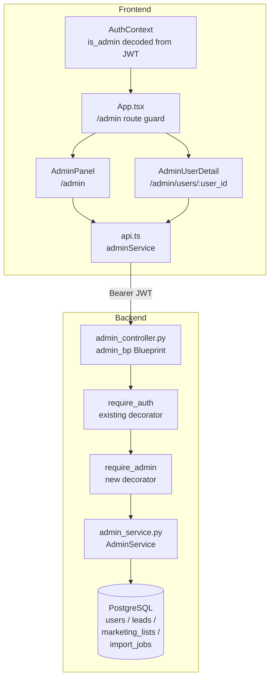

# Design Document: Admin Panel

## Overview

The admin panel adds cross-user visibility to the B&B Real Estate Analyzer platform. The feature is intentionally narrow in scope: **read-only** monitoring of all users, their activity counts, and their leads. No modification of another user's data is permitted.

The implementation touches three layers:

1. **Database** — a new `is_admin` boolean column on the `users` table, set via an idempotent Alembic migration.
2. **Backend** — a new `require_admin` decorator and a new `admin_bp` Flask Blueprint with three endpoints under `/api/admin`.
3. **Frontend** — an updated `AuthContext` that decodes `is_admin` from the JWT, and two new React components (`AdminPanel` and `AdminUserDetail`) behind a guarded `/admin` route.

The design follows all existing project conventions: idempotent migrations, `require_auth`-style decorators, Marshmallow schemas, Blueprint registration in `create_app`, React Query for data fetching, and MUI v5 components.

---

## Architecture



**Request flow for an admin endpoint:**

1. Frontend sends `Authorization: Bearer <token>` via the existing Axios interceptor.
2. `require_auth` verifies the JWT signature and sets `g.user_id` and `g.is_admin`.
3. `require_admin` checks `g.is_admin == True`; returns 403 if not.
4. The route handler calls `AdminService`, which queries the database.
5. The response is serialized and returned as JSON.

---

## Components and Interfaces

### Backend

#### `require_admin` decorator (`backend/app/api_utils.py`)

Extends the existing `require_auth` pattern. Applied after `@handle_errors` and `@require_auth`:

```python
def require_admin(f):
    """Decorator that verifies the authenticated user is an admin.

    Must be applied AFTER @require_auth (which populates g.user_id and g.is_admin).
    Returns 403 if is_admin is not True.
    Logs the unauthorized access attempt including user_id and path.
    """
```

The decorator reads `g.is_admin` (populated by an updated `require_auth` that also extracts the `is_admin` claim from the JWT). If `g.is_admin` is not `True`, it returns:

```json
{"error": "Forbidden", "message": "Admin access required."}
```

with HTTP 403 and logs the attempt.

#### `AdminService` (`backend/app/services/admin_service.py`)

Single service class with three methods:

```python
class AdminService:
    def list_users(self) -> list[dict]: ...
    def get_user_summary(self, user_id: str) -> dict: ...
    def list_leads(self, owner_user_id: str | None, page: int, page_size: int) -> dict: ...
```

- `list_users` — queries `users` table, orders by `created_at` asc, excludes credential fields.
- `get_user_summary` — queries `users` by `user_id`, then runs three `COUNT` subqueries against `leads`, `marketing_lists`, and `import_jobs`. Raises `NotFoundError` if user not found.
- `list_leads` — queries `leads` joined to `users` (for `owner_display_name`), with optional `owner_user_id` filter and pagination. Validates `page_size ≤ 200`.

#### `admin_controller.py` (`backend/app/controllers/admin_controller.py`)

New Flask Blueprint `admin_bp` registered at `/api/admin`:

| Method | Path | Description |
|--------|------|-------------|
| GET | `/api/admin/users` | List all users |
| GET | `/api/admin/users/<user_id>/summary` | Per-user activity summary |
| GET | `/api/admin/leads` | Paginated cross-user lead list |

All three routes are decorated with `@handle_errors`, `@require_auth`, and `@require_admin`.

#### Updated `AuthService.issue_token` (`backend/app/services/auth_service.py`)

The JWT payload gains an `is_admin` claim:

```python
payload = {
    "sub": user.user_id,
    "email": user.email,
    "display_name": user.display_name,
    "is_admin": bool(user.is_admin),   # NEW
    "iat": now,
    "exp": now + timedelta(seconds=self.TOKEN_LIFETIME_SECONDS),
}
```

#### Updated `require_auth` (`backend/app/api_utils.py`)

After verifying the JWT, `require_auth` also sets `g.is_admin`:

```python
claims = AuthService().verify_token(token)
g.user_id = claims['sub']
g.is_admin = claims.get('is_admin', False)  # NEW
```

If `is_admin` is absent or non-boolean in the claims, `g.is_admin` defaults to `False` (the backend never issues such tokens, but this guards against tampered tokens).

### Frontend

#### Updated `AuthUser` type (`frontend/src/types/index.ts`)

```typescript
export interface AuthUser {
  user_id: string
  email: string
  display_name: string
  is_admin: boolean   // NEW — defaults to false
}
```

#### Updated `AuthContext` (`frontend/src/context/AuthContext.tsx`)

`validateStoredToken` is updated to:
1. Extract `is_admin` from the JWT payload.
2. If `is_admin` is present but not a boolean → return `null` (malformed token, triggers logout).
3. If `is_admin` is absent → default to `false`.

The `login` callback also extracts `is_admin` from the decoded token after receiving it from the server.

#### New admin API methods (`frontend/src/services/api.ts`)

```typescript
export const adminService = {
  listUsers(): Promise<AdminUserSummary[]>
  getUserSummary(userId: string): Promise<AdminUserSummary>
  listLeads(params: AdminLeadParams): Promise<AdminLeadListResponse>
}
```

#### New types (`frontend/src/types/index.ts`)

```typescript
export interface AdminUserSummary {
  user_id: string
  email: string
  display_name: string
  is_active: boolean
  is_admin: boolean
  created_at: string
  lead_count: number
  marketing_list_count: number
  import_job_count: number
}

export interface AdminLead {
  id: number
  owner_user_id: string
  owner_display_name: string
  property_street: string | null
  property_city: string | null
  property_state: string | null
  lead_status: string
  lead_score: number
  created_at: string
}

export interface AdminLeadParams {
  owner_user_id?: string
  page?: number
  page_size?: number
}

export interface AdminLeadListResponse {
  leads: AdminLead[]
  total_count: number
  page: number
  page_size: number
}
```

#### `AdminPanel` component (`frontend/src/components/AdminPanel.tsx`)

- Fetches all users via `GET /api/admin/users`, then fetches each user's summary via `GET /api/admin/users/<user_id>/summary` in parallel using `Promise.all`.
- Uses React Query with `useQuery`.
- Displays a `CircularProgress` while loading.
- Displays an `Alert` with error message if any fetch fails; no partial data shown.
- Renders an MUI `Table` with columns: Display Name, Email, Status, Admin, Member Since, Lead Count, Marketing Lists, Import Jobs.
- Clicking a row navigates to `/admin/users/<user_id>`.

#### `AdminUserDetail` component (`frontend/src/components/AdminUserDetail.tsx`)

- Fetches user summary via `GET /api/admin/users/<user_id>/summary`.
- Fetches paginated leads via `GET /api/admin/leads?owner_user_id=<user_id>`.
- Displays user profile fields and a paginated MUI `Table` of leads.
- Includes a back button to `/admin`.

#### Route guard in `App.tsx`

```tsx
// Admin route — only accessible to admin users
<Route
  path="/admin"
  element={user?.is_admin ? <AdminPanel /> : <Navigate to="/" replace />}
/>
<Route
  path="/admin/users/:userId"
  element={user?.is_admin ? <AdminUserDetail /> : <Navigate to="/" replace />}
/>
```

The sidebar "Admin" link is conditionally rendered:

```tsx
{user?.is_admin && (
  <ListItemButton component={Link} to="/admin">
    <ListItemIcon><AdminPanelSettingsIcon /></ListItemIcon>
    <ListItemText primary="Admin" />
  </ListItemButton>
)}
```

---

## Data Models

### Migration: `add_is_admin_to_users`

New Alembic migration chained after `s9t0u1v2w3x4`:

```python
revision = 't0u1v2w3x4y5'
down_revision = 's9t0u1v2w3x4'
```

**upgrade:**

```python
def upgrade():
    # Add is_admin column (idempotent)
    op.execute("""
        ALTER TABLE users
        ADD COLUMN IF NOT EXISTS is_admin BOOLEAN NOT NULL DEFAULT FALSE
    """)

    # Set Ben as admin
    op.execute("""
        UPDATE users
        SET is_admin = TRUE
        WHERE email_lower = 'ben.d.staples.7@gmail.com'
    """)
```

**downgrade:**

```python
def downgrade():
    op.execute("""
        ALTER TABLE users
        DROP COLUMN IF EXISTS is_admin
    """)
```

### Updated `User` SQLAlchemy model

```python
is_admin = db.Column(db.Boolean, nullable=False, default=False, server_default='false')
```

### Query patterns in `AdminService`

**List users:**
```sql
SELECT user_id, email, display_name, is_active, is_admin, created_at
FROM users
ORDER BY created_at ASC
```

**User summary (counts via subqueries):**
```sql
SELECT
    u.user_id, u.email, u.display_name, u.is_active, u.is_admin, u.created_at,
    (SELECT COUNT(*) FROM leads WHERE owner_user_id = u.user_id) AS lead_count,
    (SELECT COUNT(*) FROM marketing_lists WHERE user_id = u.user_id) AS marketing_list_count,
    (SELECT COUNT(*) FROM import_jobs WHERE user_id = u.user_id) AS import_job_count
FROM users u
WHERE u.user_id = :user_id
```

**Cross-user leads (with join for display name):**
```sql
SELECT
    l.id, l.owner_user_id, u.display_name AS owner_display_name,
    l.property_street, l.property_city, l.property_state,
    l.lead_status, l.lead_score, l.created_at
FROM leads l
JOIN users u ON u.user_id = l.owner_user_id
[WHERE l.owner_user_id = :owner_user_id]
ORDER BY l.created_at DESC
LIMIT :page_size OFFSET :offset
```

---

## Correctness Properties

*A property is a characteristic or behavior that should hold true across all valid executions of a system — essentially, a formal statement about what the system should do. Properties serve as the bridge between human-readable specifications and machine-verifiable correctness guarantees.*

### Property 1: JWT `is_admin` claim round-trip

*For any* user record with a given `is_admin` value, the JWT issued by `AuthService.issue_token` SHALL contain an `is_admin` claim that is a boolean equal to the user's `is_admin` field.

**Validates: Requirements 1.4**

### Property 2: Malformed `is_admin` claim rejection

*For any* JWT token where the `is_admin` claim is present but not a boolean (e.g. a string, integer, null, or object), the frontend `validateStoredToken` function SHALL return `null`, causing the token to be removed from localStorage and the user to be treated as unauthenticated.

**Validates: Requirements 1.5, 7.4**

### Property 3: `require_admin` guards all admin routes

*For any* route registered under the `/api/admin` prefix, a request carrying a valid JWT with `is_admin = false` SHALL receive HTTP 403 with `{"error": "Forbidden", "message": "Admin access required."}`.

**Validates: Requirements 2.1, 2.2, 2.4**

### Property 4: User list excludes credential fields

*For any* set of users in the database, the response from `GET /api/admin/users` SHALL contain all users and SHALL NOT include `password_hash` or any other credential field in any user object.

**Validates: Requirements 3.1, 3.2**

### Property 5: User list ordering invariant

*For any* set of users with distinct `created_at` timestamps, the array returned by `GET /api/admin/users` SHALL be sorted in ascending order by `created_at`.

**Validates: Requirements 3.4**

### Property 6: User summary count accuracy

*For any* user with N leads, M marketing lists, and K import jobs, the response from `GET /api/admin/users/<user_id>/summary` SHALL return `lead_count = N`, `marketing_list_count = M`, and `import_job_count = K`.

**Validates: Requirements 4.1, 4.2, 4.3, 4.4**

### Property 7: Cross-user lead visibility

*For any* set of leads owned by different users, `GET /api/admin/leads` (without filter) SHALL return all leads regardless of `owner_user_id`, and each lead record SHALL include the `owner_display_name` of the owning user.

**Validates: Requirements 5.1**

### Property 8: Lead filter correctness

*For any* `owner_user_id` filter value, every lead returned by `GET /api/admin/leads?owner_user_id=<id>` SHALL have `owner_user_id` equal to the filter value, and no lead with a different `owner_user_id` SHALL appear in the results.

**Validates: Requirements 5.2**

### Property 9: Pagination envelope correctness

*For any* valid `page` and `page_size` combination, the response from `GET /api/admin/leads` SHALL include a `total_count` equal to the actual number of matching leads in the database, and the `leads` array SHALL contain exactly `min(page_size, remaining)` items starting at the correct offset.

**Validates: Requirements 5.3**

### Property 10: Admin route access control

*For any* admin user (is_admin = true), the `/admin` route SHALL render the `AdminPanel` component and the "Admin" navigation link SHALL be present in the sidebar. *For any* non-admin user (is_admin = false or absent), navigating to `/admin` SHALL redirect to the home page and the "Admin" navigation link SHALL NOT be present in the sidebar.

**Validates: Requirements 6.1, 6.2**

### Property 11: `AuthUser.is_admin` decoding

*For any* valid JWT payload, the `is_admin` field on the decoded `AuthUser` SHALL equal the boolean value of the `is_admin` claim in the payload, defaulting to `false` when the claim is absent.

**Validates: Requirements 7.1, 7.2, 7.3**

---

## Error Handling

### Backend

| Condition | Response |
|-----------|----------|
| No `Authorization` header | 401 `{"error": "Authentication required"}` (from `require_auth`) |
| Expired JWT | 401 `{"error": "Token expired"}` (from `require_auth`) |
| Invalid JWT signature | 401 `{"error": "Invalid token"}` (from `require_auth`) |
| Valid JWT, `is_admin = false` | 403 `{"error": "Forbidden", "message": "Admin access required."}` |
| `user_id` not found in summary endpoint | 404 `{"error": "Not found", "message": "User <user_id> not found."}` |
| `page_size > 200` | 400 `{"error": "Validation error", "message": "page_size cannot exceed 200."}` |
| Unexpected server error | 500 `{"error": "Internal server error", "message": "An unexpected error occurred"}` (from `@handle_errors`) |

All 403 rejections are logged at WARNING level with the requesting user's `user_id` and the requested path, using the existing `logger` pattern.

### Frontend

- **Loading state**: `CircularProgress` is shown while any React Query fetch is in-flight.
- **Error state**: If any fetch in `AdminPanel` fails, an MUI `Alert` with `severity="error"` is shown. The table is not rendered — no partial data is displayed.
- **401 handling**: The existing Axios response interceptor already handles 401 by clearing localStorage and redirecting to `/login`. Admin endpoints benefit from this automatically.
- **Malformed token**: `validateStoredToken` returns `null` for tokens with non-boolean `is_admin`, which causes `AuthContext` to clear the token and treat the user as unauthenticated.

---

## Testing Strategy

### Backend (pytest + Hypothesis)

**Unit tests** (`backend/tests/test_admin_service.py`, `test_admin_controller.py`):

- `require_admin` returns 403 with correct body for non-admin user.
- `require_admin` returns 401 when no token is present.
- `GET /api/admin/users` returns all users ordered by `created_at` asc.
- `GET /api/admin/users` response never contains `password_hash`.
- `GET /api/admin/users/<user_id>/summary` returns 404 for unknown user_id.
- `GET /api/admin/leads` with `page_size=201` returns 400.
- `GET /api/admin/leads?owner_user_id=<id>` returns only leads for that user.

**Property-based tests** (`backend/tests/test_admin_properties.py`) using Hypothesis:

Each property test runs a minimum of 100 iterations.

```python
# Feature: admin-panel, Property 1: JWT is_admin claim round-trip
@given(is_admin=st.booleans())
@settings(max_examples=100)
def test_jwt_is_admin_claim_round_trip(is_admin):
    ...

# Feature: admin-panel, Property 3: require_admin guards all admin routes
@given(route=st.sampled_from(ADMIN_ROUTES))
@settings(max_examples=100)
def test_require_admin_guards_all_routes(route):
    ...

# Feature: admin-panel, Property 4: user list excludes credential fields
@given(users=st.lists(user_strategy(), min_size=1, max_size=10))
@settings(max_examples=100)
def test_user_list_excludes_credentials(users):
    ...

# Feature: admin-panel, Property 5: user list ordering invariant
@given(users=st.lists(user_strategy(), min_size=2, max_size=20))
@settings(max_examples=100)
def test_user_list_ordering(users):
    ...

# Feature: admin-panel, Property 6: user summary count accuracy
@given(lead_count=st.integers(0, 50), list_count=st.integers(0, 20), job_count=st.integers(0, 30))
@settings(max_examples=100)
def test_user_summary_count_accuracy(lead_count, list_count, job_count):
    ...

# Feature: admin-panel, Property 7: cross-user lead visibility
@given(user_count=st.integers(1, 5), leads_per_user=st.integers(0, 10))
@settings(max_examples=100)
def test_cross_user_lead_visibility(user_count, leads_per_user):
    ...

# Feature: admin-panel, Property 8: lead filter correctness
@given(owner_user_id=st.uuids())
@settings(max_examples=100)
def test_lead_filter_correctness(owner_user_id):
    ...

# Feature: admin-panel, Property 9: pagination envelope correctness
@given(page=st.integers(1, 10), page_size=st.integers(1, 200))
@settings(max_examples=100)
def test_pagination_envelope_correctness(page, page_size):
    ...
```

### Frontend (Vitest + React Testing Library)

**Unit tests** (`frontend/src/context/AuthContext.test.tsx` additions):

- `validateStoredToken` returns `null` for tokens with `is_admin` as string, number, null, or object.
- `validateStoredToken` returns `AuthUser` with `is_admin=true` for valid admin token.
- `validateStoredToken` returns `AuthUser` with `is_admin=false` for valid non-admin token.
- `validateStoredToken` returns `AuthUser` with `is_admin=false` when claim is absent.

**Component tests** (`frontend/src/components/AdminPanel.test.tsx`):

- Renders loading indicator while fetching.
- Renders error alert when fetch fails; no table rendered.
- Renders table with all required columns when data loads.
- Clicking a user row navigates to `/admin/users/<user_id>`.

**Property-based tests** (`frontend/src/context/AuthContext.test.tsx`) using fast-check:

```typescript
// Feature: admin-panel, Property 2: malformed is_admin claim rejection
it('rejects tokens with non-boolean is_admin', () => {
  fc.assert(fc.property(
    fc.oneof(fc.string(), fc.integer(), fc.constant(null), fc.object()),
    (nonBooleanValue) => {
      const token = buildToken({ is_admin: nonBooleanValue })
      expect(validateStoredToken(token)).toBeNull()
    }
  ), { numRuns: 100 })
})

// Feature: admin-panel, Property 11: AuthUser.is_admin decoding
it('decodes is_admin correctly for any boolean value', () => {
  fc.assert(fc.property(
    fc.boolean(),
    (isAdmin) => {
      const token = buildToken({ is_admin: isAdmin })
      const user = validateStoredToken(token)
      expect(user?.is_admin).toBe(isAdmin)
    }
  ), { numRuns: 100 })
})

// Feature: admin-panel, Property 10: admin route access control
it('redirects non-admin users away from /admin for any non-admin user', () => {
  fc.assert(fc.property(
    fc.record({ user_id: fc.uuid(), email: fc.emailAddress(), display_name: fc.string() }),
    (userFields) => {
      const user = { ...userFields, is_admin: false }
      // render App with this user, navigate to /admin, expect redirect to /
    }
  ), { numRuns: 100 })
})
```

**PBT library**: `fast-check` (already available in the frontend ecosystem; install with `npm install --save-dev fast-check`).

**Minimum iterations**: 100 per property test.
