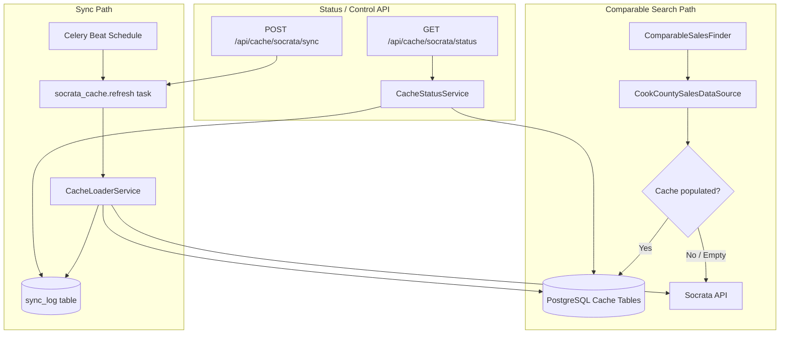

# Design Document: chicago-socrata-local-cache

## Overview

This feature adds a local PostgreSQL mirror of three Cook County Socrata datasets to the B and B Real Estate Analyzer platform. The mirror eliminates live HTTP calls to `datacatalog.cookcountyil.gov` at comparable-search time, replacing them with indexed PostgreSQL queries that complete in well under one second.

The three datasets being mirrored are:

| Dataset | Socrata ID | Purpose |
|---|---|---|
| Parcel Universe | pabr-t5kh | Latitude/longitude per PIN for bounding-box lookups |
| Parcel Sales | wvhk-k5uv | Sale transactions per PIN for comparable filtering |
| Improvement Characteristics | bcnq-qi2z | Building attributes per PIN for comparable scoring |

A Celery Beat scheduled task (`socrata_cache.refresh`) keeps the local copy fresh on a configurable cadence (default: weekly, every Sunday at 02:00 UTC). The existing `CookCountySalesDataSource` is updated to query the local cache tables first, with a per-table fallback to the live Socrata API when a cache table is empty.

Two new REST endpoints expose cache health (`GET /api/cache/socrata/status`) and manual sync triggering (`POST /api/cache/socrata/sync`).

---

## Architecture



### Key Design Decisions

**Cache-first with per-table fallback**: Each of the three datasets is checked independently. If `parcel_universe_cache` is empty but `parcel_sales_cache` is populated, the bounding-box lookup falls back to the live API while the sales query uses the cache. This avoids a total outage if one dataset fails to sync.

**Upsert strategy (INSERT ... ON CONFLICT DO UPDATE)**: All writes use PostgreSQL upserts keyed on `pin`. This makes the sync operation idempotent — re-running a full load or an incremental refresh never creates duplicates and always converges to the latest upstream state.

**Incremental refresh via `last_synced_at` watermark**: The incremental refresh queries Socrata with a `$where=:updated_at >= '<last_success_completed_at>'` filter. This minimises data transfer on weekly runs while guaranteeing that any record modified since the last successful sync is captured.

**Schema drift resilience at the loader layer**: The `CacheLoaderService` maps Socrata rows to a fixed column whitelist before upserting. Extra fields are silently dropped; missing nullable fields become NULL; missing NOT NULL fields cause the row to be skipped with a warning. This prevents upstream schema changes from crashing the sync job.

**Celery Beat for scheduling**: The existing Celery infrastructure (Redis broker, `celery_worker.py`) is extended with a `beat_schedule` entry. The schedule is overridable via the `SOCRATA_SYNC_SCHEDULE` environment variable, which is validated as a cron expression at worker startup.

---

## Components and Interfaces

### 1. SQLAlchemy Models (`backend/app/models/`)

Four new model files, each re-exported from `backend/app/models/__init__.py`:

- `parcel_universe_cache.py` → `ParcelUniverseCache`
- `parcel_sales_cache.py` → `ParcelSalesCache`
- `improvement_characteristics_cache.py` → `ImprovementCharacteristicsCache`
- `sync_log.py` → `SyncLog`

### 2. CacheLoaderService (`backend/app/services/cache_loader_service.py`)

Responsible for all data movement from Socrata to PostgreSQL.

```
CacheLoaderService
  + full_load(dataset: str) -> SyncResult
  + incremental_refresh(dataset: str) -> SyncResult
  + load_all(mode: str) -> list[SyncResult]
  - _fetch_pages(dataset_name, page_size, since_dt) -> Iterator[list[dict]]
  - _upsert_parcel_universe(rows: list[dict]) -> int
  - _upsert_parcel_sales(rows: list[dict]) -> int
  - _upsert_improvement_chars(rows: list[dict]) -> int
  - _map_row(row: dict, column_whitelist: set, not_null_cols: set) -> dict | None
  - _write_sync_log(dataset, started_at, status, rows_upserted, error_message) -> SyncLog
  - _get_last_success_timestamp(dataset: str) -> datetime | None
  - _socrata_get_with_retry(url: str, max_retries: int = 3, wait_secs: int = 5) -> list[dict]
```

`SyncResult` is a lightweight dataclass:

```python
@dataclass
class SyncResult:
    dataset: str
    status: str          # 'success' | 'failed'
    rows_upserted: int
    error_message: str | None
```

### 3. CacheStatusService (`backend/app/services/cache_status_service.py`)

Reads cache state without modifying it.

```
CacheStatusService
  + get_status() -> list[DatasetStatus]
  + get_dataset_status(dataset_name: str) -> DatasetStatus
  - _row_count(table_model) -> int
  - _last_successful_sync(dataset_name: str) -> SyncLog | None
  - _last_failed_sync(dataset_name: str) -> SyncLog | None
  - _classify_status(row_count, last_success, last_failure) -> str
```

`DatasetStatus` is a dataclass:

```python
@dataclass
class DatasetStatus:
    dataset_name: str
    row_count: int
    last_synced_at: datetime | None   # ISO 8601 UTC
    status: str                        # 'empty' | 'fresh' | 'stale' | 'never_synced'
    last_error: str | None
```

Staleness threshold: 30 days (configurable via `SOCRATA_STALE_DAYS` env var, default 30).

### 4. Updated CookCountySalesDataSource (`backend/app/services/comparable_sales_finder.py`)

The three private fetch methods are updated to check cache table row counts before deciding which data source to use. The public `fetch_comparables` interface is unchanged.

```
CookCountySalesDataSource
  + fetch_comparables(subject_facts, max_age_months, max_distance_miles, max_count) -> list[dict]
  - _fetch_pins_in_bbox(lat, lon, radius_miles) -> dict[str, tuple[float, float]]
      → queries parcel_universe_cache if non-empty, else Socrata API
  - _fetch_sales_for_pins(pins, cutoff_date, target_classes) -> list[dict]
      → queries parcel_sales_cache if non-empty, else Socrata API (single ANY(:pins) query)
  - _fetch_improvement_chars(pins) -> dict[str, dict]
      → queries improvement_characteristics_cache if non-empty, else Socrata API
  - _cache_has_rows(table_model) -> bool   [new helper]
```

The `_fetch_sales_for_pins` method eliminates the 100-PIN batch loop when using the cache, replacing it with a single `WHERE pin = ANY(:pins)` parameterized query.

### 5. Celery Task (`backend/celery_worker.py`)

A new task `socrata_cache.refresh` is registered alongside the existing tasks. The `beat_schedule` is added to `celery.conf`.

```python
@celery.task(name='socrata_cache.refresh')
def socrata_cache_refresh_task(dataset: str = 'all') -> dict:
    ...
```

### 6. Cache Controller (`backend/app/controllers/cache_controller.py`)

A new Flask Blueprint `cache_bp` registered at `/api/cache`.

```
GET  /api/cache/socrata/status   → cache_status()
POST /api/cache/socrata/sync     → trigger_sync()
```

### 7. Marshmallow Schemas (`backend/app/schemas.py`)

Two new schemas appended to the existing `schemas.py`:

- `SocrataSyncRequestSchema` — validates `POST /api/cache/socrata/sync` body
- `DatasetStatusResponseSchema` — serializes `DatasetStatus` for the status endpoint

---

## Data Models

### `parcel_universe_cache`

```python
class ParcelUniverseCache(db.Model):
    __tablename__ = 'parcel_universe_cache'

    pin            = db.Column(db.String(14), primary_key=True)
    lat            = db.Column(db.Numeric(precision=10, scale=7), nullable=True)
    lon            = db.Column(db.Numeric(precision=10, scale=7), nullable=True)
    last_synced_at = db.Column(db.DateTime(timezone=True), nullable=True)
```

No additional indexes beyond the primary key — bounding-box queries use `lat` and `lon` range scans. A composite index `(lat, lon)` is added to support the `BETWEEN` filter efficiently.

### `parcel_sales_cache`

```python
class ParcelSalesCache(db.Model):
    __tablename__ = 'parcel_sales_cache'

    id                        = db.Column(db.Integer, primary_key=True, autoincrement=True)
    pin                       = db.Column(db.String(14), nullable=False, index=True)
    sale_date                 = db.Column(db.Date, nullable=True)
    sale_price                = db.Column(db.Numeric(precision=14, scale=2), nullable=True)
    class_                    = db.Column('class', db.String(10), nullable=True)
    sale_type                 = db.Column(db.String(50), nullable=True)
    is_multisale              = db.Column(db.Boolean, nullable=True)
    sale_filter_less_than_10k = db.Column(db.Boolean, nullable=True)
    sale_filter_deed_type     = db.Column(db.Boolean, nullable=True)
    last_synced_at            = db.Column(db.DateTime(timezone=True), nullable=True)

    __table_args__ = (
        db.Index('ix_parcel_sales_pin_sale_date', 'pin', 'sale_date'),
        db.Index('ix_parcel_sales_sale_date', 'sale_date'),
    )
```

Note: `class` is a Python reserved word; the column is mapped as `class_` in Python with `'class'` as the DB column name.

### `improvement_characteristics_cache`

```python
class ImprovementCharacteristicsCache(db.Model):
    __tablename__ = 'improvement_characteristics_cache'

    pin            = db.Column(db.String(14), primary_key=True)
    bldg_sf        = db.Column(db.Integer, nullable=True)
    beds           = db.Column(db.Integer, nullable=True)
    fbath          = db.Column(db.Numeric(precision=4, scale=1), nullable=True)
    hbath          = db.Column(db.Numeric(precision=4, scale=1), nullable=True)
    age            = db.Column(db.Integer, nullable=True)
    ext_wall       = db.Column(db.Integer, nullable=True)
    apts           = db.Column(db.Integer, nullable=True)
    last_synced_at = db.Column(db.DateTime(timezone=True), nullable=True)
```

### `sync_log`

```python
class SyncLog(db.Model):
    __tablename__ = 'sync_log'

    id            = db.Column(db.Integer, primary_key=True, autoincrement=True)
    dataset_name  = db.Column(db.String(100), nullable=False, index=True)
    started_at    = db.Column(db.DateTime(timezone=True), nullable=False)
    completed_at  = db.Column(db.DateTime(timezone=True), nullable=True)
    rows_upserted = db.Column(db.Integer, nullable=True)
    status        = db.Column(
        db.String(10),
        db.CheckConstraint("status IN ('running', 'success', 'failed')", name='ck_sync_log_status'),
        nullable=False,
    )
    error_message = db.Column(db.Text, nullable=True)
```

### Alembic Migration

A single migration file `g7h8i9j0k1l2_add_socrata_cache_tables.py` with:

- **upgrade()**: Creates all four tables and their indexes. No ALTER or DROP on existing tables.
- **downgrade()**: Drops indexes first, then the four tables in reverse dependency order.

The migration `down_revision` points to the current head (`fd5451087f07`).

---

## Correctness Properties

*A property is a characteristic or behavior that should hold true across all valid executions of a system — essentially, a formal statement about what the system should do. Properties serve as the bridge between human-readable specifications and machine-verifiable correctness guarantees.*

### Property 1: Parcel Universe round-trip data integrity

*For any* valid 14-character PIN, NUMERIC latitude, and NUMERIC longitude, writing a row to `parcel_universe_cache` and reading it back by that PIN SHALL return the exact same `pin`, `lat`, and `lon` values with no numeric coercion or precision loss.

**Validates: Requirements 7.1**

---

### Property 2: Parcel Sales round-trip data integrity

*For any* valid `parcel_sales_cache` row (with arbitrary `pin`, `sale_date`, `sale_price`, `class`, boolean flags, and nullable fields), writing the row and reading it back by `(pin, sale_date)` SHALL return the exact same values for all stored columns.

**Validates: Requirements 7.2**

---

### Property 3: Improvement Characteristics round-trip data integrity

*For any* valid `improvement_characteristics_cache` row (with arbitrary `pin` and numeric/integer building attributes), writing the row and reading it back by `pin` SHALL return the exact same values for all stored columns with no coercion or precision loss.

**Validates: Requirements 7.3**

---

### Property 4: Upsert overwrites previous values

*For any* PIN and two different sets of column values (V1 and V2), upserting V1 then upserting V2 into the same cache table SHALL result in reading back V2 for all non-primary-key columns after the second upsert commits.

**Validates: Requirements 1.8, 7.4**

---

### Property 5: NULL preservation for nullable columns

*For any* nullable column in any of the three cache tables, writing a row with NULL for that column and reading it back SHALL return NULL — not a default value, empty string, or zero.

**Validates: Requirements 7.5**

---

### Property 6: Schema drift — extra fields are silently dropped

*For any* Socrata API row dict containing arbitrary extra keys beyond the defined column whitelist, the `CacheLoaderService` SHALL insert only the whitelisted columns and the resulting database row SHALL contain no data from the extra fields.

**Validates: Requirements 6.1**

---

### Property 7: Schema drift — missing nullable fields become NULL

*For any* subset of nullable columns omitted from a Socrata API row, the `CacheLoaderService` SHALL insert NULL for each omitted nullable column rather than raising an exception, and the remaining defined columns SHALL be inserted with their correct values.

**Validates: Requirements 6.2, 6.3**

---

### Property 8: Schema drift — rows with missing NOT NULL fields are skipped

*For any* batch of rows where some rows are missing a NOT NULL column value, the `CacheLoaderService` SHALL skip those specific rows, and all other rows in the same batch that have valid NOT NULL values SHALL still be inserted successfully.

**Validates: Requirements 6.5**

---

### Property 9: Pagination termination

*For any* page size N (1 ≤ N ≤ 100,000) and any mock sequence of pages where the final page contains fewer than N rows, the `CacheLoaderService` SHALL stop pagination after the first short page and SHALL make exactly `ceil(total_rows / N)` HTTP requests.

**Validates: Requirements 2.1**

---

### Property 10: Sync log written on success with correct row count

*For any* mock dataset response containing K total rows across any number of pages, after a successful full load the `sync_log` table SHALL contain exactly one row for that dataset with `status='success'` and `rows_upserted = K`.

**Validates: Requirements 2.3**

---

### Property 11: Retry behavior on transient HTTP errors

*For any* number of consecutive HTTP failures k where 0 ≤ k ≤ 2, the `CacheLoaderService` SHALL retry the request and ultimately succeed on attempt k+1, making exactly k+1 total HTTP requests for that page.

**Validates: Requirements 2.4**

---

### Property 12: Cache status classification is deterministic

*For any* combination of (row_count, days_since_last_success, has_ever_synced), the `CacheStatusService.classify_status` function SHALL return exactly one of `empty`, `fresh`, `stale`, or `never_synced` according to the following rules:
- row_count == 0 AND has_ever_synced == False → `never_synced`
- row_count == 0 → `empty`
- days_since_last_success ≤ 30 → `fresh`
- days_since_last_success > 30 → `stale`

**Validates: Requirements 5.2, 5.3, 5.4, 5.5**

---

### Property 13: Cache-first routing — non-empty cache prevents live API calls

*For any* non-empty `parcel_universe_cache`, `parcel_sales_cache`, and `improvement_characteristics_cache`, calling `CookCountySalesDataSource.fetch_comparables` SHALL make zero HTTP requests to any Socrata endpoint.

**Validates: Requirements 4.1, 4.2, 4.3**

---

### Property 14: Output schema consistency regardless of data source

*For any* call to `CookCountySalesDataSource.fetch_comparables` (whether data comes from cache or live API), every dict in the returned list SHALL contain exactly the same set of keys: `pin`, `sale_date`, `sale_price`, `property_type`, `units`, `bedrooms`, `bathrooms`, `square_footage`, `lot_size`, `year_built`, `construction_type`, `interior_condition`, `latitude`, `longitude`, `similarity_notes`, `address`. Absent values SHALL be `None`, not omitted.

**Validates: Requirements 4.7**

---

### Property 15: Incremental refresh uses correct watermark

*For any* `sync_log` history containing multiple rows with mixed `status` values and `completed_at` timestamps, the `CacheLoaderService._get_last_success_timestamp` function SHALL return the maximum `completed_at` among rows with `status='success'` for the given dataset, and SHALL return `None` if no success rows exist.

**Validates: Requirements 3.2, 3.3**

---

### Property 16: Failed refresh leaves existing cache data intact

*For any* pre-existing cache state (arbitrary rows in any of the three tables), a refresh that fails due to an API error SHALL leave all pre-existing rows unchanged — no rows deleted, no rows modified, no partial writes committed.

**Validates: Requirements 3.5**

---

### Property 17: Parcel Sales filter — only LAND AND BUILDING records are loaded

*For any* mock Socrata response containing rows with mixed `sale_type` values, the `CacheLoaderService` SHALL upsert only rows where `sale_type = 'LAND AND BUILDING'` and SHALL not insert any row with a different `sale_type` value.

**Validates: Requirements 2.7**

---

## Error Handling

### CacheLoaderService

| Condition | Behaviour |
|---|---|
| HTTP 4xx/5xx on a page fetch | Retry up to 3 times with 5-second exponential backoff. After 3 failures, write `sync_log` with `status='failed'`, `rows_upserted` = count of rows successfully upserted before the failure, `error_message` includes the failed page offset. Do not truncate previously loaded rows. |
| Network timeout / connection refused | Treated identically to HTTP error — retried then failed. |
| Type conversion error on a nullable field | Log WARNING with PIN and field name. Insert NULL for that field. Continue processing remaining rows. |
| Type conversion error on a NOT NULL field | Log WARNING with PIN and column name. Skip the entire row. Continue processing remaining rows. |
| Extra fields in Socrata response | Silently drop. Log WARNING if total column count differs from schema column count. |
| Database IntegrityError during upsert | Log ERROR with the offending row. Skip that row. Continue. |
| `SOCRATA_SYNC_SCHEDULE` invalid cron | Raise `ValueError` at Celery worker startup before any tasks are registered. |

### CacheStatusService

| Condition | Behaviour |
|---|---|
| Database unavailable | Propagate `SQLAlchemyError` — the controller's `@handle_errors` decorator returns HTTP 503. |
| No rows in `sync_log` for a dataset | Return `status='never_synced'` with `last_synced_at=None` and `last_error=None`. |

### Cache Controller

| Condition | Behaviour |
|---|---|
| Invalid `dataset` value in POST body | Return HTTP 400 with `{"error": "Invalid dataset", "message": "...", "accepted_values": [...]}`. |
| Missing or non-JSON request body | Return HTTP 400 with descriptive message. |
| Celery broker unavailable when enqueuing | Propagate exception → `@handle_errors` returns HTTP 503. |

### Custom Exceptions

Two new exceptions extending `RealEstateAnalysisException`:

```python
class CacheSyncException(RealEstateAnalysisException):
    """Raised when a cache sync operation fails unrecoverably."""
    def __init__(self, message: str, dataset: str, page_offset: int = None):
        super().__init__(message, status_code=503)
        self.payload = {
            'error_type': 'cache_sync_error',
            'dataset': dataset,
            'page_offset': page_offset,
        }

class InvalidCronExpressionException(RealEstateAnalysisException):
    """Raised at startup when SOCRATA_SYNC_SCHEDULE contains an invalid cron expression."""
    def __init__(self, expression: str):
        super().__init__(
            f"Invalid cron expression in SOCRATA_SYNC_SCHEDULE: {expression!r}",
            status_code=500,
        )
        self.payload = {
            'error_type': 'invalid_cron_expression',
            'expression': expression,
        }
```

---

## Testing Strategy

### Dual Testing Approach

Unit tests cover specific examples, edge cases, and error conditions. Property-based tests (Hypothesis) verify universal properties across many generated inputs. Both are required for comprehensive coverage.

### Property-Based Testing with Hypothesis

The project already uses Hypothesis (`backend/.hypothesis/` directory exists). All 17 correctness properties above are implemented as Hypothesis property tests.

**Library**: `hypothesis` with `hypothesis.strategies` for data generation.

**Configuration**: Each property test uses `@settings(max_examples=100)` minimum. Tests that exercise the database use SQLite in-memory (matching the existing test pattern from `conftest.py`).

**Test file**: `backend/tests/test_socrata_cache_properties.py`

**Tag format**: Each test is tagged with a comment:
```python
# Feature: chicago-socrata-local-cache, Property N: <property_text>
```

**Hypothesis strategies needed**:

```python
# 14-character Cook County PIN
pin_strategy = st.text(
    alphabet=st.characters(whitelist_categories=('Nd',)),
    min_size=14, max_size=14
)

# Valid lat/lon for Cook County bounding box
lat_strategy = st.decimals(min_value=Decimal('41.4'), max_value=Decimal('42.2'),
                            places=7, allow_nan=False, allow_infinity=False)
lon_strategy = st.decimals(min_value=Decimal('-88.3'), max_value=Decimal('-87.5'),
                            places=7, allow_nan=False, allow_infinity=False)

# Arbitrary extra fields for schema drift tests
extra_fields_strategy = st.dictionaries(
    keys=st.text(min_size=1, max_size=30).filter(lambda k: k not in KNOWN_COLUMNS),
    values=st.one_of(st.text(), st.integers(), st.floats(allow_nan=False)),
    min_size=0, max_size=10,
)

# Page sequences for pagination tests
page_sequence_strategy = st.integers(min_value=1, max_value=5).flatmap(
    lambda n_full: st.integers(min_value=0, max_value=PAGE_SIZE - 1).map(
        lambda last_size: ([PAGE_SIZE] * n_full) + ([last_size] if last_size > 0 else [])
    )
)
```

**Property test structure** (example for Property 1):

```python
@settings(max_examples=100)
@given(
    pin=pin_strategy,
    lat=lat_strategy,
    lon=lon_strategy,
)
def test_parcel_universe_round_trip(db_session, pin, lat, lon):
    # Feature: chicago-socrata-local-cache, Property 1: Parcel Universe round-trip data integrity
    row = ParcelUniverseCache(pin=pin, lat=lat, lon=lon, last_synced_at=datetime.utcnow())
    db_session.merge(row)
    db_session.commit()

    result = db_session.get(ParcelUniverseCache, pin)
    assert result.pin == pin
    assert result.lat == lat
    assert result.lon == lon
```

### Unit Tests

**Test file**: `backend/tests/test_cache_loader_service.py`

Key unit test scenarios:
- Full load with mocked Socrata responses (happy path)
- Retry logic: 1 failure then success, 2 failures then success, 3 failures → `sync_log` failure
- `dataset='all'` writes 3 separate `sync_log` rows
- Incremental refresh uses correct watermark from `sync_log`
- Schema drift: extra fields dropped, missing nullable → NULL, missing NOT NULL → row skipped
- `sale_type` filter: only `LAND AND BUILDING` rows upserted

**Test file**: `backend/tests/test_cache_status_service.py`

Key unit test scenarios:
- `never_synced` when table is empty and no sync_log rows
- `empty` when table is empty but sync_log has rows
- `fresh` when last success < 30 days ago
- `stale` when last success > 30 days ago
- `last_error` populated from most recent failed sync_log row

**Test file**: `backend/tests/test_cache_controller.py`

Key unit test scenarios:
- `GET /api/cache/socrata/status` returns correct structure for all three datasets
- `POST /api/cache/socrata/sync` with `dataset='all'` returns HTTP 202 with `task_id`
- `POST /api/cache/socrata/sync` with invalid dataset returns HTTP 400
- `POST /api/cache/socrata/sync` with missing body returns HTTP 400

**Test file**: `backend/tests/test_comparable_sales_finder.py` (additions)

Key additions:
- Cache-first routing: non-empty cache → no HTTP calls
- Fallback routing: empty cache → HTTP calls made
- Output schema consistency: same keys returned from cache and API paths
- `pin = ANY(:pins)` used instead of batched IN clauses when cache is active

### Integration Tests

- Migration round-trip: `upgrade` then `downgrade` leaves no trace of the four tables
- End-to-end sync: real Socrata API call (skipped in CI, run manually with `pytest -m integration`)
- Performance: full comparable fetch with populated cache completes in < 1000 ms

### Test Fixtures

The existing `conftest.py` `app` fixture uses SQLite in-memory. The new cache models use only standard SQL types (no PostgreSQL-specific enums), so they work with SQLite for unit and property tests. The `CheckConstraint` on `sync_log.status` is tested separately against PostgreSQL in integration tests.

A new `db_session` fixture is added to `conftest.py` for property tests that need direct ORM access without going through the HTTP layer.
