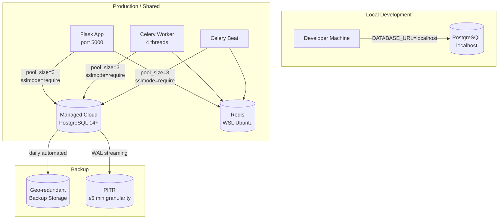

# Design Document: Cloud Database Migration

## Overview

This design covers migrating the B&B Real Estate Analysis Platform from a local PostgreSQL instance (`postgresql://localhost/real_estate_analysis`) to a managed cloud PostgreSQL service. The migration is primarily an **operational and configuration change** — the application code already reads `DATABASE_URL` from the environment, the connection pool is already configured, and Alembic manages the schema. The work falls into four areas:

1. **Provisioning** — selecting and configuring a managed PostgreSQL provider
2. **Application hardening** — adding startup guards for security, observability, and pool correctness
3. **Data migration** — exporting local data and loading it into the cloud instance
4. **Operational runbook** — backup strategy, restore procedure, and team onboarding

The design intentionally minimises code changes. The only required code changes are startup validation guards in `create_app()` and an update to `backend/.env.example`. No models, controllers, services, or migration files need to change.

---

## Architecture



**Connection budget:** Flask (3) + Celery worker 4 threads (12) + Celery Beat (3) = 18 total connections. This is well within the 100-connection default on all major managed providers and satisfies the ≥10 connection requirement.

**Provider selection:** Any managed PostgreSQL 14+ provider works. Recommended options in order of simplicity for this stack:

| Provider | Free tier | PITR | Geo-redundant backups | Notes |
|---|---|---|---|---|
| **Neon** | Yes (0.5 GB) | Yes (7 days) | Yes | Serverless, instant branching, generous free tier |
| **Supabase** | Yes (500 MB) | Yes (7 days) | Yes | Includes dashboard, good for small teams |
| **Railway** | Yes ($5 credit) | Yes | Yes | Simple deploy, good DX |
| **AWS RDS** | 12-month free | Yes | Yes | Most control, most complexity |

The design is provider-agnostic. All provider-specific steps are in the runbook section.

---

## Components and Interfaces

### 2.1 `create_app()` — Startup Validation Guards

The existing `create_app()` in `backend/app/__init__.py` already handles most requirements. The following guards need to be added or strengthened:

#### Guard 1: DATABASE_URL validation and host logging (Requirements 7.8, 8.1, 8.2)

```python
def _validate_and_log_database_url(app):
    """
    Validate DATABASE_URL at startup and log the resolved host with credentials redacted.
    Aborts startup if the URL is missing or not a valid PostgreSQL connection string.
    """
    from urllib.parse import urlparse
    raw_url = os.getenv('DATABASE_URL', '')
    if not raw_url:
        app.logger.error(
            "DATABASE_URL is not set. Set DATABASE_URL in backend/.env to a valid "
            "PostgreSQL connection string and restart."
        )
        raise SystemExit(1)

    try:
        parsed = urlparse(raw_url)
        if parsed.scheme not in ('postgresql', 'postgres'):
            raise ValueError(f"Unsupported scheme: {parsed.scheme!r}")
        safe_host = f"{parsed.scheme}://{parsed.hostname}:{parsed.port or 5432}/{parsed.path.lstrip('/')}"
        app.logger.info("Database host resolved: %s", safe_host)
    except Exception as exc:
        app.logger.error(
            "DATABASE_URL is missing or malformed. Provide a valid PostgreSQL "
            "connection string in backend/.env. Error: %s", exc
        )
        raise SystemExit(1)
```

#### Guard 2: pool_pre_ping enforcement (Requirements 8.4, 8.5)

```python
def _assert_pool_pre_ping(app):
    """
    Raise RuntimeError if pool_pre_ping is absent from engine options
    when not running in test mode. Stale connections silently fail without it.
    """
    if app.config.get('TESTING'):
        return
    engine_opts = app.config.get('SQLALCHEMY_ENGINE_OPTIONS', {})
    if not engine_opts.get('pool_pre_ping'):
        raise RuntimeError(
            "pool_pre_ping=True is required in SQLALCHEMY_ENGINE_OPTIONS when "
            "TESTING is not True. Add it to create_app() and restart."
        )
```

#### Guard 3: Superuser detection (Requirements 7.4, 7.5)

```python
def _assert_not_superuser(app):
    """
    Refuse to operate if the connected database user has superuser privileges.
    Superuser access violates the principle of least privilege and is a security risk.
    """
    db_url = app.config.get('SQLALCHEMY_DATABASE_URI', '')
    if 'postgresql' not in db_url:
        return  # SQLite in tests — skip
    try:
        from sqlalchemy import text
        with app.app_context():
            result = db.session.execute(
                text("SELECT usesuper FROM pg_user WHERE usename = current_user")
            ).fetchone()
            if result and result[0]:
                raise SystemExit(
                    "\n\n*** SECURITY ERROR: The database user configured in DATABASE_URL "
                    "has superuser privileges.\n"
                    "Create a dedicated application user with minimum required privileges "
                    "(SELECT, INSERT, UPDATE, DELETE, schema modification for migrations) "
                    "and update DATABASE_URL in backend/.env.\n"
                )
    except SystemExit:
        raise
    except Exception as e:
        app.logger.warning("Could not verify superuser status: %s", e)
```

#### Guard 4: Performance dashboard warning (Requirement 8.3)

```python
def _warn_provider_dashboard(app):
    """
    Log a startup warning pointing operators to the provider's performance dashboard.
    The dashboard URL is read from PROVIDER_DASHBOARD_URL env var if set.
    """
    dashboard_url = os.getenv('PROVIDER_DASHBOARD_URL', '')
    if dashboard_url:
        app.logger.warning(
            "*** OBSERVABILITY: Provider performance dashboard available at %s — "
            "monitor slow queries and connection counts here.", dashboard_url
        )
    else:
        app.logger.warning(
            "*** OBSERVABILITY: Set PROVIDER_DASHBOARD_URL in backend/.env to enable "
            "startup logging of the provider's performance dashboard URL."
        )
```

### 2.2 `backend/.env.example` Update (Requirements 2.6, 7.7)

The existing `DATABASE_URL` line in `.env.example` uses a localhost URL. It must be updated to show the cloud format:

```dotenv
# Cloud database (production/shared) — replace placeholders with real values from your provider
# DATABASE_URL=postgresql://<username>:<password>@<host>:<port>/<database>?sslmode=require

# Local development fallback (used when DATABASE_URL is not set)
DATABASE_URL=postgresql://localhost/real_estate_analysis

# Optional: set to your provider's admin dashboard URL for startup observability logging
# PROVIDER_DASHBOARD_URL=https://console.neon.tech/app/projects/<project-id>
```

### 2.3 Data Migration Tooling

The migration uses standard PostgreSQL tools — no custom application code is needed:

```
pg_dump  →  .sql dump file  →  pg_restore / psql  →  Cloud_Database
```

The migration script (documented in the runbook) follows this sequence:

1. `pg_dump` the local database to a file
2. Verify row counts match between local and dump
3. Create the cloud database and application user
4. `psql` / `pg_restore` the dump into the cloud database
5. Verify row counts match between dump and cloud
6. Run `flask db upgrade head` to confirm zero pending migrations
7. Run the test suite to confirm no regressions
8. Update `backend/.env` with the cloud `DATABASE_URL`
9. Restart the application

### 2.4 Alembic Migration Compatibility

All existing migrations in `backend/alembic_migrations/versions/` already follow the idempotent pattern (using `IF NOT EXISTS` raw SQL) as required by the project's migration conventions. No changes to existing migration files are needed.

Future migrations must continue to follow the idempotent pattern defined in `.kiro/steering/migrations.md`.

---

## Data Models

No new SQLAlchemy models are introduced by this feature. The migration preserves all existing models and their corresponding PostgreSQL tables, indexes, sequences, enum types, and constraints.

### Existing Schema Objects Preserved

The `pg_dump` export captures all of the following, which must be present in the cloud database after restore:

- **Tables**: All tables defined in `backend/app/models/` (leads, analysis_sessions, comparable_sales, valuation_results, scoring_weights, multifamily_deals, hubspot_* tables, contacts, tasks, interactions, etc.)
- **Enum types**: `property_type`, `construction_type`, `interior_condition` (verified by `_assert_enum_values_match_db` at startup)
- **Indexes**: All indexes created by migration scripts
- **Sequences**: All auto-increment sequences for primary keys
- **Constraints**: All foreign key, unique, and check constraints
- **Alembic version table**: `alembic_version` with the current head revision

### Connection Pool Configuration (unchanged)

| Setting | Value | Rationale |
|---|---|---|
| `pool_size` | 3 | Hard cap per process; 3 processes × 3 = 9 connections |
| `max_overflow` | 0 | No burst connections; prevents exceeding cloud limits |
| `pool_pre_ping` | True | Detects stale connections before use |
| `pool_timeout` | 30 | Wait up to 30s for a free connection before 503 |
| `NullPool` (testing) | — | No persistent connections in tests |

### Environment Variables

| Variable | Required | Description |
|---|---|---|
| `DATABASE_URL` | Yes (falls back to localhost) | Full PostgreSQL connection string with SSL params |
| `PROVIDER_DASHBOARD_URL` | No | Provider admin URL for startup observability logging |

---

## Correctness Properties

*A property is a characteristic or behavior that should hold true across all valid executions of a system — essentially, a formal statement about what the system should do. Properties serve as the bridge between human-readable specifications and machine-verifiable correctness guarantees.*

#### Redundancy Analysis

Before writing properties, reviewing the prework for redundancy:

- Requirements 7.4 and 7.5 both describe superuser detection — they are the same property (7.5 is the enforcement of 7.4). Combined into one property.
- Requirements 8.4 and 8.5 both describe `pool_pre_ping` enforcement — same property. Combined into one.
- Requirements 2.1 and 2.2 both describe DATABASE_URL passthrough — 2.2 subsumes 2.1 (if any URL is passed through, then the URL is read from the env var). Combined into one property.
- Requirements 7.8 and 8.2 both describe startup abort on bad/missing DATABASE_URL — they overlap. 7.8 covers missing/malformed URL; 8.2 covers connection failure. These are distinct failure modes and kept separate.
- Requirements 4.5 (multiple heads error message contains revision IDs) is a property over the set of head IDs. Kept as a property.
- Requirements 6.5 (pool connections within max_connections) is a mathematical invariant over pool configuration. Kept as a property.

After reflection, the following properties are unique and non-redundant:

---

### Property 1: DATABASE_URL Passthrough

*For any* valid PostgreSQL connection string set as the `DATABASE_URL` environment variable, the Flask application's `SQLALCHEMY_DATABASE_URI` configuration value SHALL equal that connection string exactly.

**Validates: Requirements 2.1, 2.2**

---

### Property 2: DATABASE_URL Fallback

*For any* environment where `DATABASE_URL` is not set, the Flask application's `SQLALCHEMY_DATABASE_URI` SHALL equal `postgresql://localhost/real_estate_analysis`.

**Validates: Requirements 2.7**

---

### Property 3: Connection Pool Settings Invariant

*For any* non-testing configuration name passed to `create_app()`, the `SQLALCHEMY_ENGINE_OPTIONS` SHALL contain `pool_size=3`, `max_overflow=0`, `pool_pre_ping=True`, and `pool_timeout=30`.

**Validates: Requirements 2.5, 8.4, 8.5**

---

### Property 4: Superuser Startup Rejection

*For any* database connection where the connected user has `usesuper=True` in `pg_user`, the application SHALL raise a `SystemExit` during startup and SHALL NOT proceed to accept requests.

**Validates: Requirements 7.4, 7.5**

---

### Property 5: Invalid DATABASE_URL Causes Startup Abort

*For any* value of `DATABASE_URL` that is either absent, empty, or uses a non-PostgreSQL scheme, the application SHALL log an error message containing the string `"DATABASE_URL"` and SHALL abort startup with a non-zero exit code.

**Validates: Requirements 7.8, 8.2**

---

### Property 6: Startup Log Redacts Credentials

*For any* `DATABASE_URL` that contains a password component, the database host logged at startup SHALL contain the hostname but SHALL NOT contain the password string.

**Validates: Requirements 8.1**

---

### Property 7: Multiple Alembic Heads Error Contains Revision IDs

*For any* set of two or more Alembic head revision identifiers present in the migration graph, the startup error message raised by `_assert_single_migration_head()` SHALL contain every revision identifier in that set.

**Validates: Requirements 4.5**

---

### Property 8: Migration Idempotency

*For any* migration script in `backend/alembic_migrations/versions/`, running `upgrade()` a second time against a database that is already at that revision SHALL complete without raising an exception and SHALL NOT alter the schema state produced by the first run.

**Validates: Requirements 4.2**

---

### Property 9: Connection Pool Budget

*For any* combination of running processes (Flask, Celery worker threads, Celery Beat) each configured with `pool_size=3` and `max_overflow=0`, the total maximum simultaneous database connections SHALL be less than or equal to the cloud database's `max_connections` setting.

**Validates: Requirements 6.5**

---

## Error Handling

### Startup Failures

All startup failures use `SystemExit` (for configuration/security errors) or `RuntimeError` (for programming errors) to prevent the application from accepting requests in a broken state. This is consistent with the existing pattern in `create_app()`.

| Condition | Error Type | Log Content | Behaviour |
|---|---|---|---|
| `DATABASE_URL` missing or non-PostgreSQL scheme | `SystemExit(1)` | Contains `"DATABASE_URL"` | Abort startup |
| SSL handshake failure | `SystemExit(1)` | Contains `"SSL"` and target host | Abort startup, no retry |
| Superuser account detected | `SystemExit(1)` | Identifies superuser violation | Abort startup |
| `pool_pre_ping` absent in non-test config | `RuntimeError` | Describes missing setting | Abort startup |
| Multiple Alembic heads | `SystemExit` | Lists all conflicting revision IDs | Abort startup |
| Migration `upgrade()` exception | `RuntimeError` | Full exception + fix instructions | Abort startup |
| Connection failure at startup | `SystemExit(1)` | Contains host + `"DATABASE_URL"` | Exit non-zero |

### Runtime Failures

| Condition | HTTP Response | Behaviour |
|---|---|---|
| Connection pool exhausted after 30s | 503 Service Unavailable | Consistent with existing `pool_timeout=30` |
| Row-level lock timeout | 409 Conflict or 503 | Roll back blocked transaction |
| Stale connection detected by `pool_pre_ping` | Transparent retry | SQLAlchemy recycles the connection automatically |

### Data Migration Failures

If `pg_restore` fails or is interrupted mid-load:

1. Drop the partially-loaded cloud database schema (`DROP SCHEMA public CASCADE; CREATE SCHEMA public;`)
2. Notify the team before redirecting any application traffic
3. Diagnose the failure (disk space, network timeout, permission error)
4. Re-run the restore from the same dump file

---

## Testing Strategy

### Unit Tests (Hypothesis — property-based)

The project already uses **Hypothesis** for property-based testing (`hypothesis==6.92.1` in `requirements.txt`). All property tests for this feature use Hypothesis with a minimum of 100 examples per property.

Each property test is tagged with a comment in the format:
`# Feature: cloud-database-migration, Property N: <property_text>`

**Property 1 — DATABASE_URL Passthrough:**
Generate arbitrary valid PostgreSQL URL strings (varying host, port, database name, user, SSL params). For each, set `DATABASE_URL` and call `create_app('development')` with a mocked DB connection. Assert `SQLALCHEMY_DATABASE_URI == DATABASE_URL`.

**Property 2 — DATABASE_URL Fallback:**
With `DATABASE_URL` unset, call `create_app('development')`. Assert `SQLALCHEMY_DATABASE_URI == 'postgresql://localhost/real_estate_analysis'`. (Single example, not a Hypothesis property — the input space is trivial.)

**Property 3 — Connection Pool Settings Invariant:**
Generate arbitrary non-testing config names. For each, call `create_app(config_name)` with a mocked DB. Assert `SQLALCHEMY_ENGINE_OPTIONS` contains the required pool settings.

**Property 4 — Superuser Startup Rejection:**
Mock `pg_user` to return `usesuper=True` for the current user. Assert `SystemExit` is raised during `create_app()`. Hypothesis generates varying database URLs and user names.

**Property 5 — Invalid DATABASE_URL Causes Startup Abort:**
Generate strings that are empty, non-URL, or use non-PostgreSQL schemes (e.g., `mysql://`, `sqlite://`, `http://`). For each, set as `DATABASE_URL` and assert `SystemExit` is raised with a log message containing `"DATABASE_URL"`.

**Property 6 — Startup Log Redacts Credentials:**
Generate PostgreSQL URLs with arbitrary passwords (varying length, special characters, unicode). For each, capture the startup log output and assert the password string does not appear in any log line, while the hostname does appear.

**Property 7 — Multiple Alembic Heads Error Contains Revision IDs:**
Generate sets of 2–5 arbitrary revision ID strings (hex-like). Mock `ScriptDirectory.get_heads()` to return them. Assert the `SystemExit` message contains every revision ID in the set.

**Property 8 — Migration Idempotency:**
For each migration file in `backend/alembic_migrations/versions/`, run `upgrade()` twice against a fresh SQLite test database. Assert no exception is raised on the second run and the schema state is identical. (Note: uses SQLite for speed; PostgreSQL-specific DDL is tested in integration.)

**Property 9 — Connection Pool Budget:**
Generate combinations of process counts (1–10 Flask workers, 1–8 Celery threads, 0–1 Beat processes) each with `pool_size=3`, `max_overflow=0`. Assert `total_connections = sum(pool_size * process_count) <= max_connections` where `max_connections` is read from the cloud DB config.

### Example-Based Unit Tests

- `.env.example` contains cloud-format `DATABASE_URL` with `sslmode=require` and no real credentials
- `.gitignore` includes `backend/.env`
- App starts with `DEBUG=True` and applies pending migrations before first request
- `upgrade()` exception during startup aborts with logged error
- Pool exhaustion returns 503 after 30s
- Lock timeout returns 409/503
- Provider dashboard URL is logged at startup when `PROVIDER_DASHBOARD_URL` is set

### Integration Tests

- `flask db upgrade head` applies cleanly to a fresh PostgreSQL database
- Row counts match between local dump and cloud database after restore
- Health check returns 200 with zero pending migrations after data load
- Two concurrent transactions on the same row: one waits, both complete correctly

### Smoke Tests (Manual / Operational)

- Cloud PostgreSQL version is 14+
- Non-SSL connection is refused
- Invalid credentials are refused
- IP allowlist blocks unauthorised IPs
- Backup retention is configured for ≥7 days
- PITR is enabled with ≤5 minute granularity
- Backups are stored in a geographically redundant location
- `backend/.env` is not tracked by git

---

## Operational Runbook

### Pre-Migration Checklist

- [ ] Cloud provider account created and project provisioned
- [ ] PostgreSQL 14+ instance created
- [ ] SSL-only connections enforced
- [ ] IP allowlist configured (include all developer IPs and CI/CD IPs)
- [ ] Application database user created with minimum privileges:
  ```sql
  CREATE USER app_user WITH PASSWORD '<strong-password>';
  GRANT CONNECT ON DATABASE real_estate_analysis TO app_user;
  GRANT USAGE ON SCHEMA public TO app_user;
  GRANT SELECT, INSERT, UPDATE, DELETE ON ALL TABLES IN SCHEMA public TO app_user;
  GRANT USAGE, SELECT ON ALL SEQUENCES IN SCHEMA public TO app_user;
  ALTER DEFAULT PRIVILEGES IN SCHEMA public GRANT SELECT, INSERT, UPDATE, DELETE ON TABLES TO app_user;
  ALTER DEFAULT PRIVILEGES IN SCHEMA public GRANT USAGE, SELECT ON SEQUENCES TO app_user;
  ```
- [ ] Automated daily backups enabled with 7-day retention
- [ ] PITR enabled
- [ ] Backup failure alerts configured (email/Slack)
- [ ] `PROVIDER_DASHBOARD_URL` noted for `.env`

### Data Export

```bash
# From the machine running the local PostgreSQL instance
pg_dump postgresql://localhost/real_estate_analysis \
  --format=custom \
  --no-owner \
  --no-acl \
  --file=real_estate_analysis_$(date +%Y%m%d_%H%M%S).dump

# Verify row counts
psql postgresql://localhost/real_estate_analysis -c "
  SELECT schemaname, tablename, n_live_tup
  FROM pg_stat_user_tables
  ORDER BY tablename;
"
```

### Data Load

```bash
# Set the cloud DATABASE_URL (do not commit this to git)
export CLOUD_URL="postgresql://app_user:<password>@<host>:<port>/real_estate_analysis?sslmode=require"

# Restore the dump
pg_restore \
  --dbname="$CLOUD_URL" \
  --no-owner \
  --no-acl \
  --verbose \
  real_estate_analysis_<timestamp>.dump

# Verify row counts match
psql "$CLOUD_URL" -c "
  SELECT schemaname, tablename, n_live_tup
  FROM pg_stat_user_tables
  ORDER BY tablename;
"

# Verify Alembic version
psql "$CLOUD_URL" -c "SELECT * FROM alembic_version;"

# Verify zero pending migrations
cd backend
DATABASE_URL="$CLOUD_URL" flask db current
DATABASE_URL="$CLOUD_URL" flask db heads
```

### Application Cutover

```bash
# 1. Update backend/.env
#    DATABASE_URL=postgresql://app_user:<password>@<host>:<port>/real_estate_analysis?sslmode=require
#    PROVIDER_DASHBOARD_URL=https://<provider-console-url>

# 2. Restart the Flask application
python backend/run.py

# 3. Verify health check
curl http://localhost:5000/api/health

# 4. Run the test suite (uses SQLite — does not touch cloud DB)
cd backend && pytest
```

### Restore Procedure

**To restore from a provider backup:**

1. Log in to the provider's admin console
2. Navigate to the database instance → Backups
3. Select the desired backup point (or PITR timestamp within the last 7 days)
4. Initiate restore to a new database instance (do not overwrite the primary until verified)
5. Verify the restored instance:
   ```bash
   export RESTORE_URL="postgresql://app_user:<password>@<restored-host>:<port>/real_estate_analysis?sslmode=require"
   psql "$RESTORE_URL" -c "SELECT COUNT(*) FROM leads;"
   psql "$RESTORE_URL" -c "SELECT * FROM alembic_version;"
   cd backend && DATABASE_URL="$RESTORE_URL" flask db current
   ```
6. If verification passes, update `DATABASE_URL` in `backend/.env` to point to the restored instance
7. Restart the application and confirm the health check returns 200
8. Notify the team that the restore is complete

**Rollback to local database (emergency):**

```bash
# Revert backend/.env
DATABASE_URL=postgresql://localhost/real_estate_analysis
# Restart application
python backend/run.py
```
