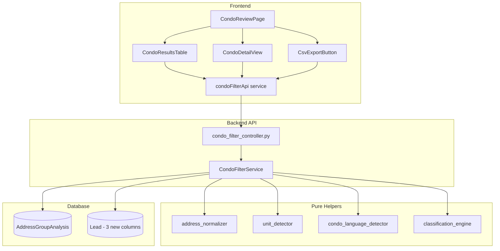

# Design Document: Commercial Condo Filter

## Overview

The Commercial Condo Filter is a backend analysis pipeline with a frontend review UI that identifies which commercial target properties are likely whole-building acquisition opportunities versus condoized or fragmented ownership structures. The system groups commercial Lead records by building-level normalized address, computes ownership and PIN metrics, detects condo indicators (unit markers, condo language), applies deterministic classification rules, and persists results for user review and manual override.

The feature integrates into the existing Flask/SQLAlchemy backend as a new service (`CondoFilterService`) with supporting helper modules, a new controller blueprint, a new database model (`AddressGroupAnalysis`), and three new columns on the existing `Lead` model. The frontend adds a new `CondoReviewPage` accessible from the sidebar navigation.

### Key Design Decisions

1. **Pure helper functions**: Address normalization, unit detection, condo language detection, and classification are implemented as pure functions (no database access) to enable comprehensive property-based testing.
2. **Service orchestration**: `CondoFilterService` orchestrates the pipeline, calling pure helpers and managing database persistence.
3. **Upsert pattern**: Analysis results use upsert semantics keyed on `normalized_address` to support re-runs without duplicates.
4. **Manual override preservation**: Re-running analysis updates automated fields but never overwrites manual override fields.
5. **Data safety**: The analysis pipeline only writes to the three new Lead columns (`condo_risk_status`, `building_sale_possible`, `condo_analysis_id`) and never deletes or modifies other Lead data.

## Architecture



### Request Flow

1. User clicks "Run Analysis" → POST `/api/condo-filter/analyze`
2. Controller delegates to `CondoFilterService.run_analysis()`
3. Service queries commercial/mixed-use Leads
4. For each Lead, `address_normalizer.normalize()` produces the grouping key
5. Leads are grouped by normalized address
6. For each group, metrics are computed (property_count, pin_count, owner_count, etc.)
7. `unit_detector` and `condo_language_detector` check group members
8. `classification_engine.classify()` applies priority-ordered rules to metrics
9. Results are upserted into `AddressGroupAnalysis` table
10. Linked Lead records are updated with classification fields
11. Summary response returned to frontend

## Components and Interfaces

### Backend Components

#### 1. `backend/app/services/condo_filter_service.py` — CondoFilterService

Orchestrates the full analysis pipeline.

```python
class CondoFilterService:
    def run_analysis(self) -> dict:
        """Run full condo filter analysis on all commercial/mixed-use leads.
        
        Returns summary dict with counts by status and building_sale_possible.
        """
        ...

    def get_results(self, filters: dict, page: int, per_page: int) -> dict:
        """Get paginated, filtered analysis results."""
        ...

    def get_detail(self, analysis_id: int) -> dict:
        """Get full detail for a single address group including linked leads."""
        ...

    def apply_override(self, analysis_id: int, status: str, building_sale: str, reason: str) -> dict:
        """Apply manual override to an address group and update linked leads."""
        ...

    def export_csv(self, filters: dict) -> str:
        """Generate CSV content for filtered results."""
        ...
```

#### 2. `backend/app/services/helpers/address_normalizer.py` — Pure function module

```python
def normalize_address(address: str) -> str:
    """Strip unit markers, normalize case/whitespace, return building-level address.
    
    Strips: unit, apt, apartment, suite, ste, # (and their values)
    Strips: alphanumeric unit suffixes (e.g., "1a", "2b", "3r")
    Normalizes: lowercase, collapse whitespace, strip leading/trailing
    
    Idempotent: normalize(normalize(x)) == normalize(x)
    """
    ...
```

#### 3. `backend/app/services/helpers/unit_detector.py` — Pure function module

```python
def has_unit_marker(address: str) -> bool:
    """Return True if address contains unit/apt/suite/ste/# markers or alphanumeric suffixes.
    
    Patterns detected (case-insensitive):
    - "unit", "apt", "apartment", "suite", "ste" followed by a value
    - "#" followed by a value
    - Trailing alphanumeric suffix pattern (e.g., "1a", "2b", "3n")
    """
    ...
```

#### 4. `backend/app/services/helpers/condo_language_detector.py` — Pure function module

```python
def has_condo_language(property_type: str | None, assessor_class: str | None) -> bool:
    """Return True if either field contains condo-related terminology.
    
    Terms detected (case-insensitive):
    - "condo", "condominium", "commercial condo", "condo unit", "unit"
    """
    ...
```

#### 5. `backend/app/services/helpers/classification_engine.py` — Pure function module

```python
from dataclasses import dataclass

@dataclass
class AddressGroupMetrics:
    property_count: int
    pin_count: int
    owner_count: int
    has_unit_number: bool
    has_condo_language: bool
    missing_pin_count: int
    missing_owner_count: int

@dataclass
class ClassificationResult:
    condo_risk_status: str          # likely_not_condo | likely_condo | partial_condo_possible | needs_review | unknown
    building_sale_possible: str     # yes | no | maybe | unknown
    triggered_rules: list[str]      # e.g., ["rule_1_unit_number"]
    reason: str                     # human-readable explanation
    confidence: str                 # high | medium | low

def classify(metrics: AddressGroupMetrics) -> ClassificationResult:
    """Apply deterministic priority-ordered rules to produce classification.
    
    Rule priority (first match wins):
    1. has_unit_number=True → likely_condo / no / high confidence
    2. has_condo_language=True → likely_condo / no / high confidence
    3. pin_count >= 4 AND owner_count >= 2 → likely_condo / no / high confidence
    4. pin_count=1 AND owner_count=1 AND no unit AND no condo language → likely_not_condo / yes / high confidence
    5. pin_count >= 2 AND owner_count=1 AND no unit → partial_condo_possible / maybe / medium confidence
    6. pin_count >= 2 AND owner_count > 1 AND no unit AND no condo language → needs_review / unknown / medium confidence
    7. missing_pin_count > 0 OR missing_owner_count > 0 → needs_review / unknown / low confidence
    8. Default fallback → needs_review / unknown / low confidence
    
    Deterministic: identical metrics always produce identical results.
    """
    ...
```

#### 6. `backend/app/controllers/condo_filter_controller.py` — Flask Blueprint

```python
from flask import Blueprint

condo_filter_bp = Blueprint('condo_filter', __name__)

# POST /api/condo-filter/analyze        — Run full analysis pipeline
# GET  /api/condo-filter/results         — List results (paginated, filtered)
# GET  /api/condo-filter/results/<id>    — Get detail with linked leads
# PUT  /api/condo-filter/results/<id>/override — Apply manual override
# GET  /api/condo-filter/export/csv      — Export filtered results as CSV
```

Registered in `app/__init__.py`:
```python
from app.controllers.condo_filter_controller import condo_filter_bp
app.register_blueprint(condo_filter_bp, url_prefix='/api/condo-filter')
```

#### 7. `backend/app/models/address_group_analysis.py` — SQLAlchemy Model

New model for persisting analysis results (see Data Models section).

### Frontend Components

#### 1. `frontend/src/components/CondoReviewPage.tsx`

Top-level page component. Manages state for filters, pagination, detail view visibility, and analysis trigger. Added to `App.tsx` routes at `/condo-filter` and to the sidebar navigation.

#### 2. `frontend/src/components/CondoResultsTable.tsx`

AG Grid table displaying analysis results. Includes:
- Filter controls (Select for condo_risk_status, building_sale_possible, manually_reviewed)
- "Run Analysis" button with loading state
- Row click to open detail view
- Pagination controls

#### 3. `frontend/src/components/CondoDetailView.tsx`

MUI Drawer showing full detail for a selected address group:
- Analysis metrics and classification details
- Table of linked Lead records (address, PIN, owners, property_type, assessor_class)
- Manual override form (Select for status, Select for building_sale_possible, TextField for reason)
- Submit button that calls override API

#### 4. `frontend/src/services/condoFilterApi.ts`

API service layer following the `leadApi.ts` pattern:

```typescript
export const condoFilterService = {
  runAnalysis(): Promise<AnalysisSummary> { ... },
  getResults(params: CondoFilterParams): Promise<CondoFilterResultsResponse> { ... },
  getDetail(id: number): Promise<AddressGroupDetail> { ... },
  applyOverride(id: number, data: OverrideRequest): Promise<AddressGroupDetail> { ... },
  exportCsv(params: CondoFilterParams): Promise<Blob> { ... },
}
```

## Data Models

### New Table: `address_group_analyses`

```python
class AddressGroupAnalysis(db.Model):
    """Stores per-building condo filter analysis results."""
    __tablename__ = 'address_group_analyses'

    id = db.Column(db.Integer, primary_key=True)
    normalized_address = db.Column(db.String(500), unique=True, nullable=False, index=True)
    source_type = db.Column(db.String(50), nullable=True)
    
    # Computed metrics
    property_count = db.Column(db.Integer, nullable=False, default=0)
    pin_count = db.Column(db.Integer, nullable=False, default=0)
    owner_count = db.Column(db.Integer, nullable=False, default=0)
    has_unit_number = db.Column(db.Boolean, nullable=False, default=False)
    has_condo_language = db.Column(db.Boolean, nullable=False, default=False)
    missing_pin_count = db.Column(db.Integer, nullable=False, default=0)
    missing_owner_count = db.Column(db.Integer, nullable=False, default=0)
    
    # Classification results
    condo_risk_status = db.Column(db.String(50), nullable=False, index=True)
    building_sale_possible = db.Column(db.String(50), nullable=False)
    analysis_details = db.Column(db.JSON, nullable=True)
    
    # Manual override
    manually_reviewed = db.Column(db.Boolean, nullable=False, default=False)
    manual_override_status = db.Column(db.String(50), nullable=True)
    manual_override_reason = db.Column(db.Text, nullable=True)
    
    # Timestamps
    analyzed_at = db.Column(db.DateTime, nullable=True)
    created_at = db.Column(db.DateTime, nullable=False, default=datetime.utcnow)
    updated_at = db.Column(db.DateTime, nullable=False, default=datetime.utcnow, onupdate=datetime.utcnow)
    
    # Relationships
    leads = db.relationship('Lead', backref='condo_analysis', lazy='dynamic')
```

### Lead Table Extensions

Three new nullable columns on the existing `Lead` model:

```python
# Added to backend/app/models/lead.py
condo_risk_status = db.Column(db.String(50), nullable=True)
building_sale_possible = db.Column(db.String(50), nullable=True)
condo_analysis_id = db.Column(db.Integer, db.ForeignKey('address_group_analyses.id'), nullable=True)
```

### Alembic Migration

New migration adds:
1. `address_group_analyses` table with all columns and indexes
2. Three new columns on `leads` table
3. Foreign key constraint from `leads.condo_analysis_id` to `address_group_analyses.id`

### API Schemas (Marshmallow)

Added to `backend/app/schemas.py`:

```python
class CondoFilterResultsQuerySchema(Schema):
    """Query params for GET /api/condo-filter/results."""
    condo_risk_status = fields.Str(load_default=None, validate=validate.OneOf([
        'likely_condo', 'likely_not_condo', 'partial_condo_possible', 'needs_review', 'unknown'
    ]))
    building_sale_possible = fields.Str(load_default=None, validate=validate.OneOf([
        'yes', 'no', 'maybe', 'unknown'
    ]))
    manually_reviewed = fields.Bool(load_default=None)
    page = fields.Int(load_default=1, validate=validate.Range(min=1))
    per_page = fields.Int(load_default=20, validate=validate.Range(min=1, max=100))


class CondoFilterOverrideSchema(Schema):
    """Request body for PUT /api/condo-filter/results/<id>/override."""
    condo_risk_status = fields.Str(required=True, validate=validate.OneOf([
        'likely_condo', 'likely_not_condo', 'partial_condo_possible', 'needs_review', 'unknown'
    ]))
    building_sale_possible = fields.Str(required=True, validate=validate.OneOf([
        'yes', 'no', 'maybe', 'unknown'
    ]))
    reason = fields.Str(required=True, validate=validate.Length(min=1, max=1000))
```

### Frontend Types

Added to `frontend/src/types/index.ts`:

```typescript
// Condo Filter types
export type CondoRiskStatus = 'likely_condo' | 'likely_not_condo' | 'partial_condo_possible' | 'needs_review' | 'unknown'
export type BuildingSalePossible = 'yes' | 'no' | 'maybe' | 'unknown'

export interface AddressGroupAnalysis {
  id: number
  normalized_address: string
  source_type: string | null
  property_count: number
  pin_count: number
  owner_count: number
  has_unit_number: boolean
  has_condo_language: boolean
  missing_pin_count: number
  missing_owner_count: number
  condo_risk_status: CondoRiskStatus
  building_sale_possible: BuildingSalePossible
  analysis_details: {
    triggered_rules: string[]
    reason: string
    confidence: string
  } | null
  manually_reviewed: boolean
  manual_override_status: string | null
  manual_override_reason: string | null
  analyzed_at: string | null
  created_at: string | null
  updated_at: string | null
}

export interface AddressGroupDetail extends AddressGroupAnalysis {
  leads: AddressGroupLead[]
}

export interface AddressGroupLead {
  id: number
  property_street: string
  county_assessor_pin: string | null
  owner_first_name: string | null
  owner_last_name: string | null
  owner_2_first_name: string | null
  owner_2_last_name: string | null
  property_type: string | null
  assessor_class: string | null
}

export interface CondoFilterResultsResponse extends PaginatedResponse {
  results: AddressGroupAnalysis[]
}

export interface CondoAnalysisSummary {
  total_groups: number
  total_properties: number
  by_status: Record<CondoRiskStatus, number>
  by_building_sale: Record<BuildingSalePossible, number>
}

export interface CondoFilterParams {
  condo_risk_status?: CondoRiskStatus
  building_sale_possible?: BuildingSalePossible
  manually_reviewed?: boolean
  page?: number
  per_page?: number
}

export interface CondoOverrideRequest {
  condo_risk_status: CondoRiskStatus
  building_sale_possible: BuildingSalePossible
  reason: string
}
```

## Correctness Properties

*A property is a characteristic or behavior that should hold true across all valid executions of a system — essentially, a formal statement about what the system should do. Properties serve as the bridge between human-readable specifications and machine-verifiable correctness guarantees.*

### Property 1: Address Normalization Correctness

*For any* valid address string containing unit markers (unit, apt, apartment, suite, ste, #, or alphanumeric suffixes like "1a", "2b"), the Address_Normalizer SHALL produce a Normalized_Address that does not contain the unit marker or its value, while preserving the base street address content. For addresses without unit markers, the normalizer SHALL preserve the full semantic address content (modulo case and whitespace normalization).

**Validates: Requirements 1.1, 1.2, 1.3, 1.4**

### Property 2: Address Normalization Idempotence

*For any* string input, applying the Address_Normalizer twice SHALL produce the same result as applying it once: `normalize(normalize(x)) == normalize(x)`.

**Validates: Requirements 1.5, 14.1**

### Property 3: Unit Detector Correctness

*For any* address string, the Unit_Detector SHALL return `true` if and only if the address contains a recognized unit marker pattern (unit, apt, apartment, suite, ste, # followed by a value, or trailing alphanumeric suffix). For addresses constructed without any such pattern, the detector SHALL return `false`.

**Validates: Requirements 3.1, 3.2, 3.3**

### Property 4: Condo Language Detector Correctness

*For any* pair of (property_type, assessor_class) strings, the Condo_Language_Detector SHALL return `true` if and only if at least one field contains a recognized condo term (case-insensitive): "condo", "condominium", "commercial condo", "condo unit", or "unit". For field values containing none of these terms, the detector SHALL return `false`.

**Validates: Requirements 4.1, 4.2**

### Property 5: Group Metric Computation Correctness

*For any* list of Lead-like records sharing the same normalized address, the computed metrics SHALL satisfy: `property_count == len(leads)`, `pin_count == len(set of unique non-null PINs)`, `owner_count == len(set of unique non-null owner name combinations)`, `missing_pin_count == count of leads with null PIN`, `missing_owner_count == count of leads with null owner names`, `has_unit_number == any(has_unit_marker(lead.address) for lead in leads)`, and `has_condo_language == any(has_condo_language(lead.property_type, lead.assessor_class) for lead in leads)`.

**Validates: Requirements 2.3, 3.4, 4.3**

### Property 6: Classification Engine Determinism and Rule Correctness

*For any* valid `AddressGroupMetrics`, the Classification_Engine SHALL: (a) produce a result matching exactly one rule from the priority-ordered rule set, (b) always produce identical output for identical input metrics (determinism), and (c) always include non-empty `triggered_rules`, `reason`, and `confidence` fields in the result.

**Validates: Requirements 5.1, 5.2, 5.3, 5.4, 5.5, 5.6, 5.7, 5.8, 5.9, 5.10, 5.11**

### Property 7: Data Safety Invariant

*For any* set of Lead records processed by the Condo_Filter_Service, after analysis completes: (a) no Lead records are deleted (count unchanged), (b) only the fields `condo_risk_status`, `building_sale_possible`, and `condo_analysis_id` are modified, and (c) all other Lead field values remain identical to their pre-analysis state.

**Validates: Requirements 13.1, 13.2, 13.3, 14.2**

### Property 8: CSV Export Completeness

*For any* set of `AddressGroupAnalysis` records with linked Leads, the CSV export SHALL produce rows containing all required columns (normalized_address, representative_property_address, pin_count, owner_count, condo_risk_status, building_sale_possible, owner_names, mailing_addresses, property_ids, pins, reason, confidence), and for groups with multiple leads, multi-valued fields SHALL contain all values from linked leads joined by a delimiter.

**Validates: Requirements 12.1, 12.3**

### Property 9: Manual Override Preservation Under Re-Analysis

*For any* `AddressGroupAnalysis` record where `manually_reviewed` is `True` and `manual_override_status` is set, re-running the automated analysis SHALL update `analysis_details` with fresh automated results but SHALL NOT modify `manual_override_status`, `manual_override_reason`, or `manually_reviewed`.

**Validates: Requirements 6.5, 9.3, 9.4**

## Error Handling

| Scenario | Behavior |
|----------|----------|
| No commercial/mixed-use leads exist | Return 200 with zero counts in summary |
| Database error during analysis | Roll back transaction, return 500 with descriptive message, no partial results persisted |
| Invalid filter parameter on GET results | Return 400 with Marshmallow validation error details |
| Address_Group_Analysis record not found (GET/PUT) | Return 404 with descriptive message |
| Invalid override status value | Return 400 with validation error |
| Lead has null `property_street` | Skip lead during grouping (cannot normalize null), log warning |
| Large dataset (>5000 leads) | Process in batches of 500 with periodic commits to avoid long transactions |
| Concurrent analysis runs | Use database-level unique constraint on `normalized_address` for upsert safety |

Error responses follow the existing project pattern:
```json
{
  "error": "Error type",
  "message": "Human-readable description"
}
```

The controller uses the same `@handle_errors` decorator pattern as `lead_controller.py` for consistent error formatting.

## Testing Strategy

### Property-Based Tests (Hypothesis)

The pure helper functions are ideal for property-based testing. Each property test runs a minimum of **100 iterations** using Hypothesis.

**Library**: Hypothesis (already in `backend/requirements.txt`)

**Test file**: `backend/tests/test_condo_filter_properties.py`

| Property | Target Function(s) | Hypothesis Strategy |
|----------|-------------------|---------------------|
| 1: Normalization Correctness | `normalize_address()` | Custom strategy generating addresses with known unit markers |
| 2: Normalization Idempotence | `normalize_address()` | `st.text(min_size=1, max_size=200)` for arbitrary strings |
| 3: Unit Detector Correctness | `has_unit_marker()` | Composite strategy: addresses with/without injected markers |
| 4: Condo Language Detector | `has_condo_language()` | `st.text()` pairs with/without injected condo terms |
| 5: Metric Computation | `compute_group_metrics()` | `st.lists()` of lead-like dicts with controlled fields |
| 6: Classification Correctness | `classify()` | `st.builds(AddressGroupMetrics, ...)` with constrained integers/booleans |
| 7: Data Safety | `CondoFilterService.run_analysis()` | Generate lead fixtures, snapshot all fields before/after |
| 8: CSV Export | `export_csv()` | Generate analysis result dicts with linked lead lists |
| 9: Override Preservation | `CondoFilterService.run_analysis()` | Pre-set override fields, run analysis, verify unchanged |

**Tag format**: Each test is annotated with:
```python
# Feature: commercial-condo-filter, Property {N}: {title}
```

**Configuration**:
```python
from hypothesis import settings

@settings(max_examples=100)
@given(...)
def test_property_N(...):
    ...
```

### Unit Tests (pytest)

**Test file**: `backend/tests/test_condo_filter_service.py`

Example-based tests covering:
- API endpoint request/response validation (POST analyze, GET results, GET detail, PUT override, GET CSV)
- Database upsert behavior (first run creates, second run updates)
- Manual override end-to-end flow
- Pagination and filter combinations
- Error responses (404 for missing record, 400 for invalid params, 500 for DB errors)
- `analyzed_at` timestamp correctness
- Filter application to CSV export
- Batch processing for large datasets

### Frontend Tests (Vitest + React Testing Library)

**Test files**: Co-located as `ComponentName.test.tsx`

- `CondoReviewPage.test.tsx`: Page renders, "Run Analysis" triggers API, results display
- `CondoResultsTable.test.tsx`: Filter controls render, filter changes trigger re-fetch, pagination works
- `CondoDetailView.test.tsx`: Detail renders linked leads, override form submits correctly
- Mock API responses using MSW or manual mocks following existing test patterns

### Integration Tests

**Test file**: `backend/tests/test_condo_filter_integration.py`

- Full pipeline: seed leads → POST analyze → verify DB state → GET results → GET detail → PUT override → verify cascade
- Unique constraint enforcement on `normalized_address`
- Foreign key integrity (`condo_analysis_id` references valid record)
- Re-analysis preserves overrides while updating automated fields
