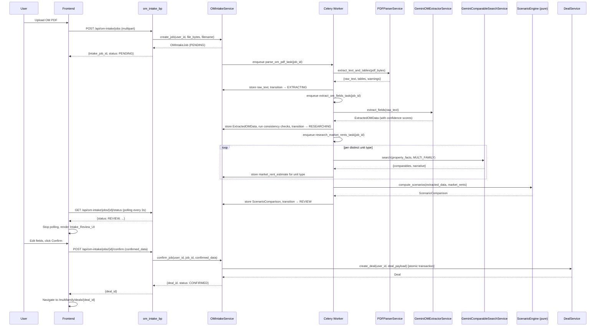
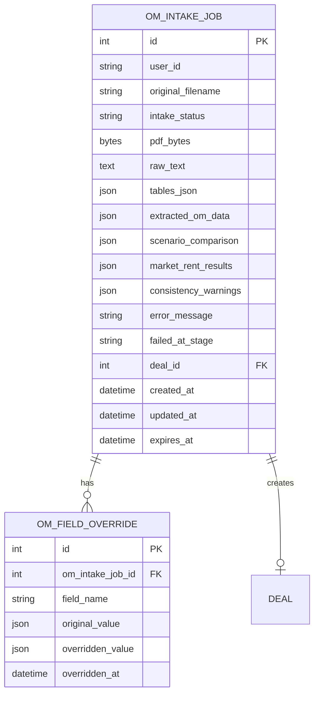

# Design Document

## Overview

The Commercial OM PDF Intake feature adds an asynchronous pipeline that transforms a broker Offering Memorandum PDF into a pre-populated multifamily Deal record. The pipeline has four sequential stages — PDF parsing, AI field extraction, market rent research, and Deal creation — each modelled as a Celery task that advances an `OMIntakeJob` state machine through the statuses `PENDING → PARSING → EXTRACTING → RESEARCHING → REVIEW → CONFIRMED` (or `FAILED` at any stage).

The feature is designed around three core principles:

1. **Pure-function scenario computation.** The `ScenarioEngine` that derives `Broker_Current`, `Broker_Pro_Forma`, and `Realistic_Scenario` metrics is a stateless module-level function that takes frozen dataclasses and returns a `ScenarioComparison` dataclass. This makes it straightforward to run Hypothesis against it at 100+ iterations without touching the database.

2. **Reuse over reinvention.** The feature reuses `GeminiComparableSearchService` for market rent research, the existing `GOOGLE_AI_API_KEY` environment variable, the `RealEstateAnalysisException` hierarchy, the `@handle_errors` decorator pattern, and the `DealService.create_deal` path for Deal creation.

3. **Atomic Deal creation.** The confirmation step wraps Unit creation, Rent_Roll_Entry creation, Market_Rent_Assumption creation, expense mapping, and `OMIntakeJob` status update in a single SQLAlchemy transaction that rolls back completely on any failure.

### Design decisions and rationales

- **Celery for async processing.** PDF parsing (up to 30 s for 50 pages) and two Gemini API calls (up to 60 s each) make synchronous handling impractical. Each pipeline stage is a separate Celery task so failures are isolated and retries are granular.
- **PyMuPDF as primary parser, pdfplumber as fallback.** PyMuPDF (`fitz`) is faster and handles more PDF variants; pdfplumber has superior table extraction. The `PDFParserService` tries PyMuPDF first and falls back to pdfplumber for table extraction if PyMuPDF's table output is empty.
- **Gemini for field extraction, not a regex pipeline.** OM PDFs have no standard layout. A structured Gemini prompt requesting a typed JSON object is more robust than a regex/heuristic approach and aligns with the existing `GeminiComparableSearchService` pattern.
- **Confidence scores are Gemini-reported, not computed.** The extraction prompt instructs Gemini to include a `confidence` key per field. The `OMExtractorService` validates that all confidence values are in `[0.0, 1.0]` and defaults absent fields to `confidence=0.0`.
- **Exponential backoff is implemented in the Celery task, not in the service.** This keeps the `GeminiOMExtractorService` and `GeminiComparableSearchService` stateless and testable; retry logic lives in the task layer where Celery's `autoretry_for` and `retry_backoff` can be used.
- **Scenario computation is frontend-replicated for instant recalculation.** The `ScenarioEngine` formulas are simple enough to re-implement in TypeScript in the frontend so that field edits recalculate metrics within 300 ms without a server round-trip. The backend `ScenarioEngine` is the authoritative implementation; the frontend mirrors it.
- **PDF bytes stored in the database as `LargeBinary`.** For a 50 MB limit this is acceptable for a single-user/small-team tool. A future enhancement could move to S3/presigned URLs without changing the service interface.
- **`unit_count` CHECK constraint relaxed for OM intake.** The existing `deals` table has `CHECK unit_count >= 5`. OM intake creates Deals through `DealService.create_deal`, which enforces this constraint. The requirements do not relax it, so OMs for properties with fewer than 5 units will fail Deal creation with a validation error — this is intentional and consistent with the multifamily-underwriting-proforma spec.

## Architecture

### High-level pipeline



### Package layout (backend additions)

Following the project's "one model per file, one service per file" conventions:

```
backend/app/
├── models/
│   └── om_intake_job.py              # OMIntakeJob SQLAlchemy model
├── services/om_intake/
│   ├── __init__.py
│   ├── om_intake_service.py          # CRUD + state transitions + confirmation
│   ├── pdf_parser_service.py         # PyMuPDF + pdfplumber extraction
│   ├── gemini_om_extractor_service.py # Gemini field extraction
│   ├── scenario_engine.py            # pure compute_scenarios(inputs) → ScenarioComparison
│   └── om_intake_dataclasses.py      # frozen dataclasses: ExtractedOMData, ScenarioComparison, etc.
├── controllers/
│   └── om_intake_controller.py       # Blueprint: om_intake_bp, prefix /api/om-intake
├── tasks/
│   └── om_intake_tasks.py            # Celery tasks: parse, extract, research
└── schemas.py                        # OM intake Marshmallow schemas appended
```

### Package layout (frontend additions)

```
frontend/src/
├── pages/multifamily/
│   └── OMIntakePage.tsx              # Upload form + polling + review UI
├── components/multifamily/
│   ├── OMUploadForm.tsx              # Drag-and-drop PDF upload
│   ├── OMStatusPoller.tsx            # Polls /status every 3s, renders loading messages
│   ├── OMReviewPanel.tsx             # Three-scenario comparison table + field editor
│   ├── OMScenarioTable.tsx           # Side-by-side scenario metrics table
│   ├── OMUnitMixComparison.tsx       # Per-unit-type comparison rows
│   ├── OMDataWarnings.tsx            # Consistency warning display
│   └── omScenarioEngine.ts           # TypeScript mirror of ScenarioEngine formulas
├── services/api.ts                   # OM intake endpoints appended
└── types/index.ts                    # OM intake TypeScript types appended
```

### Integration points with the existing platform

| Concern | Approach |
|---|---|
| Auth | Reuse existing Flask session / user identity. OM intake endpoints do not introduce a separate auth layer. |
| Gemini API | Reuse `GeminiComparableSearchService` for market rent research. Reuse `GOOGLE_AI_API_KEY` env var. |
| Deal creation | Call `DealService.create_deal` and related services from `OMIntakeService.confirm_job`. |
| Audit trail | Log Deal creation source (OM intake + `intake_job_id`) via `DealService._log_audit`. |
| Error handling | New exceptions extend `RealEstateAnalysisException`. Controllers use `@handle_errors`. |
| Celery | New tasks registered in `celery_worker.py` alongside existing `multifamily.recompute_all_deals`. |
| Navigation | "Upload OM" button added to the Multifamily section in `App.tsx` sidebar. |

## Components and Interfaces

### OMIntakeService

The central orchestrator for job lifecycle management. Instantiated per-request from the controller.

```python
class OMIntakeService:
    def create_job(self, user_id: str, file_bytes: bytes, filename: str) -> OMIntakeJob
        # Validates MIME type (from filename/magic bytes) and file size (≤ 50 MB).
        # Creates OMIntakeJob with status=PENDING, stores pdf_bytes.
        # Enqueues parse_om_pdf_task.

    def get_job(self, user_id: str, job_id: int) -> OMIntakeJob
        # Returns job if it belongs to user_id; raises ResourceNotFoundError (404) otherwise.

    def list_jobs(self, user_id: str, page: int, page_size: int) -> tuple[list[OMIntakeJob], int]
        # Returns paginated list ordered by created_at DESC, total count.
        # page_size clamped to [1, 100], default 25.

    def get_scenario_comparison(self, user_id: str, job_id: int) -> ScenarioComparison
        # Returns stored ScenarioComparison for jobs in REVIEW or CONFIRMED status.

    def confirm_job(self, user_id: str, job_id: int, confirmed_data: dict) -> Deal
        # Validates job is in REVIEW status; raises ConflictError if already CONFIRMED.
        # Applies user overrides to ExtractedOMData.
        # Calls _create_deal_from_intake in a single atomic transaction.
        # Transitions job to CONFIRMED, stores deal_id.

    def retry_failed_job(self, user_id: str, job_id: int) -> OMIntakeJob
        # Creates a new OMIntakeJob referencing the same pdf_bytes.
        # Original job remains FAILED.

    # Internal state transition helpers (called by Celery tasks)
    def transition_to_parsing(self, job_id: int) -> None
    def store_parsed_text(self, job_id: int, raw_text: str, tables: list, warnings: list) -> None
    def transition_to_extracting(self, job_id: int) -> None
    def store_extracted_data(self, job_id: int, data: ExtractedOMData) -> None
    def store_market_rent(self, job_id: int, unit_type: str, estimate: Decimal, low: Decimal, high: Decimal) -> None
    def store_scenario_comparison(self, job_id: int, comparison: ScenarioComparison) -> None
    def transition_to_review(self, job_id: int) -> None
    def transition_to_failed(self, job_id: int, error_message: str) -> None
```

### PDFParserService

Stateless service for PDF text and table extraction.

```python
class PDFParserService:
    def extract(self, pdf_bytes: bytes) -> PDFExtractionResult
        # Tries PyMuPDF (fitz) first for text extraction.
        # Falls back to pdfplumber for table extraction if PyMuPDF tables are empty.
        # Raises InvalidFileError if PDF cannot be opened.
        # Returns PDFExtractionResult with raw_text, tables, warnings.

@dataclass(frozen=True)
class PDFExtractionResult:
    raw_text: str                    # Full UTF-8 text from all pages
    tables: list[list[list[str]]]    # List of tables; each table is list of rows; each row is list of cell strings
    table_extraction_warning: str | None  # Set if table extraction failed but text succeeded
```

### GeminiOMExtractorService

Calls Gemini with the extracted PDF text and returns a structured `ExtractedOMData`.

```python
class GeminiOMExtractorService:
    def __init__(self) -> None
        # Reads GOOGLE_AI_API_KEY; raises GeminiConfigurationError if missing.

    def extract(self, raw_text: str, tables: list) -> ExtractedOMData
        # Builds the OM extraction prompt with raw_text and table summaries.
        # Calls Gemini API (timeout=60s).
        # Parses and validates the JSON response.
        # Returns ExtractedOMData with all fields and confidence scores.
        # Raises GeminiAPIError, GeminiParseError, GeminiResponseError on failure.
```

The extraction prompt instructs Gemini to return a JSON object with every field in `ExtractedOMData`, each as `{"value": <value_or_null>, "confidence": <0.0-1.0>}`. Required fields (`unit_mix` array and `asking_price`) are validated; missing required fields raise `GeminiResponseError`.

### ScenarioEngine (pure)

The most test-critical component. A module-level pure function that takes frozen dataclasses and returns a `ScenarioComparison`.

```python
# om_intake_dataclasses.py

@dataclass(frozen=True)
class UnitMixRow:
    unit_type_label: str
    unit_count: int
    sqft: Decimal
    current_avg_rent: Decimal | None
    proforma_rent: Decimal | None
    market_rent_estimate: Decimal | None
    market_rent_low: Decimal | None
    market_rent_high: Decimal | None

@dataclass(frozen=True)
class ScenarioInputs:
    unit_mix: tuple[UnitMixRow, ...]
    proforma_vacancy_rate: Decimal
    proforma_gross_expenses: Decimal | None
    other_income_items: tuple[OtherIncomeItem, ...]
    asking_price: Decimal | None
    # Financing (optional)
    loan_amount: Decimal | None
    interest_rate: Decimal | None
    amortization_years: int | None
    debt_service_annual: Decimal | None
    # Broker-stated aggregates (for broker_current and broker_proforma scenarios)
    current_gross_potential_income: Decimal | None
    current_effective_gross_income: Decimal | None
    current_gross_expenses: Decimal | None
    current_noi: Decimal | None
    current_vacancy_rate: Decimal | None
    proforma_gross_potential_income: Decimal | None
    proforma_effective_gross_income: Decimal | None
    proforma_noi: Decimal | None

@dataclass(frozen=True)
class ScenarioMetrics:
    gross_potential_income_annual: Decimal | None
    effective_gross_income_annual: Decimal | None
    gross_expenses_annual: Decimal | None
    noi_annual: Decimal | None
    cap_rate: Decimal | None
    grm: Decimal | None
    monthly_rent_total: Decimal | None
    dscr: Decimal | None
    cash_on_cash: Decimal | None

@dataclass(frozen=True)
class UnitMixComparisonRow:
    unit_type_label: str
    unit_count: int
    sqft: Decimal
    current_avg_rent: Decimal | None
    proforma_rent: Decimal | None
    market_rent_estimate: Decimal | None
    market_rent_low: Decimal | None
    market_rent_high: Decimal | None

@dataclass(frozen=True)
class ScenarioComparison:
    broker_current: ScenarioMetrics
    broker_proforma: ScenarioMetrics
    realistic: ScenarioMetrics
    unit_mix_comparison: tuple[UnitMixComparisonRow, ...]
    significant_variance_flag: bool | None
    realistic_cap_rate_below_proforma: bool | None

# scenario_engine.py
def compute_scenarios(inputs: ScenarioInputs) -> ScenarioComparison: ...
```

Key computation rules (all using `Decimal` arithmetic):
- `realistic_gpi = sum(row.market_rent_estimate * row.unit_count for row in unit_mix) * 12` (null if any estimate is null)
- `realistic_egi = realistic_gpi * (1 - proforma_vacancy_rate) + sum(other_income_items annual amounts)` (null if gpi is null)
- `realistic_noi = realistic_egi - proforma_gross_expenses` (null if either is null)
- `realistic_cap_rate = realistic_noi / asking_price` if `asking_price > 0` else `null`
- `realistic_grm = asking_price / realistic_gpi` if `realistic_gpi > 0` else `null`
- `significant_variance_flag`: `|realistic_noi - proforma_noi| / |proforma_noi| > 0.10` if `proforma_noi` is non-zero/non-null, else `null`
- `realistic_cap_rate_below_proforma`: `realistic_cap_rate < proforma_cap_rate` if both are non-null, else `null`

### OMIntakeController (Flask Blueprint)

```python
om_intake_bp = Blueprint('om_intake', __name__)

# Routes (all prefixed /api/om-intake)
POST   /jobs                          # Upload PDF, create job
GET    /jobs                          # List user's jobs (paginated)
GET    /jobs/{job_id}                 # Get job status + metadata
GET    /jobs/{job_id}/review          # Get full review data (REVIEW/CONFIRMED only)
POST   /jobs/{job_id}/confirm         # Confirm intake, create Deal
POST   /jobs/{job_id}/retry           # Retry a FAILED job
```

### Celery Tasks

```python
# om_intake_tasks.py

@celery.task(
    name='om_intake.parse_pdf',
    autoretry_for=(),          # No auto-retry for parse failures (corrupt file)
    max_retries=0,
)
def parse_om_pdf_task(job_id: int) -> None: ...

@celery.task(
    name='om_intake.extract_fields',
    autoretry_for=(GeminiAPIError,),
    retry_backoff=2,           # 2s, 4s, 8s
    max_retries=3,
)
def extract_om_fields_task(job_id: int) -> None: ...

@celery.task(
    name='om_intake.research_market_rents',
    autoretry_for=(GeminiAPIError,),
    retry_backoff=2,
    max_retries=3,
)
def research_market_rents_task(job_id: int) -> None: ...
```

Each task:
1. Loads the `OMIntakeJob` from the database.
2. Transitions the job to the appropriate in-progress status.
3. Calls the relevant service.
4. On success: stores results and enqueues the next task (or transitions to `REVIEW`).
5. On unrecoverable failure: calls `OMIntakeService.transition_to_failed(job_id, error_message)`.

### REST API surface

All endpoints are prefixed `/api/om-intake`. All request/response bodies go through Marshmallow schemas appended to `backend/app/schemas.py`.

| Method | Path | Description |
|---|---|---|
| `POST` | `/jobs` | Upload PDF, create OMIntakeJob (Req 1.1) |
| `GET` | `/jobs` | List user's jobs, paginated (Req 8.1) |
| `GET` | `/jobs/{id}` | Get job status (Req 1.7) |
| `GET` | `/jobs/{id}/review` | Get full review data: ExtractedOMData + ScenarioComparison (Req 5.1, 8.2) |
| `POST` | `/jobs/{id}/confirm` | Confirm intake, create Deal (Req 7.1) |
| `POST` | `/jobs/{id}/retry` | Retry a FAILED job (Req 9.3) |

## Data Models

### Entity-Relationship diagram



### `om_intake_jobs` table

| Column | Type | Notes |
|---|---|---|
| `id` | Integer PK | |
| `user_id` | String(255) | FK-like; not a hard FK to allow user table flexibility |
| `original_filename` | String(500) | Original uploaded filename |
| `intake_status` | String(20) | CHECK IN ('PENDING','PARSING','EXTRACTING','RESEARCHING','REVIEW','CONFIRMED','FAILED') |
| `pdf_bytes` | LargeBinary | Raw PDF bytes; retained until terminal status |
| `raw_text` | Text | Extracted UTF-8 text from PDF |
| `tables_json` | JSON | Extracted table data (list of tables) |
| `table_extraction_warning` | Text | Warning if table extraction failed but text succeeded |
| `extracted_om_data` | JSON | Full `ExtractedOMData` dict with values and confidence scores |
| `scenario_comparison` | JSON | Serialized `ScenarioComparison` |
| `market_rent_results` | JSON | Per-unit-type market rent research results |
| `consistency_warnings` | JSON | List of consistency warning objects |
| `market_research_warnings` | JSON | Per-unit-type market research failure warnings |
| `partial_realistic_scenario_warning` | Boolean | True if any market_rent_estimate is null |
| `asking_price_missing_error` | Boolean | True if asking_price is null/zero after extraction |
| `unit_count_missing_error` | Boolean | True if unit_count is null/< 1 after extraction |
| `error_message` | Text | Error message when status=FAILED |
| `failed_at_stage` | String(20) | The status at the time of failure |
| `deal_id` | Integer | FK → deals.id; set when CONFIRMED |
| `created_at` | DateTime | default=utcnow |
| `updated_at` | DateTime | onupdate=utcnow |
| `expires_at` | DateTime | created_at + 90 days; used for expiry checks |

Index: `(user_id, created_at DESC)` for history queries.

### `om_field_overrides` table

| Column | Type | Notes |
|---|---|---|
| `id` | Integer PK | |
| `om_intake_job_id` | Integer FK → om_intake_jobs.id | CASCADE delete |
| `field_name` | String(100) | Dot-notation field path, e.g. `asking_price` or `unit_mix.0.current_avg_rent` |
| `original_value` | JSON | The Gemini-extracted value before override |
| `overridden_value` | JSON | The user-supplied value |
| `overridden_at` | DateTime | Timestamp of the override |

Unique constraint: `(om_intake_job_id, field_name)` — one override record per field per job.

### `ExtractedOMData` JSON structure (stored in `extracted_om_data` column)

The JSON object mirrors the field list from Requirement 3.2. Each field is stored as:
```json
{
  "asking_price": {"value": 2500000, "confidence": 0.95},
  "unit_count": {"value": 12, "confidence": 0.99},
  "unit_mix": [
    {
      "unit_type_label": {"value": "2BR/1BA", "confidence": 0.98},
      "unit_count": {"value": 6, "confidence": 0.98},
      "sqft": {"value": 850, "confidence": 0.85},
      "current_avg_rent": {"value": 1200, "confidence": 0.90},
      "proforma_rent": {"value": 1400, "confidence": 0.80}
    }
  ],
  ...
}
```

Absent fields have `{"value": null, "confidence": 0.0}`.

### SQLAlchemy model

```python
class OMIntakeJob(db.Model):
    __tablename__ = 'om_intake_jobs'

    id = db.Column(db.Integer, primary_key=True)
    user_id = db.Column(db.String(255), nullable=False, index=True)
    original_filename = db.Column(db.String(500), nullable=False)
    intake_status = db.Column(db.String(20), nullable=False, default='PENDING')
    pdf_bytes = db.Column(db.LargeBinary, nullable=True)
    raw_text = db.Column(db.Text, nullable=True)
    tables_json = db.Column(db.JSON, nullable=True)
    table_extraction_warning = db.Column(db.Text, nullable=True)
    extracted_om_data = db.Column(db.JSON, nullable=True)
    scenario_comparison = db.Column(db.JSON, nullable=True)
    market_rent_results = db.Column(db.JSON, nullable=True)
    consistency_warnings = db.Column(db.JSON, nullable=True)
    market_research_warnings = db.Column(db.JSON, nullable=True)
    partial_realistic_scenario_warning = db.Column(db.Boolean, nullable=True)
    asking_price_missing_error = db.Column(db.Boolean, nullable=True)
    unit_count_missing_error = db.Column(db.Boolean, nullable=True)
    error_message = db.Column(db.Text, nullable=True)
    failed_at_stage = db.Column(db.String(20), nullable=True)
    deal_id = db.Column(db.Integer, db.ForeignKey('deals.id'), nullable=True)
    created_at = db.Column(db.DateTime, nullable=False, default=datetime.utcnow)
    updated_at = db.Column(db.DateTime, nullable=False, default=datetime.utcnow, onupdate=datetime.utcnow)
    expires_at = db.Column(db.DateTime, nullable=False)

    field_overrides = db.relationship('OMFieldOverride', backref='job', lazy='dynamic', cascade='all, delete-orphan')

    __table_args__ = (
        db.CheckConstraint(
            "intake_status IN ('PENDING','PARSING','EXTRACTING','RESEARCHING','REVIEW','CONFIRMED','FAILED')",
            name='ck_om_intake_jobs_status'
        ),
        db.Index('ix_om_intake_jobs_user_created', 'user_id', 'created_at'),
    )
```

### Expense label mapping

The `OMIntakeService.confirm_job` method maps recognized expense labels to `Deal` OpEx fields:

| Recognized label patterns | Deal field |
|---|---|
| `real estate tax`, `property tax`, `taxes` | `property_taxes_annual` |
| `insurance` | `insurance_annual` |
| `gas`, `electric`, `water`, `sewer`, `trash`, `utilities` | `utilities_annual` (summed) |
| `maintenance`, `repairs`, `repair` | `repairs_and_maintenance_annual` |
| `management`, `mgmt` | (stored as management fee rate if %; else `other_opex_annual`) |
| `admin`, `marketing`, `advertising` | `admin_and_marketing_annual` |
| `payroll`, `labor`, `staff` | `payroll_annual` |

Matching is case-insensitive substring matching. Unrecognized labels are stored as `unmatched_expense_items` on the `OMIntakeJob` (not silently dropped) and surfaced in the review UI.

## Correctness Properties

*A property is a characteristic or behavior that should hold true across all valid executions of a system — essentially, a formal statement about what the system should do. Properties serve as the bridge between human-readable specifications and machine-verifiable correctness guarantees.*

The `ScenarioEngine` is a pure function with no I/O, making it the ideal target for property-based testing. The field extraction mapping, consistency checks, and round-trip integrity checks are also pure logic that benefits from Hypothesis-driven input generation.

### Property 1: Confidence scores are always in [0.0, 1.0]

*For any* `ExtractedOMData` produced by `GeminiOMExtractorService.extract`, every confidence score associated with every field (including all fields within each `UnitMixRow`) SHALL be a value in the closed interval `[0.0, 1.0]`.

**Validates: Requirements 3.3**

---

### Property 2: Absent fields have null value and zero confidence

*For any* `ExtractedOMData` where a field's value is `null`, the corresponding confidence score SHALL be `0.0`. Equivalently, a non-zero confidence score implies a non-null value.

**Validates: Requirements 3.4**

---

### Property 3: Realistic GPI formula

*For any* `ScenarioInputs` where all `unit_mix` rows have a non-null `market_rent_estimate`, the `realistic.gross_potential_income_annual` in the resulting `ScenarioComparison` SHALL equal `sum(row.market_rent_estimate * row.unit_count for row in unit_mix) * 12`, computed with `Decimal` arithmetic.

**Validates: Requirements 4.4**

---

### Property 4: Realistic EGI formula

*For any* `ScenarioInputs` where `realistic_gpi` is non-null, the `realistic.effective_gross_income_annual` SHALL equal `realistic_gpi * (1 - proforma_vacancy_rate) + sum(item.annual_amount for item in other_income_items)`.

**Validates: Requirements 4.5**

---

### Property 5: Realistic NOI formula

*For any* `ScenarioInputs` where `realistic_egi` and `proforma_gross_expenses` are both non-null, the `realistic.noi_annual` SHALL equal `realistic_egi - proforma_gross_expenses`.

**Validates: Requirements 4.6**

---

### Property 6: Cap rate zero-guard

*For any* `ScenarioInputs`, if `asking_price` is zero or null, then `realistic.cap_rate`, `broker_current.cap_rate`, and `broker_proforma.cap_rate` SHALL all be `null`. If `asking_price > 0` and `noi_annual` is non-null, then `cap_rate = noi_annual / asking_price`.

**Validates: Requirements 4.7, 5.8**

---

### Property 7: GRM zero-guard

*For any* `ScenarioInputs`, if `gross_potential_income_annual` is zero or null for a scenario, then `grm` for that scenario SHALL be `null`. If `gross_potential_income_annual > 0` and `asking_price` is non-null, then `grm = asking_price / gross_potential_income_annual`.

**Validates: Requirements 4.8, 5.9**

---

### Property 8: Significant variance flag correctness

*For any* `ScenarioComparison` where `broker_proforma.noi_annual` is non-zero and non-null, `significant_variance_flag` SHALL be `true` if and only if `|realistic.noi_annual - broker_proforma.noi_annual| / |broker_proforma.noi_annual| > 0.10`. If `broker_proforma.noi_annual` is zero or null, `significant_variance_flag` SHALL be `null`.

**Validates: Requirements 5.4, 5.5**

---

### Property 9: Realistic cap rate below proforma flag correctness

*For any* `ScenarioComparison` where both `realistic.cap_rate` and `broker_proforma.cap_rate` are non-null, `realistic_cap_rate_below_proforma` SHALL be `true` if and only if `realistic.cap_rate < broker_proforma.cap_rate`.

**Validates: Requirements 5.6**

---

### Property 10: Unit mix comparison completeness

*For any* `ScenarioComparison`, every row in `unit_mix_comparison` SHALL contain non-null values for `unit_type_label`, `unit_count`, and `sqft`. The `unit_mix_comparison` array SHALL have exactly one row per distinct `unit_type_label` in the input `unit_mix`.

**Validates: Requirements 5.7**

---

### Property 11: Gemini call count equals distinct unit type count

*For any* `ScenarioInputs` with `n` distinct `unit_type_label` values in `unit_mix`, the market rent research step SHALL invoke `GeminiComparableSearchService.search` exactly `n` times — once per distinct unit type.

**Validates: Requirements 4.1**

---

### Property 12: Deal field mapping round-trip

*For any* confirmed `ExtractedOMData` with a non-null `asking_price`, the `Deal` created by `OMIntakeService.confirm_job` SHALL have `purchase_price` equal to the confirmed `asking_price`, `property_address` equal to `property_address`, `unit_count` equal to `unit_count`, `property_city` equal to `property_city`, `property_state` equal to `property_state`, and `property_zip` equal to `property_zip`.

**Validates: Requirements 7.2, 11.1**

---

### Property 13: Unit record count equals unit_count

*For any* confirmed `ExtractedOMData`, the number of `Unit` records created on the resulting `Deal` SHALL equal the top-level `unit_count` field in the confirmed data, and SHALL also equal the sum of `unit_count` across all `Unit_Mix_Rows`.

**Validates: Requirements 7.3, 11.3**

---

### Property 14: Rent roll sum matches unit mix sum

*For any* confirmed `ExtractedOMData`, the sum of `current_rent` across all `Rent_Roll_Entry` records on the created `Deal` SHALL equal the sum of `(current_avg_rent * unit_count)` across all `Unit_Mix_Rows`, within an absolute tolerance of `$0.01`.

**Validates: Requirements 7.4, 11.2**

---

### Property 15: Other income monthly formula

*For any* `ExtractedOMData` with a non-empty `other_income_items` array, the `Deal.other_income_monthly` SHALL equal `sum(item.annual_amount for item in other_income_items) / 12`, using `Decimal` arithmetic rounded to 2 decimal places.

**Validates: Requirements 7.7**

---

### Property 16: User override is applied to Deal

*For any* field override applied during the review step, the corresponding field on the created `Deal` SHALL equal the user-overridden value, not the original Gemini-extracted value.

**Validates: Requirements 11.4**

---

### Property 17: Override audit trail completeness

*For any* field override, the `OMFieldOverride` record SHALL store the `original_value` (the Gemini-extracted value), the `overridden_value` (the user-supplied value), and a non-null `overridden_at` timestamp.

**Validates: Requirements 11.5**

---

### Property 18: NOI consistency check correctness

*For any* `ExtractedOMData` where `current_noi`, `current_effective_gross_income`, and `current_gross_expenses` are all non-null and non-zero, the `noi_consistency_warning` SHALL be set if and only if `|current_noi - (current_effective_gross_income - current_gross_expenses)| / |current_effective_gross_income - current_gross_expenses| > 0.02`.

**Validates: Requirements 10.2**

---

### Property 19: Cap rate consistency check correctness

*For any* `ExtractedOMData` where `current_cap_rate`, `current_noi`, and `asking_price` are all non-null and non-zero, the `cap_rate_consistency_warning` SHALL be set if and only if `|current_cap_rate - (current_noi / asking_price)| > 0.005`.

**Validates: Requirements 10.3**

---

### Property 20: GRM consistency check correctness

*For any* `ExtractedOMData` where `current_grm`, `asking_price`, and `current_gross_potential_income` are all non-null and non-zero, the `grm_consistency_warning` SHALL be set if and only if `|current_grm - (asking_price / current_gross_potential_income)| / (asking_price / current_gross_potential_income) > 0.02`.

**Validates: Requirements 10.4**

---

### Property 21: History list ordering

*For any* user with multiple `OMIntakeJob` records, the paginated history list SHALL be ordered by `created_at` descending — i.e., for any two adjacent items `a` and `b` in the returned list, `a.created_at >= b.created_at`.

**Validates: Requirements 8.1**

---

### Property Reflection

After reviewing all 21 properties:

- Properties 3–7 (GPI, EGI, NOI, cap rate, GRM formulas) are distinct arithmetic formulas with different inputs and outputs — no redundancy.
- Properties 12 and 13 both test Deal creation but validate different fields (field mapping vs. unit count) — kept separate.
- Properties 14 and 13 both test unit-related invariants but validate different things (rent sum vs. unit count) — kept separate.
- Properties 18–20 (consistency checks) each test a different formula — no redundancy.
- Property 8 (significant variance flag) and Property 9 (cap rate below proforma flag) test different boolean flags — kept separate.
- Properties 16 and 17 both relate to overrides but test different aspects (value application vs. audit trail) — kept separate.

No properties were eliminated as redundant. All 21 provide unique validation value.

## Error Handling

### New exception classes

The following exceptions extend `RealEstateAnalysisException` and are added to `backend/app/exceptions.py`:

```python
class InvalidFileError(RealEstateAnalysisException):
    """Raised when the uploaded file fails MIME type or size validation."""
    def __init__(self, message: str, field: str = None):
        super().__init__(message, status_code=422)
        self.payload = {'error_type': 'invalid_file_error', 'field': field}

class ExternalServiceError(RealEstateAnalysisException):
    """Raised when an external service (Gemini, PDF parser) fails unrecoverably."""
    def __init__(self, message: str, service: str = None):
        super().__init__(message, status_code=502)
        self.payload = {'error_type': 'external_service_error', 'service': service}

class ResourceNotFoundError(RealEstateAnalysisException):
    """Raised when a requested resource does not exist or belongs to another user."""
    def __init__(self, message: str, resource_type: str = None, resource_id=None):
        super().__init__(message, status_code=404)
        self.payload = {'error_type': 'resource_not_found', 'resource_type': resource_type, 'resource_id': resource_id}

class ConflictError(RealEstateAnalysisException):
    """Raised when an operation conflicts with current resource state (e.g., re-confirming a CONFIRMED job)."""
    def __init__(self, message: str, deal_id: int = None):
        super().__init__(message, status_code=409)
        self.payload = {'error_type': 'conflict_error', 'deal_id': deal_id}
```

### Error handling matrix

| Stage | Failure condition | Action |
|---|---|---|
| Upload | MIME type not `application/pdf` | `InvalidFileError` → HTTP 422 |
| Upload | File > 50 MB | `InvalidFileError` → HTTP 422 |
| Upload | DB write fails | HTTP 500, no partial record |
| PARSING | PDF unreadable/corrupt | `transition_to_failed`, `error_message` set |
| PARSING | Extracted text < 100 chars | `transition_to_failed`, `error_message` set |
| PARSING | Table extraction fails, text OK | Store warning, continue to EXTRACTING |
| EXTRACTING | `GOOGLE_AI_API_KEY` missing | `transition_to_failed`, config error message |
| EXTRACTING | Empty/null raw_text | `transition_to_failed`, no Gemini call made |
| EXTRACTING | Gemini HTTP 429 or 5xx | Retry up to 3× with 2s/4s/8s backoff; then `transition_to_failed` |
| EXTRACTING | Gemini network error/timeout | Retry up to 3× with backoff; then `transition_to_failed` |
| EXTRACTING | Gemini response not valid JSON | `transition_to_failed`, parse error message |
| EXTRACTING | `unit_mix` absent/malformed or `asking_price` absent | `transition_to_failed`, identifies missing fields |
| RESEARCHING | Market rent call fails for a unit type | Store `market_research_warning`, set estimate to null, continue |
| RESEARCHING | All market rent calls fail | Store warnings, set all estimates to null, transition to REVIEW with `partial_realistic_scenario_warning` |
| CONFIRM | Job not in REVIEW status | `ConflictError` → HTTP 409 |
| CONFIRM | `asking_price` null/zero | HTTP 422, job stays in REVIEW |
| CONFIRM | `unit_count` null/< 1 | HTTP 422, job stays in REVIEW |
| CONFIRM | Deal creation validation error | HTTP 422, job stays in REVIEW |
| CONFIRM | Any DB error mid-transaction | Full rollback, job stays in REVIEW |
| Any stage | Unhandled exception | `transition_to_failed` within 5 minutes (Celery task timeout) |
| Status request | Job not found or wrong user | `ResourceNotFoundError` → HTTP 404 |
| Re-confirm | Job already CONFIRMED | `ConflictError` → HTTP 409 with `deal_id` |
| History | Job expired (> 90 days) | HTTP 410 Gone with expiry message |

### Retry implementation

Exponential backoff is implemented via Celery's `autoretry_for` and `retry_backoff` on the `extract_om_fields_task` and `research_market_rents_task` tasks. The `GeminiOMExtractorService` and `GeminiComparableSearchService` remain stateless — they raise exceptions; the task layer handles retries.

```python
@celery.task(
    name='om_intake.extract_fields',
    autoretry_for=(GeminiAPIError,),
    retry_backoff=2,      # 2^1=2s, 2^2=4s, 2^3=8s
    max_retries=3,
    retry_jitter=False,   # deterministic for testing
)
def extract_om_fields_task(job_id: int) -> None:
    ...
```

After 3 retries are exhausted, Celery calls the task's `on_failure` handler, which calls `OMIntakeService.transition_to_failed`.

## Testing Strategy

### Dual testing approach

Unit tests verify specific examples, edge cases, and error conditions. Property tests verify universal properties across all inputs. Both are necessary for comprehensive coverage.

### Property-based testing

The project uses **Hypothesis** (already in `requirements.txt` and used by the multifamily-underwriting-proforma spec). Property tests live in `backend/tests/` following the `test_<module>.py` naming convention.

**Target file:** `backend/tests/test_om_scenario_engine.py`

Each property test is tagged with a comment referencing the design property:
```python
# Feature: commercial-om-pdf-intake, Property 3: Realistic GPI formula
@given(scenario_inputs_strategy())
@settings(max_examples=100)
def test_realistic_gpi_formula(inputs: ScenarioInputs) -> None:
    ...
```

**Hypothesis strategies:**

```python
# Strategies for generating test inputs
from hypothesis import strategies as st
from hypothesis.strategies import composite

@composite
def unit_mix_row_strategy(draw, require_market_rent=True):
    return UnitMixRow(
        unit_type_label=draw(st.text(min_size=1, max_size=20)),
        unit_count=draw(st.integers(min_value=1, max_value=50)),
        sqft=draw(st.decimals(min_value=Decimal('200'), max_value=Decimal('5000'), places=0)),
        current_avg_rent=draw(st.decimals(min_value=Decimal('0'), max_value=Decimal('10000'), places=2) | st.none()),
        proforma_rent=draw(st.decimals(min_value=Decimal('0'), max_value=Decimal('10000'), places=2) | st.none()),
        market_rent_estimate=draw(st.decimals(min_value=Decimal('100'), max_value=Decimal('10000'), places=2)) if require_market_rent else draw(st.decimals(min_value=Decimal('100'), max_value=Decimal('10000'), places=2) | st.none()),
        market_rent_low=draw(st.decimals(min_value=Decimal('50'), max_value=Decimal('5000'), places=2) | st.none()),
        market_rent_high=draw(st.decimals(min_value=Decimal('100'), max_value=Decimal('15000'), places=2) | st.none()),
    )

@composite
def scenario_inputs_strategy(draw):
    unit_mix = draw(st.lists(unit_mix_row_strategy(), min_size=1, max_size=20))
    return ScenarioInputs(
        unit_mix=tuple(unit_mix),
        proforma_vacancy_rate=draw(st.decimals(min_value=Decimal('0'), max_value=Decimal('0.5'), places=4)),
        proforma_gross_expenses=draw(st.decimals(min_value=Decimal('0'), max_value=Decimal('1000000'), places=2) | st.none()),
        other_income_items=draw(st.lists(other_income_item_strategy(), max_size=10)),
        asking_price=draw(st.decimals(min_value=Decimal('0'), max_value=Decimal('100000000'), places=2) | st.none()),
        ...
    )
```

**Property tests to implement (one test per property):**

| Test function | Property | Hypothesis strategy |
|---|---|---|
| `test_confidence_scores_in_range` | Property 1 | Generate random Gemini response dicts with varying confidence values |
| `test_absent_fields_have_zero_confidence` | Property 2 | Generate ExtractedOMData with null fields |
| `test_realistic_gpi_formula` | Property 3 | `scenario_inputs_strategy()` with all market rents non-null |
| `test_realistic_egi_formula` | Property 4 | `scenario_inputs_strategy()` with non-null GPI |
| `test_realistic_noi_formula` | Property 5 | `scenario_inputs_strategy()` with non-null EGI and expenses |
| `test_cap_rate_zero_guard` | Property 6 | `scenario_inputs_strategy()` with asking_price=0 or None |
| `test_grm_zero_guard` | Property 7 | `scenario_inputs_strategy()` with GPI=0 or None |
| `test_significant_variance_flag` | Property 8 | Generate pairs of (realistic_noi, proforma_noi) |
| `test_realistic_cap_rate_below_proforma_flag` | Property 9 | Generate pairs of (realistic_cap_rate, proforma_cap_rate) |
| `test_unit_mix_comparison_completeness` | Property 10 | `scenario_inputs_strategy()` |
| `test_gemini_call_count_equals_distinct_unit_types` | Property 11 | Generate unit mixes with varying distinct type counts |
| `test_deal_field_mapping_round_trip` | Property 12 | Generate random ExtractedOMData with non-null asking_price |
| `test_unit_record_count_equals_unit_count` | Property 13 | Generate random unit mixes |
| `test_rent_roll_sum_matches_unit_mix_sum` | Property 14 | Generate random unit mixes with current_avg_rent |
| `test_other_income_monthly_formula` | Property 15 | Generate random other_income_items arrays |
| `test_user_override_applied_to_deal` | Property 16 | Generate random field overrides |
| `test_override_audit_trail_completeness` | Property 17 | Generate random field overrides |
| `test_noi_consistency_check` | Property 18 | Generate random (noi, egi, expenses) triples |
| `test_cap_rate_consistency_check` | Property 19 | Generate random (cap_rate, noi, price) triples |
| `test_grm_consistency_check` | Property 20 | Generate random (grm, price, gpi) triples |
| `test_history_list_ordering` | Property 21 | Generate random sets of jobs with varying created_at |

### Unit tests

**Target files:**
- `backend/tests/test_om_intake_service.py` — CRUD, state transitions, confirmation, retry
- `backend/tests/test_pdf_parser_service.py` — text extraction, table extraction, error cases
- `backend/tests/test_gemini_om_extractor_service.py` — prompt building, response parsing, error handling
- `backend/tests/test_om_intake_controller.py` — HTTP endpoints, auth, validation

Key unit test scenarios:
- Upload with valid PDF → 201 with `intake_job_id`
- Upload with non-PDF MIME type → 422
- Upload with file > 50 MB → 422
- Status request for another user's job → 404
- Confirm a CONFIRMED job → 409 with `deal_id`
- Confirm with `asking_price` missing → 422, job stays in REVIEW
- PDF with < 100 chars of text → FAILED status
- Corrupt PDF bytes → FAILED status
- Table extraction failure with text success → EXTRACTING status, warning stored
- Gemini returns invalid JSON → FAILED status
- Gemini returns missing `unit_mix` → FAILED status
- Market rent research failure for one unit type → REVIEW with warning, null estimate
- All market rent estimates null → `partial_realistic_scenario_warning` set
- Retry of FAILED job → new job created, original stays FAILED
- History pagination: page_size clamped to [1, 100]
- Expired job (> 90 days) → 410 response

### Frontend tests

**Target files:**
- `frontend/src/components/multifamily/OMUploadForm.test.tsx`
- `frontend/src/components/multifamily/OMStatusPoller.test.tsx`
- `frontend/src/components/multifamily/OMReviewPanel.test.tsx`
- `frontend/src/components/multifamily/omScenarioEngine.test.ts`

Key frontend test scenarios:
- Upload form: accepts PDF, rejects non-PDF
- Status poller: polls every 3s, stops on REVIEW, shows correct loading messages per status
- Review panel: renders three-scenario table, marks low-confidence fields with amber background
- Review panel: field edit triggers recalculation within 300 ms
- `omScenarioEngine.ts`: mirrors all ScenarioEngine formulas (unit tests for each formula)
- Navigation: "Upload OM" button visible in Multifamily nav section

### Integration tests

- Full pipeline end-to-end with a real fixture PDF (mocked Gemini responses)
- Atomic transaction rollback: inject DB failure mid-Deal-creation, verify job stays in REVIEW
- Celery task retry: mock Gemini to fail twice then succeed, verify job reaches REVIEW
