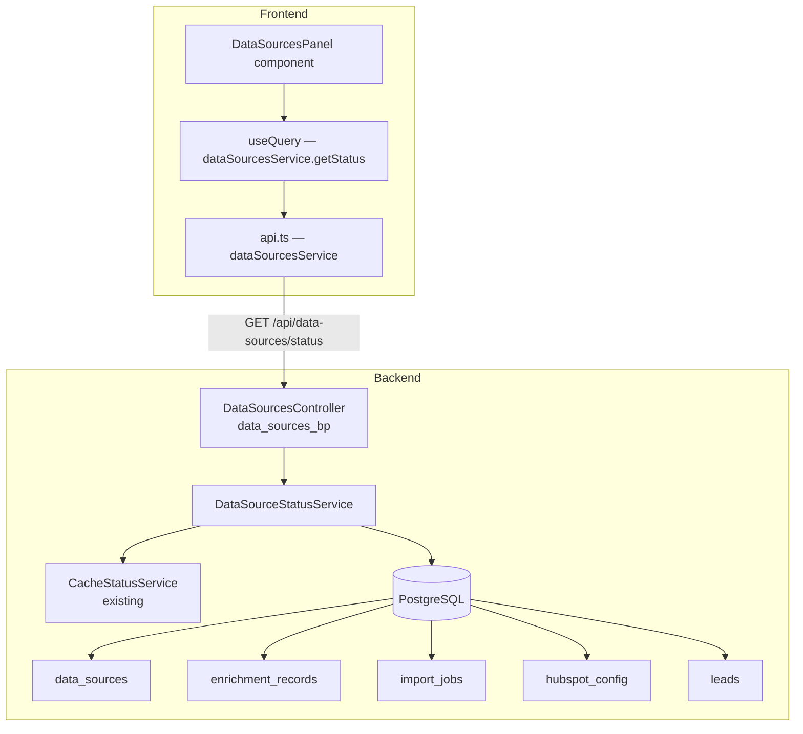
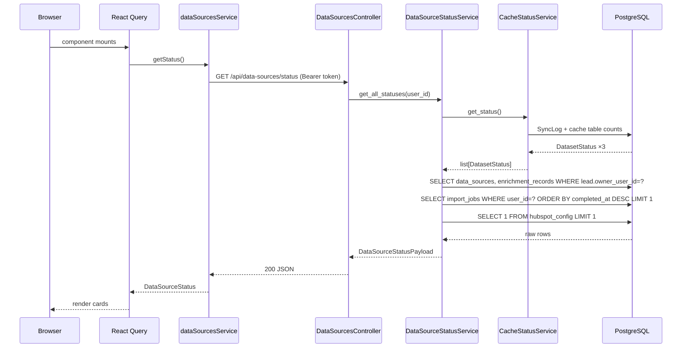

# Design Document: Data Sources Panel

## Overview

The Data Sources Panel is a read-only diagnostic UI panel in the Lead Management section that aggregates the health and coverage status of every data source feeding lead ingestion, enrichment, and scoring into a single API response and a single React component. Users can see at a glance whether their Socrata cache is fresh, how many leads have been enriched by each external plugin, when their last Google Sheets import ran, and whether HubSpot is connected — without navigating to four separate pages.

The backend exposes one new endpoint (`GET /api/data-sources/status`) backed by a new `DataSourceStatusService`. The frontend renders the response with React Query (60-second stale time), a loading skeleton, per-source status chips, enrichment coverage bars, and stale-data warning icons. All data is scoped to the authenticated user via `g.user_id`.

---

## Architecture



---

## Components and Interfaces

### Backend

#### `DataSourceStatusService` (`backend/app/services/data_source_status_service.py`)

Single-purpose service that queries all four source categories and assembles the unified response. It never writes to the database.

**Responsibilities**:
- Delegate Socrata status to the existing `CacheStatusService.get_status()`
- Query `DataSource` for all registered enrichment plugins, then for each source count `EnrichmentRecord` rows with `status IN ('success', 'failed', 'pending')` scoped to leads owned by the requesting user
- Query `ImportJob` for the single most-recent completed job owned by the requesting user
- Check `HubSpotConfig` for a non-null row (presence = connected)
- Return a structured dataclass `DataSourceStatusPayload`

**Does not raise** on empty results — it returns zeroed counts. Propagates `SQLAlchemyError` so the controller can return HTTP 503.

---

#### `DataSourcesController` (`backend/app/controllers/data_sources_controller.py`)

Blueprint `data_sources_bp`, registered at `/api/data-sources`.

**Route**: `GET /api/data-sources/status`

Uses `@require_auth` to enforce authentication (returns 401 for anonymous requests). Calls `DataSourceStatusService`, serializes with a Marshmallow schema, and returns 200. Returns 503 on `SQLAlchemyError`. Uses the same `@handle_errors` pattern as every other controller.

---

#### Blueprint Registration (`backend/app/__init__.py`)

```python
from app.controllers.data_sources_controller import data_sources_bp
app.register_blueprint(data_sources_bp, url_prefix='/api/data-sources')
```

---

### Frontend

#### `DataSourcesPanel` (`frontend/src/components/DataSourcesPanel.tsx`)

Top-level panel component. Owns the React Query call and orchestrates all sub-components.

**Sub-components (all within the same file or co-located)**:

| Sub-component | Purpose |
|---|---|
| `DataSourcesSkeleton` | Loading skeleton — one `Skeleton` row per expected source type |
| `DataSourcesError` | Error state with message + Retry button |
| `StatusSummaryBanner` | Green / amber / red banner summarising overall health |
| `SocrataSourceCard` | Card for one Socrata dataset; shows staleness chip + days-since label |
| `EnrichmentSourceCard` | Card for one enrichment plugin; shows coverage bar + failure warning |
| `ImportSourceCard` | Card for the Google Sheets source; shows last run timestamp + row count |
| `HubSpotSourceCard` | Card for the HubSpot integration; shows connected / not-configured state |
| `CoverageBar` | Horizontal MUI `LinearProgress` with enriched/failed/not-run legend |
| `StatusChip` | Small MUI `Chip` mapping a status string to color + icon |

---

## Data Flow



On error the controller returns a structured JSON error; React Query marks the query as errored, and `DataSourcesPanel` renders the `DataSourcesError` state with a Retry button that calls `refetch()` with `{ cancelRefetch: true }` to bypass the 60-second stale cache.

---

## API Contract

### `GET /api/data-sources/status`

**Authentication**: Bearer JWT required. Returns `401` if missing or invalid.

**Response — 200 OK**

```json
{
  "socrata_datasets": [
    {
      "name": "parcel_universe",
      "source_type": "socrata",
      "refresh_type": "periodic",
      "is_active": true,
      "status": "fresh",
      "last_refreshed_at": "2025-01-15T14:32:00Z",
      "row_count": 847213,
      "days_since_sync": 3,
      "last_error": null
    }
  ],
  "enrichment_sources": [
    {
      "name": "skip_trace_provider",
      "source_type": "enrichment",
      "refresh_type": "on_demand",
      "is_active": true,
      "last_refreshed_at": "2025-01-14T09:10:00Z",
      "success_count": 34,
      "failed_count": 2,
      "pending_count": 1,
      "not_run_count": 13,
      "total_leads_count": 50
    }
  ],
  "import_source": {
    "name": "Google Sheets",
    "source_type": "import",
    "refresh_type": "static",
    "is_active": true,
    "last_refreshed_at": "2025-01-10T08:00:00Z",
    "rows_imported": 120,
    "import_status": "completed"
  },
  "hubspot_source": {
    "name": "HubSpot",
    "source_type": "hubspot",
    "refresh_type": "on_demand",
    "is_active": true,
    "connected": true
  }
}
```

Notes:
- `import_source.last_refreshed_at`, `import_source.rows_imported`, and `import_source.import_status` are `null` when no completed `ImportJob` exists for the user.
- `hubspot_source` is always present in the response. `connected: false` when no `HubSpotConfig` row exists.
- `days_since_sync` is `null` when `last_refreshed_at` is `null`; otherwise it is `floor((now - last_refreshed_at).days)` and is always `≥ 0`.
- All four top-level keys are always present even when empty (e.g. no enrichment sources → `"enrichment_sources": []`).

**Error responses**:

| Status | Condition |
|--------|-----------|
| 401 | Missing or invalid Bearer token |
| 503 | Database unavailable (`SQLAlchemyError`) |

---

## Data Models

New types added to `frontend/src/types/index.ts`:

```typescript
// -----------------------------------------------------------------------
// Data Sources Panel Types
// -----------------------------------------------------------------------

export type SocrataDatasetStatusValue = 'fresh' | 'stale' | 'empty' | 'never_synced'
export type RefreshType = 'periodic' | 'on_demand' | 'static'

export interface SocrataDatasetStatus {
  name: string
  source_type: 'socrata'
  refresh_type: 'periodic'
  is_active: boolean
  status: SocrataDatasetStatusValue
  last_refreshed_at: string | null   // ISO-8601 UTC
  row_count: number
  days_since_sync: number | null     // always >= 0 when non-null
  last_error: string | null
}

export interface EnrichmentSourceStatus {
  name: string
  source_type: 'enrichment'
  refresh_type: 'on_demand'
  is_active: boolean
  last_refreshed_at: string | null
  success_count: number
  failed_count: number
  pending_count: number
  not_run_count: number
  total_leads_count: number
}

export interface ImportSourceStatus {
  name: string
  source_type: 'import'
  refresh_type: 'static'
  is_active: boolean
  last_refreshed_at: string | null
  rows_imported: number | null
  import_status: string | null
}

export interface HubSpotSourceStatus {
  name: string
  source_type: 'hubspot'
  refresh_type: 'on_demand'
  is_active: boolean
  connected: boolean
}

export interface DataSourceStatus {
  socrata_datasets: SocrataDatasetStatus[]
  enrichment_sources: EnrichmentSourceStatus[]
  import_source: ImportSourceStatus
  hubspot_source: HubSpotSourceStatus
}
```

---

## Component Hierarchy

```
DataSourcesPanel
├── [loading]  DataSourcesSkeleton
│   └── Skeleton × (3 + N + 1 + 1) rows
├── [error]    DataSourcesError
│   ├── Alert (MUI) — error message
│   └── Button — "Retry"
└── [loaded]
    ├── StatusSummaryBanner
    │   └── CheckCircleIcon (green) | WarningIcon (amber) | ErrorIcon (red)
    ├── Typography — "Socrata Datasets"
    ├── SocrataSourceCard × 3
    │   ├── StatusChip (fresh | stale | empty | never_synced)
    │   ├── Typography — last refreshed timestamp (local timezone)
    │   ├── [stale]       WarningAmberIcon  aria-label="{name}: stale"
    │   ├── [never/empty] ErrorIcon         aria-label="{name}: {status}"
    │   └── Typography — "N days since last sync" (stale only)
    ├── Typography — "Enrichment Sources"
    ├── EnrichmentSourceCard × N
    │   ├── StatusChip (active | inactive)
    │   ├── CoverageBar
    │   │   ├── LinearProgress (enriched green segment)
    │   │   └── Legend: "Enriched X | Failed Y | Not Run Z"
    │   └── [failures in 30d] WarningIcon — "N failures in last 30 days"
    ├── Typography — "Import Source"
    ├── ImportSourceCard
    │   ├── Typography — "Last import: YYYY-MM-DD HH:MM" or "No imports yet"
    │   └── Typography — "N rows imported"
    └── HubSpotSourceCard
        └── Chip — "Connected" (green) | "Not configured" (grey)
```

---

## State Management

The panel uses a single React Query query with no local mutation state.

```typescript
// In DataSourcesPanel.tsx
const {
  data,
  isLoading,
  isError,
  error,
  refetch,
} = useQuery<DataSourceStatus, Error>({
  queryKey: ['dataSourceStatus'],
  queryFn: dataSourcesService.getStatus,
  staleTime: 60_000,   // Req 7.5 — do not re-fetch more than once per 60s
})
```

**Retry button** calls `refetch()` with `{ cancelRefetch: true }` to bypass the stale cache and force a fresh fetch regardless of stale time.

**"Last updated" staleness indicator**: The panel tracks the React Query `dataUpdatedAt` timestamp. If `Date.now() - dataUpdatedAt > 60_000`, a "Data may be stale — " note is shown next to each coverage count (Req 4.5).

---

## Frontend Service

Added to `frontend/src/services/api.ts`:

```typescript
export const dataSourcesService = {
  getStatus: async (): Promise<DataSourceStatus> => {
    const response = await api.get<DataSourceStatus>('/data-sources/status')
    return response.data
  },
}
```

---

## Error Handling

### Backend

| Scenario | Handling |
|---|---|
| Unauthenticated request | `@require_auth` returns 401 before the service is called |
| `SQLAlchemyError` from any query | Propagated through `DataSourceStatusService`; `@handle_errors` returns 503 |
| `CacheStatusService` raises `SQLAlchemyError` | Same — propagated and caught by `@handle_errors` |
| No leads for user | `total_leads_count: 0`, all counts `0`; not an error |
| No completed `ImportJob` for user | `import_source.last_refreshed_at: null` etc.; not an error |
| `HubSpotConfig` table absent or empty | `connected: false`; not an error |

### Frontend

| Scenario | Handling |
|---|---|
| Network error / non-2xx response | `isError = true`; `DataSourcesError` shown with Retry |
| 401 from API | Axios interceptor redirects to `/login` before React Query sees the error |
| 503 from API | `DataSourcesError` shown; Retry available |
| Empty `enrichment_sources` array | `EnrichmentSourceCard` section renders with "No enrichment sources configured" |
| `total_leads_count === 0` | Coverage shown as "0 / 0 (N/A)"; percentage calculation skipped |
| `days_since_sync` is `null` | "No successful sync has occurred" shown instead of days label |

---

## Correctness Properties

The following invariants must hold for any valid response from `DataSourceStatusService` and any valid render by `DataSourcesPanel`.

### Property 1: Coverage percentages bounded [0, 100]

**Validates: Requirements 4.1**

For any `EnrichmentSourceStatus` with `total_leads_count > 0`:
- `(success_count / total_leads_count) * 100` ∈ [0.0, 100.0]

### Property 2: Partition invariant — counts sum to total

**Validates: Requirements 4.4, 5.7**

For every enrichment source:
- `success_count + failed_count + pending_count + not_run_count == total_leads_count`

### Property 3: Status summary banner is green iff ALL sources healthy

**Validates: Requirements 6.5**

The banner is green **if and only if**:
- All Socrata datasets have `status == 'fresh'`
- All enrichment sources have `is_active == true`
- No enrichment source has recent failures in the last 30 days

In all other cases the banner is amber or red.

### Property 4: Staleness day count always >= 0

**Validates: Requirements 6.1**

For any `last_refreshed_at` timestamp that is non-null:
- `days_since_sync = floor((utcnow - last_refreshed_at).days) >= 0`

### Property 5: API always returns all four source categories

**Validates: Requirements 5.1, 1.1, 1.2, 1.3, 1.4**

Every successful response from `GET /api/data-sources/status` must include:
- `socrata_datasets` (list, may be empty)
- `enrichment_sources` (list, may be empty)
- `import_source` (object, never null — uses null fields internally)
- `hubspot_source` (object, never null — uses `connected: false`)

---

## Testing Strategy

### Unit Tests (pytest / Vitest)

**Backend** (`backend/tests/test_data_source_status_service.py`):
- Service returns zeroed counts when user has no leads
- Service returns `null` import fields when no completed `ImportJob` exists
- Service returns `connected: false` when no `HubSpotConfig` row exists
- Controller returns 401 when no Bearer token is provided
- Controller returns 503 when `DataSourceStatusService` raises `SQLAlchemyError`
- Coverage counts are correctly scoped to the requesting user (not other users' leads)

**Frontend** (`frontend/src/components/DataSourcesPanel.test.tsx`):
- Renders loading skeleton while query is loading
- Renders error state + Retry button when query fails
- Retry button calls `refetch()` bypassing stale cache
- Stale Socrata dataset shows amber `WarningAmberIcon` with correct `aria-label`
- Never-synced/empty Socrata dataset shows red `ErrorIcon` with correct `aria-label`
- `total_leads_count === 0` renders "0 / 0 (N/A)" without a percentage
- Green banner shown when all sources are healthy
- Inactive enrichment source renders with reduced opacity and "Inactive" label

### Property-Based Tests

**Backend** (Hypothesis):
- `test_coverage_percentage_bounded` — arbitrary lead count splits stay in [0, 100]
- `test_enrichment_counts_sum_to_total` — partition invariant holds for any `total_leads`
- `test_days_since_sync_non_negative` — `compute_days_since` returns ≥ 0 for any past datetime
- `test_response_always_has_four_categories` — arbitrary DB state always yields all four keys

**Frontend** (fast-check via Vitest):
- Coverage bar `LinearProgress` value stays in [0, 100] for arbitrary `(enriched, failed, notRun)` triples
- Banner color logic satisfies Property 3 for arbitrary generated `DataSourceStatus` payloads

### Integration Tests

- End-to-end: seed DB with known `EnrichmentRecord` counts, call `GET /api/data-sources/status`, assert counts match seed data
- Socrata delegation: mock `CacheStatusService.get_status()` and verify the controller passes through the returned statuses unchanged

---

## Performance Considerations

- The `GET /api/data-sources/status` query is **read-only** and runs at most once per 60 seconds per browser tab (enforced by React Query `staleTime`).
- The `EnrichmentRecord` coverage counts use a single `GROUP BY data_source_id, status` query over the user's leads rather than N individual queries per source.
- The `ImportJob` lookup uses `ORDER BY completed_at DESC LIMIT 1` — fully indexed on `user_id`.
- No Celery tasks or external HTTP calls are made; the endpoint completes within a single DB round-trip batch.
- Response payload is small (< 5 KB for typical installations) — no pagination required.

---

## Security Considerations

- `@require_auth` ensures only authenticated users can call the endpoint — anonymous requests get 401 before any DB query runs.
- User-scoped queries (`owner_user_id = g.user_id` for leads, `user_id = g.user_id` for import jobs) prevent cross-user data leakage.
- `HubSpotConfig` presence check returns only a boolean `connected` flag — no token, portal ID, or credential material is included in the response.
- The panel is purely read-only; no mutations are exposed through this feature.

---

## Dependencies

### New backend files
- `backend/app/services/data_source_status_service.py` — new service
- `backend/app/controllers/data_sources_controller.py` — new Blueprint

### Modified backend files
- `backend/app/__init__.py` — register `data_sources_bp`
- `backend/app/services/__init__.py` — re-export `DataSourceStatusService`
- `backend/app/schemas.py` — add `DataSourceStatusSchema` (Marshmallow)

### New frontend files
- `frontend/src/components/DataSourcesPanel.tsx` — panel + all sub-components
- `frontend/src/components/DataSourcesPanel.test.tsx` — unit + PBT tests

### Modified frontend files
- `frontend/src/types/index.ts` — add five new interfaces / types
- `frontend/src/services/api.ts` — add `dataSourcesService`
- `frontend/src/App.tsx` — add route / sidebar entry for the panel

### No new migrations required
The feature only reads from existing tables (`data_sources`, `enrichment_records`, `import_jobs`, `hubspot_config`, `leads`). No schema changes are needed.
