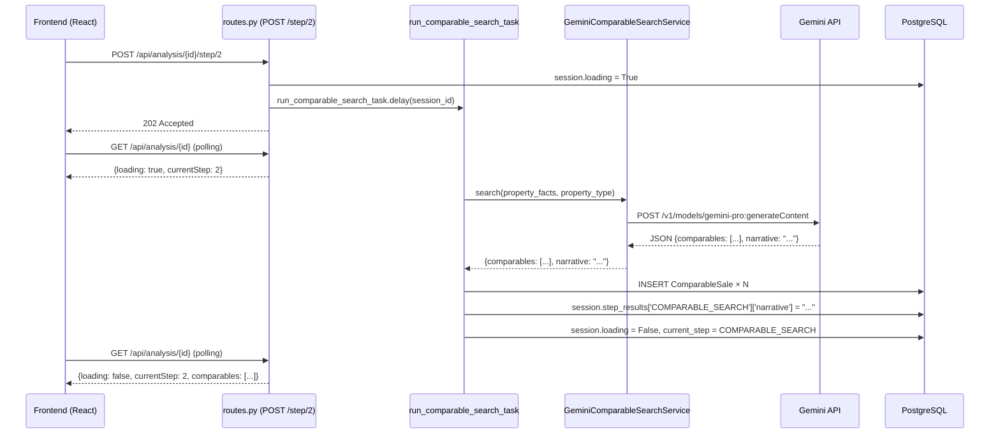

# Design Document: Gemini Comparable Search

## Overview

This feature replaces the Cook County Socrata API-based comparable sales search (Step 2 of the 6-step analysis workflow) with a Gemini AI-powered search. A new `GeminiComparableSearchService` sends confirmed property facts to the Gemini API and receives a structured JSON response containing both a list of comparable sales and a full narrative analysis. The comparable sales are stored as `ComparableSale` database records using the existing schema. The narrative is stored in `session.step_results['COMPARABLE_SEARCH']['narrative']` and displayed in a new `GeminiNarrativePanel` React component below the comparable review table.

The existing Celery task infrastructure, workflow step ordering, and Cook County Socrata cache tables are all preserved intact.

### Key Design Decisions

**Why a dedicated service class?** The `GeminiComparableSearchService` follows the existing one-service-per-file convention in `backend/app/services/`. Encapsulating the Gemini API call, prompt selection, JSON parsing, and error handling in one class makes it independently testable and keeps `celery_worker.py` focused on orchestration.

**Why keep the same `ComparableSale` schema?** All downstream steps (weighted scoring, valuation, report generation) consume `ComparableSale` records. Preserving the schema means zero changes to Steps 3–6 and their tests.

**Why store the narrative in `step_results`?** The `step_results` JSON column is already the canonical store for per-step metadata. Adding `narrative` as a key inside `step_results['COMPARABLE_SEARCH']` requires no schema migration and is immediately available to the frontend via the existing `GET /api/analysis/{session_id}` endpoint.

---

## Architecture



### Component Relationships

```
celery_worker.py
  └── run_comparable_search_task()
        ├── GeminiComparableSearchService.search()   [NEW]
        │     ├── _build_prompt(property_facts, property_type)
        │     ├── _call_gemini_api(prompt)
        │     └── _parse_response(raw_json)
        └── _map_comparable_to_model(comp_dict)      [NEW helper]
              └── ComparableSale(...)
```

---

## Components and Interfaces

### Backend: `GeminiComparableSearchService`

**File:** `backend/app/services/gemini_comparable_search_service.py`

```python
class GeminiComparableSearchService:
    """
    Calls the Gemini API with confirmed property facts and returns
    a structured dict with comparable sales and a narrative analysis.

    Raises GeminiConfigurationError at instantiation if GOOGLE_AI_API_KEY
    is not set or is empty.
    """

    def __init__(self) -> None:
        """Read API key from environment; raise if missing."""

    def search(
        self,
        property_facts: dict,
        property_type: PropertyType,
    ) -> dict:
        """
        Call Gemini and return:
            {
                "comparables": [
                    {
                        "address": str,
                        "sale_date": str,          # "YYYY-MM-DD"
                        "sale_price": float,
                        "property_type": str,      # enum value string
                        "units": int,
                        "bedrooms": int,
                        "bathrooms": float,
                        "square_footage": int,
                        "lot_size": int,
                        "year_built": int,
                        "construction_type": str,  # enum value string
                        "interior_condition": str, # enum value string
                        "distance_miles": float,
                        "latitude": float,
                        "longitude": float,
                        "similarity_notes": str,
                    },
                    ...
                ],
                "narrative": str,
            }

        Raises:
            GeminiConfigurationError: if API key is missing (at __init__)
            GeminiParseError: if response is not valid JSON
            GeminiResponseError: if required keys are missing from response
            GeminiAPIError: if the HTTP call to Gemini fails
        """

    def _build_prompt(
        self,
        property_facts: dict,
        property_type: PropertyType,
    ) -> str:
        """Select and render the correct prompt template."""

    def _call_gemini_api(self, prompt: str) -> str:
        """POST to Gemini API; return raw response text."""

    def _parse_response(self, raw: str) -> dict:
        """Parse JSON, validate required keys, return dict."""
```

**Custom exceptions** (added to `backend/app/exceptions.py`):

| Exception | When raised |
|---|---|
| `GeminiConfigurationError` | `GOOGLE_AI_API_KEY` not set or empty at `__init__` |
| `GeminiAPIError` | HTTP error from Gemini API |
| `GeminiParseError` | Response body is not valid JSON |
| `GeminiResponseError` | JSON is valid but missing `"comparables"` or `"narrative"` |

All four extend `RealEstateAnalysisException` (the existing base class in `exceptions.py`).

### Prompt Templates

Two prompt templates are defined as module-level constants in `gemini_comparable_search_service.py`:

**`RESIDENTIAL_PROMPT_TEMPLATE`** — used when `property_type` is `SINGLE_FAMILY` or `MULTI_FAMILY`. Instructs Gemini to find residential comparable sales and produce a narrative with sections A–F (location, physical characteristics, market conditions, adjustments, value indicators, summary).

**`COMMERCIAL_PROMPT_TEMPLATE`** — used when `property_type` is `COMMERCIAL`. Instructs Gemini to find commercial comparable sales and produce a full commercial analysis narrative.

Both templates include:
- A system instruction requiring the response to be a single JSON object with exactly two top-level keys: `"comparables"` and `"narrative"`.
- A `{property_facts_json}` placeholder that is filled with `json.dumps(property_facts, indent=2)`.
- Explicit field names and types for each comparable object.

The `_build_prompt` method selects the template based on `property_type` and renders it with `str.format(property_facts_json=...)`.

### Backend: `celery_worker.py` — Updated `run_comparable_search_task`

The task is updated to replace the `WorkflowController._execute_comparable_search` call with direct use of `GeminiComparableSearchService`. The session state update logic (setting `current_step`, `completed_steps`, `updated_at`, `loading`) is preserved unchanged.

```python
@celery.task(name='workflow.run_comparable_search')
def run_comparable_search_task(session_id: str) -> dict:
    # ... (app context setup unchanged) ...
    try:
        service = GeminiComparableSearchService()
        result = service.search(
            property_facts=_serialize_property_facts(session.subject_property),
            property_type=session.subject_property.property_type,
        )

        # Persist comparables
        for comp_dict in result['comparables']:
            comparable = _map_comparable_to_model(comp_dict, session.id)
            db.session.add(comparable)

        # Store narrative in step_results
        step_results = dict(session.step_results or {})
        step_results['COMPARABLE_SEARCH'] = {
            'comparable_count': len(result['comparables']),
            'narrative': result['narrative'],
            'status': 'complete',
        }

        # Preserve existing session state update logic
        completed_steps = list(session.completed_steps or [])
        if WorkflowStep.PROPERTY_FACTS.name not in completed_steps:
            completed_steps.append(WorkflowStep.PROPERTY_FACTS.name)
        session.completed_steps = completed_steps
        session.step_results = step_results
        session.current_step = WorkflowStep.COMPARABLE_SEARCH
        session.loading = False
        session.updated_at = datetime.utcnow()
        db.session.commit()
        return step_results['COMPARABLE_SEARCH']

    except Exception as exc:
        session.loading = False
        session.step_results = {
            **(session.step_results or {}),
            'COMPARABLE_SEARCH_ERROR': str(exc),
        }
        db.session.commit()
        return {'error': str(exc)}
```

The `_serialize_property_facts` helper converts the `PropertyFacts` ORM object to a plain dict (reusing the existing serialization logic from `WorkflowController._serialize_property_facts`).

### Backend: `WorkflowController` — Decoupling

`WorkflowController.__init__` removes the `self.comparable_finder = ComparableSalesFinder()` line. The `_execute_comparable_search` method is either removed or left as a no-op stub (since the Celery task now calls `GeminiComparableSearchService` directly). All other workflow steps are unchanged.

### Frontend: `ComparableSale` TypeScript Type

`similarity_notes` is added as an optional field to the existing `ComparableSale` interface in `frontend/src/types/index.ts`:

```typescript
export interface ComparableSale {
  id: string
  address: string
  saleDate: string
  salePrice: number
  propertyType: PropertyType
  units: number
  bedrooms: number
  bathrooms: number
  squareFootage: number
  lotSize: number
  yearBuilt: number
  constructionType: ConstructionType
  interiorCondition: InteriorCondition
  distanceMiles: number
  coordinates: { lat: number; lng: number }
  similarityNotes?: string | null   // NEW
}
```

Making it optional (`?`) ensures backward compatibility with manually-added comparables (which have no `similarityNotes`) and with any existing serialized session data.

### Frontend: `ComparableReviewTable` — Similarity Notes Column

A "Similarity Notes" column is added as the last data column before "Actions". The column renders a `SimilarityNotesCell` sub-component that handles truncation:

- If `similarityNotes` is null, undefined, or empty: renders an empty `<TableCell />`.
- If `similarityNotes.length <= 100`: renders the full text.
- If `similarityNotes.length > 100`: renders the first 100 characters, then a `<Button size="small">…more</Button>` that toggles a local `expanded` state to show the full text.

The `onComparablesChange` callback signature is unchanged — it still receives `ComparableSale[]`.

### Frontend: `GeminiNarrativePanel` Component

**File:** `frontend/src/components/GeminiNarrativePanel.tsx`

```typescript
interface GeminiNarrativePanelProps {
  narrative: string | null | undefined
}

export const GeminiNarrativePanel: React.FC<GeminiNarrativePanelProps>
```

Behavior:
- Returns `null` when `narrative` is null, undefined, or an empty string.
- Renders an MUI `Accordion` with `defaultExpanded={true}` so it is always expanded on initial render.
- The `AccordionSummary` label is "AI Analysis".
- The `AccordionDetails` contains a `Box` with `sx={{ maxHeight: 400, overflowY: 'auto', whiteSpace: 'pre-wrap' }}` to preserve whitespace and line breaks and enable scrolling.

The component is rendered in `App.tsx` (or the Step 3 view) immediately below `<ComparableReviewTable />`, reading the narrative from `session.step_results?.COMPARABLE_SEARCH?.narrative`.

### Frontend: Step 2 Loading Message

In `App.tsx`, the existing loading message for `currentStep === WorkflowStep.COMPARABLE_SEARCH` is updated from:

```
"Searching for comparable sales… This may take up to 2 minutes."
```

to:

```
"Searching for comparable sales with AI… This may take up to 2 minutes."
```

---

## Data Models

### `ComparableSale` (unchanged schema)

No database migration is required. The `similarity_notes` column (`db.Column(db.Text, nullable=True)`) already exists in the model. The Gemini service populates it with per-comparable narrative text from the `"similarity_notes"` field in the Gemini JSON response.

### `AnalysisSession.step_results` — Updated Shape

After a successful Gemini search, `step_results['COMPARABLE_SEARCH']` has this shape:

```json
{
  "COMPARABLE_SEARCH": {
    "comparable_count": 12,
    "narrative": "## Section A: Location Analysis\n\nThe subject property...",
    "status": "complete"
  }
}
```

The `narrative` key is new. The `comparable_count` and `status` keys are preserved from the existing implementation.

### Field Mapping: Gemini JSON → `ComparableSale`

| Gemini JSON field | `ComparableSale` column | Type | Default on failure |
|---|---|---|---|
| `address` | `address` | `str` | `"Unknown"` |
| `sale_date` | `sale_date` | `date` (parsed from `"YYYY-MM-DD"`) | `date.today()` |
| `sale_price` | `sale_price` | `float` | `0.0` |
| `property_type` | `property_type` | `PropertyType` enum | `PropertyType.SINGLE_FAMILY` |
| `units` | `units` | `int` | `1` |
| `bedrooms` | `bedrooms` | `int` | `0` |
| `bathrooms` | `bathrooms` | `float` | `0.0` |
| `square_footage` | `square_footage` | `int` | `0` |
| `lot_size` | `lot_size` | `int` | `0` |
| `year_built` | `year_built` | `int` | `0` |
| `construction_type` | `construction_type` | `ConstructionType` enum | `ConstructionType.FRAME` |
| `interior_condition` | `interior_condition` | `InteriorCondition` enum | `InteriorCondition.AVERAGE` |
| `distance_miles` | `distance_miles` | `float` | `0.0` |
| `latitude` | `latitude` | `float` (nullable) | `None` |
| `longitude` | `longitude` | `float` (nullable) | `None` |
| `similarity_notes` | `similarity_notes` | `str` (nullable) | `None` |

**Enum resolution order** (same pattern as the existing `_execute_comparable_search`):
1. Try `EnumClass(value)` — matches by value string (e.g. `"single_family"`).
2. Try `EnumClass[value.upper()]` — matches by name (e.g. `"SINGLE_FAMILY"`).
3. Fall back to the default listed above.

---

## Correctness Properties

*A property is a characteristic or behavior that should hold true across all valid executions of a system — essentially, a formal statement about what the system should do. Properties serve as the bridge between human-readable specifications and machine-verifiable correctness guarantees.*

### Property 1: Search result always has required keys

*For any* valid `property_facts` dict and any `PropertyType` value, calling `GeminiComparableSearchService.search()` with a mocked Gemini API that returns a well-formed response SHALL always return a dict containing exactly the keys `"comparables"` (a list) and `"narrative"` (a string).

**Validates: Requirements 1.1, 1.4**

---

### Property 2: Prompt template selection is correct for all property types

*For any* `PropertyType` value, the prompt passed to the Gemini API SHALL contain residential-prompt markers if and only if the property type is `SINGLE_FAMILY` or `MULTI_FAMILY`, and commercial-prompt markers if and only if the property type is `COMMERCIAL`.

**Validates: Requirements 1.2, 1.3**

---

### Property 3: Invalid JSON always raises a parse error

*For any* string that is not valid JSON, calling `GeminiComparableSearchService._parse_response()` SHALL raise a `GeminiParseError` with a descriptive message.

**Validates: Requirements 1.5**

---

### Property 4: Missing required keys always raise a response error

*For any* valid JSON object that is missing the `"comparables"` key, the `"narrative"` key, or both, calling `GeminiComparableSearchService._parse_response()` SHALL raise a `GeminiResponseError` identifying the missing field(s).

**Validates: Requirements 1.6**

---

### Property 5: Comparable count matches Gemini response list length

*For any* list of N comparable dicts returned by a mocked Gemini API, after `run_comparable_search_task` completes successfully, exactly N `ComparableSale` records SHALL exist in the database for that session.

**Validates: Requirements 2.2**

---

### Property 6: Narrative round-trip preservation

*For any* narrative string returned by a mocked Gemini API, after `run_comparable_search_task` completes successfully, `session.step_results['COMPARABLE_SEARCH']['narrative']` SHALL equal that exact string.

**Validates: Requirements 2.3**

---

### Property 7: Field mapping preserves all valid comparable fields

*For any* comparable dict containing valid values for all 16 required fields, the `_map_comparable_to_model` helper SHALL produce a `ComparableSale` instance where every field matches the corresponding input value (after type coercion).

**Validates: Requirements 3.1**

---

### Property 8: Enum defaults are applied for all unrecognized values

*For any* string that does not match a known `PropertyType`, `ConstructionType`, or `InteriorCondition` enum value, the field mapping logic SHALL default to `PropertyType.SINGLE_FAMILY`, `ConstructionType.FRAME`, and `InteriorCondition.AVERAGE` respectively.

**Validates: Requirements 3.2, 3.3, 3.4**

---

### Property 9: Unparseable sale dates default to today

*For any* string that cannot be parsed as a valid ISO date (including empty strings, arbitrary text, and malformed date strings), the field mapping logic SHALL use `date.today()` as the `sale_date`.

**Validates: Requirements 3.5**

---

### Property 10: Similarity notes truncation threshold

*For any* `similarityNotes` string with length greater than 100 characters, the `SimilarityNotesCell` component SHALL display exactly the first 100 characters followed by a "…more" affordance, and SHALL NOT display any characters beyond position 100 until the affordance is activated.

**Validates: Requirements 5.2**

---

### Property 11: Narrative whitespace preservation

*For any* narrative string containing whitespace characters (spaces, tabs, newlines, carriage returns), the `GeminiNarrativePanel` SHALL render the text in a container with `white-space: pre-wrap` (or equivalent) so that all whitespace and line breaks are preserved in the rendered output.

**Validates: Requirements 6.7**

---

## Error Handling

### Service Layer

| Scenario | Behavior |
|---|---|
| `GOOGLE_AI_API_KEY` not set | `GeminiConfigurationError` raised at `__init__` — task never starts |
| Gemini HTTP 4xx/5xx | `GeminiAPIError` raised; task catches it, sets `loading=False`, stores error in `step_results['COMPARABLE_SEARCH_ERROR']` |
| Response not valid JSON | `GeminiParseError` raised; same task-level handling |
| Response missing required keys | `GeminiResponseError` raised; same task-level handling |
| Individual field parse failure (date, enum, numeric) | Silent default applied per the field mapping table; no exception raised |
| Session not found in task | Task returns `{'error': 'session not found'}` immediately |

### Frontend

| Scenario | Behavior |
|---|---|
| `session.step_results.COMPARABLE_SEARCH_ERROR` is set | Existing error display logic in `App.tsx` surfaces the error message |
| `narrative` is null/undefined/empty | `GeminiNarrativePanel` returns `null` — no panel rendered |
| `similarityNotes` is null/undefined/empty | `SimilarityNotesCell` renders an empty `<TableCell />` |

### Startup Validation

The Celery worker startup block in `celery_worker.py` is extended to include `GOOGLE_AI_API_KEY` in `_required_env_vars`:

```python
_required_env_vars = ['DATABASE_URL', 'REDIS_URL', 'GOOGLE_AI_API_KEY']
```

This causes the worker to exit immediately with a descriptive error if the key is missing, consistent with the existing pattern for `DATABASE_URL` and `REDIS_URL`.

The Flask `create_app` factory logs a `WARNING`-level message if `GOOGLE_AI_API_KEY` is not set, but does not raise — the app can still start and serve non-analysis routes.

---

## Testing Strategy

### Unit Tests (pytest + Hypothesis)

**`tests/test_gemini_comparable_search_service.py`**

- Example tests:
  - `GeminiComparableSearchService()` raises `GeminiConfigurationError` when `GOOGLE_AI_API_KEY` is unset or empty.
  - `search()` calls the Gemini API with the correct prompt for each `PropertyType`.
  - `search()` returns a dict with `"comparables"` and `"narrative"` keys on a valid mocked response.

- Property tests (Hypothesis):
  - **Property 1**: `@given(property_facts=st.dictionaries(...), property_type=st.sampled_from(PropertyType))` — assert result always has required keys.
  - **Property 2**: `@given(property_type=st.sampled_from(PropertyType))` — assert correct prompt template is selected.
  - **Property 3**: `@given(raw=st.text().filter(lambda s: not is_valid_json(s)))` — assert `GeminiParseError` is raised.
  - **Property 4**: `@given(missing_key=st.sampled_from(['comparables', 'narrative', 'both']))` — assert `GeminiResponseError` is raised.

**`tests/test_comparable_field_mapping.py`**

- Property tests (Hypothesis):
  - **Property 7**: `@given(comp=st.fixed_dictionaries({...}))` with valid field values — assert all `ComparableSale` fields match.
  - **Property 8**: `@given(bad_value=st.text().filter(lambda s: s not in valid_enum_values))` — assert enum defaults are applied.
  - **Property 9**: `@given(bad_date=st.text().filter(lambda s: not is_iso_date(s)))` — assert `date.today()` is used.

**`tests/test_gemini_comparable_search_task.py`**

- Example tests:
  - Task creates exactly N `ComparableSale` records when Gemini returns N comparables.
  - Task stores narrative in `step_results['COMPARABLE_SEARCH']['narrative']`.
  - Task sets `session.loading = False` on success.
  - Task sets `session.loading = False` and stores error on `GeminiAPIError`.

- Property tests (Hypothesis):
  - **Property 5**: `@given(n=st.integers(min_value=0, max_value=20))` — assert exactly N records created.
  - **Property 6**: `@given(narrative=st.text())` — assert narrative is stored exactly.

### Frontend Tests (Vitest + React Testing Library)

**`ComparableReviewTable.test.tsx`** (extended)

- Example tests:
  - "Similarity Notes" column header is present before "Actions" column.
  - Clicking "…more" on a truncated cell shows the full text.
  - Null/empty `similarityNotes` renders an empty cell.

- Property tests:
  - **Property 10**: `fc.property(fc.string({ minLength: 101 }), ...)` — assert truncation at 100 chars with "…more".

**`GeminiNarrativePanel.test.tsx`** (new)

- Example tests:
  - Panel renders below `ComparableReviewTable` when narrative is present.
  - Panel does not render when narrative is null, undefined, or empty string.
  - Panel is expanded by default.
  - Clicking "AI Analysis" header collapses and re-expands the panel.
  - Container has `maxHeight: 400px` and `overflowY: auto`.

- Property tests:
  - **Property 11**: `fc.property(fc.string(), ...)` — assert `white-space: pre-wrap` is applied.

**Property test configuration:**
- Backend: Hypothesis with `@settings(max_examples=100)` on all property tests.
- Frontend: fast-check with `numRuns: 100` on all property tests.
- Each property test is tagged with a comment: `# Feature: gemini-comparable-search, Property N: <property_text>`.

### Integration Tests

- Extend `tests/test_comparable_search_fixes.py` to patch `GeminiComparableSearchService.search` instead of `ComparableSalesFinder.find_comparables` in the existing integration test suite.
- Verify `POST /api/cache/socrata/sync` still returns the expected response (Requirement 8.1 regression guard).

### Socrata Cache Preservation

No changes are made to:
- `parcel_universe_cache`, `parcel_sales_cache`, `improvement_characteristics_cache` tables.
- `socrata_cache_refresh_task` Celery task and beat schedule.
- `POST /api/cache/socrata/sync` endpoint.
- `CookCountySalesDataSource` and `ComparableSalesFinder` classes (they remain in the codebase for the multifamily underwriting proforma feature).

`WorkflowController` removes its `self.comparable_finder` attribute and the `ComparableSalesFinder` import, but the service file itself is not deleted.
