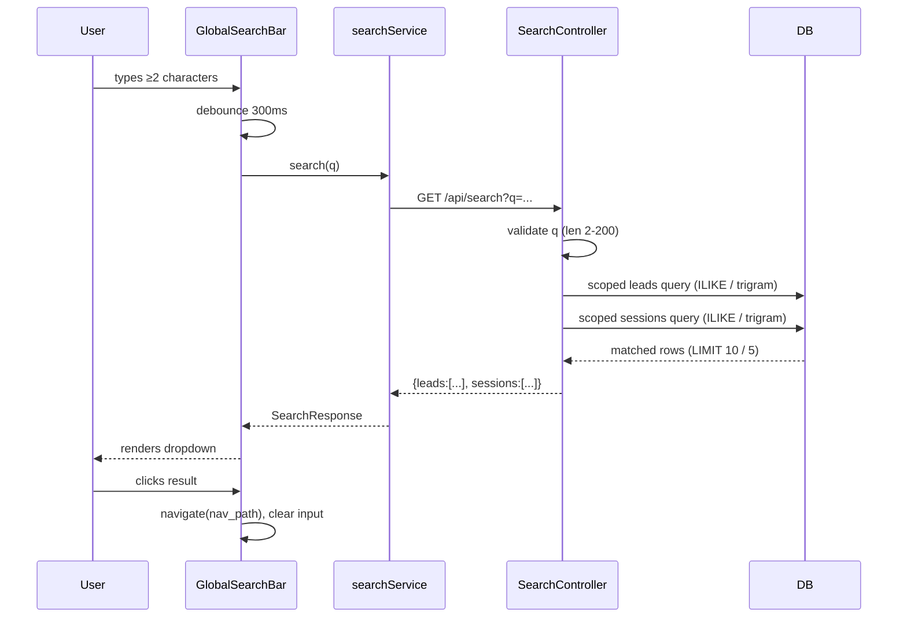

# Design Document: Global Search Bar

## Overview

The global search bar is a persistent UI control embedded in the application's MUI AppBar that lets authenticated users search across leads (by owner name or property address) and analysis sessions (by property address). Results appear in a popover dropdown below the input; clicking a result uses React Router's `useNavigate` to navigate directly to that record.

The feature has three layers:

1. **Frontend component** (`GlobalSearchBar.tsx`) — handles input, debouncing, dropdown rendering, keyboard navigation, and client-side routing.
2. **API service method** (`searchService.search` in `api.ts`) — thin Axios wrapper around `GET /api/search`.
3. **Backend endpoint** (`search_controller.py`, `GET /api/search`) — validates the query, executes ownership-scoped SQL, and returns ranked results.

A database migration enables `pg_trgm` and adds trigram indexes on the searched columns for production performance. In tests (SQLite), the service falls back gracefully to `ILIKE`.

---

## Architecture



### Key Design Decisions

**Debounce on the frontend, not the backend.** A 300 ms debounce avoids firing a request on every keystroke. The backend has no knowledge of typing cadence and simply handles each request independently.

**ILIKE with optional trigram acceleration.** The query logic uses `ILIKE '%q%'` by default (works on SQLite in tests). If `pg_trgm` is installed, trigram indexes on the searched columns make these queries sub-linear at scale. The controller tries to use trigram similarity via a feature-flag approach: it checks whether `pg_trgm` is available and adjusts the SQL accordingly, wrapped in a `try/except` that falls back to `ILIKE` on failure.

**Ownership scoping is server-authoritative.** The backend reads `g.user_id` and `g.is_admin` exclusively from the verified JWT. No client-supplied parameter can elevate search scope.

**`nav_path` is constructed on the backend.** The frontend trusts `nav_path` from the response and calls `useNavigate(nav_path)`. This keeps routing logic in one place (the controller) and means the frontend does not need to know how session IDs map to URLs.

**Separate blueprint, not appended to `routes.py`.** Following the project convention, the search endpoint lives in its own `search_controller.py` blueprint registered with `url_prefix='/api'`.

---

## Components and Interfaces

### Frontend

#### `GlobalSearchBar.tsx`

A new component in `frontend/src/components/`. Responsibilities:
- Renders either a full text input (desktop, `sm` breakpoint and above) or a collapsed icon button (mobile, below `sm`).
- Manages local state: `query`, `results`, `isLoading`, `isOpen`, `error`, `activeMobile`.
- Debounces the query with a 300 ms delay using `useRef`/`setTimeout`.
- Cancels in-flight requests (via `AbortController` or React Query `enabled` flag) when the query changes.
- Renders a results dropdown (`Paper` + `List`) grouped under "Leads" and "Analysis Sessions" section headers.
- Handles keyboard navigation: `ArrowDown`/`ArrowUp` moves `focusedIndex`; `Enter` navigates to the focused item; `Escape` clears and closes.
- Calls `useNavigate()` for client-side navigation on result selection.
- On navigation, clears query and closes dropdown.

**Props:** none (reads `useNavigate`, `useTheme`, `useMediaQuery` internally).

**State:**
```typescript
query: string
results: SearchResponse | null
isLoading: boolean
error: string | null
isOpen: boolean
focusedIndex: number   // -1 = none focused
mobileExpanded: boolean
```

**Placement in `App.tsx`:** Inserted in the Toolbar between the title `Typography` and the pipeline spinner. The title's `sx={{ flexGrow: 1 }}` is changed to a fixed width or removed so the search bar can occupy a defined portion of the bar:

```tsx
<Typography variant="h6" component="h1" noWrap sx={{ flexGrow: 0, mr: 2 }}>
  Real Estate Analysis Platform
</Typography>
<GlobalSearchBar />
{/* spacer */}
<Box sx={{ flexGrow: 1 }} />
{pipelineStatus?.pipeline_running && ( ... )}
<Avatar ... />
```

#### `searchService` (addition to `api.ts`)

```typescript
export const searchService = {
  search: async (q: string, signal?: AbortSignal): Promise<SearchResponse> => {
    const response = await api.get<SearchResponse>('/search', {
      params: { q },
      signal,
    })
    return response.data
  },
}
```

### Backend

#### `search_controller.py`

```
backend/app/controllers/search_controller.py
```

Blueprint: `search_bp = Blueprint('search', __name__)`  
Registered in `app/__init__.py` with `url_prefix='/api'`.

Single route: `GET /api/search`  
Decorators: `@handle_errors`, `@require_auth`

The route function:
1. Reads `q` from `request.args`, returns 400 if absent, too short (<2 after trim), or too long (>200).
2. Reads `g.user_id` and `g.is_admin` for ownership scoping.
3. Executes leads query (see Data Models section).
4. Executes sessions query.
5. Ranks and caps results.
6. Serializes and returns JSON.

#### Registration in `app/__init__.py`

```python
from app.controllers.search_controller import search_bp
app.register_blueprint(search_bp, url_prefix='/api')
```

---

## Data Models

### TypeScript (additions to `frontend/src/types/index.ts`)

```typescript
export interface SearchResultItem {
  id: number
  type: 'lead' | 'session'
  label: string
  nav_path: string
  lead_score?: number | null
  created_at?: string | null
  status?: string | null
}

export interface SearchResponse {
  leads: SearchResultItem[]
  sessions: SearchResultItem[]
}
```

### SQL Queries

#### Leads query

```sql
-- With pg_trgm (PostgreSQL production):
SELECT
  id,
  owner_first_name,
  owner_last_name,
  property_street,
  lead_score,
  owner_user_id
FROM leads
WHERE
  (owner_user_id = :user_id OR :is_admin = TRUE)
  AND owner_user_id IS NOT NULL  -- excludes NULL-owner leads for regular users
  AND (
    owner_first_name ILIKE :pattern
    OR owner_last_name  ILIKE :pattern
    OR property_street  ILIKE :pattern
  )
ORDER BY
  -- prefix matches first
  CASE
    WHEN owner_first_name ILIKE :prefix_pattern THEN 0
    WHEN owner_last_name  ILIKE :prefix_pattern THEN 0
    WHEN property_street  ILIKE :prefix_pattern THEN 0
    ELSE 1
  END,
  COALESCE(owner_last_name, property_street)
LIMIT 10
```

The `NULL owner_user_id` exclusion for regular users is handled by the `AND owner_user_id IS NOT NULL` clause combined with the ownership scope condition: `(owner_user_id = :user_id OR :is_admin = TRUE)`. When `is_admin` is False, `owner_user_id = :user_id` is False for NULL rows, so they are excluded automatically.

For admin users (`is_admin = TRUE`), the WHERE clause simplifies to the text-match only — no ownership filter is applied.

#### Sessions query

```sql
SELECT
  a.id,
  a.session_id,
  a.user_id,
  a.created_at,
  a.current_step,
  pf.address
FROM analysis_sessions a
JOIN property_facts pf ON pf.session_id = a.id
WHERE
  (a.user_id = :user_id OR :is_admin = TRUE)
  AND pf.address ILIKE :pattern
ORDER BY
  CASE WHEN pf.address ILIKE :prefix_pattern THEN 0 ELSE 1 END,
  pf.address
LIMIT 5
```

### Trigram Handling

```python
def _supports_trgm(db_session) -> bool:
    """Return True if pg_trgm extension is available."""
    try:
        db_session.execute(text("SELECT 1 FROM pg_extension WHERE extname = 'pg_trgm'"))
        return db_session.execute(
            text("SELECT 1 FROM pg_extension WHERE extname = 'pg_trgm'")
        ).scalar() is not None
    except Exception:
        return False
```

When `pg_trgm` is unavailable (SQLite tests), the queries use `ILIKE` as shown above, which SQLite handles via its case-insensitive `LIKE`.

### Response Serialization

Lead `label` computation (server-side):
- Both `owner_first_name` and `owner_last_name` present → `"{first} {last}"`
- Only one name present → that single name value
- Neither name, but `property_street` present → `property_street`
- All three absent → `"Unknown Lead"`

`nav_path` for leads: `"/properties/{id}"`  
`nav_path` for sessions: `"/analysis/arv/{session_id}"`

Session `status` derived from `current_step` enum value:
- `PROPERTY_FACTS` → `"In Progress"`
- `REPORT_GENERATION` (step 6) + `completed_steps` containing `REPORT_GENERATION` → `"Complete"`
- All others → `"In Progress"`

### Database Migration

New file: `backend/alembic_migrations/versions/<rev_id>_add_search_trigram_indexes.py`

```python
def upgrade():
    # Enable pg_trgm for trigram index support
    op.execute("CREATE EXTENSION IF NOT EXISTS pg_trgm;")

    # Trigram indexes on leads
    op.execute("""
        CREATE INDEX IF NOT EXISTS ix_leads_owner_first_name_trgm
        ON leads USING gin(owner_first_name gin_trgm_ops)
    """)
    op.execute("""
        CREATE INDEX IF NOT EXISTS ix_leads_owner_last_name_trgm
        ON leads USING gin(owner_last_name gin_trgm_ops)
    """)
    op.execute("""
        CREATE INDEX IF NOT EXISTS ix_leads_property_street_trgm
        ON leads USING gin(property_street gin_trgm_ops)
    """)

    # Trigram index on property_facts.address
    op.execute("""
        CREATE INDEX IF NOT EXISTS ix_property_facts_address_trgm
        ON property_facts USING gin(address gin_trgm_ops)
    """)

def downgrade():
    op.execute("DROP INDEX IF EXISTS ix_property_facts_address_trgm")
    op.execute("DROP INDEX IF EXISTS ix_leads_property_street_trgm")
    op.execute("DROP INDEX IF EXISTS ix_leads_owner_last_name_trgm")
    op.execute("DROP INDEX IF EXISTS ix_leads_owner_first_name_trgm")
    # Note: we do NOT drop pg_trgm extension as other indexes may depend on it
```

---

## Correctness Properties

*A property is a characteristic or behavior that should hold true across all valid executions of a system — essentially, a formal statement about what the system should do. Properties serve as the bridge between human-readable specifications and machine-verifiable correctness guarantees.*

### Property 1: Debounce contract

*For any* query string of 2 or more characters typed in rapid succession (each keystroke within the 300 ms debounce window), the search API SHALL be called exactly once after the debounce window elapses — not once per keystroke.

**Validates: Requirements 2.1**

### Property 2: Short queries never trigger search

*For any* query string of length 0 or 1 (after trimming whitespace), the `searchService.search` function SHALL NOT be called and no results SHALL be displayed.

**Validates: Requirements 2.2**

### Property 3: Input length hard cap

*For any* string of more than 200 characters typed into the search input, the input's stored value SHALL have a length of at most 200 characters.

**Validates: Requirements 2.5**

### Property 4: Backend rejects queries shorter than 2 characters

*For any* `q` parameter value whose trimmed length is less than 2 characters (including empty strings and whitespace-only strings), the `GET /api/search` endpoint SHALL respond with HTTP 400 containing a `message` field.

**Validates: Requirements 3.3**

### Property 5: Backend rejects queries longer than 200 characters

*For any* `q` parameter value whose length exceeds 200 characters, the `GET /api/search` endpoint SHALL respond with HTTP 400 containing a `message` field.

**Validates: Requirements 3.4**

### Property 6: Search results match query text

*For any* valid query `q` and any set of leads in the database, every lead returned in the `leads` array SHALL have `q` appearing (case-insensitive) in at least one of `owner_first_name`, `owner_last_name`, or `property_street`. Similarly, every session returned in the `sessions` array SHALL have `q` appearing (case-insensitive) in its linked `PropertyFacts.address`.

**Validates: Requirements 3.5, 3.6**

### Property 7: Result count caps are always respected

*For any* valid query against any dataset of any size, the `leads` array SHALL contain at most 10 items and the `sessions` array SHALL contain at most 5 items.

**Validates: Requirements 3.8, 4.7**

### Property 8: Response shape is always valid

*For any* valid query that returns a 200 response, the response body SHALL contain a `leads` array and a `sessions` array. Every item in `leads` SHALL have `id` (integer), `type` (string `"lead"`), `label` (non-empty string), and `nav_path` (string starting with `/properties/`). Every item in `sessions` SHALL have `id` (integer), `type` (string `"session"`), `label` (non-empty string), `nav_path` (string starting with `/analysis/arv/`), and `created_at` (ISO 8601 string).

**Validates: Requirements 3.10**

### Property 9: Ownership scoping — regular users see only their own records

*For any* regular user (non-admin) and any dataset containing leads and sessions belonging to multiple users, the search endpoint SHALL return only records where `leads.owner_user_id = g.user_id` (for leads) and `analysis_sessions.user_id = g.user_id` (for sessions). Records belonging to other users or records with `NULL owner_user_id` SHALL NOT appear.

**Validates: Requirements 9.1, 9.2, 9.3, 9.6**

### Property 10: Lead label computation follows precedence

*For any* combination of `owner_first_name`, `owner_last_name`, and `property_street` values (including null and empty-string variants), the `label` field in the lead result SHALL follow the specified precedence: full name if both parts are present → single available name → `property_street` → `"Unknown Lead"`.

**Validates: Requirements 6.1, 6.2, 6.3, 6.4, 6.5**

### Property 11: Lead result navigation targets correct path

*For any* lead result item with a given `id`, clicking the item SHALL navigate to `/properties/{id}` — the `nav_path` is always derived from the lead's `id`.

**Validates: Requirements 5.1**

### Property 12: Session result navigation uses returned nav_path

*For any* analysis session result item, clicking the item SHALL navigate to the `nav_path` value returned by the backend — the frontend does not re-derive the path.

**Validates: Requirements 5.2**

---

## Error Handling

### Frontend

| Condition | Behavior |
|-----------|----------|
| Search API returns 4xx/5xx | Display "Search failed. Please try again." in dropdown |
| Network error (no response) | Display "Search failed. Please try again." in dropdown |
| Response arrives for stale query | Discard response; do not update results state |
| Result item has empty `nav_path` | Do not navigate; display "Search failed. Please try again." |
| Query drops below 2 chars | Clear results, cancel any pending request |

The component uses an `AbortController` per search request. When a new search is triggered (or the query is cleared), the previous controller's `.abort()` is called, which causes the Axios request to reject silently (caught and ignored for `AbortError`).

### Backend

| Condition | HTTP Status | Response |
|-----------|-------------|----------|
| Missing `q` parameter | 400 | `{"message": "Missing required parameter: q"}` |
| `q` shorter than 2 chars (after trim) | 400 | `{"message": "Query must be at least 2 characters"}` |
| `q` longer than 200 chars | 400 | `{"message": "Query must not exceed 200 characters"}` |
| Unauthenticated request | 401 | Standard `@require_auth` response |
| Database error | 500 | `@handle_errors` standard 500 response |
| No matches | 200 | `{"leads": [], "sessions": []}` |

The `@handle_errors` decorator from the existing codebase handles all unexpected exceptions, logging them and returning a structured 500 response.

---

## Testing Strategy

### Unit Tests (Frontend) — `GlobalSearchBar.test.tsx`

Vitest + React Testing Library with `jsdom`. The test file is co-located with the component.

Key example-based tests:
- Renders search icon button on mobile (mocked `useMediaQuery` → true)
- Renders text input on desktop (mocked `useMediaQuery` → false)
- Icon button click expands input and focuses it (mobile)
- Empty blur collapses mobile input
- Escape key clears query, closes dropdown, removes focus
- Loading spinner shown while request in flight
- "No results found" shown when backend returns empty arrays
- "Search failed. Please try again." shown on error response
- Clicking a lead result navigates to `/properties/{id}`
- Clicking a session result navigates to the `nav_path`
- Result items grouped under "Leads" / "Analysis Sessions" headers
- Section omitted when no results in that category

Property-based tests (using `@fast-check/vitest`):
- **Property 1** (debounce): For any string ≥2 chars, verify API called once after fake-timer advance ≥300ms.
- **Property 2** (short queries): For any string of length 0 or 1, verify API never called.
- **Property 3** (input cap): For any string >200 chars, verify input value capped at 200 chars.
- **Property 11** (lead nav): For any lead id (integer 1–999999), verify clicking navigates to `/properties/{id}`.
- **Property 12** (session nav): For any session nav_path string, verify clicking navigates to that path.

### Unit Tests (Backend) — `test_search_controller.py`

pytest + Hypothesis. Uses the in-memory SQLite test client from `conftest.py`.

Key example-based tests:
- `GET /api/search` with no `q` returns 400 with `message`
- `GET /api/search?q=a` (1 char) returns 400
- `GET /api/search` without auth header returns 401
- `GET /api/search?q=xyz` with no matching records returns `{"leads": [], "sessions": []}`
- Admin user query returns records from multiple users
- Regular user query returns only their own records
- Lead with `NULL owner_user_id` excluded from regular user results

Property-based tests (using `hypothesis`):
- **Property 4** (reject short q): `@given(st.text(max_size=1))` — any trimmed-short string returns 400.
- **Property 5** (reject long q): `@given(st.text(min_size=201))` — any overlong string returns 400.
- **Property 6** (match correctness): For any query q and any generated set of leads/sessions, every returned result contains q in the searched field (case-insensitive).
- **Property 7** (result caps): For any query that generates more than 10 matching leads and 5 matching sessions, the response counts do not exceed those caps.
- **Property 8** (response shape): For any valid query, response has correct structure with required fields.
- **Property 9** (ownership scoping): For any regular-user query over a multi-user dataset, no returned record belongs to a different user.
- **Property 10** (label computation): For any combination of name/address inputs, label follows the specified precedence rule.

### Configuration

Property tests are tagged with comments referencing the design:
```python
# Feature: global-search-bar, Property 4: backend rejects queries shorter than 2 characters
@given(q=st.text(max_size=1))
@settings(max_examples=100)
def test_search_rejects_short_query(client, q):
    ...
```

Frontend property tests use `@fast-check/vitest` with `fc.assert` and at least 100 runs per property.

### Integration / Smoke Tests

- Manual smoke test: verify `pg_trgm` extension is present in the production database after migration.
- Manual load test: verify <500ms P95 response time at 50k leads.
