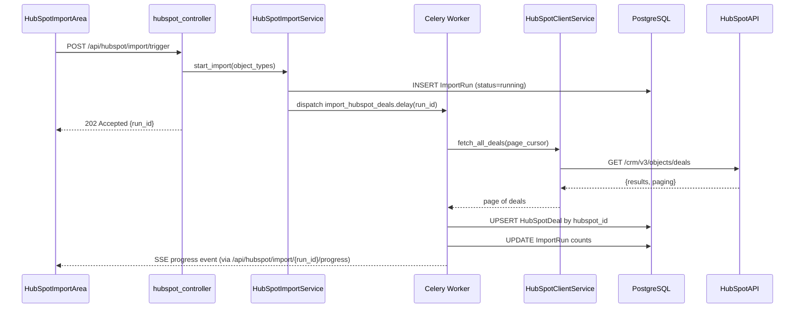
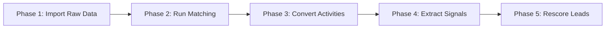

# Design Document: HubSpot CRM Migration

## Overview

This feature transforms the platform into a self-sufficient, property-first CRM by migrating all historical data from HubSpot and building the internal structures needed to replace it. The work spans six active phases:

1. **Internal CRM Foundation** — Organization, Interaction, and Task models with timeline support
2. **HubSpot Raw Historical Import** — Celery-driven paginated import of all HubSpot object types
3. **HubSpot Mapping and Matching** — PIN/address/email/name matching with confidence levels
4. **Activity Conversion and Timeline** — Converting raw engagements to internal Interactions and Tasks
5. **Lead Scoring and Signal Enrichment** — Keyword-based signal extraction and score adjustments
6. **Deferred Write-Back** — Out of scope for MVP; documented for future reference

A seventh phase (Mobile Quick-Add) is a roadmap item and is not implemented in this release.

The design follows the existing platform conventions: Flask Blueprints for controllers, one SQLAlchemy model per file, one service class per file, Marshmallow schemas in `schemas.py`, Celery for background tasks, and Hypothesis for property-based testing.

---

## Architecture

### High-Level Component Diagram

```mermaid
graph TD
    subgraph Frontend
        IA[HubSpotImportArea]
        RQ[ReviewQueue]
        TP[TimelinePanel]
        NTF[NoteTaskForm]
        HLV[HubSpotLeadViews]
    end

    subgraph Backend Controllers
        HC[hubspot_controller /api/hubspot/*]
        OC[organization_controller /api/organizations/*]
        IC[interaction_controller /api/interactions/*]
        TC[task_controller /api/tasks/*]
        LC[lead_controller /api/leads/* - extended]
    end

    subgraph Services
        HCS[HubSpotClientService]
        HIS[HubSpotImportService]
        HMS[HubSpotMatcherService]
        HACS[HubSpotActivityConverterService]
        HSES[HubSpotSignalExtractorService]
        OS[OrganizationService]
        IS[InteractionService]
        TS[TaskService]
        TLS[TimelineService]
        LSE[LeadScoringEngine - extended]
    end

    subgraph Celery Tasks
        CT1[import_hubspot_deals]
        CT2[import_hubspot_contacts]
        CT3[import_hubspot_companies]
        CT4[import_hubspot_engagements]
        CT5[run_hubspot_matching]
        CT6[convert_hubspot_activities]
        CT7[extract_hubspot_signals]
        CT8[rescore_leads_after_import]
        CT9[generate_backup_export]
    end

    subgraph Database Models
        M1[Organization / Links]
        M2[Interaction / InteractionAssociation]
        M3[Task / TaskAssociation]
        M4[HubSpotConfig]
        M5[HubSpotDeal/Contact/Company/Engagement]
        M6[ImportRun]
        M7[HubSpotMatch]
        M8[HubSpotSignal]
        M9[Lead - extended]
    end

    Frontend --> Backend Controllers
    Backend Controllers --> Services
    Services --> Celery Tasks
    Services --> Database Models
    Celery Tasks --> Database Models
    HCS --> HubSpotAPI[(HubSpot API - GET only)]
```

### Request Flow: Import Trigger



### Phase Execution Order



---

## Components and Interfaces

### New Flask Blueprints

| Blueprint | File | URL Prefix |
|---|---|---|
| `hubspot_bp` | `hubspot_controller.py` | `/api/hubspot` |
| `organization_bp` | `organization_controller.py` | `/api/organizations` |
| `interaction_bp` | `interaction_controller.py` | `/api/interactions` |
| `task_bp` | `task_controller.py` | `/api/tasks` |

All controllers use the existing `@handle_errors` decorator and read `g.user_id` from the `before_request` hook.

### API Endpoints

#### HubSpot Controller (`/api/hubspot`)

| Method | Path | Description | Request Body | Response |
|---|---|---|---|---|
| `GET` | `/api/hubspot/config` | Get current HubSpot config (token masked) | — | `{portal_id, account_name, configured_at}` |
| `POST` | `/api/hubspot/config` | Save/update HubSpot API token | `{token, portal_id}` | `{portal_id, account_name}` |
| `POST` | `/api/hubspot/config/test` | Test connection to HubSpot | — | `{success, account_name, portal_id, error?}` |
| `POST` | `/api/hubspot/import/trigger` | Start a full import run | `{object_types?: [...]}` | `{run_id, status: "running"}` |
| `GET` | `/api/hubspot/import/runs` | List all ImportRun records | `?page&per_page` | `{runs: [...], total}` |
| `GET` | `/api/hubspot/import/runs/{run_id}` | Get a single ImportRun | — | `ImportRun` object |
| `GET` | `/api/hubspot/import/{run_id}/progress` | SSE stream of import progress | — | SSE events |
| `POST` | `/api/hubspot/export/backup` | Trigger backup export generation | — | `{task_id}` |
| `GET` | `/api/hubspot/export/backup/download` | Download most recent backup | — | JSON file download |
| `GET` | `/api/hubspot/review-queue` | List Review Queue items | `?type&confidence&page` | `{items: [...], total, pending_count}` |
| `POST` | `/api/hubspot/review-queue/{match_id}/confirm` | Confirm a match | `{internal_record_id?}` | `{success}` |
| `POST` | `/api/hubspot/review-queue/{match_id}/reject` | Reject and re-link | `{internal_record_id}` | `{success}` |
| `POST` | `/api/hubspot/review-queue/{match_id}/new-record` | Mark as new record | — | `{success, new_record_id}` |

#### Organization Controller (`/api/organizations`)

| Method | Path | Description |
|---|---|---|
| `GET` | `/api/organizations` | List organizations (paginated, filterable) |
| `POST` | `/api/organizations` | Create organization |
| `GET` | `/api/organizations/{id}` | Get organization detail |
| `PUT` | `/api/organizations/{id}` | Update organization |
| `DELETE` | `/api/organizations/{id}` | Soft-delete organization |
| `GET` | `/api/organizations/{id}/audit-log` | Get audit log entries |
| `POST` | `/api/organizations/{id}/links/properties` | Link to a property |
| `DELETE` | `/api/organizations/{id}/links/properties/{link_id}` | Remove property link |
| `POST` | `/api/organizations/{id}/links/owners` | Link to an owner |
| `DELETE` | `/api/organizations/{id}/links/owners/{link_id}` | Remove owner link |

#### Interaction Controller (`/api/interactions`)

| Method | Path | Description |
|---|---|---|
| `GET` | `/api/interactions` | List interactions (filterable by target) |
| `POST` | `/api/interactions` | Create interaction |
| `GET` | `/api/interactions/{id}` | Get interaction detail |
| `PUT` | `/api/interactions/{id}` | Update interaction |
| `DELETE` | `/api/interactions/{id}` | Delete interaction |
| `GET` | `/api/leads/{lead_id}/timeline` | Timeline for a lead |
| `GET` | `/api/organizations/{org_id}/timeline` | Timeline for an organization |

#### Task Controller (`/api/tasks`)

| Method | Path | Description |
|---|---|---|
| `GET` | `/api/tasks` | List tasks (filterable) |
| `POST` | `/api/tasks` | Create task |
| `GET` | `/api/tasks/{id}` | Get task detail |
| `PUT` | `/api/tasks/{id}` | Update task |
| `DELETE` | `/api/tasks/{id}` | Delete task |
| `POST` | `/api/tasks/{id}/complete` | Mark task as completed |

#### Lead Controller Extensions (`/api/leads`)

| Method | Path | Description |
|---|---|---|
| `GET` | `/api/leads/views/previously-warm` | Previously Warm Leads view |
| `GET` | `/api/leads/views/needs-review` | Needs Review view |
| `GET` | `/api/leads/views/follow-up-overdue` | Follow-Up Overdue view |
| `GET` | `/api/leads/views/no-next-action` | No Current Next Action view |
| `GET` | `/api/leads/views/do-not-contact` | Do Not Contact view |
| `GET` | `/api/leads/views/missing-property-match` | Missing Property Match view |

---

## Data Models

All new models follow the existing convention: one class per file in `backend/app/models/`, re-exported from `backend/app/models/__init__.py`.

### Organization

```python
# backend/app/models/organization.py
class Organization(db.Model):
    __tablename__ = 'organizations'

    id = db.Column(db.Integer, primary_key=True)
    name = db.Column(db.String(500), nullable=False)
    org_type = db.Column(db.Enum(
        'llc', 'trust', 'corporation', 'brokerage',
        'law_firm', 'property_management', 'unknown',
        name='org_type_enum'
    ), nullable=False, default='unknown')
    status = db.Column(db.Enum('active', 'inactive', 'unknown', name='org_status_enum'),
                       nullable=False, default='unknown')
    notes = db.Column(db.Text, nullable=True)
    source = db.Column(db.String(100), nullable=True)  # 'manual' | 'hubspot_import'
    hubspot_company_id = db.Column(db.String(50), nullable=True, index=True)
    created_at = db.Column(db.DateTime, nullable=False, default=datetime.utcnow)
    updated_at = db.Column(db.DateTime, nullable=False, default=datetime.utcnow,
                           onupdate=datetime.utcnow)

    property_links = db.relationship('PropertyOrganizationLink', backref='organization',
                                     lazy='dynamic', cascade='all, delete-orphan')
    owner_links = db.relationship('OwnerOrganizationLink', backref='organization',
                                  lazy='dynamic', cascade='all, delete-orphan')
    audit_entries = db.relationship('OrganizationAuditLog', backref='organization',
                                    lazy='dynamic', cascade='all, delete-orphan')
```

### OrganizationAuditLog

```python
# backend/app/models/organization_audit_log.py
class OrganizationAuditLog(db.Model):
    __tablename__ = 'organization_audit_log'

    id = db.Column(db.Integer, primary_key=True)
    organization_id = db.Column(db.Integer, db.ForeignKey('organizations.id', ondelete='CASCADE'),
                                nullable=False, index=True)
    field_name = db.Column(db.String(100), nullable=False)
    old_value = db.Column(db.Text, nullable=True)
    new_value = db.Column(db.Text, nullable=True)
    changed_by = db.Column(db.String(100), nullable=False)
    changed_at = db.Column(db.DateTime, nullable=False, default=datetime.utcnow)
```

### PropertyOrganizationLink / OwnerOrganizationLink

```python
# backend/app/models/property_organization_link.py
class PropertyOrganizationLink(db.Model):
    __tablename__ = 'property_organization_links'

    id = db.Column(db.Integer, primary_key=True)
    # property_id references leads.id (Lead is the property record for now)
    property_id = db.Column(db.Integer, db.ForeignKey('leads.id', ondelete='CASCADE'),
                            nullable=False, index=True)
    organization_id = db.Column(db.Integer, db.ForeignKey('organizations.id', ondelete='CASCADE'),
                                nullable=False, index=True)
    role = db.Column(db.String(100), nullable=False)  # owner, property_manager, broker, attorney, related_party
    created_at = db.Column(db.DateTime, nullable=False, default=datetime.utcnow)

# backend/app/models/owner_organization_link.py
class OwnerOrganizationLink(db.Model):
    __tablename__ = 'owner_organization_links'

    id = db.Column(db.Integer, primary_key=True)
    owner_id = db.Column(db.Integer, db.ForeignKey('leads.id', ondelete='CASCADE'),
                         nullable=False, index=True)
    organization_id = db.Column(db.Integer, db.ForeignKey('organizations.id', ondelete='CASCADE'),
                                nullable=False, index=True)
    role = db.Column(db.String(100), nullable=False)  # principal, member, attorney, broker
    created_at = db.Column(db.DateTime, nullable=False, default=datetime.utcnow)
```

### Interaction / InteractionAssociation

```python
# backend/app/models/interaction.py
class Interaction(db.Model):
    __tablename__ = 'interactions'

    id = db.Column(db.Integer, primary_key=True)
    interaction_type = db.Column(db.Enum(
        'note', 'call', 'email', 'meeting', 'other',
        name='interaction_type_enum'
    ), nullable=False)
    body = db.Column(db.Text, nullable=False)
    occurred_at = db.Column(db.DateTime, nullable=False)
    source = db.Column(db.Enum('manual', 'hubspot_import', name='interaction_source_enum'),
                       nullable=False, default='manual')
    hubspot_engagement_id = db.Column(db.String(50), nullable=True, unique=True, index=True)
    raw_payload = db.Column(db.JSON, nullable=True)
    is_orphaned = db.Column(db.Boolean, nullable=False, default=False)
    created_at = db.Column(db.DateTime, nullable=False, default=datetime.utcnow)
    updated_at = db.Column(db.DateTime, nullable=False, default=datetime.utcnow,
                           onupdate=datetime.utcnow)

    associations = db.relationship('InteractionAssociation', backref='interaction',
                                   lazy='dynamic', cascade='all, delete-orphan')

# backend/app/models/interaction_association.py
class InteractionAssociation(db.Model):
    __tablename__ = 'interaction_associations'

    id = db.Column(db.Integer, primary_key=True)
    interaction_id = db.Column(db.Integer, db.ForeignKey('interactions.id', ondelete='CASCADE'),
                               nullable=False, index=True)
    target_type = db.Column(db.Enum(
        'lead', 'organization', 'contact',
        name='interaction_target_type_enum'
    ), nullable=False)
    target_id = db.Column(db.Integer, nullable=False)

    __table_args__ = (
        db.Index('ix_interaction_assoc_target', 'target_type', 'target_id'),
    )
```

### Task / TaskAssociation

```python
# backend/app/models/task.py
class Task(db.Model):
    __tablename__ = 'tasks'

    id = db.Column(db.Integer, primary_key=True)
    title = db.Column(db.String(500), nullable=False)
    body = db.Column(db.Text, nullable=True)
    due_date = db.Column(db.DateTime, nullable=True)
    status = db.Column(db.Enum(
        'open', 'completed', 'cancelled', 'overdue',
        name='task_status_enum'
    ), nullable=False, default='open')
    priority = db.Column(db.Enum('high', 'medium', 'low', name='task_priority_enum'),
                         nullable=False, default='medium')
    source = db.Column(db.Enum('manual', 'hubspot_import', name='task_source_enum'),
                       nullable=False, default='manual')
    hubspot_task_id = db.Column(db.String(50), nullable=True, unique=True, index=True)
    raw_payload = db.Column(db.JSON, nullable=True)
    completion_timestamp = db.Column(db.DateTime, nullable=True)
    created_at = db.Column(db.DateTime, nullable=False, default=datetime.utcnow)
    updated_at = db.Column(db.DateTime, nullable=False, default=datetime.utcnow,
                           onupdate=datetime.utcnow)

    associations = db.relationship('TaskAssociation', backref='task',
                                   lazy='dynamic', cascade='all, delete-orphan')

# backend/app/models/task_association.py
class TaskAssociation(db.Model):
    __tablename__ = 'task_associations'

    id = db.Column(db.Integer, primary_key=True)
    task_id = db.Column(db.Integer, db.ForeignKey('tasks.id', ondelete='CASCADE'),
                        nullable=False, index=True)
    target_type = db.Column(db.Enum(
        'lead', 'organization',
        name='task_target_type_enum'
    ), nullable=False)
    target_id = db.Column(db.Integer, nullable=False)

    __table_args__ = (
        db.Index('ix_task_assoc_target', 'target_type', 'target_id'),
    )
```

### HubSpotConfig

```python
# backend/app/models/hubspot_config.py
class HubSpotConfig(db.Model):
    __tablename__ = 'hubspot_config'

    id = db.Column(db.Integer, primary_key=True)
    # Token stored as Fernet-encrypted bytes, base64-encoded
    encrypted_token = db.Column(db.Text, nullable=False)
    portal_id = db.Column(db.String(50), nullable=True)
    account_name = db.Column(db.String(255), nullable=True)
    created_at = db.Column(db.DateTime, nullable=False, default=datetime.utcnow)
    updated_at = db.Column(db.DateTime, nullable=False, default=datetime.utcnow,
                           onupdate=datetime.utcnow)
```

### HubSpot Raw Import Tables

```python
# backend/app/models/hubspot_deal.py
class HubSpotDeal(db.Model):
    __tablename__ = 'hubspot_deals'

    id = db.Column(db.Integer, primary_key=True)
    hubspot_id = db.Column(db.String(50), nullable=False, unique=True, index=True)
    raw_payload = db.Column(db.JSON, nullable=False)
    import_run_id = db.Column(db.Integer, db.ForeignKey('hubspot_import_runs.id'), nullable=True)
    first_imported_at = db.Column(db.DateTime, nullable=False, default=datetime.utcnow)
    last_updated_at = db.Column(db.DateTime, nullable=False, default=datetime.utcnow,
                                onupdate=datetime.utcnow)

# backend/app/models/hubspot_contact.py
class HubSpotContact(db.Model):
    __tablename__ = 'hubspot_contacts'
    # Same structure as HubSpotDeal

# backend/app/models/hubspot_company.py
class HubSpotCompany(db.Model):
    __tablename__ = 'hubspot_companies'
    # Same structure as HubSpotDeal

# backend/app/models/hubspot_engagement.py
class HubSpotEngagement(db.Model):
    __tablename__ = 'hubspot_engagements'

    id = db.Column(db.Integer, primary_key=True)
    hubspot_id = db.Column(db.String(50), nullable=False, unique=True, index=True)
    engagement_type = db.Column(db.String(50), nullable=False)  # NOTE, CALL, TASK
    raw_payload = db.Column(db.JSON, nullable=False)
    import_run_id = db.Column(db.Integer, db.ForeignKey('hubspot_import_runs.id'), nullable=True)
    first_imported_at = db.Column(db.DateTime, nullable=False, default=datetime.utcnow)
    last_updated_at = db.Column(db.DateTime, nullable=False, default=datetime.utcnow,
                                onupdate=datetime.utcnow)
```

### ImportRun

```python
# backend/app/models/hubspot_import_run.py
class HubSpotImportRun(db.Model):
    __tablename__ = 'hubspot_import_runs'

    id = db.Column(db.Integer, primary_key=True)
    object_type = db.Column(db.String(50), nullable=False)  # deals, contacts, companies, engagements
    status = db.Column(db.Enum(
        'running', 'success', 'partial', 'failed',
        name='import_run_status_enum'
    ), nullable=False, default='running')
    start_time = db.Column(db.DateTime, nullable=False, default=datetime.utcnow)
    end_time = db.Column(db.DateTime, nullable=True)
    total_fetched = db.Column(db.Integer, nullable=False, default=0)
    created_count = db.Column(db.Integer, nullable=False, default=0)
    updated_count = db.Column(db.Integer, nullable=False, default=0)
    skipped_count = db.Column(db.Integer, nullable=False, default=0)
    error_count = db.Column(db.Integer, nullable=False, default=0)
    error_message = db.Column(db.Text, nullable=True)
```

### HubSpotMatch

```python
# backend/app/models/hubspot_match.py
class HubSpotMatch(db.Model):
    __tablename__ = 'hubspot_matches'

    id = db.Column(db.Integer, primary_key=True)
    hubspot_record_type = db.Column(db.String(50), nullable=False)  # deal, contact, company
    hubspot_id = db.Column(db.String(50), nullable=False, index=True)
    internal_record_type = db.Column(db.String(50), nullable=True)  # lead, organization
    internal_record_id = db.Column(db.Integer, nullable=True)
    confidence = db.Column(db.Enum(
        'HIGH', 'MEDIUM', 'LOW', 'UNMATCHED',
        name='match_confidence_enum'
    ), nullable=False)
    status = db.Column(db.Enum(
        'pending', 'confirmed', 'rejected',
        name='match_status_enum'
    ), nullable=False, default='pending')
    matching_criteria = db.Column(db.String(100), nullable=True)  # pin_match, address_match, email_match, etc.
    created_at = db.Column(db.DateTime, nullable=False, default=datetime.utcnow)
    updated_at = db.Column(db.DateTime, nullable=False, default=datetime.utcnow,
                           onupdate=datetime.utcnow)

    __table_args__ = (
        db.UniqueConstraint('hubspot_record_type', 'hubspot_id', name='uq_hubspot_match'),
    )
```

### HubSpotSignal

```python
# backend/app/models/hubspot_signal.py
class HubSpotSignal(db.Model):
    __tablename__ = 'hubspot_signals'

    id = db.Column(db.Integer, primary_key=True)
    lead_id = db.Column(db.Integer, db.ForeignKey('leads.id', ondelete='CASCADE'),
                        nullable=False, index=True)
    signal_type = db.Column(db.Enum(
        'PRIOR_INTERACTION_EXISTS', 'PRIOR_RESPONSE_EXISTS', 'PRIOR_WARM_CONVERSATION',
        'ASKING_PRICE_GIVEN', 'APPOINTMENT_OCCURRED', 'OFFER_PREVIOUSLY_SENT',
        'SELLER_SAID_MAYBE_LATER', 'SELLER_NOT_INTERESTED', 'WRONG_NUMBER',
        'DO_NOT_CONTACT', 'FOLLOW_UP_OVERDUE', 'PRIOR_LEAD_SOURCE_KNOWN',
        name='hubspot_signal_type_enum'
    ), nullable=False)
    source_engagement_id = db.Column(db.String(50), nullable=True)
    extracted_at = db.Column(db.DateTime, nullable=False, default=datetime.utcnow)
    raw_evidence = db.Column(db.Text, nullable=True)
```

### Lead Model Extensions

Two new columns are added to the existing `leads` table:

```python
# Added to backend/app/models/lead.py
suppression_flag = db.Column(db.Boolean, nullable=False, default=False)
recommended_action = db.Column(db.Enum(
    'CONTACT_NOW', 'FOLLOW_UP_LATER', 'REVISIT_OFFER', 'DO_NOT_CONTACT',
    name='recommended_action_enum'
), nullable=True)
```

### Signal Keyword Dictionary

The signal keyword dictionary is stored as a JSON record in a dedicated table, allowing updates without code deployment:

```python
# backend/app/models/hubspot_signal_dictionary.py
class HubSpotSignalDictionary(db.Model):
    __tablename__ = 'hubspot_signal_dictionary'

    id = db.Column(db.Integer, primary_key=True)
    signal_type = db.Column(db.String(50), nullable=False, unique=True)
    keywords = db.Column(db.JSON, nullable=False)
    # keywords format: ["phrase one", "phrase two", ...]
    updated_at = db.Column(db.DateTime, nullable=False, default=datetime.utcnow,
                           onupdate=datetime.utcnow)
```

Default keyword entries (seeded at migration time):

```json
[
  {"signal_type": "PRIOR_WARM_CONVERSATION",
   "keywords": ["interested", "wants to sell", "open to offers", "let's talk", "call me back", "warm lead"]},
  {"signal_type": "APPOINTMENT_OCCURRED",
   "keywords": ["appointment", "meeting", "showed up", "walked the property", "met with"]},
  {"signal_type": "OFFER_PREVIOUSLY_SENT",
   "keywords": ["offer sent", "sent offer", "submitted offer", "offer submitted", "offer letter"]},
  {"signal_type": "SELLER_SAID_MAYBE_LATER",
   "keywords": ["maybe later", "not right now", "call back in", "follow up in", "check back", "not yet"]},
  {"signal_type": "SELLER_NOT_INTERESTED",
   "keywords": ["not interested", "no thanks", "don't call", "remove me", "not selling"]},
  {"signal_type": "WRONG_NUMBER",
   "keywords": ["wrong number", "wrong person", "not the owner", "disconnected"]},
  {"signal_type": "DO_NOT_CONTACT",
   "keywords": ["do not contact", "dnc", "cease and desist", "stop calling", "harassment"]},
  {"signal_type": "ASKING_PRICE_GIVEN",
   "keywords": ["asking", "wants", "price is", "listed at", "they want"]},
  {"signal_type": "PRIOR_INTERACTION_EXISTS",
   "keywords": ["called", "spoke with", "left voicemail", "emailed", "texted", "mailed"]},
  {"signal_type": "PRIOR_RESPONSE_EXISTS",
   "keywords": ["responded", "replied", "called back", "returned call", "answered"]},
  {"signal_type": "PRIOR_LEAD_SOURCE_KNOWN",
   "keywords": ["from list", "from mailer", "from driving", "from zillow", "from mls"]}
]
```

---

## Services

### HubSpotClientService

Wraps all HubSpot API calls. Enforces GET-only access at the method level.

```python
# backend/app/services/hubspot_client_service.py
class HubSpotClientService:
    BASE_URL = "https://api.hubapi.com"
    PAGE_SIZE = 100

    def __init__(self, config: HubSpotConfig):
        self._token = self._decrypt_token(config.encrypted_token)

    def _decrypt_token(self, encrypted_token: str) -> str:
        """Decrypt the stored Fernet-encrypted token."""
        from cryptography.fernet import Fernet
        key = os.environ['HUBSPOT_ENCRYPTION_KEY'].encode()
        f = Fernet(key)
        return f.decrypt(encrypted_token.encode()).decode()

    def _get(self, path: str, params: dict = None) -> dict:
        """Execute a GET request. Raises HubSpotReadOnlyViolation for any non-GET attempt."""
        url = f"{self.BASE_URL}{path}"
        resp = requests.get(url, headers={"Authorization": f"Bearer {self._token}"}, params=params)
        resp.raise_for_status()
        return resp.json()

    def enforce_get_only(self, method: str):
        """Raise HubSpotReadOnlyViolation if method is not GET."""
        if method.upper() != 'GET':
            logger.error("Attempted non-GET HubSpot call: %s", method)
            raise HubSpotReadOnlyViolation(f"Non-GET HubSpot call blocked: {method}")

    def fetch_all_deals(self) -> Iterator[dict]:
        """Paginate through all HubSpot deals, yielding one record at a time."""
        # Uses cursor-based pagination via 'after' parameter

    def fetch_all_contacts(self) -> Iterator[dict]: ...
    def fetch_all_companies(self) -> Iterator[dict]: ...
    def fetch_all_engagements(self) -> Iterator[dict]: ...
    def test_connection(self) -> dict:
        """Call /account-info/v3/details to verify token and return account info."""
```

**Design decision**: Token decryption happens in the constructor so the raw token never leaves the service. The `enforce_get_only` method is called at the top of any method that could theoretically accept a method parameter, providing defense-in-depth.

### HubSpotImportService

Orchestrates import runs. Creates `HubSpotImportRun` records and dispatches Celery tasks.

```python
class HubSpotImportService:
    def start_import(self, object_types: list[str] = None) -> list[HubSpotImportRun]:
        """Create ImportRun records and dispatch Celery tasks for each object type."""

    def get_run_status(self, run_id: int) -> HubSpotImportRun: ...
    def list_runs(self, page: int, per_page: int) -> tuple[list, int]: ...
```

### HubSpotMatcherService

Implements the matching algorithm for deals, contacts, and companies.

```python
class HubSpotMatcherService:
    def match_deal(self, deal: HubSpotDeal) -> HubSpotMatch:
        """
        Priority order:
        1. PIN match against leads.county_assessor_pin
        2. Normalized address match against deal name
        3. Normalized address match against HubSpot address custom property
        Returns HubSpotMatch with appropriate confidence.
        """

    def match_contact(self, contact: HubSpotContact) -> HubSpotMatch:
        """
        Priority order:
        1. Email match against leads.email_1/email_2/...
        2. Phone match (digits only) against leads.phone_1/phone_2/...
        3. Full name + associated deal's property match
        """

    def match_company(self, company: HubSpotCompany) -> HubSpotMatch:
        """
        Priority order:
        1. Exact normalized name match against organizations.name
        2. Normalized name + associated deal's property match
        """

    @staticmethod
    def normalize_address(address: str) -> str:
        """
        Normalize an address for comparison:
        1. Strip and uppercase
        2. Expand abbreviations: ST→STREET, AVE→AVENUE, BLVD→BOULEVARD,
           DR→DRIVE, RD→ROAD, CT→COURT, LN→LANE, PL→PLACE
        3. Remove all punctuation (commas, periods, hyphens, #)
        Returns normalized string.
        """

    @staticmethod
    def normalize_phone(phone: str) -> str:
        """Strip all non-digit characters from a phone number."""

    @staticmethod
    def normalize_company_name(name: str) -> str:
        """Uppercase, strip punctuation, collapse whitespace."""
```

**Address Normalization Algorithm** (detailed):

```
Input:  "123 Main St., Apt #4"
Step 1 (uppercase):   "123 MAIN ST., APT #4"
Step 2 (abbreviations):
  - "ST." → "STREET" (word-boundary match, handles trailing punctuation)
  - Abbreviation map applied left-to-right, longest match first
Step 3 (punctuation removal): remove [.,#-/]
Output: "123 MAIN STREET APT 4"
```

Abbreviation expansion map (applied as whole-word replacements):

| Abbreviation | Expansion |
|---|---|
| ST | STREET |
| AVE | AVENUE |
| BLVD | BOULEVARD |
| DR | DRIVE |
| RD | ROAD |
| CT | COURT |
| LN | LANE |
| PL | PLACE |
| HWY | HIGHWAY |
| PKWY | PARKWAY |
| CIR | CIRCLE |

### HubSpotActivityConverterService

Converts raw `HubSpotEngagement` records to internal `Interaction` and `Task` records.

```python
class HubSpotActivityConverterService:
    def convert_engagement(self, engagement: HubSpotEngagement) -> Interaction | Task | None:
        """
        Routes to convert_note, convert_call, or convert_task based on engagement_type.
        Returns None if engagement_type is unrecognized.
        """

    def convert_note(self, engagement: HubSpotEngagement) -> Interaction:
        """Create Interaction(type=note) from HubSpot NOTE engagement."""

    def convert_call(self, engagement: HubSpotEngagement) -> Interaction:
        """Create Interaction(type=call) from HubSpot CALL engagement."""

    def convert_task(self, engagement: HubSpotEngagement) -> Task:
        """
        Create Task from HubSpot TASK engagement.
        Status mapping: COMPLETED → completed, all others → open.
        """

    def _resolve_associations(self, engagement: HubSpotEngagement) -> list[dict]:
        """
        Look up confirmed HubSpotMatch records for each associated deal/contact/company ID.
        Returns list of {target_type, target_id} dicts.
        If no matches found, returns empty list (engagement marked as orphaned).
        """
```

### HubSpotSignalExtractorService

Extracts signals from engagement body text using the configurable keyword dictionary.

```python
class HubSpotSignalExtractorService:
    def __init__(self):
        self._dictionary = self._load_dictionary()

    def _load_dictionary(self) -> dict[str, list[str]]:
        """Load signal keyword dictionary from HubSpotSignalDictionary table."""

    def extract_signals(self, engagement: HubSpotEngagement, lead_id: int) -> list[HubSpotSignal]:
        """
        Scan engagement body text (case-insensitive) against all keyword lists.
        Returns list of HubSpotSignal records to be persisted.
        Also checks for overdue task condition for FOLLOW_UP_OVERDUE signal.
        """

    def apply_suppression(self, signals: list[HubSpotSignal]) -> None:
        """
        For any DO_NOT_CONTACT or WRONG_NUMBER signal, set suppression_flag=True
        on the associated Lead record.
        """
```

### OrganizationService

```python
class OrganizationService:
    def create(self, data: dict, changed_by: str) -> Organization:
        """Validate name non-empty, create org, write audit log entry."""

    def update(self, org_id: int, data: dict, changed_by: str) -> Organization:
        """Update fields, write audit log entry for each changed field."""

    def link_property(self, org_id: int, property_id: int, role: str) -> PropertyOrganizationLink: ...
    def link_owner(self, org_id: int, owner_id: int, role: str) -> OwnerOrganizationLink: ...
    def get_audit_log(self, org_id: int) -> list[OrganizationAuditLog]: ...
```

### InteractionService

```python
class InteractionService:
    def create(self, data: dict) -> Interaction:
        """
        Validate: body non-empty, at least one association target.
        Create Interaction and InteractionAssociation records.
        """

    def get_timeline(self, target_type: str, target_id: int,
                     filters: dict = None) -> list[dict]:
        """
        Delegate to TimelineService. Returns unified timeline entries.
        """
```

### TaskService

```python
class TaskService:
    def create(self, data: dict) -> Task:
        """Validate title non-empty, create Task and TaskAssociation records."""

    def complete(self, task_id: int) -> Task:
        """Set status=completed, completion_timestamp=now."""

    def get_overdue_tasks(self) -> list[Task]:
        """Return all tasks where due_date < now and status=open."""

    def mark_overdue_if_needed(self, task: Task) -> Task:
        """
        Called on every read. If due_date < now and status=open, set status=overdue.
        This ensures the overdue state is always current without a background job.
        """
```

### TimelineService

```python
class TimelineService:
    def get_timeline(self, target_type: str, target_id: int,
                     entry_type: str = None, subtype: str = None,
                     date_from: datetime = None, date_to: datetime = None) -> list[dict]:
        """
        Aggregate Interactions and Tasks for a given target.
        1. Query InteractionAssociation for matching interactions
        2. Query TaskAssociation for matching tasks
        3. Apply filters
        4. Sort combined list by occurred_at/due_date descending
        5. Return unified list of timeline entry dicts
        """
```

### LeadScoringEngine Extensions

The existing `compute_score` method is extended to accept an optional list of `HubSpotSignal` records:

```python
# Signal score adjustments (constants)
SIGNAL_ADJUSTMENTS = {
    'PRIOR_WARM_CONVERSATION': +15.0,
    'APPOINTMENT_OCCURRED': +20.0,
    'OFFER_PREVIOUSLY_SENT': +10.0,
    'SELLER_SAID_MAYBE_LATER': -5.0,
    'SELLER_NOT_INTERESTED': -40.0,
    'DO_NOT_CONTACT': -50.0,
    'WRONG_NUMBER': -30.0,
}

ACTIVE_OUTREACH_THRESHOLD = 30.0  # Leads below this score are excluded from active outreach

def compute_score(self, lead: Lead, weights: ScoringWeights,
                  signals: list[HubSpotSignal] = None) -> float:
    """
    Compute base score from four sub-scores, then apply signal adjustments.
    Suppressed leads (suppression_flag=True) are clamped to max 10.0.
    """
    base_score = ... # existing logic
    if signals:
        for signal in signals:
            base_score += SIGNAL_ADJUSTMENTS.get(signal.signal_type, 0.0)
    if lead.suppression_flag:
        base_score = min(base_score, 10.0)
    return max(0.0, min(round(base_score, 2), 100.0))

def compute_recommended_action(self, signals: list[HubSpotSignal]) -> str | None:
    """
    Determine recommended_action from the most recently extracted signal.
    Priority: DO_NOT_CONTACT > SELLER_NOT_INTERESTED > SELLER_SAID_MAYBE_LATER > OFFER_PREVIOUSLY_SENT
    """
```

---

## Celery Tasks

All tasks live in `backend/app/tasks/hubspot_tasks.py` and are registered with the existing Celery app.

```python
@celery.task(bind=True, max_retries=3)
def import_hubspot_deals(self, run_id: int):
    """
    Paginate through all HubSpot deals via HubSpotClientService.
    For each page: UPSERT into hubspot_deals by hubspot_id.
    Update ImportRun counts after each page.
    On fatal error: mark run as failed, re-raise.
    On non-fatal record error: log, increment error_count, continue.
    """

@celery.task(bind=True, max_retries=3)
def import_hubspot_contacts(self, run_id: int): ...

@celery.task(bind=True, max_retries=3)
def import_hubspot_companies(self, run_id: int): ...

@celery.task(bind=True, max_retries=3)
def import_hubspot_engagements(self, run_id: int): ...

@celery.task
def run_hubspot_matching(run_id: int = None):
    """
    Process all HubSpotDeal/Contact/Company records with no confirmed match.
    Call HubSpotMatcherService for each. Populate hubspot_matches table.
    """

@celery.task
def convert_hubspot_activities(run_id: int = None):
    """
    Process all HubSpotEngagement records not yet converted.
    Call HubSpotActivityConverterService for each.
    Skip if hubspot_engagement_id already exists in interactions or tasks.
    """

@celery.task
def extract_hubspot_signals(run_id: int = None):
    """
    Process all converted Interactions with source=hubspot_import.
    Call HubSpotSignalExtractorService for each.
    Apply suppression flags.
    """

@celery.task
def rescore_leads_after_import(user_id: str = 'default'):
    """
    Trigger LeadScoringEngine.bulk_rescore() after signal extraction.
    Passes signals to compute_score for each lead.
    """

@celery.task
def generate_backup_export():
    """
    Query all HubSpotDeal/Contact/Company/Engagement records.
    Serialize to JSON with import metadata.
    Write to a temp file, store path in a BackupExport record.
    """
```

### Upsert Pattern

All import tasks use PostgreSQL's `INSERT ... ON CONFLICT DO UPDATE` via SQLAlchemy:

```python
from sqlalchemy.dialects.postgresql import insert as pg_insert

stmt = pg_insert(HubSpotDeal).values(
    hubspot_id=record['id'],
    raw_payload=record,
    import_run_id=run_id,
    first_imported_at=func.coalesce(
        HubSpotDeal.first_imported_at, datetime.utcnow()
    ),
    last_updated_at=datetime.utcnow(),
)
stmt = stmt.on_conflict_do_update(
    index_elements=['hubspot_id'],
    set_={
        'raw_payload': stmt.excluded.raw_payload,
        'last_updated_at': stmt.excluded.last_updated_at,
        'import_run_id': stmt.excluded.import_run_id,
        # first_imported_at is NOT updated — preserves original import time
    }
)
result = db.session.execute(stmt)
# result.rowcount == 1 always; use result.inserted_primary_key to detect insert vs update
```

---

## Frontend Components

All components follow the existing convention: one `.tsx` file per component in `frontend/src/components/`.

### HubSpotImportArea

Main import management page. Rendered at `/import/hubspot`.

**Sections:**
- Connection config form (token input, save, test connection button)
- "Read-Only Mode" badge (always visible when configured)
- Import trigger panel (object type checkboxes, "Start Import" button)
- Active import progress (SSE-driven progress bar per object type)
- Import history table (list of ImportRun records with status, counts, timestamps)
- Backup export section (generate + download buttons)
- Review Queue badge with pending count

**State management:** React Query for import run list and config. SSE via `EventSource` for live progress.

### ReviewQueue

Rendered at `/import/hubspot/review-queue`.

**Features:**
- Filterable table (by object type, confidence level)
- Each row shows: HubSpot record summary, proposed internal match, confidence badge, matching criteria
- Side-by-side field comparison for conflict detection (Req 22.4)
- Action buttons: Confirm, Reject + Re-link, Mark as New Record
- Pending count badge in navigation

### TimelinePanel

Reusable component embedded in Lead, Organization detail pages.

**Props:** `targetType: 'lead' | 'organization'`, `targetId: number`

**Features:**
- Chronological list of Interaction and Task entries
- Filter bar (type, subtype, date range)
- Each entry shows: type icon, subtype label, occurred_at/due_date, body/title, source badge, HubSpot ID if applicable
- Empty state message when no entries exist

### NoteTaskForm

Inline form embedded in detail pages, rendered below the TimelinePanel.

**Features:**
- Tab switcher: "Note" | "Task"
- Note form: body textarea (required), submit button
- Task form: title (required), body (optional), due date picker, priority selector
- Auto-populates association from page context (no re-selection needed)
- On success: invalidates timeline React Query cache → timeline refreshes without page reload
- Inline validation error display

### HubSpotLeadViews

Six pre-built filtered views accessible from the leads navigation:

| View Label | Route | Filter Logic |
|---|---|---|
| Previously Warm Leads | `/leads/views/previously-warm` | Has signal PRIOR_WARM_CONVERSATION or APPOINTMENT_OCCURRED |
| Needs Review | `/leads/views/needs-review` | HubSpot-imported, confidence UNMATCHED or status needs_review |
| Follow-Up Overdue | `/leads/views/follow-up-overdue` | Has open Task with past due_date |
| No Current Next Action | `/leads/views/no-next-action` | Has PRIOR_INTERACTION_EXISTS signal, no open Task, no future Interaction |
| Do Not Contact | `/leads/views/do-not-contact` | suppression_flag=True on Lead or any associated Owner |
| Missing Property Match | `/leads/views/missing-property-match` | HubSpot placeholder Property with no confirmed match |

Each view reuses the existing lead list table component with pre-applied filters.

---

## Correctness Properties

*A property is a characteristic or behavior that should hold true across all valid executions of a system — essentially, a formal statement about what the system should do. Properties serve as the bridge between human-readable specifications and machine-verifiable correctness guarantees.*

This feature has substantial pure-function logic (address normalization, match confidence assignment, signal extraction, score adjustment, overdue detection, timeline ordering) that is well-suited to property-based testing with Hypothesis.

**Property Reflection:** After reviewing all prework items, the following consolidations were made:
- Requirements 1.2, 1.3, and 1.6 (org-property and org-owner links) are combined into one link-retrieval property.
- Requirements 2.3, 3.3, and 1.5 (whitespace rejection) are combined into one "empty input rejection" property.
- Requirements 2.5 and 3.4 (hubspot source field preservation) are combined into one "hubspot source round-trip" property.
- Requirements 3.6, 15.4 (overdue detection) are combined into one overdue property.
- Requirements 4.1 and 2.6 (reverse chronological ordering) are combined into one timeline ordering property.
- Requirements 8.1–8.4 (upsert by HubSpot ID) are combined into one duplicate prevention property.
- Requirements 10.2 and 10.3 (PIN → HIGH, address-only → MEDIUM) are combined into one confidence assignment property.
- Requirements 17.1–17.2 (signal score adjustments) and 17.6 (suppression clamping) are combined into one scoring property.

---

### Property 1: Address Normalization is Idempotent

*For any* string, applying the address normalization function twice must produce the same result as applying it once.

**Validates: Requirements 10.5**

---

### Property 2: Address Normalization is Deterministic

*For any* string, applying the address normalization function multiple times must always produce the same output.

**Validates: Requirements 10.5**

---

### Property 3: Empty and Whitespace Inputs are Always Rejected

*For any* string composed entirely of whitespace characters (spaces, tabs, newlines), submitting it as an Organization name, Interaction body, or Task title must be rejected with a validation error, and no record must be created.

**Validates: Requirements 1.5, 2.3, 3.3**

---

### Property 4: Duplicate Prevention — Upsert by HubSpot ID

*For any* HubSpot record (deal, contact, company, or engagement), importing the same record N times (N ≥ 1) must result in exactly one row in the corresponding raw table, with `first_imported_at` equal to the timestamp of the first import and `last_updated_at` equal to the timestamp of the most recent import.

**Validates: Requirements 8.1, 8.2, 8.3, 8.4, 8.6**

---

### Property 5: Match Confidence Assignment is Deterministic

*For any* HubSpot deal record, if the deal contains a PIN that matches an existing Lead's `county_assessor_pin`, the resulting `HubSpotMatch` must have confidence `HIGH`. If the deal has no PIN match but has a normalized address that matches an existing Lead's normalized address, the confidence must be `MEDIUM`. If neither match is found, the confidence must be `UNMATCHED`.

**Validates: Requirements 10.1, 10.2, 10.3, 10.4**

---

### Property 6: Contact Match Confidence Assignment

*For any* HubSpot contact record, if the contact's email matches an existing Lead's email fields, the resulting `HubSpotMatch` must have confidence `HIGH`. If only a phone match is found (digits-only comparison), the confidence must be `HIGH`. If only a name-plus-property-association match is found, the confidence must be `MEDIUM`.

**Validates: Requirements 11.1, 11.2, 11.3**

---

### Property 7: Timeline is Always Reverse Chronological

*For any* set of Interactions and Tasks associated with a given target (lead or organization), the timeline endpoint must return all entries sorted in descending order by their `occurred_at` (for Interactions) or `due_date` (for Tasks), with no gaps or reorderings.

**Validates: Requirements 4.1, 2.6**

---

### Property 8: Timeline Completeness

*For any* target with K manually-created records and M HubSpot-imported records, the timeline endpoint must return exactly K + M entries (subject to any applied filters).

**Validates: Requirements 4.2**

---

### Property 9: Overdue Detection Invariant

*For any* Task with `due_date` strictly in the past and `status` equal to `open`, every query response for that task must reflect `status = overdue`. This must hold regardless of when the task was created or last updated.

**Validates: Requirements 3.6, 15.4**

---

### Property 10: HubSpot Source Fields are Preserved on Round-Trip

*For any* Interaction or Task created with `source = hubspot_import`, the `hubspot_engagement_id` and `raw_payload` fields must be non-null and equal to the values provided at creation time after a persist-and-retrieve cycle.

**Validates: Requirements 2.5, 3.4**

---

### Property 11: Suppressed Lead Score is Always Below Threshold

*For any* Lead with `suppression_flag = True`, the computed score returned by `LeadScoringEngine.compute_score()` must be at most 10.0, regardless of the base sub-scores or signal adjustments applied.

**Validates: Requirements 17.6**

---

### Property 12: Signal Score Adjustments are Monotone

*For any* Lead, adding a positive-adjustment signal (PRIOR_WARM_CONVERSATION, APPOINTMENT_OCCURRED) must result in a score greater than or equal to the score without that signal. Adding a negative-adjustment signal (SELLER_NOT_INTERESTED, DO_NOT_CONTACT) must result in a score less than or equal to the score without that signal.

**Validates: Requirements 17.1, 17.2**

---

### Property 13: Scoring Weights Always Sum to 1.0

*For any* `ScoringWeights` record stored in the database, the sum of `property_characteristics_weight + data_completeness_weight + owner_situation_weight + location_desirability_weight` must be within 0.01 of 1.0.

**Validates: Requirements 17.1, 17.2, 17.6**

---

### Property 14: Signal Extraction Keyword Match

*For any* engagement body text that contains a keyword from the signal dictionary for signal type S, the signal extractor must include a `HubSpotSignal` of type S in its output. The match must be case-insensitive.

**Validates: Requirements 16.1, 16.2**

---

### Property 15: Suppression Flag Set for DO_NOT_CONTACT and WRONG_NUMBER Signals

*For any* Lead that has a `HubSpotSignal` of type `DO_NOT_CONTACT` or `WRONG_NUMBER`, the Lead's `suppression_flag` must be `True` after signal application.

**Validates: Requirements 16.3**

---

### Property 16: Review Queue Membership Invariant

*For any* `HubSpotMatch` with confidence `MEDIUM`, `LOW`, or `UNMATCHED` and status `pending`, that match must appear in the Review Queue. *For any* `HubSpotMatch` with status `confirmed` or `rejected`, that match must not appear in the Review Queue.

**Validates: Requirements 13.1, 13.4, 13.5**

---

### Property 17: HubSpot Client Enforces GET-Only

*For any* call to `HubSpotClientService` with an HTTP method other than `GET`, the service must raise a `HubSpotReadOnlyViolation` exception and must not execute the API call.

**Validates: Requirements 19.1, 19.2, 19.3**

---

### Property 18: Import Run Counts are Accurate

*For any* import run processing N records where E records fail with non-fatal errors, the resulting `HubSpotImportRun` must satisfy: `total_fetched = created_count + updated_count + skipped_count + error_count` and `error_count = E`.

**Validates: Requirements 20.2, 20.4**

---

### Property 19: No Overwrite of Protected Fields Without Confirmation

*For any* HubSpot import that produces a match to an existing Lead, the Lead's `county_assessor_pin`, `property_street`, `lead_score`, and `source` fields must remain unchanged after the import unless the match has been explicitly confirmed in the Review Queue.

**Validates: Requirements 22.1, 22.2, 22.3**

---

### Property 20: Organization Audit Log Grows on Every Mutation

*For any* sequence of N create/update operations on an Organization record, the audit log for that organization must contain at least N entries after all operations complete.

**Validates: Requirements 1.4**

---

## Error Handling

### New Exception Classes

All new exceptions extend `RealEstateAnalysisException` from `backend/app/exceptions.py`:

```python
class HubSpotReadOnlyViolation(RealEstateAnalysisException):
    """Raised when code attempts a non-GET HubSpot API call."""
    def __init__(self, method: str):
        super().__init__(f"HubSpot write blocked: {method}", status_code=500)
        self.payload = {'error_type': 'hubspot_read_only_violation', 'method': method}

class HubSpotAuthenticationError(RealEstateAnalysisException):
    """Raised when HubSpot returns 401 or 403."""
    def __init__(self, message: str = "HubSpot authentication failed"):
        super().__init__(message, status_code=401)
        self.payload = {'error_type': 'hubspot_auth_error'}

class HubSpotRateLimitError(RealEstateAnalysisException):
    """Raised when HubSpot returns 429."""
    def __init__(self, retry_after: int = None):
        super().__init__("HubSpot rate limit exceeded", status_code=429)
        self.payload = {'error_type': 'hubspot_rate_limit', 'retry_after': retry_after}

class ImportRunNotFoundError(ResourceNotFoundError):
    """Raised when an ImportRun ID does not exist."""

class MatchNotFoundError(ResourceNotFoundError):
    """Raised when a HubSpotMatch ID does not exist."""

class OrganizationValidationError(ValidationException):
    """Raised when Organization name is empty or invalid."""

class InteractionValidationError(ValidationException):
    """Raised when Interaction body is empty or has no association targets."""

class TaskValidationError(ValidationException):
    """Raised when Task title is empty."""
```

### Error Handling Strategy by Layer

**HubSpotClientService:**
- `401/403` → raise `HubSpotAuthenticationError`
- `429` → raise `HubSpotRateLimitError` (Celery task retries with exponential backoff)
- `5xx` → raise `ExternalServiceError` (Celery task retries up to 3 times)
- Non-GET method → raise `HubSpotReadOnlyViolation` (never retried)
- Timeout (>30s) → raise `ExternalServiceError`

**Celery Import Tasks:**
- Non-fatal record error (malformed JSON, missing required field): log warning, increment `error_count`, continue
- Fatal error (auth failure, rate limit exhausted): mark `ImportRun.status = 'failed'`, record `error_message`, stop task
- Partial success (some records failed): mark `ImportRun.status = 'partial'`

**Controllers:**
- All controllers use `@handle_errors` decorator which maps exception types to HTTP status codes
- `HubSpotReadOnlyViolation` → 500 with descriptive message
- `HubSpotAuthenticationError` → 401
- `OrganizationValidationError` / `InteractionValidationError` / `TaskValidationError` → 400

**Review Queue Confirm/Reject:**
- If association creation fails: keep match in queue, return 500 with error detail (Req 13.4)
- If match not found: return 404

---

## Testing Strategy

### Property-Based Testing (Hypothesis)

The project already uses Hypothesis for property-based testing. All new property tests use `@given` decorators with appropriate strategies.

**Library:** `hypothesis` (already in `requirements.txt`)
**Configuration:** Minimum 100 examples per property test (`settings(max_examples=100)`)
**Tag format:** Each test is tagged with a comment: `# Feature: hubspot-crm-migration, Property N: <property_text>`

Key test files:
- `backend/tests/test_hubspot_address_normalization.py` — Properties 1, 2
- `backend/tests/test_hubspot_validation.py` — Property 3
- `backend/tests/test_hubspot_import_upsert.py` — Property 4
- `backend/tests/test_hubspot_matching.py` — Properties 5, 6
- `backend/tests/test_hubspot_timeline.py` — Properties 7, 8
- `backend/tests/test_hubspot_overdue.py` — Property 9
- `backend/tests/test_hubspot_source_roundtrip.py` — Property 10
- `backend/tests/test_hubspot_scoring.py` — Properties 11, 12, 13
- `backend/tests/test_hubspot_signal_extraction.py` — Properties 14, 15
- `backend/tests/test_hubspot_review_queue.py` — Property 16
- `backend/tests/test_hubspot_readonly.py` — Property 17
- `backend/tests/test_hubspot_import_counts.py` — Property 18
- `backend/tests/test_hubspot_no_overwrite.py` — Property 19
- `backend/tests/test_hubspot_audit_log.py` — Property 20

Example property test structure:

```python
# Feature: hubspot-crm-migration, Property 1: Address normalization is idempotent
@given(st.text(min_size=0, max_size=200))
@settings(max_examples=100)
def test_address_normalization_idempotent(address):
    result_once = HubSpotMatcherService.normalize_address(address)
    result_twice = HubSpotMatcherService.normalize_address(result_once)
    assert result_once == result_twice

# Feature: hubspot-crm-migration, Property 4: Duplicate prevention upsert
@given(st.text(min_size=1, max_size=50), st.integers(min_value=2, max_value=10))
@settings(max_examples=100)
def test_upsert_never_duplicates(hubspot_id, import_count):
    for _ in range(import_count):
        upsert_hubspot_deal(hubspot_id=hubspot_id, raw_payload={'id': hubspot_id})
    count = HubSpotDeal.query.filter_by(hubspot_id=hubspot_id).count()
    assert count == 1
```

### Unit Tests (Example-Based)

Unit tests cover:
- Specific HubSpot API response shapes (deal with PIN, deal without PIN, contact with email, etc.)
- Status mapping: HubSpot COMPLETED → internal completed, all others → open
- Connection test success and failure paths
- Backup export JSON structure
- Review Queue confirm/reject/new-record flows
- Signal dictionary loading and hot-reload

### Integration Tests

Integration tests (using SQLite in-memory via `conftest.py`) cover:
- Full import pipeline: mock HubSpot API → raw import → matching → activity conversion → signal extraction → rescore
- ImportRun status transitions (running → success, running → partial, running → failed)
- SSE progress event emission during import
- Backup export file generation

### Frontend Tests (Vitest + React Testing Library)

- `HubSpotImportArea.test.tsx` — config save, test connection, trigger import, progress display
- `ReviewQueue.test.tsx` — filter, confirm, reject, new-record actions
- `TimelinePanel.test.tsx` — renders entries in reverse chronological order, empty state
- `NoteTaskForm.test.tsx` — validation errors, successful submission, timeline refresh
- `HubSpotLeadViews.test.tsx` — each view renders with correct filter applied

### Test Data Strategy

All tests use SQLite in-memory database (existing `conftest.py` pattern). HubSpot API calls are mocked using `unittest.mock.patch` on `HubSpotClientService._get`. No real HubSpot API calls are made in tests.

---
