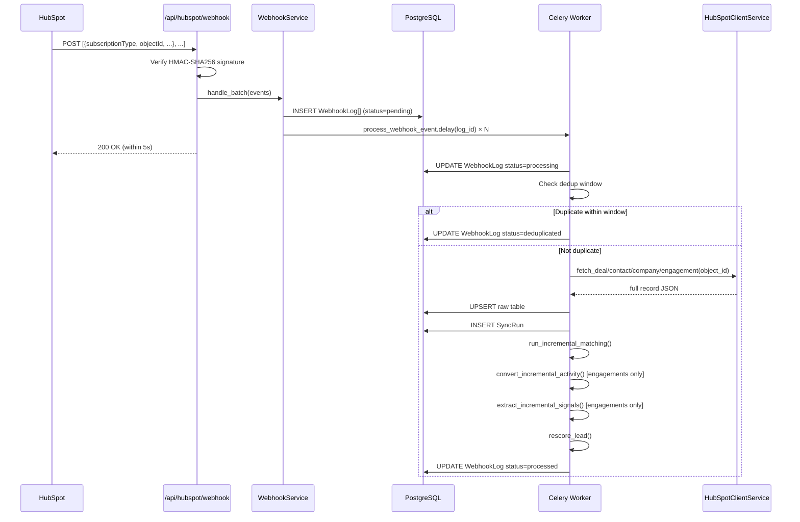

# Design Document: HubSpot Webhook Sync

## Overview

This feature adds ongoing one-way synchronization from HubSpot to the platform via HubSpot's webhook delivery system. After the initial historical migration, this keeps the platform's raw HubSpot tables, internal records, timelines, and lead scores current as HubSpot changes happen — without manual re-imports.

The design reuses the existing migration infrastructure (Celery, `HubSpotClientService`, `HubSpotMatcherService`, `HubSpotActivityConverterService`, `HubSpotSignalExtractorService`) and adds two new pieces:

1. A **webhook receiver endpoint** that authenticates, logs, and dispatches events
2. A **Celery processing pipeline** that fetches, upserts, matches, converts, and rescores

**Note on subscription management**: HubSpot's legacy private apps do not support managing webhook subscriptions via API. Subscriptions are configured manually in the HubSpot UI. The platform displays the webhook URL and setup instructions but does not call the HubSpot Webhooks API to register subscriptions.

---

## Architecture

### Component Diagram

```mermaid
graph TD
    subgraph HubSpot
        HS_API[HubSpot API]
        HS_WH[HubSpot Webhook Delivery]
    end

    subgraph Platform Frontend
        IA[Import_Area — extended]
        WHL[WebhookLogView]
        SubMgr[SubscriptionManager UI]
    end

    subgraph Platform Backend
        WHE[POST /api/hubspot/webhook]
        WHC[hubspot_webhook_controller]
        WHS[WebhookService]
    end

    subgraph Celery Pipeline
        CT_PROC[process_webhook_event]
        CT_FETCH[fetch_and_upsert_record]
        CT_MATCH[run_incremental_matching]
        CT_CONV[convert_incremental_activity]
        CT_SIG[extract_incremental_signals]
        CT_SCORE[rescore_lead]
    end

    subgraph Existing Services
        HCS[HubSpotClientService]
        HMS[HubSpotMatcherService]
        HACS[HubSpotActivityConverterService]
        HSES[HubSpotSignalExtractorService]
        LSE[LeadScoringEngine]
    end

    subgraph Database
        WHL_DB[(WebhookLog)]
        SR_DB[(SyncRun)]
        RAW[(HubSpotDeal/Contact/Company/Engagement)]
        MATCH[(HubSpotMatch)]
        SIG[(HubSpotSignal)]
        LEADS[(leads)]
    end

    HS_WH -->|POST batch of events| WHE
    WHE --> WHC
    WHC --> WHS
    WHS -->|store raw payload| WHL_DB
    WHS -->|dispatch| CT_PROC
    WHC -->|200 OK| HS_WH

    CT_PROC --> CT_FETCH
    CT_FETCH --> HCS
    HCS --> HS_API
    CT_FETCH -->|upsert| RAW
    CT_FETCH -->|create| SR_DB
    CT_FETCH --> CT_MATCH
    CT_MATCH --> HMS
    CT_MATCH -->|upsert| MATCH
    CT_MATCH --> CT_CONV
    CT_CONV --> HACS
    CT_CONV --> CT_SIG
    CT_SIG --> HSES
    CT_SIG -->|upsert| SIG
    CT_SIG --> CT_SCORE
    CT_SCORE --> LSE
    CT_SCORE -->|update| LEADS

    Platform Frontend --> Platform Backend
```

### Event Processing Pipeline



---

## Data Models

### WebhookLog

```python
# backend/app/models/hubspot_webhook_log.py
class HubSpotWebhookLog(db.Model):
    __tablename__ = 'hubspot_webhook_logs'

    id = db.Column(db.Integer, primary_key=True)
    hubspot_object_type = db.Column(db.String(50), nullable=False)  # deal, contact, company, engagement
    hubspot_object_id = db.Column(db.String(50), nullable=False, index=True)
    event_type = db.Column(db.String(100), nullable=False)  # deal.creation, deal.propertyChange, etc.
    subscription_type = db.Column(db.String(100), nullable=True)  # raw HubSpot subscriptionType field
    raw_payload = db.Column(db.JSON, nullable=False)  # full event object (not logged at INFO level)
    status = db.Column(db.Enum(
        'pending', 'processing', 'processed', 'failed',
        'deduplicated', 'loop_suppressed',
        name='webhook_log_status_enum'
    ), nullable=False, default='pending')
    error_message = db.Column(db.Text, nullable=True)
    superseded_by_log_id = db.Column(db.Integer, db.ForeignKey('hubspot_webhook_logs.id'),
                                      nullable=True)  # set when deduplicated
    received_at = db.Column(db.DateTime, nullable=False, default=datetime.utcnow)
    processed_at = db.Column(db.DateTime, nullable=True)

    __table_args__ = (
        db.Index('ix_webhook_log_object', 'hubspot_object_type', 'hubspot_object_id'),
        db.Index('ix_webhook_log_status', 'status'),
        db.Index('ix_webhook_log_received', 'received_at'),
    )
```

### WebhookSubscription

> **Removed**: HubSpot private apps do not support API-based subscription management. Subscriptions are configured manually in the HubSpot UI. This model is not needed.

### SyncRun

```python
# backend/app/models/hubspot_sync_run.py
class HubSpotSyncRun(db.Model):
    __tablename__ = 'hubspot_sync_runs'

    id = db.Column(db.Integer, primary_key=True)
    trigger = db.Column(db.String(50), nullable=False, default='webhook')  # 'webhook' | 'manual'
    object_type = db.Column(db.String(50), nullable=False)
    hubspot_id = db.Column(db.String(50), nullable=False)
    upsert_result = db.Column(db.String(20), nullable=True)  # 'created' | 'updated'
    webhook_log_id = db.Column(db.Integer, db.ForeignKey('hubspot_webhook_logs.id'), nullable=True)
    processed_at = db.Column(db.DateTime, nullable=False, default=datetime.utcnow)
```

### HubSpotConfig Extension

Add `encrypted_client_secret` to the existing `HubSpotConfig` model:

```python
# Added to backend/app/models/hubspot_config.py
encrypted_client_secret = db.Column(db.Text, nullable=True)
# Fernet-encrypted HubSpot client secret for webhook signature verification
```

---

## New Flask Blueprint

| Blueprint | File | URL Prefix |
|---|---|---|
| `hubspot_webhook_bp` | `hubspot_webhook_controller.py` | `/api/hubspot` |

This blueprint is separate from the existing `hubspot_bp` to keep the unauthenticated webhook endpoint isolated from the authenticated import endpoints.

### API Endpoints

#### Webhook Receiver

| Method | Path | Description | Auth |
|---|---|---|---|
| `POST` | `/api/hubspot/webhook` | Receive HubSpot webhook events | HMAC signature (no user auth) |

#### Webhook Log (added to existing `hubspot_bp`)

| Method | Path | Description |
|---|---|---|
| `GET` | `/api/hubspot/webhook-log` | List recent webhook events (paginated) |
| `GET` | `/api/hubspot/webhook-log/summary` | 24-hour status counts + last synced time |
| `POST` | `/api/hubspot/webhook-log/{log_id}/retry` | Manually retry a failed event |

---

## Services

### WebhookService

Handles the synchronous part of webhook processing: signature verification, batch parsing, deduplication check, and Celery dispatch.

```python
# backend/app/services/hubspot_webhook_service.py
class HubSpotWebhookService:

    def verify_signature(self, raw_body: bytes, signature_header: str) -> bool:
        """
        Verify HMAC-SHA256 signature using the stored client secret.
        Uses hmac.compare_digest for constant-time comparison.
        Returns True if valid, False otherwise.
        """

    def handle_batch(self, events: list[dict]) -> list[HubSpotWebhookLog]:
        """
        For each event in the batch:
        1. Parse object type and ID from subscriptionType
        2. INSERT WebhookLog with status=pending
        3. Dispatch process_webhook_event.delay(log_id)
        Returns list of created log records.
        """

    def get_log_summary(self) -> dict:
        """
        Returns counts by status for the last 24 hours and the
        most recent processed_at timestamp.
        """

    def retry_failed_event(self, log_id: int) -> None:
        """Re-dispatch a failed WebhookLog entry to Celery."""
```

### WebhookSubscriptionService

> **Removed**: HubSpot private apps do not support API-based subscription management. Subscriptions are configured manually in the HubSpot UI (Settings → Development → Legacy Apps → your app → Webhooks tab). No service is needed.

### Celery Tasks

```python
# backend/app/tasks/hubspot_webhook_tasks.py

@celery.task(bind=True, max_retries=3)
def process_webhook_event(self, log_id: int):
    """
    Main processing task for a single webhook event.

    1. Load WebhookLog, set status=processing
    2. Check dedup window: query for a more recent event for the same
       (object_type, object_id) within DEDUP_WINDOW_SECONDS
       - If found: mark as deduplicated, return
    3. Check loop guard: was this object_id written by the platform
       within LOOP_GUARD_SECONDS?
       - If yes: mark as loop_suppressed, return
    4. Dispatch fetch_and_upsert_record.si(object_type, object_id, log_id)
    """

@celery.task(bind=True, max_retries=3)
def fetch_and_upsert_record(self, object_type: str, object_id: str, log_id: int):
    """
    Fetch the full record from HubSpot API and upsert into the raw table.

    Uses HubSpotClientService._get() for the fetch.
    Uses existing upsert logic from the migration Celery tasks.
    Creates a SyncRun record.
    Then chains to run_incremental_matching.
    Retries with exponential backoff on API errors.
    """

@celery.task
def run_incremental_matching(object_type: str, object_id: str):
    """
    Run HubSpotMatcherService for the updated record.
    Only re-queues to Review_Queue if confidence is MEDIUM/UNMATCHED
    AND no confirmed match already exists.
    """

@celery.task
def convert_incremental_activity(engagement_id: str):
    """
    Run HubSpotActivityConverterService for a single engagement.
    Skips if an Interaction/Task with this hubspot_engagement_id already exists
    and the raw payload hasn't changed.
    """

@celery.task
def extract_incremental_signals(engagement_id: str, lead_id: int):
    """
    Run HubSpotSignalExtractorService for a single engagement.
    Then dispatch rescore_lead.
    """

@celery.task
def rescore_lead(lead_id: int):
    """
    Run LeadScoringEngine for a single lead.
    Reuses the existing rescore_leads_after_import logic scoped to one lead.
    """
```

---

## Signature Verification Detail

HubSpot v3 signatures are computed as:

```
HMAC-SHA256(client_secret, request_uri + request_body + timestamp)
```

The platform must:
1. Read `X-HubSpot-Signature-v3` and `X-HubSpot-Request-Timestamp` headers
2. Reject requests where the timestamp is more than 5 minutes old (replay attack prevention)
3. Compute `HMAC-SHA256(secret, method + uri + body + timestamp)`
4. Compare using `hmac.compare_digest`

```python
import hmac, hashlib, time

def verify_v3_signature(secret: str, method: str, uri: str,
                         body: bytes, sig_header: str, ts_header: str) -> bool:
    # Reject stale timestamps
    if abs(time.time() - int(ts_header)) > 300:
        return False
    message = f"{method}{uri}{body.decode('utf-8')}{ts_header}".encode('utf-8')
    expected = hmac.new(secret.encode('utf-8'), message, hashlib.sha256).hexdigest()
    return hmac.compare_digest(expected, sig_header)
```

---

## Deduplication Logic

```python
DEDUP_WINDOW_SECONDS = int(os.environ.get('HUBSPOT_DEDUP_WINDOW_SECONDS', 60))

def is_duplicate(object_type: str, object_id: str, current_log_id: int) -> int | None:
    """
    Returns the log_id of a more recent event for the same object within the window,
    or None if this event should be processed.
    """
    cutoff = datetime.utcnow() - timedelta(seconds=DEDUP_WINDOW_SECONDS)
    newer = HubSpotWebhookLog.query.filter(
        HubSpotWebhookLog.hubspot_object_type == object_type,
        HubSpotWebhookLog.hubspot_object_id == object_id,
        HubSpotWebhookLog.id > current_log_id,
        HubSpotWebhookLog.received_at >= cutoff,
        HubSpotWebhookLog.status.in_(['pending', 'processing', 'processed'])
    ).order_by(HubSpotWebhookLog.id.desc()).first()
    return newer.id if newer else None
```

---

## Loop Guard Logic

Since write-back is deferred, the loop guard is primarily defensive. It uses a simple time-based check:

```python
LOOP_GUARD_SECONDS = int(os.environ.get('HUBSPOT_LOOP_GUARD_SECONDS', 30))

def is_loop_event(object_type: str, object_id: str) -> bool:
    """
    Returns True if this object was written to HubSpot by the platform
    within the loop guard window.
    Checks a platform_writes table (keyed by object_type + object_id + written_at).
    """
```

A `HubSpotPlatformWrite` table tracks outbound writes when write-back is eventually enabled. Until then, this table is always empty and the guard always returns False.

---

## Database Migration

```python
# New migration: add_hubspot_webhook_tables

def upgrade():
    # WebhookLog status enum
    op.execute("""
        DO $$ BEGIN
            CREATE TYPE webhook_log_status_enum AS ENUM (
                'pending', 'processing', 'processed', 'failed',
                'deduplicated', 'loop_suppressed'
            );
        EXCEPTION WHEN duplicate_object THEN NULL;
        END $$;
    """)

    op.execute("""
        CREATE TABLE IF NOT EXISTS hubspot_webhook_logs (
            id SERIAL PRIMARY KEY,
            hubspot_object_type VARCHAR(50) NOT NULL,
            hubspot_object_id VARCHAR(50) NOT NULL,
            event_type VARCHAR(100) NOT NULL,
            subscription_type VARCHAR(100),
            raw_payload JSONB NOT NULL,
            status webhook_log_status_enum NOT NULL DEFAULT 'pending',
            error_message TEXT,
            superseded_by_log_id INTEGER REFERENCES hubspot_webhook_logs(id),
            received_at TIMESTAMP NOT NULL DEFAULT NOW(),
            processed_at TIMESTAMP
        )
    """)
    op.execute("CREATE INDEX IF NOT EXISTS ix_webhook_log_object ON hubspot_webhook_logs(hubspot_object_type, hubspot_object_id)")
    op.execute("CREATE INDEX IF NOT EXISTS ix_webhook_log_status ON hubspot_webhook_logs(status)")
    op.execute("CREATE INDEX IF NOT EXISTS ix_webhook_log_received ON hubspot_webhook_logs(received_at)")

    op.execute("""
        CREATE TABLE IF NOT EXISTS hubspot_sync_runs (
            id SERIAL PRIMARY KEY,
            trigger VARCHAR(50) NOT NULL DEFAULT 'webhook',
            object_type VARCHAR(50) NOT NULL,
            hubspot_id VARCHAR(50) NOT NULL,
            upsert_result VARCHAR(20),
            webhook_log_id INTEGER REFERENCES hubspot_webhook_logs(id),
            processed_at TIMESTAMP NOT NULL DEFAULT NOW()
        )
    """)

    op.execute("""
        CREATE TABLE IF NOT EXISTS hubspot_platform_writes (
            id SERIAL PRIMARY KEY,
            object_type VARCHAR(50) NOT NULL,
            hubspot_id VARCHAR(50) NOT NULL,
            written_at TIMESTAMP NOT NULL DEFAULT NOW()
        )
    """)
    op.execute("CREATE INDEX IF NOT EXISTS ix_platform_writes_lookup ON hubspot_platform_writes(object_type, hubspot_id, written_at)")

    # Add encrypted_client_secret to hubspot_config
    op.execute("""
        ALTER TABLE hubspot_config
        ADD COLUMN IF NOT EXISTS encrypted_client_secret TEXT
    """)


def downgrade():
    op.execute("ALTER TABLE hubspot_config DROP COLUMN IF EXISTS encrypted_client_secret")
    op.execute("DROP TABLE IF EXISTS hubspot_platform_writes")
    op.execute("DROP TABLE IF EXISTS hubspot_sync_runs")
    op.execute("DROP TABLE IF EXISTS hubspot_webhook_logs")
    op.execute("DROP TYPE IF EXISTS webhook_log_status_enum")
```

---

## Frontend Components

### WebhookSyncPanel (added to Import_Area)

New tab or section within the existing `HubSpotImportArea` component:

- **Client Secret Input**: Write-only field to save the HubSpot client secret; shows a "Configured" badge when one is saved
- **Webhook URL**: Read-only copyable field showing `{BASE_URL}/api/hubspot/webhook`
- **Setup Instructions**: Step-by-step guide for configuring the subscription in HubSpot's UI, including the list of event types to subscribe to
- **Last Synced**: Timestamp of most recently processed event; warning banner if no event received in 24 hours
- **24-Hour Summary**: Counts of processed / failed / deduplicated events
- **Webhook Log Table**: Paginated list of recent events with status, object type, object ID, received time, and a "Retry" button for failed events

### State Management

Uses existing React Query patterns:
- `useQuery(['hubspot-webhook-log'])` → `GET /api/hubspot/webhook-log`
- `useQuery(['hubspot-webhook-summary'])` → `GET /api/hubspot/webhook-log/summary`
- `useMutation` for retry and client secret save actions

---

## Security Considerations

- The `/api/hubspot/webhook` endpoint is **not** protected by the platform's normal user authentication middleware, since HubSpot cannot provide a user session token. It is protected exclusively by HMAC signature verification.
- The raw webhook payload is stored in the DB for debugging but is never logged at INFO level or above.
- The client secret is stored encrypted (Fernet) and never returned in any API response.
- Stale timestamp rejection (>5 minutes) prevents replay attacks.
- The endpoint is rate-limited separately from the authenticated API to prevent abuse.

---

## Open Questions / Decisions

1. **Public URL**: The webhook endpoint must be publicly reachable by HubSpot. In development, this requires a tunnel (e.g., ngrok). The platform should display the configured `BASE_URL` + `/api/hubspot/webhook` in the Import_Area so the user can verify it matches what is entered in HubSpot.

2. **Cleanup job**: Webhook logs older than 30 days should be purged. This can be a simple Celery beat task added alongside the existing scheduled tasks.
