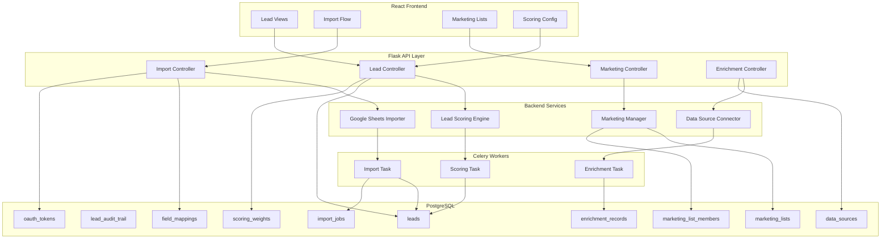
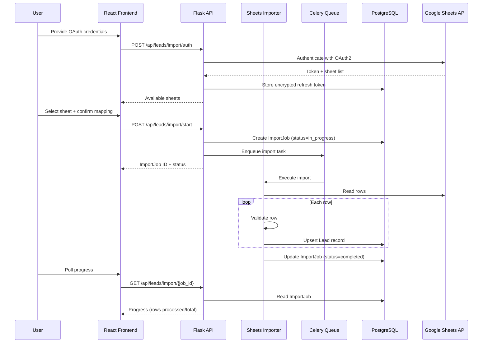

# Design Document: Lead Database Integration

## Overview

This design extends the existing Real Estate Analysis Platform to support importing, storing, scoring, enriching, and marketing property leads from Google Sheets. The platform currently handles property analysis workflows (comparable sales, valuation, scenarios). This feature adds a parallel lead management pipeline that connects to the existing analysis workflow.

The system introduces six new backend services, a set of new PostgreSQL tables, new REST API endpoints, and corresponding React frontend views. All long-running operations (imports, bulk scoring, bulk enrichment) run asynchronously via the existing Celery task queue.

### Key Design Decisions

1. **Reuse existing infrastructure**: Flask/SQLAlchemy/Celery/PostgreSQL stack — no new frameworks.
2. **Separate domain boundary**: Lead management models and services live alongside but are decoupled from the existing analysis models. The only integration point is a foreign key from `AnalysisSession` to `Lead`.
3. **Google Sheets API via service account or OAuth2**: The platform already has `google-api-python-client` in requirements.txt. We extend this with secure token storage.
4. **Upsert-based imports**: Property address is the deduplication key. Subsequent imports update existing records rather than creating duplicates.
5. **Plugin-based enrichment**: External data source connectors follow a registry pattern so new sources can be added without modifying core code.

## Architecture



### Request Flow: Google Sheets Import



## Components and Interfaces

### Backend Services

#### 1. GoogleSheetsImporter (`backend/app/services/google_sheets_importer.py`)

Handles OAuth2 authentication, sheet discovery, row reading, validation, and upsert logic.

```python
class GoogleSheetsImporter:
    def authenticate(self, credentials: dict) -> AuthResult
    def list_sheets(self, spreadsheet_id: str, token: OAuthToken) -> list[SheetInfo]
    def read_headers(self, spreadsheet_id: str, sheet_name: str, token: OAuthToken) -> list[str]
    def auto_map_fields(self, headers: list[str]) -> FieldMapping
    def start_import(self, job_config: ImportJobConfig) -> ImportJob
    def process_import(self, job_id: int) -> ImportResult  # Celery task entry point
    def validate_row(self, row: dict, field_mapping: FieldMapping) -> ValidationResult
    def upsert_lead(self, validated_data: dict) -> Lead
```

#### 2. LeadScoringEngine (`backend/app/services/lead_scoring_engine.py`)

Computes a 0–100 score for each lead based on configurable weighted criteria.

```python
class LeadScoringEngine:
    def compute_score(self, lead: Lead, weights: ScoringWeights) -> float
    def score_property_characteristics(self, lead: Lead, weight: float) -> float
    def score_data_completeness(self, lead: Lead, weight: float) -> float
    def score_owner_situation(self, lead: Lead, weight: float) -> float
    def score_location_desirability(self, lead: Lead, weight: float) -> float
    def bulk_rescore(self, lead_ids: list[int], weights: ScoringWeights) -> int  # Celery task
    def get_weights(self, user_id: str) -> ScoringWeights
    def update_weights(self, user_id: str, weights: ScoringWeights) -> ScoringWeights
```

#### 3. DataSourceConnector (`backend/app/services/data_source_connector.py`)

Plugin registry for external data sources. Each plugin implements a standard interface.

```python
class DataSourcePlugin:
    """Base class for external data source plugins."""
    name: str
    def lookup(self, address: str, owner_name: str) -> EnrichmentData | None

class DataSourceConnector:
    def register_source(self, plugin: DataSourcePlugin) -> None
    def enrich_lead(self, lead_id: int, source_name: str) -> EnrichmentRecord
    def bulk_enrich(self, lead_ids: list[int], source_name: str) -> list[EnrichmentRecord]  # Celery task
    def list_sources(self) -> list[DataSourceInfo]
```

#### 4. MarketingManager (`backend/app/services/marketing_manager.py`)

Manages marketing lists, membership, and outreach status tracking.

```python
class MarketingManager:
    def create_list(self, name: str, user_id: str, filter_criteria: dict | None) -> MarketingList
    def rename_list(self, list_id: int, name: str) -> MarketingList
    def delete_list(self, list_id: int) -> None
    def add_leads(self, list_id: int, lead_ids: list[int]) -> int
    def remove_leads(self, list_id: int, lead_ids: list[int]) -> int
    def update_outreach_status(self, list_id: int, lead_id: int, status: OutreachStatus) -> None
    def get_list_members(self, list_id: int, page: int, per_page: int) -> PaginatedResult
    def create_list_from_filters(self, name: str, user_id: str, filters: dict) -> MarketingList
```

### API Endpoints

#### Lead Management (`/api/leads/`)

| Method | Path | Description |
|--------|------|-------------|
| GET | `/api/leads/` | List leads with pagination, filtering, sorting |
| GET | `/api/leads/{lead_id}` | Get lead detail with score, enrichment, analysis links |
| POST | `/api/leads/{lead_id}/analyze` | Start analysis session from lead |
| GET | `/api/leads/scoring/weights` | Get current scoring weights |
| PUT | `/api/leads/scoring/weights` | Update scoring weights (triggers bulk rescore) |

#### Import (`/api/leads/import/`)

| Method | Path | Description |
|--------|------|-------------|
| POST | `/api/leads/import/auth` | Authenticate with Google OAuth2 |
| GET | `/api/leads/import/sheets` | List available sheets from spreadsheet |
| GET | `/api/leads/import/headers` | Read headers from selected sheet |
| POST | `/api/leads/import/mapping` | Save or update field mapping |
| POST | `/api/leads/import/start` | Start import job |
| GET | `/api/leads/import/jobs` | List import jobs |
| GET | `/api/leads/import/jobs/{job_id}` | Get import job status and progress |
| POST | `/api/leads/import/jobs/{job_id}/rerun` | Re-run a previous import |

#### Enrichment (`/api/leads/enrichment/`)

| Method | Path | Description |
|--------|------|-------------|
| GET | `/api/leads/enrichment/sources` | List registered data sources |
| POST | `/api/leads/{lead_id}/enrich` | Enrich a single lead |
| POST | `/api/leads/enrichment/bulk` | Bulk enrich leads in a marketing list |

#### Marketing Lists (`/api/leads/marketing/`)

| Method | Path | Description |
|--------|------|-------------|
| GET | `/api/leads/marketing/lists` | List marketing lists |
| POST | `/api/leads/marketing/lists` | Create marketing list |
| PUT | `/api/leads/marketing/lists/{list_id}` | Rename marketing list |
| DELETE | `/api/leads/marketing/lists/{list_id}` | Delete marketing list |
| GET | `/api/leads/marketing/lists/{list_id}/members` | Get list members with pagination |
| POST | `/api/leads/marketing/lists/{list_id}/members` | Add leads to list |
| DELETE | `/api/leads/marketing/lists/{list_id}/members` | Remove leads from list |
| PUT | `/api/leads/marketing/lists/{list_id}/members/{lead_id}/status` | Update outreach status |

### Frontend Components

| Component | Purpose |
|-----------|---------|
| `LeadListPage` | Paginated table of leads with filters, sort, score display |
| `LeadDetailPage` | Full lead detail with tabs: Info, Score, Enrichment, Marketing, Analysis |
| `ImportWizard` | Multi-step: Auth → Sheet Select → Field Mapping → Import Progress |
| `FieldMappingEditor` | Drag-and-drop or dropdown mapping of sheet columns to DB fields |
| `ScoringWeightsEditor` | Slider-based weight configuration with live preview |
| `MarketingListManager` | CRUD for lists, member management, outreach status tracking |
| `ImportHistoryTable` | Table of past imports with status, counts, re-run action |

## Data Models

### New Database Tables

#### `leads` table

```sql
CREATE TABLE leads (
    id SERIAL PRIMARY KEY,
    -- Property details
    property_address VARCHAR(500) NOT NULL,
    property_type VARCHAR(50),
    bedrooms INTEGER,
    bathrooms DECIMAL(3,1),
    square_footage INTEGER,
    lot_size INTEGER,
    year_built INTEGER,
    -- Owner information
    owner_name VARCHAR(255) NOT NULL,
    ownership_type VARCHAR(100),
    acquisition_date DATE,
    -- Contact information
    phone_1 VARCHAR(20),
    phone_2 VARCHAR(20),
    phone_3 VARCHAR(20),
    email_1 VARCHAR(255),
    email_2 VARCHAR(255),
    -- Mailing information
    mailing_address VARCHAR(500),
    mailing_city VARCHAR(100),
    mailing_state VARCHAR(50),
    mailing_zip VARCHAR(20),
    -- Scoring
    lead_score DECIMAL(5,2) DEFAULT 0,
    -- Metadata
    data_source VARCHAR(100),
    last_import_job_id INTEGER REFERENCES import_jobs(id),
    created_at TIMESTAMP NOT NULL DEFAULT CURRENT_TIMESTAMP,
    updated_at TIMESTAMP NOT NULL DEFAULT CURRENT_TIMESTAMP,
    -- Analysis link
    analysis_session_id INTEGER REFERENCES analysis_sessions(id),
    -- Constraints
    CONSTRAINT uq_leads_property_address UNIQUE (property_address)
);

CREATE INDEX idx_leads_owner_name ON leads(owner_name);
CREATE INDEX idx_leads_mailing_state ON leads(mailing_state);
CREATE INDEX idx_leads_mailing_zip ON leads(mailing_zip);
CREATE INDEX idx_leads_mailing_city ON leads(mailing_city);
CREATE INDEX idx_leads_lead_score ON leads(lead_score);
CREATE INDEX idx_leads_property_type ON leads(property_type);
CREATE INDEX idx_leads_created_at ON leads(created_at);
```

#### `lead_audit_trail` table

```sql
CREATE TABLE lead_audit_trail (
    id SERIAL PRIMARY KEY,
    lead_id INTEGER NOT NULL REFERENCES leads(id) ON DELETE CASCADE,
    field_name VARCHAR(100) NOT NULL,
    old_value TEXT,
    new_value TEXT,
    changed_by VARCHAR(100) NOT NULL,  -- 'import_job:{id}' or 'user:{id}' or 'enrichment:{id}'
    changed_at TIMESTAMP NOT NULL DEFAULT CURRENT_TIMESTAMP
);

CREATE INDEX idx_lead_audit_trail_lead_id ON lead_audit_trail(lead_id);
```

#### `import_jobs` table

```sql
CREATE TABLE import_jobs (
    id SERIAL PRIMARY KEY,
    user_id VARCHAR(255) NOT NULL,
    spreadsheet_id VARCHAR(255) NOT NULL,
    sheet_name VARCHAR(255) NOT NULL,
    field_mapping_id INTEGER REFERENCES field_mappings(id),
    status VARCHAR(20) NOT NULL DEFAULT 'pending',  -- pending, in_progress, completed, failed
    total_rows INTEGER DEFAULT 0,
    rows_processed INTEGER DEFAULT 0,
    rows_imported INTEGER DEFAULT 0,
    rows_skipped INTEGER DEFAULT 0,
    error_log JSONB DEFAULT '[]',
    started_at TIMESTAMP,
    completed_at TIMESTAMP,
    created_at TIMESTAMP NOT NULL DEFAULT CURRENT_TIMESTAMP
);

CREATE INDEX idx_import_jobs_user_id ON import_jobs(user_id);
CREATE INDEX idx_import_jobs_status ON import_jobs(status);
```

#### `field_mappings` table

```sql
CREATE TABLE field_mappings (
    id SERIAL PRIMARY KEY,
    user_id VARCHAR(255) NOT NULL,
    spreadsheet_id VARCHAR(255) NOT NULL,
    sheet_name VARCHAR(255) NOT NULL,
    mapping JSONB NOT NULL,  -- {"Sheet Column": "db_field", ...}
    created_at TIMESTAMP NOT NULL DEFAULT CURRENT_TIMESTAMP,
    updated_at TIMESTAMP NOT NULL DEFAULT CURRENT_TIMESTAMP,
    CONSTRAINT uq_field_mapping UNIQUE (user_id, spreadsheet_id, sheet_name)
);
```

#### `oauth_tokens` table

```sql
CREATE TABLE oauth_tokens (
    id SERIAL PRIMARY KEY,
    user_id VARCHAR(255) NOT NULL UNIQUE,
    encrypted_refresh_token BYTEA NOT NULL,
    token_expiry TIMESTAMP,
    created_at TIMESTAMP NOT NULL DEFAULT CURRENT_TIMESTAMP,
    updated_at TIMESTAMP NOT NULL DEFAULT CURRENT_TIMESTAMP
);
```

#### `scoring_weights` table

```sql
CREATE TABLE scoring_weights (
    id SERIAL PRIMARY KEY,
    user_id VARCHAR(255) NOT NULL UNIQUE,
    property_characteristics_weight DECIMAL(3,2) NOT NULL DEFAULT 0.30,
    data_completeness_weight DECIMAL(3,2) NOT NULL DEFAULT 0.20,
    owner_situation_weight DECIMAL(3,2) NOT NULL DEFAULT 0.30,
    location_desirability_weight DECIMAL(3,2) NOT NULL DEFAULT 0.20,
    created_at TIMESTAMP NOT NULL DEFAULT CURRENT_TIMESTAMP,
    updated_at TIMESTAMP NOT NULL DEFAULT CURRENT_TIMESTAMP
);
```

#### `data_sources` table

```sql
CREATE TABLE data_sources (
    id SERIAL PRIMARY KEY,
    name VARCHAR(100) NOT NULL UNIQUE,
    endpoint_url VARCHAR(500),
    config JSONB DEFAULT '{}',
    field_mapping JSONB DEFAULT '{}',
    is_active BOOLEAN NOT NULL DEFAULT TRUE,
    created_at TIMESTAMP NOT NULL DEFAULT CURRENT_TIMESTAMP
);
```

#### `enrichment_records` table

```sql
CREATE TABLE enrichment_records (
    id SERIAL PRIMARY KEY,
    lead_id INTEGER NOT NULL REFERENCES leads(id) ON DELETE CASCADE,
    data_source_id INTEGER NOT NULL REFERENCES data_sources(id),
    status VARCHAR(20) NOT NULL DEFAULT 'pending',  -- pending, success, failed, no_results
    retrieved_data JSONB,
    error_reason TEXT,
    created_at TIMESTAMP NOT NULL DEFAULT CURRENT_TIMESTAMP
);

CREATE INDEX idx_enrichment_records_lead_id ON enrichment_records(lead_id);
CREATE INDEX idx_enrichment_records_data_source_id ON enrichment_records(data_source_id);
```

#### `marketing_lists` table

```sql
CREATE TABLE marketing_lists (
    id SERIAL PRIMARY KEY,
    name VARCHAR(255) NOT NULL,
    user_id VARCHAR(255) NOT NULL,
    filter_criteria JSONB,
    created_at TIMESTAMP NOT NULL DEFAULT CURRENT_TIMESTAMP,
    updated_at TIMESTAMP NOT NULL DEFAULT CURRENT_TIMESTAMP
);

CREATE INDEX idx_marketing_lists_user_id ON marketing_lists(user_id);
```

#### `marketing_list_members` table

```sql
CREATE TABLE marketing_list_members (
    id SERIAL PRIMARY KEY,
    marketing_list_id INTEGER NOT NULL REFERENCES marketing_lists(id) ON DELETE CASCADE,
    lead_id INTEGER NOT NULL REFERENCES leads(id) ON DELETE CASCADE,
    outreach_status VARCHAR(20) NOT NULL DEFAULT 'not_contacted',
    -- not_contacted, contacted, responded, converted, opted_out
    added_at TIMESTAMP NOT NULL DEFAULT CURRENT_TIMESTAMP,
    status_updated_at TIMESTAMP,
    CONSTRAINT uq_list_member UNIQUE (marketing_list_id, lead_id)
);

CREATE INDEX idx_mlm_marketing_list_id ON marketing_list_members(marketing_list_id);
CREATE INDEX idx_mlm_lead_id ON marketing_list_members(lead_id);
CREATE INDEX idx_mlm_outreach_status ON marketing_list_members(outreach_status);
```

### SQLAlchemy Models

New models follow the existing pattern (see `PropertyFacts`, `AnalysisSession`):

- `Lead` — maps to `leads` table, includes relationship to `AnalysisSession`, `EnrichmentRecord`, `MarketingListMember`, `LeadAuditTrail`
- `LeadAuditTrail` — maps to `lead_audit_trail`
- `ImportJob` — maps to `import_jobs`, includes relationship to `FieldMapping`
- `FieldMapping` — maps to `field_mappings`
- `OAuthToken` — maps to `oauth_tokens`
- `ScoringWeights` — maps to `scoring_weights`
- `DataSource` — maps to `data_sources`
- `EnrichmentRecord` — maps to `enrichment_records`
- `MarketingList` — maps to `marketing_lists`, includes relationship to `MarketingListMember`
- `MarketingListMember` — maps to `marketing_list_members`

### Relationship to Existing Models

- `Lead.analysis_session_id` → `AnalysisSession.id` (nullable FK, set when user starts analysis from a lead)
- `AnalysisSession` gains a backref `lead` for reverse lookup
- No changes to existing analysis tables or models beyond adding the backref


## Correctness Properties

*A property is a characteristic or behavior that should hold true across all valid executions of a system — essentially, a formal statement about what the system should do. Properties serve as the bridge between human-readable specifications and machine-verifiable correctness guarantees.*

### Property 1: Auto-mapping correctness

*For any* list of Google Sheet column headers, the auto-mapping function should map every header that matches a known synonym to the correct Lead database field, and leave every header that does not match any known synonym unmapped.

**Validates: Requirements 2.2, 2.5**

### Property 2: Field mapping validation rejects incomplete mappings

*For any* field mapping configuration, the validation function should accept the mapping if and only if all required Lead database fields (property address, owner name) have a mapped source column.

**Validates: Requirements 2.3**

### Property 3: Field mapping persistence round-trip

*For any* valid field mapping, saving it to the database and then retrieving it by the same user ID, spreadsheet ID, and sheet name should return an equivalent mapping.

**Validates: Requirements 2.4**

### Property 4: Row validation correctness

*For any* row of data mapped through a field mapping, the row validation function should accept the row if and only if all required fields are present, all values conform to their expected data types, and no field exceeds its length constraint.

**Validates: Requirements 3.2**

### Property 5: Upsert deduplication preserves unique addresses

*For any* set of existing leads in the database and any batch of valid import rows, after upserting all rows, the number of leads in the database should equal the number of unique property addresses across both the existing leads and the import batch.

**Validates: Requirements 3.3, 8.4**

### Property 6: Import job count invariant

*For any* completed import job processing N rows, the sum of rows_imported and rows_skipped should equal total_rows, and total_rows should equal N.

**Validates: Requirements 3.5**

### Property 7: Audit trail records all field changes on update

*For any* lead and any update that changes one or more fields, the audit trail should contain one record per changed field with the correct old value, new value, and field name.

**Validates: Requirements 4.4**

### Property 8: Pagination consistency

*For any* set of leads and any valid page size, iterating through all pages should return every lead exactly once, with no duplicates and no omissions, and the total count should match the actual number of leads.

**Validates: Requirements 4.5**

### Property 9: Filter predicate correctness

*For any* set of leads and any combination of filter criteria (property type, city, state, zip, owner name, score range, marketing list), every lead in the filtered result should satisfy all specified filter predicates, and no lead satisfying all predicates should be excluded.

**Validates: Requirements 4.6**

### Property 10: Lead score is a bounded weighted sum

*For any* valid lead and any scoring weights that sum to 1.0, the computed lead score should equal the weighted sum of the sub-scores (property characteristics, data completeness, owner situation, location desirability), and the result should be between 0 and 100 inclusive.

**Validates: Requirements 5.1, 5.2**

### Property 11: Score sorting correctness

*For any* set of leads sorted by lead score in descending order, each lead's score should be greater than or equal to the next lead's score.

**Validates: Requirements 5.6**

### Property 12: Enrichment updates lead fields correctly

*For any* lead and any enrichment data returned from a data source, after successful enrichment the lead's fields should reflect the enrichment data, and an enrichment record with status "success" should exist linking the lead to the data source.

**Validates: Requirements 6.3**

### Property 13: Marketing list membership

*For any* lead and any N distinct marketing lists, adding the lead to all N lists should result in the lead appearing as a member of each of the N lists, and querying any of those lists should include that lead.

**Validates: Requirements 7.2, 7.3**

### Property 14: Filter-based list creation with opted-out exclusion

*For any* set of filter criteria and any set of leads where some have outreach status "opted_out" in any marketing list, creating a new marketing list from those filter criteria should include all leads matching the filters except those with "opted_out" status.

**Validates: Requirements 7.4, 7.7**

### Property 15: Outreach status persistence

*For any* lead in a marketing list and any valid outreach status value ("not_contacted", "contacted", "responded", "converted", "opted_out"), updating the outreach status should persist the new value, and querying the list member should return the updated status.

**Validates: Requirements 7.6**

### Property 16: Lead-to-analysis pre-population

*For any* lead with property details (address, property type, bedrooms, bathrooms, square footage, lot size, year built), creating an analysis session from that lead should produce a session whose subject property address and available property fields match the originating lead's data.

**Validates: Requirements 9.1**

## Error Handling

### Import Errors

| Error Condition | Handling Strategy |
|----------------|-------------------|
| Google OAuth2 authentication failure | Return descriptive error (expired token, invalid credentials, scope mismatch). Do not retry automatically. |
| Google Sheets API rate limit | Exponential backoff with max 3 retries. Log to ImportJob error_log. |
| Google Sheets API unavailable | Mark ImportJob as "failed" with error reason. Allow user to re-run. |
| Row validation failure | Skip row, log row number + error reason in ImportJob.error_log. Continue processing. |
| Duplicate address on insert | Use upsert logic (ON CONFLICT UPDATE). Not treated as an error. |
| Celery worker crash mid-import | ImportJob remains "in_progress". Provide a manual "mark as failed" action. Implement heartbeat check. |

### Scoring Errors

| Error Condition | Handling Strategy |
|----------------|-------------------|
| Missing fields for scoring | Score the available criteria, set missing sub-scores to 0. Log warning. |
| Invalid weight configuration (sum ≠ 1.0) | Reject weight update with validation error. Return 400. |
| Bulk rescore timeout | Process in batches of 500 leads. Track progress. Allow resume. |

### Enrichment Errors

| Error Condition | Handling Strategy |
|----------------|-------------------|
| External data source timeout | Create EnrichmentRecord with status "failed" and error reason. Leave lead unchanged. |
| External data source returns no results | Create EnrichmentRecord with status "no_results". Leave lead unchanged. |
| External data source returns invalid data | Create EnrichmentRecord with status "failed". Log malformed response. Leave lead unchanged. |
| Plugin not found | Return 404 with descriptive message. |

### API Errors

| Error Condition | Handling Strategy |
|----------------|-------------------|
| Lead not found | Return 404 with `{"error": "Lead not found", "message": "Lead {id} does not exist"}` |
| Marketing list not found | Return 404 with descriptive message. |
| Import job not found | Return 404 with descriptive message. |
| Invalid filter parameters | Return 400 with validation details. |
| Pagination out of range | Return empty results with correct total count. |
| Concurrent import for same spreadsheet | Return 409 Conflict. Only one active import per spreadsheet. |

### Token Security

- OAuth2 refresh tokens are encrypted using Fernet symmetric encryption before storage.
- Encryption key is stored in environment variable `OAUTH_ENCRYPTION_KEY`, not in the database.
- Tokens are decrypted only in memory during API calls, never logged or returned in API responses.

## Testing Strategy

### Unit Tests

Unit tests cover individual service methods with mocked dependencies:

- **GoogleSheetsImporter**: Mock Google API client. Test `validate_row`, `auto_map_fields`, `upsert_lead` with specific examples and edge cases (empty rows, max-length fields, special characters).
- **LeadScoringEngine**: Test `compute_score` with known inputs and expected outputs. Test boundary conditions (all fields empty → low score, all fields populated → high score).
- **DataSourceConnector**: Mock external sources. Test plugin registration, enrichment record creation, error handling.
- **MarketingManager**: Test CRUD operations, membership management, outreach status transitions, opted-out exclusion.
- **Field mapping validation**: Test required field checks, auto-mapping with various header formats.
- **Audit trail**: Test that updates generate correct audit records.

### Property-Based Tests

Property-based tests use the `hypothesis` library (already in `requirements.txt`) with a minimum of 100 iterations per property. Each test references its design document property.

| Property | Test Description | Tag |
|----------|-----------------|-----|
| P1 | Generate random header lists, verify auto-mapping | Feature: lead-database-integration, Property 1: Auto-mapping correctness |
| P2 | Generate random field mappings, verify validation | Feature: lead-database-integration, Property 2: Field mapping validation rejects incomplete mappings |
| P3 | Generate random mappings, save/load round-trip | Feature: lead-database-integration, Property 3: Field mapping persistence round-trip |
| P4 | Generate random row data, verify validation | Feature: lead-database-integration, Property 4: Row validation correctness |
| P5 | Generate random existing leads + import batch, verify unique count | Feature: lead-database-integration, Property 5: Upsert deduplication preserves unique addresses |
| P6 | Generate random import batches, verify count invariant | Feature: lead-database-integration, Property 6: Import job count invariant |
| P7 | Generate random lead updates, verify audit trail | Feature: lead-database-integration, Property 7: Audit trail records all field changes on update |
| P8 | Generate random lead sets + page sizes, verify pagination | Feature: lead-database-integration, Property 8: Pagination consistency |
| P9 | Generate random leads + filter criteria, verify predicate | Feature: lead-database-integration, Property 9: Filter predicate correctness |
| P10 | Generate random leads + weights, verify bounded weighted sum | Feature: lead-database-integration, Property 10: Lead score is a bounded weighted sum |
| P11 | Generate random scored leads, verify sort order | Feature: lead-database-integration, Property 11: Score sorting correctness |
| P12 | Generate random leads + enrichment data, verify update | Feature: lead-database-integration, Property 12: Enrichment updates lead fields correctly |
| P13 | Generate random leads + N lists, verify membership | Feature: lead-database-integration, Property 13: Marketing list membership |
| P14 | Generate random leads with opted-out status + filters, verify exclusion | Feature: lead-database-integration, Property 14: Filter-based list creation with opted-out exclusion |
| P15 | Generate random status updates, verify persistence | Feature: lead-database-integration, Property 15: Outreach status persistence |
| P16 | Generate random leads with property details, verify session pre-population | Feature: lead-database-integration, Property 16: Lead-to-analysis pre-population |

### Integration Tests

- **Google Sheets API**: Test with mocked Google API responses for auth flow, sheet listing, row reading.
- **Celery tasks**: Test that import, scoring, and enrichment tasks are enqueued and execute correctly.
- **API endpoints**: Test full request/response cycle for all new endpoints with test database.
- **Database migrations**: Test that migration creates all tables with correct constraints and indexes.

### Test Infrastructure

- Use `pytest` (existing) with `hypothesis` (existing) for property-based tests.
- Use `conftest.py` fixtures for test database setup, lead factories, and mock services.
- Use `unittest.mock` for Google API and external data source mocking.
- Each property test configured with `@settings(max_examples=100)`.
