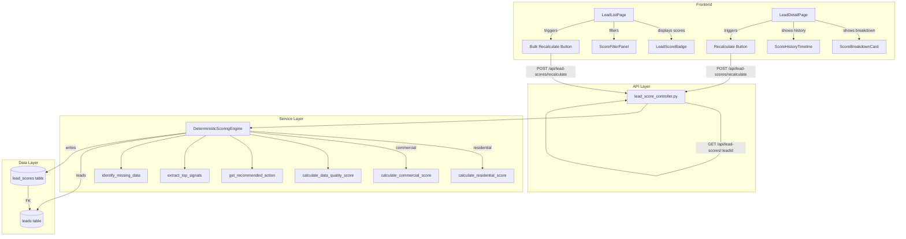
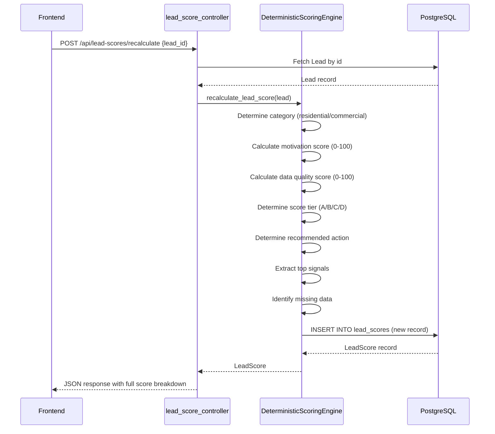

# Design Document: Lead Scoring Engine

## Overview

The Lead Scoring Engine is a deterministic, explainable scoring system that replaces the existing single-float `lead_score` on the Lead model with a richer, versioned scoring architecture. It computes separate scores for residential and commercial leads using point-based rules, stores full score breakdowns in a dedicated `lead_scores` table, tracks missing data, computes a data quality score, and recommends a next action for each lead.

The system is designed as a **new service** (`DeterministicScoringEngine`) alongside the existing `LeadScoringEngine`, with a new model (`LeadScore`), a new controller (`lead_score_bp`), and new frontend components. The existing scoring system remains untouched for backward compatibility.

### Key Design Decisions

1. **New table, not column updates** — Score records are append-only. Each recalculation creates a new row, preserving full history.
2. **Separate service file** — `deterministic_scoring_engine.py` lives alongside the old `lead_scoring_engine.py`. No modifications to existing code.
3. **Category-based dispatch** — The engine reads `lead.lead_category` to select residential vs. commercial scoring logic.
4. **Pure functions for scoring** — All scoring functions are pure (no DB access), making them trivially testable with Hypothesis.
5. **JSONB for flexibility** — `score_details`, `top_signals`, and `missing_data` use JSONB columns to accommodate future scoring dimensions without schema changes.

## Architecture



### Data Flow: Score Recalculation



## Components and Interfaces

### Backend Components

#### 1. Model: `LeadScore` (`backend/app/models/lead_score.py`)

SQLAlchemy model for the `lead_scores` table. One-to-many relationship with `Lead` (a lead has many score records over time).

#### 2. Service: `DeterministicScoringEngine` (`backend/app/services/deterministic_scoring_engine.py`)

Pure scoring logic with no side effects in the computation functions. DB interaction is isolated to `recalculate_*` methods.

**Public Interface:**

```python
class DeterministicScoringEngine:
    # Core scoring
    def calculate_residential_score(self, lead: Lead) -> dict:
        """Returns {total_score, score_details, score_version}"""

    def calculate_commercial_score(self, lead: Lead) -> dict:
        """Returns {total_score, score_details, score_version}"""

    # Data quality
    def calculate_data_quality_score(self, lead: Lead) -> tuple[float, list[str]]:
        """Returns (data_quality_score, missing_data_fields)"""

    # Action recommendation
    def get_recommended_action(self, lead: Lead, total_score: float, data_quality_score: float, score_tier: str) -> str:
        """Returns one of the allowed action strings"""

    # Signals
    def extract_top_signals(self, score_details: dict) -> list[dict]:
        """Returns top contributing dimensions sorted by points desc"""

    # Tier calculation
    def calculate_score_tier(self, total_score: float) -> str:
        """Returns 'A', 'B', 'C', or 'D'"""

    # Orchestration (DB-touching)
    def recalculate_lead_score(self, lead: Lead) -> 'LeadScore':
        """Compute and persist a new LeadScore record"""

    def recalculate_all_lead_scores(self) -> int:
        """Recalculate all leads, returns count"""

    def recalculate_by_source_type(self, source_type: str) -> int:
        """Recalculate leads matching source_type, returns count"""
```

#### 3. Controller: `lead_score_bp` (`backend/app/controllers/lead_score_controller.py`)

Flask Blueprint registered at `/api/lead-scores`.

**Endpoints:**

| Method | Path | Description |
|--------|------|-------------|
| GET | `/api/lead-scores/<lead_id>` | Get latest score + history for a lead |
| POST | `/api/lead-scores/recalculate` | Recalculate score(s) — accepts `lead_id`, `source_type`, or `all=true` |

### Frontend Components

#### 1. `LeadScoreBadge` — Compact score tier badge (color-coded A/B/C/D)
#### 2. `ScoreBreakdownCard` — Full score details with dimension breakdown
#### 3. `ScoreHistoryTimeline` — Chronological list of past scores
#### 4. `ScoreFilterPanel` — Filter controls for score tier, action, data quality, missing data
#### 5. `RecalculateButton` — Triggers single or bulk recalculation

### Frontend Types (additions to `frontend/src/types/index.ts`)

```typescript
export interface LeadScoreRecord {
  id: number
  lead_id: number
  score_version: string
  total_score: number
  score_tier: 'A' | 'B' | 'C' | 'D'
  data_quality_score: number
  recommended_action: RecommendedAction
  top_signals: ScoreSignal[]
  score_details: Record<string, number>
  missing_data: string[]
  created_at: string
}

export type RecommendedAction =
  | 'review_now'
  | 'enrich_data'
  | 'mail_ready'
  | 'call_ready'
  | 'valuation_needed'
  | 'suppress'
  | 'nurture'
  | 'needs_manual_review'

export interface ScoreSignal {
  dimension: string
  points: number
}

export interface LeadScoreResponse {
  latest: LeadScoreRecord
  history: LeadScoreRecord[]
}

export interface RecalculateRequest {
  lead_id?: number
  source_type?: string
  all?: boolean
}

export interface RecalculateResponse {
  success: boolean
  message: string
  score?: LeadScoreRecord
  count?: number
}
```

### Frontend API Methods (additions to `frontend/src/services/api.ts`)

```typescript
export const leadScoreService = {
  getLeadScore: (leadId: number) => api.get<LeadScoreResponse>(`/lead-scores/${leadId}`),
  recalculate: (params: RecalculateRequest) => api.post<RecalculateResponse>('/lead-scores/recalculate', params),
}
```

## Data Models

### `lead_scores` Table Schema

| Column | Type | Constraints | Description |
|--------|------|-------------|-------------|
| id | Integer | PK, auto-increment | Primary key |
| lead_id | Integer | FK → leads.id, NOT NULL, indexed | Reference to scored lead |
| property_id | Integer | Nullable | Optional property reference (future use) |
| score_version | String(50) | NOT NULL | Algorithm identifier (e.g., `residential_v1_internal_data`) |
| total_score | Float | NOT NULL | Composite motivation score 0-100 |
| score_tier | String(1) | NOT NULL | A, B, C, or D |
| data_quality_score | Float | NOT NULL | Data completeness score 0-100 |
| recommended_action | String(50) | NOT NULL | One of the allowed action values |
| top_signals | JSONB | NOT NULL, default [] | Top contributing dimensions |
| score_details | JSONB | NOT NULL, default {} | Full point breakdown by dimension |
| missing_data | JSONB | NOT NULL, default [] | List of missing field names |
| created_at | DateTime | NOT NULL, default now() | When this score was computed |

### SQLAlchemy Model

```python
class LeadScore(db.Model):
    __tablename__ = 'lead_scores'

    id = db.Column(db.Integer, primary_key=True)
    lead_id = db.Column(db.Integer, db.ForeignKey('leads.id'), nullable=False, index=True)
    property_id = db.Column(db.Integer, nullable=True)
    score_version = db.Column(db.String(50), nullable=False)
    total_score = db.Column(db.Float, nullable=False)
    score_tier = db.Column(db.String(1), nullable=False)
    data_quality_score = db.Column(db.Float, nullable=False)
    recommended_action = db.Column(db.String(50), nullable=False)
    top_signals = db.Column(db.JSON, nullable=False, default=list)
    score_details = db.Column(db.JSON, nullable=False, default=dict)
    missing_data = db.Column(db.JSON, nullable=False, default=list)
    created_at = db.Column(db.DateTime, nullable=False, default=datetime.utcnow)

    # Relationships
    lead = db.relationship('Lead', backref=db.backref('score_records', lazy='dynamic', order_by='LeadScore.created_at.desc()'))
```

### Alembic Migration

New migration file: `backend/alembic_migrations/versions/b2c3d4e5f6g7_add_lead_scores_table.py`

```python
def upgrade():
    op.create_table(
        'lead_scores',
        sa.Column('id', sa.Integer(), primary_key=True),
        sa.Column('lead_id', sa.Integer(), sa.ForeignKey('leads.id'), nullable=False),
        sa.Column('property_id', sa.Integer(), nullable=True),
        sa.Column('score_version', sa.String(50), nullable=False),
        sa.Column('total_score', sa.Float(), nullable=False),
        sa.Column('score_tier', sa.String(1), nullable=False),
        sa.Column('data_quality_score', sa.Float(), nullable=False),
        sa.Column('recommended_action', sa.String(50), nullable=False),
        sa.Column('top_signals', postgresql.JSONB(), nullable=False, server_default='[]'),
        sa.Column('score_details', postgresql.JSONB(), nullable=False, server_default='{}'),
        sa.Column('missing_data', postgresql.JSONB(), nullable=False, server_default='[]'),
        sa.Column('created_at', sa.DateTime(), nullable=False, server_default=sa.func.now()),
    )
    op.create_index('ix_lead_scores_lead_id', 'lead_scores', ['lead_id'])
    op.create_index('ix_lead_scores_created_at', 'lead_scores', ['created_at'])
    op.create_index('ix_lead_scores_score_tier', 'lead_scores', ['score_tier'])

def downgrade():
    op.drop_table('lead_scores')
```

### Scoring Dimension Definitions

#### Residential Scoring (`residential_v1_internal_data`, max 100 points)

| Dimension | Max Points | Logic |
|-----------|-----------|-------|
| property_type_fit | 20 | Multi-family/2-4 unit = 20, SFR = 10, other = 5, missing = 0 |
| neighborhood_fit | 15 | Based on property_city/zip matching target neighborhoods (configurable list, default: all get 8) |
| unit_count_fit | 15 | 2-4 units = 15, 5+ = 10, 1 unit = 5, missing = 0 |
| absentee_owner | 10 | Mailing address ≠ property address = 10, same/missing = 0 |
| owner_mailing_quality | 10 | Has full mailing address (street+city+state+zip) = 10, partial = 5, none = 0 |
| years_owned | 10 | 10+ years = 10, 5-9 years = 7, 2-4 years = 4, <2 years = 2, missing = 0 |
| existing_notes_motivation | 10 | Contains motivation keywords = 10, has notes but no keywords = 3, no notes = 0 |
| manual_priority | 10 | Based on user-assigned priority (future field, default 0) |

#### Commercial Scoring (`commercial_v1_internal_data`, max 100 points)

| Dimension | Max Points | Logic |
|-----------|-----------|-------|
| property_type_fit | 20 | Commercial/mixed-use = 20, multi-family 5+ = 15, other = 5, missing = 0 |
| condo_clarity | 20 | likely_not_condo = 20, unknown = 10, partial_condo_possible = 5, needs_review = 2, likely_condo = 0 |
| building_sale_possible | 15 | yes = 15, maybe = 8, no = 0, unknown = 5 |
| neighborhood_fit | 10 | Same logic as residential but max 10 |
| owner_concentration | 10 | 1 owner at address = 10, 2 = 7, 3-4 = 4, 5+ = 2 |
| absentee_owner | 10 | Same logic as residential |
| building_size_fit | 5 | Has sqft data and >= 2000 sqft = 5, has sqft < 2000 = 3, missing = 0 |
| existing_notes_motivation | 5 | Same logic as residential but max 5 |
| manual_priority | 5 | Same logic as residential but max 5 |

#### Data Quality Scoring (max 100 points, both categories)

| Field Check | Points |
|-------------|--------|
| has_pin (county_assessor_pin) | 20 |
| has_property_address (property_street) | 15 |
| has_normalized_address (property_street normalized) | 10 |
| has_owner_name (owner_first_name or owner_last_name) | 15 |
| has_owner_mailing_address (mailing_address) | 15 |
| has_property_type_or_assessor_class (property_type) | 10 |
| has_estimated_unit_count_or_building_size (units or square_footage) | 10 |
| has_source_reference (source or data_source) | 5 |

#### Recommended Action Decision Tree

```
IF lead has do_not_contact flag → "suppress"
ELSE IF lead_category == "commercial" AND condo_risk_status == "likely_condo" → "suppress"
ELSE IF lead_category == "commercial" AND condo_risk_status == "needs_review" → "needs_manual_review"
ELSE IF score_tier == "A" AND data_quality_score >= 70 → "mail_ready"
ELSE IF score_tier == "A" AND data_quality_score < 70 → "enrich_data"
ELSE IF score_tier == "B" AND data_quality_score >= 70 → "review_now"
ELSE IF score_tier == "B" AND data_quality_score < 70 → "enrich_data"
ELSE IF score_tier == "C" → "nurture"
ELSE IF score_tier == "D" → "suppress"
```


## Correctness Properties

*A property is a characteristic or behavior that should hold true across all valid executions of a system — essentially, a formal statement about what the system should do. Properties serve as the bridge between human-readable specifications and machine-verifiable correctness guarantees.*

### Property 1: Score Details Sum Equals Total Score

*For any* valid lead (residential or commercial), the sum of all values in `score_details` SHALL equal `total_score` (within floating-point tolerance of 0.01).

**Validates: Requirements 14.4, 2.10, 3.7**

### Property 2: Residential Scoring Invariants

*For any* residential lead, the scoring engine SHALL produce a result where: (a) `score_version` equals `"residential_v1_internal_data"`, (b) `total_score` is in [0, 100], (c) `score_details` contains exactly the keys `property_type_fit`, `neighborhood_fit`, `unit_count_fit`, `absentee_owner`, `owner_mailing_quality`, `years_owned`, `existing_notes_motivation`, `manual_priority`, and (d) each dimension value is within [0, its defined maximum].

**Validates: Requirements 2.1, 2.2, 2.10**

### Property 3: Commercial Scoring Invariants

*For any* commercial lead, the scoring engine SHALL produce a result where: (a) `score_version` equals `"commercial_v1_internal_data"`, (b) `total_score` is in [0, 100], (c) `score_details` contains exactly the keys `property_type_fit`, `condo_clarity`, `building_sale_possible`, `neighborhood_fit`, `owner_concentration`, `absentee_owner`, `building_size_fit`, `existing_notes_motivation`, `manual_priority`, and (d) each dimension value is within [0, its defined maximum].

**Validates: Requirements 3.1, 3.2, 3.7**

### Property 4: Data Quality Score Correctness

*For any* lead, the `data_quality_score` SHALL equal the sum of points for fields that are present and non-empty (from the defined field-to-points mapping), and SHALL always be in [0, 100].

**Validates: Requirements 4.1, 4.2, 4.3, 4.4**

### Property 5: Missing Data Detection Correctness

*For any* lead, the `missing_data` array SHALL contain exactly those field names from the checked set that are null or empty on the lead record, and SHALL NOT contain any field that is present and non-empty.

**Validates: Requirements 5.1, 5.2, 5.3**

### Property 6: Tier Assignment Correctness

*For any* total_score in [0, 100], `calculate_score_tier` SHALL return "A" when score is in [75, 100], "B" when in [60, 75), "C" when in [40, 60), and "D" when in [0, 40).

**Validates: Requirements 1.2**

### Property 7: Recommended Action Validity and Decision Tree

*For any* lead with a computed total_score, data_quality_score, and score_tier, the `get_recommended_action` function SHALL return a value from the allowed set {review_now, enrich_data, mail_ready, call_ready, valuation_needed, suppress, nurture, needs_manual_review}, and SHALL follow the priority ordering: do_not_contact overrides → commercial condo overrides → tier-based logic.

**Validates: Requirements 1.3, 6.1, 6.2, 6.3, 6.4, 6.5, 6.6, 6.7, 6.8, 6.9, 6.10**

### Property 8: Top Signals Extraction Correctness

*For any* score_details dictionary, `extract_top_signals` SHALL return a list that: (a) is ordered by points descending, (b) contains no entries with zero points, (c) has length equal to min(3, count of non-zero dimensions) or greater, and (d) every entry's dimension exists in score_details.

**Validates: Requirements 7.1, 7.2, 7.3, 7.4**

### Property 9: Scoring Determinism

*For any* lead, calling the scoring function twice with identical input data SHALL produce identical `total_score`, `score_details`, `data_quality_score`, `score_tier`, `recommended_action`, `top_signals`, and `missing_data`.

**Validates: Requirements 14.1**

### Property 10: Category-Based Algorithm Dispatch

*For any* lead, the scoring engine SHALL use `calculate_residential_score` when `lead_category` is "residential" and `calculate_commercial_score` when `lead_category` is "commercial", as evidenced by the `score_version` field in the output.

**Validates: Requirements 8.4, 8.5**

## Error Handling

### API Layer Errors

| Scenario | HTTP Status | Response |
|----------|-------------|----------|
| Invalid request body (missing required fields) | 400 | `{"error": "Validation error", "message": "..."}` |
| lead_id not found | 404 | `{"error": "Lead not found", "message": "Lead {id} does not exist"}` |
| No recalculation target specified | 400 | `{"error": "Validation error", "message": "Must specify lead_id, source_type, or all=true"}` |
| Database error during scoring | 500 | `{"error": "Internal server error", "message": "An unexpected error occurred"}` |
| Rate limit exceeded | 429 | `{"error": "Rate limit exceeded", "message": "..."}` |

### Service Layer Error Handling

- **Missing lead_category**: If a lead has no `lead_category` set, default to "residential" scoring.
- **Invalid field values**: Scoring functions treat unexpected/invalid field values as missing (award 0 points for that dimension).
- **Bulk recalculation failures**: If scoring fails for an individual lead during bulk recalculation, log the error and continue with the next lead. Return the count of successfully scored leads.
- **Database write failures**: If the INSERT for a LeadScore record fails, raise the exception to the controller layer for proper HTTP error response.

### Frontend Error Handling

- **Network errors**: Display toast notification with retry option.
- **404 on score fetch**: Display "Not scored" state in UI.
- **Bulk recalculation timeout**: Show progress indicator; poll for completion if the request times out.
- **Stale data**: React Query invalidates score cache after successful recalculation.

## Testing Strategy

### Property-Based Tests (Hypothesis)

The scoring engine's pure functions are ideal for property-based testing. Each correctness property maps to a Hypothesis test with a minimum of 100 iterations.

**Library**: Hypothesis (already in project dependencies)

**Test file**: `backend/tests/test_deterministic_scoring_engine.py`

**Configuration**:
- `@settings(max_examples=100)` minimum per property test
- Custom strategies for generating Lead-like objects with realistic field distributions

**Property test mapping**:

| Property | Test Function | Strategy |
|----------|--------------|----------|
| Property 1 | `test_score_details_sum_equals_total` | Generate random leads (both categories) |
| Property 2 | `test_residential_scoring_invariants` | Generate random residential leads |
| Property 3 | `test_commercial_scoring_invariants` | Generate random commercial leads |
| Property 4 | `test_data_quality_score_correctness` | Generate random field presence combinations |
| Property 5 | `test_missing_data_detection` | Generate random field presence combinations |
| Property 6 | `test_tier_assignment` | Generate random floats [0, 100] |
| Property 7 | `test_recommended_action_validity` | Generate random (tier, dq_score, lead_category, condo_status) tuples |
| Property 8 | `test_top_signals_extraction` | Generate random score_details dicts |
| Property 9 | `test_scoring_determinism` | Generate random leads, score twice |
| Property 10 | `test_category_dispatch` | Generate random leads with category |

**Tag format**: Each test is tagged with a comment:
```python
# Feature: lead-scoring-engine, Property 1: Score details sum equals total score
```

### Unit Tests (pytest)

Unit tests cover specific examples, edge cases, and integration points:

- **Edge cases**: Lead with all fields null, lead with all fields populated, boundary scores (0, 39, 40, 59, 60, 74, 75, 100)
- **Specific dimension logic**: Verify exact point values for known inputs (e.g., property_type "multi_family" → 20 points)
- **Motivation keywords**: Test specific keyword detection in notes
- **Absentee owner detection**: Test address comparison edge cases (case sensitivity, whitespace)
- **API endpoint tests**: Test controller responses for valid/invalid requests (using Flask test client)

### Integration Tests

- **Bulk recalculation**: Create leads in test DB, run bulk recalculate, verify correct number of records created
- **Score history**: Score a lead multiple times, verify GET endpoint returns all records in order
- **Filter endpoints**: Verify lead list filtering by score_tier, recommended_action, missing_data

### Frontend Tests (Vitest + React Testing Library)

- **Component rendering**: Verify LeadScoreBadge renders correct colors, ScoreBreakdownCard shows all dimensions
- **Filter interactions**: Verify ScoreFilterPanel emits correct filter values
- **API integration**: Mock API responses, verify components display data correctly
- **Loading states**: Verify loading indicators during recalculation
