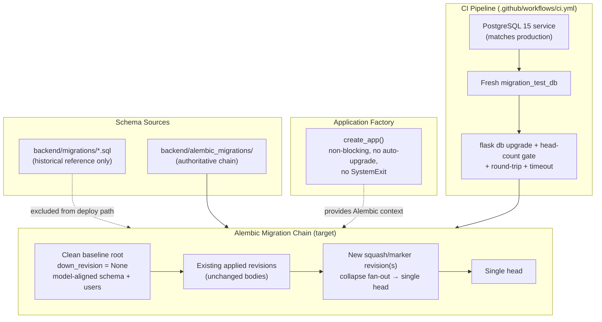
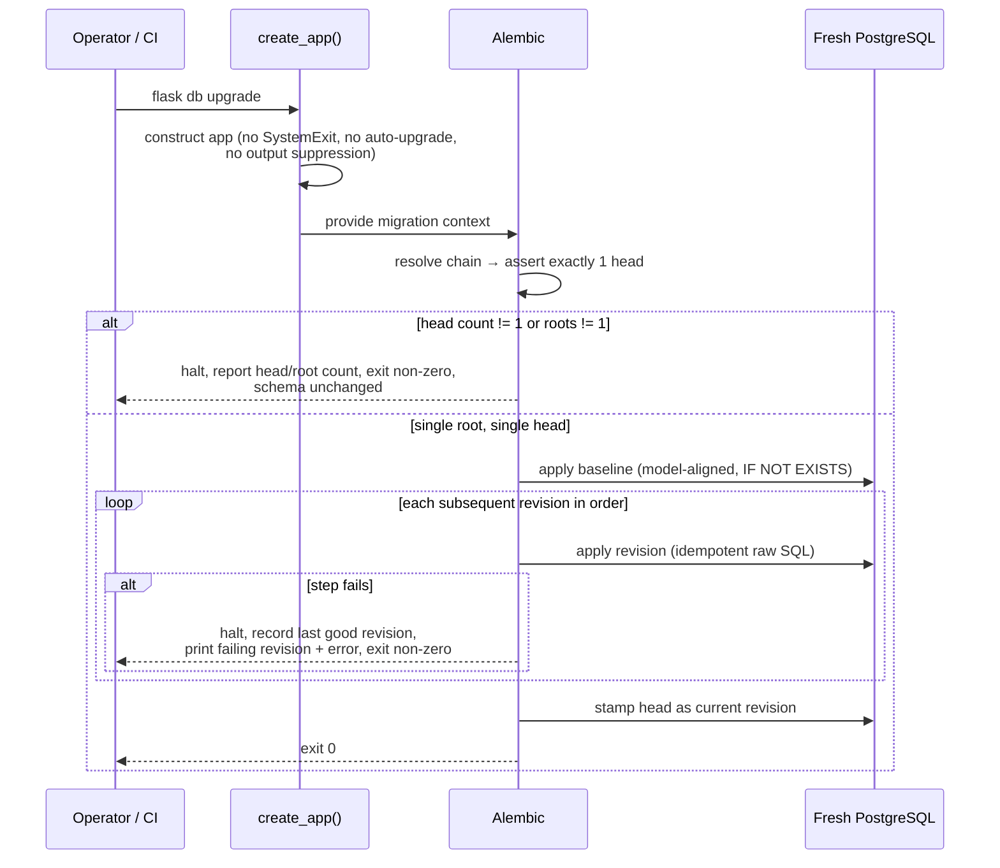

# Design Document

## Overview

The migration system today has three structural defects that make every deploy unpredictable:

1. **Split schema sources.** The schema lives in two places — three raw SQL files in `backend/migrations/` (`001_create_schema.sql`, `002_lead_management.sql`, `003_add_lead_category.sql`) applied manually outside Alembic, and the Alembic chain in `backend/alembic_migrations/` that *assumes* those raw files already ran. There is no single source of truth.
2. **A fragile second root.** `267725fe7017_baseline_schema` was authored to run *after* `000000000000_initial_schema` and mutate it — it renames enum types (`property_type` → `propertytype`), casts `TEXT[]`/`JSONB` columns to `JSON`, and uses `batch_alter_table`. These statements only succeed against a database already in a specific mutated state and fail on a fresh PostgreSQL database. The chain also fans out into several branches that are stitched back together by no-op `merge_heads` revisions.
3. **A blocking, process-terminating app factory.** `create_app()` runs `SystemExit` guards (`_validate_and_log_database_url`, the `SECRET_KEY` check) and an auto-`upgrade()` as startup side effects. When `flask db upgrade` imports the app to get the Alembic context, these guards can terminate the process before the migration command produces any output.

On top of this, local and CI tests run against **SQLite in-memory**, so PostgreSQL-specific failures (named enum types, array/JSONB casts) are never caught before production. CI does include a `migration_test_db` smoke step, but the chain it validates still contains the fragile baseline revision.

This design moves the system to a single, deployable, verifiable contract:

- **One authoritative schema source** — the Alembic chain alone produces the complete schema on a fresh database, with zero manual SQL.
- **A single linear chain** — exactly one root (`down_revision = None`) and exactly one head.
- **A clean-baseline (squash) strategy** that *adds* new revision files without rewriting any revision already applied to production, reconciling the consolidation goal with the steering rule "do not rewrite existing migration files."
- **A non-blocking app factory** that constructs cleanly under migration commands without `SystemExit` or auto-`upgrade()`.
- **CI that validates the real production engine** — PostgreSQL, fresh database, full chain, with a head-count and round-trip gate.

The work stays fully consistent with `.kiro/steering/migrations.md`: every new migration uses raw SQL with `IF NOT EXISTS`, enum creation guarded by `EXCEPTION WHEN duplicate_object`, no `batch_alter_table`, and `DROP ... IF EXISTS` downgrades.

### Research Notes and Key Findings

- **Current root topology.** `000000000000_initial_schema.py` has `down_revision = None` and already consolidates all three raw SQL files *plus* the `users` table using idempotent raw SQL (`CREATE TABLE IF NOT EXISTS`, `DO $$ ... EXCEPTION WHEN duplicate_object`, `CREATE INDEX IF NOT EXISTS`). This is the natural foundation for the clean baseline — the `users` table is *already* represented here (Requirement 4 is largely satisfied at the root). `267725fe7017_baseline_schema.py` has `down_revision = '000000000000'` and is the fragile, fresh-DB-hostile revision that must be neutralized.
- **The "two roots" problem is really a "fragile second baseline" problem.** Alembic resolves a single root today (`000000000000`), but `267725fe7017` behaves like a second baseline that only works from a mutated state. The squash strategy targets *both* the head fan-out (merge revisions) and the fragile retype step.
- **Enum naming divergence.** `000000000000` creates lowercase-named enums (`property_type`, values `single_family`), while the SQLAlchemy models expect PascalCase-named enums (`propertytype`, values `SINGLE_FAMILY`). `267725fe7017` is what bridges the two. The clean baseline must create the **model-aligned** enum types directly so no retype step is needed on a fresh database.
- **Idempotency tooling already exists.** `backend/scripts/lint_migrations.py` statically lints migrations for dangerous patterns and maintains `_INITIAL_SCHEMA_TABLES`. CI already runs it. The design extends this tooling rather than inventing new tooling.
- **CI already provisions PostgreSQL 15** as a service and runs a `flask db upgrade` smoke test against a dedicated `migration_test_db`. Production runs PostgreSQL (the VPS). The design hardens this existing job (head-count gate, round-trip, timeout, no-SQLite assertion) rather than adding a parallel pipeline.
- **`down_revision` as tuple.** `e5f6g7h8i9j0_merge_heads.py` uses a tuple `down_revision` to merge four branches. The single-head invariant must tolerate legitimate historical merge revisions while guaranteeing the *current* head count is exactly 1.

## Architecture

### Components in scope



### Migration command flow (fresh database)



### Design decisions and rationale

| Decision | Rationale | Alternatives rejected |
|---|---|---|
| **Clean-baseline by adding revisions, not editing** | Production databases are already at the current head. Rewriting `000000000000` or `267725fe7017` would change applied revision bodies and break the chain for existing databases (violates steering rule and Req 9.1). | Rewrite existing baseline in place — breaks production. |
| **Create model-aligned enum types in the baseline** | Eliminates the fragile `267725fe7017` retype-on-mutated-state step for *fresh* databases. The fresh path never needs to rename an enum. | Keep the retype step — fails on fresh DB (the core bug). |
| **Neutralize `267725fe7017` for fresh DBs via guarded, conditional SQL** | The revision must remain in the chain (production has applied it) but must become a safe no-op when the target schema already matches model-aligned types. Guards (`IF EXISTS`, `information_schema`/`pg_type` checks) make it idempotent and fresh-safe. | Delete the file — breaks production chain continuity. |
| **Single squash/marker head revision** | Collapses the branch fan-out to one unambiguous head so `flask db upgrade` resolves one target (Req 7). | Leave multiple `merge_heads` revisions — works but leaves ambiguity risk; the gate still enforces count = 1. |
| **Move blocking guards out of the migration construction path** | `flask db upgrade` must produce output and finish (Req 5). Guards that call `SystemExit` or auto-`upgrade()` abort it. | Keep guards — reproduces the original failure. |
| **Gate head count and round-trip in CI** | Catches multi-head regressions and irreversible revisions before merge to `main` (Req 6, 7, 10). | Rely on runtime startup check only — too late, fires in production. |
| **Validate against PostgreSQL only, no SQLite substitution** | PostgreSQL-specific constructs (named enums, array/JSONB casts) are invisible under SQLite (Req 6.4). | Continue trusting SQLite test runs for migration correctness. |

### Clean-baseline (squash) strategy

The strategy reconciles "one authoritative, fresh-runnable schema" with "do not rewrite applied revisions":

1. **Designate the baseline.** `000000000000_initial_schema` remains the single root (`down_revision = None`). It is *augmented conceptually* by a documented baseline-replacement mapping rather than edited. Its body is already idempotent and already creates the `users` table.
2. **Make the fresh path self-sufficient.** The baseline must create the **model-aligned** enum types and column types directly so that no later revision has to retype them on a fresh database. Because `000000000000` is already applied in production with lowercase enum names, the model-aligned types are introduced by a **new** revision appended to the chain that performs guarded, idempotent conversions that are a no-op when the target type already matches (so fresh and existing databases converge to the same end state).
3. **Collapse the head fan-out.** Add a single new squash/marker revision whose `down_revision` points at the current single head, producing exactly one head. Historical merge revisions remain in place (their bodies unchanged).
4. **Document the replacement mapping.** A `MIGRATIONS.md` (or section in the existing `alembic_migrations/README`) lists, by revision identifier, every revision constituting the consolidated baseline and every prior revision it replaces, with no unmapped revision remaining (Req 9.3).
5. **Document the stamp path.** For an existing production database, document the exact `flask db stamp <revision>` command, the assumed starting revision, and the explicit statement that stamping changes only the recorded revision and applies no schema changes (Req 9.4).
6. **Reject unrecognized starting revisions.** The upgrade-path documentation and a guard revision halt before any schema change if the recorded revision is absent from the documented mapping (Req 9.5).

## Components and Interfaces

### 1. Clean baseline / consolidation revisions (`backend/alembic_migrations/versions/`)

**Responsibility:** Produce the complete, model-aligned schema on a fresh PostgreSQL database and collapse the chain to a single head, without modifying any applied revision file.

- **Root revision** (`000000000000_initial_schema`, unchanged body): `down_revision = None`. Creates all pre-Alembic tables, the `users` table, indexes, and enum types using idempotent raw SQL.
- **New model-alignment revision** (new file): converts enum types and column types to the model-aligned form using guarded, conditional SQL that is a no-op when the type already matches. Replaces the role `267725fe7017` played, but in a fresh-DB-safe way.
- **New squash/marker head revision** (new file): `down_revision = <current single head>`. Empty `upgrade()`/`downgrade()` or a thin guard; its purpose is to establish one unambiguous head and to host the documented baseline-replacement mapping in its docstring.

All new revisions follow the steering conventions:

```python
def upgrade():
    # tables
    op.execute("CREATE TABLE IF NOT EXISTS ... ")
    # enums
    op.execute("""
        DO $$ BEGIN
            CREATE TYPE propertytype AS ENUM ('SINGLE_FAMILY', 'MULTI_FAMILY', 'COMMERCIAL');
        EXCEPTION WHEN duplicate_object THEN NULL;
        END $$;
    """)
    # indexes
    op.execute("CREATE INDEX IF NOT EXISTS ... ")

def downgrade():
    op.execute("DROP INDEX IF EXISTS ... ")
    op.execute("DROP TABLE IF EXISTS ... ")
    op.execute("DROP TYPE IF EXISTS ... ")
```

### 2. Application factory (`backend/app/__init__.py`)

**Responsibility:** Construct a usable Flask app for migration commands without blocking, terminating the process, or suppressing command output.

Changes:

- **No auto-`upgrade()` in the migration path.** The development-only auto-`upgrade()` block is gated so it never runs when the process is a migration command (detected via `FLASK_APP`/CLI context or an explicit `KIRO_MIGRATION` / `FLASK_DB_COMMAND` guard env var). Migration commands rely on the operator running `flask db upgrade` explicitly.
- **No `SystemExit` during construction.** `_validate_and_log_database_url`, the `SECRET_KEY` guard, and `_assert_pool_pre_ping` are changed to raise standard exceptions (`RuntimeError` / a custom `ConfigurationError` extending `RealEstateAnalysisException`) whose message is preserved in command output, rather than calling `SystemExit`. Missing configuration is logged at error level and re-raised (Req 5.4).
- **No output suppression.** Construction must not reconfigure logging in a way that redirects or swallows the migration command's stdout (Req 5.5).
- **No destructive DB work at construction** (Req 5.3) and **completion within 5 seconds** with no input/prompt/indefinite waits (Req 5.6) — the Redis ping in `_warn_missing_optional_keys` is bounded by a short socket timeout and is skipped in the migration path.

Interface (conceptual):

```python
def create_app(config_name='development') -> Flask:
    # construct, init extensions, register blueprints
    # NO SystemExit, NO auto-upgrade when in migration context
    # raises ConfigurationError (preserved in output) on missing required config
    ...
```

### 3. Migration chain validation (single root / single head)

**Responsibility:** Guarantee exactly one root and exactly one head, halting before any schema change if violated.

- **Reusable validator** `assert_single_head_and_root()` (refactor of the existing `_assert_single_migration_head`) returns structured results: `head_count`, `head_revisions`, `root_count`, `root_revisions`. It does **not** call `SystemExit`; callers decide how to surface failures.
- **CLI/CI entry point** `scripts/check_migration_chain.py` (new): exits non-zero and prints the detected head/root count and each offending revision identifier when the count is not 1 (Req 1.6, 7.3).
- **Pre-upgrade guard:** the upgrade path invokes the validator before applying revisions; on violation it halts with the chain unchanged (Req 1.6).

### 4. CI pipeline (`.github/workflows/ci.yml`)

**Responsibility:** Validate the production engine and chain on every PR to `main`.

Hardening of the existing `backend` job:

- Run `python scripts/check_migration_chain.py` (head-count + root-count gate) **before** the upgrade smoke test; fail the run and report counts/revisions on violation (Req 7.2, 7.3).
- Keep the dedicated **fresh** `migration_test_db` that pytest never touches (Req 6.2), against **PostgreSQL 15** matching production major version (Req 6.1, 6.4).
- Wrap `flask db upgrade` with a **300-second timeout** (`timeout 300 flask db upgrade`); terminate and fail on timeout (Req 6.5).
- Add a **round-trip** step: `flask db upgrade` → `flask db downgrade base` → `flask db upgrade`, asserting exit 0 and a final empty-then-complete schema (Req 10.2, 10.3, 10.5).
- On any non-zero exit, fail the run, do not mark passed, and surface the failing revision and error output (Req 6.3). PR-to-`main` runs block merge on failure (Req 6.6).

### 5. Migration linter (`backend/scripts/lint_migrations.py`)

**Responsibility:** Static enforcement of the idempotency convention.

- Extend the existing linter to flag, as errors: `op.create_table` / `op.create_index` / `op.add_column` used in **new** baseline/consolidation revisions (Req 8.1, 8.3, 8.4), any `batch_alter_table` targeting PostgreSQL in new revisions (Req 8.5), enum creation without an `EXCEPTION WHEN duplicate_object` guard (Req 8.2), and any `upgrade()` lacking a corresponding `downgrade()` with `DROP ... IF EXISTS` (Req 8.6).
- Keep `_INITIAL_SCHEMA_TABLES` synchronized with the baseline so ALTERs against unknown tables are caught (existing behavior).

### 6. Deployment documentation

**Responsibility:** Specify `flask db upgrade` as the only schema step and remove all manual-SQL references.

- Update deploy docs (deploy workflow notes / runbook) so the documented schema step is **only** `flask db upgrade`, with no `psql`, no raw SQL files, and no manual statement (Req 3.5, 3.3).
- Add the `backend/migrations/README` (or header notice) marking the raw SQL files as **non-authoritative historical reference, not applied during deployment** (Req 1.4).
- Document the clean-baseline mapping, the `flask db stamp` command, and the unrecognized-revision halt behavior (Req 9.3, 9.4, 9.5).

## Data Models

This feature changes **how** the schema is built and validated; it does not add new application tables. The relevant "data models" are the migration-graph artifacts and the schema contract the chain must produce.

### Migration revision (Alembic)

| Field | Type | Constraint |
|---|---|---|
| `revision` | str | Unique identifier of the revision |
| `down_revision` | str \| tuple \| None | `None` for the single root; non-null single value for every other non-merge revision (Req 7.4, 7.5); tuple only for historical merge revisions |
| `branch_labels` | str \| None | Unused (single linear chain) |
| `upgrade()` | function | Idempotent raw SQL per steering convention |
| `downgrade()` | function | Corresponding `DROP ... IF EXISTS` (Req 8.6) |

### Chain invariants (validated contract)

| Invariant | Source requirement |
|---|---|
| Exactly one revision with `down_revision = None` | 1.5, 7.5 |
| Exactly one head revision | 7.1 |
| Every non-baseline revision links to exactly one immediate predecessor | 7.4 |
| Baseline creates all objects without referencing pre-existing types/tables | 2.5 |
| `users` table created by exactly one revision; FKs to `users` ordered after it | 4.1, 4.4, 4.5 |

### Schema contract (must be produced on a fresh database)

The full set of model tables under `backend/app/models/` — including the analysis pipeline (`analysis_sessions`, `property_facts`, `comparable_sales`, `ranked_comparables`, `valuation_results`, `comparable_valuations`, `scenarios`, `wholesale_scenarios`, `fix_flip_scenarios`, `buy_hold_scenarios`), lead management (`leads`, `lead_audit_trail`, `enrichment_records`, `import_jobs`, `field_mappings`, `oauth_tokens`, `scoring_weights`, `data_sources`, `marketing_lists`, `marketing_list_members`), `users`, and all subsequently-added CRM/multifamily/cache tables — with their columns, indexes, constraints, and **model-aligned enum types** (`propertytype`, `constructiontype`, `interiorcondition`, `workflowstep`, `scenariotype`). A schema comparison of the migrated fresh database against the models must report zero differences (Req 1.1, 1.2, 2.2).

### Baseline-replacement mapping (documentation artifact)

| Field | Description |
|---|---|
| `baseline_revision` | Revision identifier in the consolidated baseline |
| `replaces` | List of prior revision identifiers this baseline revision subsumes |
| `assumed_start_revision` | The recorded revision a production DB is assumed to be at before stamping |
| `stamp_command` | Exact `flask db stamp <revision>` command |

Every pre-consolidation revision must appear in exactly one `replaces` list (no unmapped revision — Req 9.3).

## Error Handling

| Condition | Handling | Requirement |
|---|---|---|
| Chain has zero or >1 root | Validator reports root count + revisions; upgrade halts before any change; non-zero exit | 1.6 |
| Chain resolves to head count ≠ 1 | `check_migration_chain.py` prints detected count + each head revision; CI fails; runtime guard raises (no `SystemExit`) | 7.1, 7.3 |
| Migration step fails on fresh DB | Halt before further revisions; recorded revision stays at last successful revision; print failing revision id + underlying error; non-zero exit | 2.3, 2.4, 3.4 |
| `users` schema element cannot be created | Halt; leave DB in pre-migration state; error names the missing element | 4.3 |
| FK references `users` before it exists | Halt; leave DB in pre-migration state; error names the unresolved reference | 4.6 |
| Missing required config in app factory | Log error + raise `ConfigurationError` (message preserved in output); **no** `SystemExit` | 5.4 |
| Downgrade step fails during round-trip | Halt at failing revision; leave not-yet-downgraded objects intact; non-zero exit + failing revision in message | 10.4 |
| Upgrade path run against unrecognized recorded revision | Halt before any schema change; error names the unrecognized starting revision; schema + recorded revision unchanged | 9.5 |
| CI upgrade exceeds 300s | Terminate command; fail run | 6.5 |
| Re-run at head (no-op) | Apply zero revisions; no changes; exit 0 | 2.6, 8.7 |
| Partial prior application re-run | Complete remaining statements via `IF NOT EXISTS` guards; exit 0 with no duplicate-object errors | 8.8 |

**Recoverability principle:** because every new migration is idempotent (`IF NOT EXISTS` / `EXCEPTION WHEN duplicate_object`), a failed run leaves the database recoverable for a repeat run with no manual SQL intervention (Req 3.4).

## Testing Strategy

### Property-based testing applicability

Property-based testing is **not appropriate** for this feature, and the Correctness Properties section is intentionally omitted.

This feature is migration / infrastructure-configuration work. Its behavior is driven by a **single, fixed migration chain** and a **single, fixed set of SQLAlchemy models** — not by a large or varied input space. Applying the workflow's decision guide:

1. *Does behavior vary meaningfully with input?* No. There is one chain and one model set; there is no random input whose variation reveals edge cases.
2. *Are we testing our code or external services / configuration?* We are testing migration scripts executed by Alembic against a real PostgreSQL database, plus CI configuration and app-factory wiring — declarative/infrastructure concerns.
3. *Would 100 iterations find more bugs than 2–3?* No. Each check (fresh-DB upgrade, round-trip, idempotent re-run, head count) is deterministic; repeating it with the same fixed inputs yields the same result.
4. *Is the cost of 100 iterations justified?* No. Each run provisions and migrates a real PostgreSQL database — high cost, no added coverage.

The few criteria that *sound* universal (idempotency in Req 8.7/8.8, the round-trip in Req 10, the start-revision mapping in Req 9.2/9.5) range over **finite, enumerable sets** (the existing migration files; the known pre-consolidation revisions), so they are best expressed as **parametrized example/integration tests** over those known items rather than as randomized property tests. This matches the steering guidance that IaC and declarative schema configuration use snapshot/integration/static-analysis testing instead of PBT.

### Integration tests (PostgreSQL, the primary suite)

Run against a fresh PostgreSQL 15 database (matching production), never SQLite:

- **Fresh-DB upgrade (Req 1.1, 1.2, 2.1, 2.2, 3.1, 3.2):** `flask db upgrade` on an empty database exits 0, records the head, and a schema diff against the models reports zero differences.
- **No raw-SQL dependency (Req 1.3, 3.3):** the fresh-DB upgrade succeeds with `backend/migrations/*.sql` never read or applied.
- **Users table (Req 4.2):** after upgrade, the `users` table matches the `User` model (columns, constraints, indexes) exactly.
- **Downgrade round-trip (Req 10.1, 10.2):** full upgrade then `downgrade base` leaves zero chain-created tables and zero chain-created enum types; baseline downgrade exits 0.
- **Upgrade–downgrade–upgrade round-trip (Req 10.3, 10.5):** reaches head with exit 0 and a final schema identical to a direct fresh upgrade (no residual objects).
- **Idempotent re-run (Req 2.6, 8.7):** running upgrade twice leaves the schema identical and exits 0 both times.
- **Partial-application recovery (Req 8.8):** after simulating a partially-applied migration, re-running completes remaining statements with no duplicate-object errors.

### Example / unit tests

- **App factory non-blocking (Req 5.1, 5.2, 5.3, 5.6):** `create_app()` in a migration context returns an app, does not call `SystemExit`, does not auto-`upgrade()`, performs no destructive DB work, and completes within 5 seconds.
- **App factory config error (Req 5.4):** missing required config raises `ConfigurationError` with the originating message preserved, not `SystemExit`.
- **Output not suppressed (Req 5.5):** stdout from a migration command is not redirected/swallowed by app construction.

### Parametrized chain / static checks

- **Single root & single head (Req 1.5, 1.6, 7.1, 7.4, 7.5):** `check_migration_chain.py` asserts exactly one `down_revision = None`, exactly one head, and a non-null single predecessor for every non-merge revision.
- **Idempotency lint (Req 8.1–8.6):** extended `lint_migrations.py` fails on `op.create_table`/`op.create_index`/`op.add_column`/`batch_alter_table` in new revisions, unguarded enum creation, and missing `DROP ... IF EXISTS` downgrades.
- **Start-revision mapping (Req 9.2, 9.3, 9.5):** a test asserts every pre-consolidation revision appears in exactly one `replaces` entry, and that an unrecognized recorded revision triggers the documented halt.

### CI gate (Req 6.1–6.6, 7.2, 7.3)

The hardened `backend` CI job: provisions PostgreSQL 15, runs the chain validator, then runs the fresh-DB upgrade and round-trip with a 300-second timeout, fails the run (and blocks merge to `main`) on any non-zero exit or timeout, and reports the failing revision / head counts. No SQLite substitution is permitted for migration validation.

### Documentation verification

- Confirm the deploy runbook lists `flask db upgrade` as the only schema step with no `psql`/raw-SQL references (Req 3.5).
- Confirm `backend/migrations/README` marks the raw SQL files non-authoritative (Req 1.4) and that the stamp command and assumed start revision are documented (Req 9.4).
