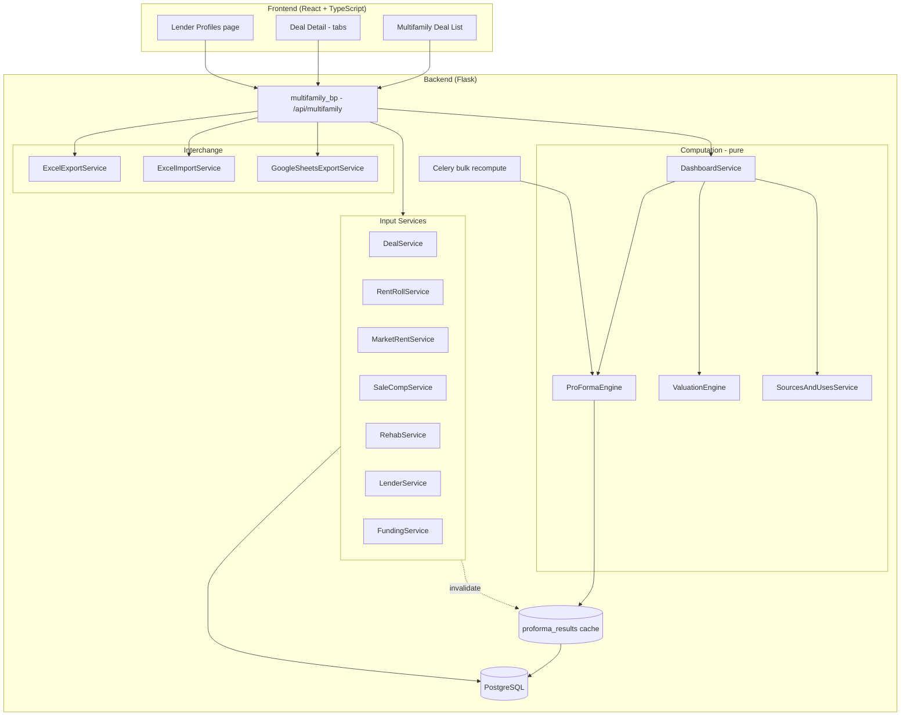
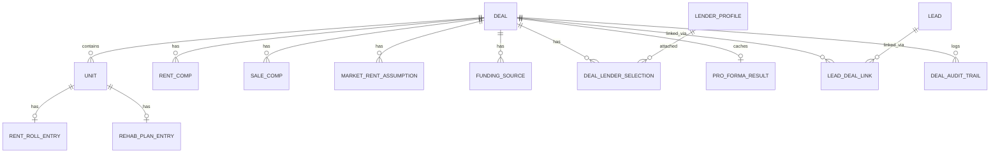
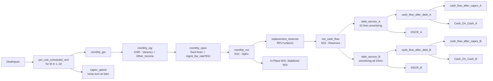

# Design Document

## Overview

The Multifamily Underwriting Pro Forma feature extends the Real Estate Analysis Platform with a dedicated commercial-multifamily track that runs alongside the existing single-family workflow. Where the single-family workflow produces an ARV through comp-based valuation, the multifamily workflow values assets on stabilized NOI divided by market cap rate and is organised around lender-focused metrics (DSCR, LTV, Cash-on-Cash) computed from a 24-month monthly pro forma.

At its heart is a **deterministic, pure-function pro forma engine** that transforms a `DealInputs` value into a `ProFormaComputation` value (24 months × per-scenario cash flow, plus summary metrics). The engine is the most test-critical component in this feature and is designed explicitly to be property-testable in isolation from Flask, SQLAlchemy, and I/O.

Around the engine sit three layers:

1. **Input capture** — services and REST endpoints for Deals, Units, Rent Roll, Market Rents, Rent/Sale Comps, Rehab Plan, Lender Profiles and Funding Sources.
2. **Computation** — the pure ProFormaEngine, the ValuationEngine, the Sources & Uses builder, and the Dashboard composer, with a cache keyed by an `Inputs_Hash` derived from a canonical serialisation of the Deal's inputs.
3. **Round-trip interchange** — the ExcelExportService and ExcelImportService, which together must satisfy `import(export(deal)) ≡ deal` over the fields defined by the source workbook `B-B Commercial Multi Pro Forma v22.xlsx`.

### Design decisions and rationales

- **Horizon is 24 months and hardcoded, but isolated.** The requirements pin the horizon at 24. Rather than letting `24` appear as a magic number across the codebase, this design defines a single module-level constant `HORIZON_MONTHS = 24` (plus derived `STABILIZED_MONTHS = range(13, 25)`). Changing the horizon later is a one-line change in `pro_forma_constants.py`, and every loop, array size, and slicing operation refers to the constant.
- **CapEx allocation defaults to lump-sum at `Rehab_Start_Month`** (Req 8.10). The design models allocation as a pluggable `CapExAllocationStrategy` protocol so straight-line-over-downtime or custom curves can be added later without touching the engine core.
- **Interest Reserve is a first-class Deal input, not a computed value.** It appears in Sources & Uses (Req 10.1) as a user-supplied placeholder field `interest_reserve_amount` (default 0.0). The design flags this as a known placeholder so a future enhancement can compute it from the construction IO schedule.
- **Google Sheets is export-only.** Round-trip is Excel-only (Req 13.5). The Sheets export reuses the workbook writer against the Sheets API.
- **Permissions piggyback on the existing Lead model.** A Deal linked to a Lead inherits the Lead's access grants (Req 14.3). Deals not linked to any Lead are owned by their creator via a `created_by_user_id` column.
- **The ProFormaEngine is a pure function.** It takes a frozen `DealInputs` dataclass and returns a `ProFormaComputation` dataclass. It performs no database reads, no I/O, and no mutation of its inputs. This makes it straightforward to run Hypothesis against it at 100+ iterations without touching the database.
- **Caching writes on read, invalidates on write.** Per Req 15.4, writes invalidate the cached `ProFormaResult` but do not recompute synchronously; the next `GET` recomputes and rewrites the cache row. Bulk recomputes use Celery (Req 15.5).
- **`Decimal`, not `float`, throughout the engine.** All monetary and rate computations use `decimal.Decimal` with a documented quantization policy (2 dp for money, 6 dp for rates) so rounding is deterministic and testable.

## Architecture

### High-level layout

The multifamily feature is a **distinct track** of the existing platform. It adds its own blueprint, models, services, and frontend routes without mutating single-family code paths.



### Package layout (backend)

Following the project's "one model per file, one service per file" conventions:

```
backend/app/
├── models/
│   ├── deal.py
│   ├── unit.py
│   ├── rent_roll_entry.py
│   ├── market_rent_assumption.py
│   ├── rent_comp.py
│   ├── sale_comp.py
│   ├── rehab_plan_entry.py
│   ├── lender_profile.py
│   ├── deal_lender_selection.py
│   ├── funding_source.py
│   ├── pro_forma_result.py
│   ├── lead_deal_link.py
│   └── deal_audit_trail.py
├── services/multifamily/
│   ├── __init__.py
│   ├── deal_service.py
│   ├── rent_roll_service.py
│   ├── market_rent_service.py
│   ├── sale_comp_service.py
│   ├── rehab_service.py
│   ├── lender_service.py
│   ├── funding_service.py
│   ├── pro_forma_constants.py         # HORIZON_MONTHS = 24
│   ├── pro_forma_inputs.py            # frozen DealInputs dataclass
│   ├── pro_forma_result_dc.py         # ProFormaComputation dataclass
│   ├── pro_forma_engine.py            # pure compute_pro_forma(inputs)
│   ├── inputs_hash.py                 # canonical JSON + SHA-256
│   ├── valuation_engine.py
│   ├── sources_and_uses_service.py
│   ├── dashboard_service.py
│   ├── excel_workbook_spec.py         # single source of truth for sheets/columns
│   ├── excel_export_service.py
│   ├── excel_import_service.py
│   └── google_sheets_export_service.py
├── controllers/
│   ├── multifamily_deal_controller.py
│   ├── multifamily_rent_roll_controller.py
│   ├── multifamily_market_rent_controller.py
│   ├── multifamily_sale_comp_controller.py
│   ├── multifamily_rehab_controller.py
│   ├── multifamily_lender_controller.py
│   ├── multifamily_funding_controller.py
│   ├── multifamily_pro_forma_controller.py
│   ├── multifamily_dashboard_controller.py
│   └── multifamily_import_export_controller.py
├── tasks/
│   └── multifamily_recompute.py        # Celery task
└── schemas.py                          # multifamily Marshmallow schemas appended
```

### Package layout (frontend)

```
frontend/src/
├── pages/multifamily/
│   ├── DealListPage.tsx
│   ├── DealDetailPage.tsx              # tab router
│   └── LenderProfilesPage.tsx
├── components/multifamily/
│   ├── RentRollTab.tsx
│   ├── MarketRentsTab.tsx
│   ├── SaleCompsTab.tsx
│   ├── RehabPlanTab.tsx
│   ├── LendersTab.tsx
│   ├── FundingTab.tsx
│   ├── ProFormaTab.tsx                 # 24-month table + charts
│   └── DashboardTab.tsx                # side-by-side scenarios
├── services/api.ts                     # multifamily endpoints appended
└── types/index.ts                      # multifamily types appended
```

### Integration points with the existing platform

| Concern | Approach |
|---|---|
| Auth | Reuse existing Flask session / user identity. Multifamily endpoints do not introduce a separate auth layer. |
| Audit trail | New `deal_audit_trails` table mirrors `LeadAuditTrail` shape (Req 14.4). |
| Excel library | Reuse `openpyxl` already in `requirements.txt` (Req 14.5). No second Excel dependency. |
| Google Sheets | Reuse `google-api-python-client` and existing `OAuthToken` storage. |
| Lead ↔ Deal | New `lead_deal_links` association table grants Deal access to anyone with Lead access (Req 14.3). |
| Error handling | New domain exceptions extend `RealEstateAnalysisException`. Controllers use the existing `@handle_errors` decorator pattern from `lead_controller.py`. |
| Rate limiting | Reuse Flask-Limiter defaults; apply a stricter `@limiter.limit("10 per hour")` on the Excel import endpoint. |

## Components and Interfaces

All services are instantiated per-request from controllers (no global singletons, matching the existing `LeadScoringEngine` pattern). The pure computation components (`ProFormaEngine`, `ValuationEngine`, `SourcesAndUsesService`) are stateless and exposed as module-level functions.

### DealService

```python
class DealService:
    def create_deal(self, user_id, payload) -> Deal
    def get_deal(self, user_id, deal_id) -> Deal                    # permission-checked
    def list_deals(self, user_id, filters) -> list[Deal]
    def update_deal(self, user_id, deal_id, payload) -> Deal        # invalidates cache
    def soft_delete_deal(self, user_id, deal_id) -> None
    def link_to_lead(self, user_id, deal_id, lead_id) -> None
    def suggest_lead_match(self, user_id, property_address) -> Lead | None
    def user_has_access(self, user_id, deal_id) -> bool             # direct or Lead-linked
    def build_inputs_snapshot(self, deal_id) -> DealInputs          # frozen snapshot
```

### RentRollService

```python
class RentRollService:
    def add_unit(self, deal_id, payload) -> Unit                    # unique Unit_ID per Deal
    def update_unit(self, deal_id, unit_id, payload) -> Unit
    def delete_unit(self, deal_id, unit_id) -> None
    def set_rent_roll_entry(self, deal_id, unit_id, payload) -> RentRollEntry
    def get_rent_roll_summary(self, deal_id) -> RentRollSummary     # Req 2.5 rollup
```

### MarketRentService

```python
class MarketRentService:
    def set_assumption(self, deal_id, unit_type, payload) -> MarketRentAssumption
    def add_rent_comp(self, deal_id, payload) -> RentComp           # computes Rent_Per_SqFt
    def delete_rent_comp(self, deal_id, comp_id) -> None
    def get_comps_rollup(self, deal_id, unit_type) -> RentCompRollup     # Req 3.4
    def default_assumptions_from_comps(self, deal_id) -> list[MarketRentAssumption]  # Req 3.5
```

### SaleCompService

```python
class SaleCompService:
    def add_sale_comp(self, deal_id, payload) -> SaleComp           # computes Observed_PPU
    def delete_sale_comp(self, deal_id, comp_id) -> None
    def get_comps_rollup(self, deal_id) -> SaleCompRollup           # Req 4.4 min/median/avg/max
```

### RehabService

```python
class RehabService:
    def set_plan_entry(self, deal_id, unit_id, payload) -> RehabPlanEntry    # computes Stabilized_Month
    def get_monthly_rollup(self, deal_id) -> list[RehabMonthlyRollup]        # Req 5.6
    def get_rehab_budget_total(self, deal_id) -> Decimal                     # Req 5.7
```

### LenderService

```python
class LenderService:
    def create_profile(self, user_id, payload) -> LenderProfile      # validates rate/LTV bounds
    def list_profiles(self, user_id, lender_type) -> list[LenderProfile]
    def update_profile(self, user_id, profile_id, payload) -> LenderProfile
    def delete_profile(self, user_id, profile_id) -> None
    def attach_to_deal(self, deal_id, scenario, profile_id, is_primary) -> DealLenderSelection
    def detach_from_deal(self, deal_id, selection_id) -> None
```

### FundingService

```python
class FundingService:
    def add_source(self, deal_id, payload) -> FundingSource          # unique Source_Type per Deal
    def update_source(self, deal_id, source_id, payload) -> FundingSource
    def delete_source(self, deal_id, source_id) -> None
    def compute_draws(self, deal_id, required_equity) -> FundingDrawPlan
        # waterfall Cash -> HELOC_1 -> HELOC_2, returns per-source Draw_Amount
    def compute_origination_fees(self, draw_plan) -> Decimal
    def compute_heloc_carrying_interest(self, draw_plan, month_index) -> Decimal
```

### ProFormaEngine (pure)

```python
# pro_forma_inputs.py
@dataclass(frozen=True)
class DealInputs:
    deal: DealSnapshot                      # purchase_price, closing_costs, vacancy_rate, ...
    units: tuple[UnitSnapshot, ...]
    rent_roll: tuple[RentRollSnapshot, ...]
    rehab_plan: tuple[RehabPlanSnapshot, ...]
    market_rents: tuple[MarketRentSnapshot, ...]
    opex: OpExAssumptions
    reserves: ReserveAssumptions
    lender_scenario_a: LenderProfileSnapshot | None   # Primary
    lender_scenario_b: LenderProfileSnapshot | None   # Primary
    funding_sources: tuple[FundingSourceSnapshot, ...]
    capex_allocation: CapExAllocationStrategy = LumpSumAtStart()

# pro_forma_engine.py
def compute_pro_forma(inputs: DealInputs) -> ProFormaComputation: ...
```

`ProFormaComputation` holds:
- `monthly_schedule: tuple[MonthlyRow, ...]` of length `HORIZON_MONTHS`
- `per_unit_schedule: dict[str, tuple[Decimal, ...]]` (scheduled rent per month keyed by `unit_id`)
- `summary: ProFormaSummary` (In_Place_NOI, Stabilized_NOI, per-scenario In_Place_DSCR, Stabilized_DSCR, Cash_On_Cash)
- `sources_and_uses_a: SourcesAndUses`, `sources_and_uses_b: SourcesAndUses`
- `missing_inputs_a: list[str]`, `missing_inputs_b: list[str]` (Req 8.14)

Each `MonthlyRow` contains: `month`, `gsr`, `vacancy_loss`, `other_income`, `egi`, `opex_breakdown`, `opex_total`, `noi`, `replacement_reserves`, `net_cash_flow`, `debt_service_a`, `debt_service_b`, `cash_flow_after_debt_a`, `cash_flow_after_debt_b`, `capex_spend`, `cash_flow_after_capex_a`, `cash_flow_after_capex_b`.

### ValuationEngine (pure)

```python
def compute_valuation(
    stabilized_noi: Decimal | None,
    purchase_price: Decimal,
    month_1_gsr: Decimal,
    unit_count: int,
    sale_comp_rollup: SaleCompRollup,
    custom_cap_rate: Decimal | None,
) -> Valuation
```

Returns `Valuation` with `valuation_at_cap_rate_{min,median,average,max}`, `valuation_at_ppu_{min,median,average,max}`, optional `valuation_at_custom_cap_rate`, `price_to_rent_ratio`, and a `warnings` list (e.g. `Non_Positive_Stabilized_NOI`).

### SourcesAndUsesService (pure helpers)

```python
def compute_loan_amount_scenario_a(lender, purchase_price, closing_costs, rehab_total) -> Decimal
def compute_loan_amount_scenario_b(lender, purchase_price) -> Decimal
def build_sources_and_uses(scenario, deal, lender, draw_plan, interest_reserve) -> SourcesAndUses
```

`SourcesAndUses` contains typed `uses` (purchase_price, closing_costs, rehab_budget_total, loan_origination_fees, funding_source_origination_fees, interest_reserve) and typed `sources` (loan_amount, cash_draw, heloc_1_draw, heloc_2_draw), plus `total_uses`, `total_sources`, `initial_cash_investment = total_uses - loan_amount` (Req 10.5).

### DashboardService

```python
class DashboardService:
    def get_dashboard(self, deal_id) -> Dashboard
        # Reads cached ProFormaResult if valid, otherwise recomputes.
        # Returns per-scenario summary (Req 11.1) with missing_inputs fallback (Req 11.2).
```

### ExcelExportService / ExcelImportService

```python
class ExcelExportService:
    def export_deal(self, deal_id) -> bytes              # .xlsx bytes
    def export_deal_to_sheets(self, deal_id, oauth_token) -> str   # spreadsheet URL

class ExcelImportService:
    def import_workbook(self, user_id, file) -> ImportResult
        # ImportResult contains deal_id and per-sheet parse report
```

Both services read the single source of truth `excel_workbook_spec.py`, which declares the sheet names, column order, and column types for each of the 10 sheets (Req 12.1). Keeping the spec in one module is what makes the round-trip property implementable.

### Caching component

```python
# inputs_hash.py
def canonical_inputs(deal: Deal) -> dict         # stable, sorted keys, Decimal->str
def compute_inputs_hash(deal: Deal) -> str       # SHA-256 hex of json.dumps(canonical)
```

The `pro_forma_results` table is the cache. On `GET /deals/{id}/pro-forma`:
1. Compute current `inputs_hash` from Deal state.
2. If a row exists with the same hash, return it.
3. Otherwise call `compute_pro_forma(inputs)`, upsert the row, return it.

On any write that changes a cacheable input (Req 15.3), delete the cache row in the same transaction as the write.

### REST API surface

All endpoints are prefixed `/api/multifamily`. All request/response bodies go through Marshmallow schemas appended to `backend/app/schemas.py`.

| Method | Path | Description |
|---|---|---|
| `POST`   | `/deals` | Create Deal (Req 1.1) |
| `GET`    | `/deals` | List user's Deals (Req 1.5) |
| `GET`    | `/deals/{id}` | Get Deal detail (Req 1.4) |
| `PATCH`  | `/deals/{id}` | Update Deal (Req 1.6) |
| `DELETE` | `/deals/{id}` | Soft-delete Deal (Req 1.7) |
| `POST`   | `/deals/{id}/link-lead` | Link Deal to Lead (Req 14.2/14.3) |
| `POST`   | `/deals/{id}/units` | Add Unit (Req 2.1) |
| `PATCH`  | `/deals/{id}/units/{unit_id}` | Update Unit |
| `DELETE` | `/deals/{id}/units/{unit_id}` | Remove Unit |
| `PUT`    | `/deals/{id}/units/{unit_id}/rent-roll` | Set RentRollEntry (Req 2.3) |
| `GET`    | `/deals/{id}/rent-roll/summary` | Rent roll rollup (Req 2.5) |
| `PUT`    | `/deals/{id}/market-rents/{unit_type}` | Set Market_Rent_Assumption (Req 3.1) |
| `POST`   | `/deals/{id}/rent-comps` | Add Rent_Comp (Req 3.2) |
| `DELETE` | `/deals/{id}/rent-comps/{comp_id}` | |
| `GET`    | `/deals/{id}/rent-comps/rollup` | Rent comp rollup by Unit_Type (Req 3.4) |
| `POST`   | `/deals/{id}/sale-comps` | Add Sale_Comp (Req 4.1) |
| `DELETE` | `/deals/{id}/sale-comps/{comp_id}` | |
| `GET`    | `/deals/{id}/sale-comps/rollup` | Sale comp rollup (Req 4.4) |
| `PUT`    | `/deals/{id}/units/{unit_id}/rehab` | Set Rehab_Plan_Entry (Req 5.1) |
| `GET`    | `/deals/{id}/rehab/rollup` | Monthly rehab rollup (Req 5.6) |
| `POST`   | `/lender-profiles` | Create Lender_Profile (Req 6.1, 6.2) |
| `GET`    | `/lender-profiles` | List Lender_Profiles |
| `PATCH`  | `/lender-profiles/{id}` | Update |
| `DELETE` | `/lender-profiles/{id}` | |
| `POST`   | `/deals/{id}/scenarios/{A|B}/lenders` | Attach Lender (Req 6.5–6.7) |
| `DELETE` | `/deals/{id}/scenarios/{A|B}/lenders/{selection_id}` | Detach |
| `POST`   | `/deals/{id}/funding-sources` | Add Funding_Source (Req 7.1, 7.2) |
| `PATCH`  | `/deals/{id}/funding-sources/{id}` | |
| `DELETE` | `/deals/{id}/funding-sources/{id}` | |
| `GET`    | `/deals/{id}/pro-forma` | Compute or return cached Pro_Forma_Result (Req 8, 15) |
| `POST`   | `/deals/{id}/pro-forma/recompute` | Force recompute (admin/debug) |
| `GET`    | `/deals/{id}/valuation` | Valuation table (Req 9) |
| `GET`    | `/deals/{id}/sources-and-uses` | Per-scenario S&U (Req 10) |
| `GET`    | `/deals/{id}/dashboard` | Summary Dashboard (Req 11) |
| `GET`    | `/deals/{id}/export/excel` | Excel export (Req 12) |
| `GET`    | `/deals/{id}/export/sheets` | Google Sheets export (Req 12.5) |
| `POST`   | `/deals/import/excel` | Import workbook (Req 13) |
| `POST`   | `/admin/recompute-all` | Enqueue Celery bulk recompute (Req 15.5) |

## Data Models

### Entity-Relationship diagram



### SQLAlchemy models (field summaries)

All models use `id = Integer, primary_key=True, autoincrement`, `created_at = DateTime default=utcnow`, `updated_at = DateTime onupdate=utcnow`, and a `deleted_at = DateTime nullable=True` for soft delete where applicable. Monetary fields use `Numeric(14, 2)`; rates use `Numeric(8, 6)`.

#### `deals`
| Column | Type | Notes |
|---|---|---|
| `id` | Integer PK | |
| `created_by_user_id` | String(255) | ownership for non-Lead-linked deals |
| `property_address` | String(500) | |
| `property_city` | String(100) | |
| `property_state` | String(50) | |
| `property_zip` | String(20) | |
| `unit_count` | Integer | `CHECK unit_count >= 5` (Req 1.2) |
| `purchase_price` | Numeric(14,2) | `CHECK > 0` (Req 1.3) |
| `closing_costs` | Numeric(14,2) | default 0 |
| `close_date` | Date | |
| `vacancy_rate` | Numeric(8,6) | default 0.05 |
| `other_income_monthly` | Numeric(14,2) | default 0 |
| `management_fee_rate` | Numeric(8,6) | default 0.08 |
| `reserve_per_unit_per_year` | Numeric(14,2) | default 250 |
| `property_taxes_annual` | Numeric(14,2) | |
| `insurance_annual` | Numeric(14,2) | |
| `utilities_annual` | Numeric(14,2) | |
| `repairs_and_maintenance_annual` | Numeric(14,2) | |
| `admin_and_marketing_annual` | Numeric(14,2) | |
| `payroll_annual` | Numeric(14,2) | |
| `other_opex_annual` | Numeric(14,2) | |
| `interest_reserve_amount` | Numeric(14,2) | placeholder, default 0 |
| `custom_cap_rate` | Numeric(8,6) | nullable (Req 9.3) |
| `status` | String(50) | e.g. 'draft', 'under_review' |
| `created_at`, `updated_at`, `deleted_at` | | |

#### `units`
| Column | Type | Notes |
|---|---|---|
| `id` | Integer PK | |
| `deal_id` | FK → deals.id | `ondelete=CASCADE` |
| `unit_identifier` | String(50) | user-supplied Unit_ID |
| `unit_type` | String(50) | e.g. '1BR/1BA', '2BR/2BA' |
| `beds` | Integer | |
| `baths` | Numeric(4,1) | |
| `sqft` | Integer | |
| `occupancy_status` | String(20) | CHECK IN ('Occupied','Vacant','Down') |
| | | `UNIQUE (deal_id, unit_identifier)` (Req 2.2) |

#### `rent_roll_entries`
| Column | Type | Notes |
|---|---|---|
| `id` | Integer PK | |
| `unit_id` | FK → units.id | `UNIQUE`, one-to-one |
| `current_rent` | Numeric(14,2) | |
| `lease_start_date` | Date | nullable |
| `lease_end_date` | Date | nullable; CHECK `lease_end_date >= lease_start_date` (Req 2.4) |
| `notes` | Text | |

#### `market_rent_assumptions`
| Column | Type | Notes |
|---|---|---|
| `id` | PK | |
| `deal_id` | FK → deals.id | |
| `unit_type` | String(50) | |
| `target_rent` | Numeric(14,2) | nullable; defaulted from comps when ≥3 exist (Req 3.5) |
| `post_reno_target_rent` | Numeric(14,2) | same defaulting rule |
| | | `UNIQUE (deal_id, unit_type)` |

#### `rent_comps`
| Column | Type | Notes |
|---|---|---|
| `id` | PK | |
| `deal_id` | FK → deals.id | |
| `address`, `neighborhood`, `unit_type` | String | |
| `observed_rent` | Numeric(14,2) | |
| `sqft` | Integer | CHECK > 0 (Req 3.3) |
| `rent_per_sqft` | Numeric(10,4) | computed at write time |
| `observation_date` | Date | |
| `source_url` | String(1000) | nullable |

#### `sale_comps`
| Column | Type | Notes |
|---|---|---|
| `id` | PK | |
| `deal_id` | FK → deals.id | |
| `address` | String(500) | |
| `unit_count` | Integer | CHECK > 0 (Req 4.2) |
| `status` | String(50) | 'Active', 'Pending', 'Closed' |
| `sale_price` | Numeric(14,2) | |
| `close_date` | Date | |
| `observed_cap_rate` | Numeric(8,6) | CHECK 0 < rate <= 0.25 (Req 4.3) |
| `observed_ppu` | Numeric(14,2) | computed at write time |
| `distance_miles` | Numeric(8,3) | |

#### `rehab_plan_entries`
| Column | Type | Notes |
|---|---|---|
| `id` | PK | |
| `unit_id` | FK → units.id | UNIQUE, one-to-one |
| `renovate_flag` | Boolean | default False |
| `current_rent` | Numeric(14,2) | |
| `suggested_post_reno_rent` | Numeric(14,2) | nullable |
| `underwritten_post_reno_rent` | Numeric(14,2) | nullable |
| `rehab_start_month` | Integer | CHECK 1..24; NULL when `renovate_flag=False` (Req 5.2, 5.5) |
| `downtime_months` | Integer | CHECK >= 0; NULL when `renovate_flag=False` (Req 5.3) |
| `stabilized_month` | Integer | derived = start + downtime; NULL when `renovate_flag=False` |
| `rehab_budget` | Numeric(14,2) | |
| `scope_notes` | Text | |
| `stabilizes_after_horizon` | Boolean | flag (Req 5.4) |

#### `lender_profiles`
Reusable across Deals; `created_by_user_id` scopes visibility.

| Column | Type | Notes |
|---|---|---|
| `id` | PK | |
| `created_by_user_id` | String(255) | |
| `company` | String(200) | |
| `lender_type` | String(30) | CHECK IN ('Construction_To_Perm','Self_Funded_Reno') |
| `origination_fee_rate` | Numeric(8,6) | common to both types |
| `prepay_penalty_description` | Text | |
| **Construction_To_Perm fields** | | nullable when type = Self_Funded_Reno |
| `ltv_total_cost` | Numeric(8,6) | 0..1 (Req 6.4) |
| `construction_rate` | Numeric(8,6) | 0..0.30 (Req 6.3) |
| `construction_io_months` | Integer | |
| `construction_term_months` | Integer | |
| `perm_rate` | Numeric(8,6) | 0..0.30 |
| `perm_amort_years` | Integer | |
| `min_interest_or_yield` | Numeric(14,2) | |
| **Self_Funded_Reno fields** | | nullable when type = Construction_To_Perm |
| `max_purchase_ltv` | Numeric(8,6) | 0..1 |
| `treasury_5y_rate` | Numeric(8,6) | |
| `spread_bps` | Integer | |
| `term_years` | Integer | |
| `amort_years` | Integer | |

A Marshmallow `@validates_schema` enforces "all Construction_To_Perm fields required when `lender_type = Construction_To_Perm`, and all Self_Funded_Reno fields required when `lender_type = Self_Funded_Reno`". `all_in_rate` is computed at read time as `treasury_5y_rate + spread_bps / 10000` (Req 6.2).

#### `deal_lender_selections`
| Column | Type | Notes |
|---|---|---|
| `id` | PK | |
| `deal_id` | FK → deals.id | |
| `lender_profile_id` | FK → lender_profiles.id | |
| `scenario` | String(1) | CHECK IN ('A','B') |
| `is_primary` | Boolean | default False |
| | | `UNIQUE (deal_id, scenario, lender_profile_id)` |
| | | service enforces at most 3 rows per `(deal_id, scenario)` (Req 6.7) |
| | | partial unique index: at most 1 primary per `(deal_id, scenario)` |

#### `funding_sources`
| Column | Type | Notes |
|---|---|---|
| `id` | PK | |
| `deal_id` | FK → deals.id | |
| `source_type` | String(10) | CHECK IN ('Cash','HELOC_1','HELOC_2') |
| `total_available` | Numeric(14,2) | |
| `interest_rate` | Numeric(8,6) | |
| `origination_fee_rate` | Numeric(8,6) | |
| | | `UNIQUE (deal_id, source_type)` (Req 7.2) |

#### `pro_forma_results` (cache)
| Column | Type | Notes |
|---|---|---|
| `id` | PK | |
| `deal_id` | FK → deals.id UNIQUE | one row per Deal |
| `inputs_hash` | String(64) | SHA-256 hex |
| `computed_at` | DateTime | |
| `result_json` | JSONB | full `ProFormaComputation` serialized |

#### `lead_deal_links` (permission bridge)
| Column | Type | Notes |
|---|---|---|
| `id` | PK | |
| `lead_id` | FK → leads.id | |
| `deal_id` | FK → deals.id | |
| | | `UNIQUE (lead_id, deal_id)` |

#### `deal_audit_trails` (mirrors `LeadAuditTrail`, Req 14.4)
| Column | Type | Notes |
|---|---|---|
| `id`, `deal_id`, `user_id`, `action`, `changed_fields` (JSON), `created_at` | | |

### Frozen snapshot dataclasses (pure-function input to engine)

These live in `pro_forma_inputs.py` and are populated from SQLAlchemy models by `DealService.build_inputs_snapshot(deal_id)`. They use `Decimal` throughout; no SQLAlchemy session is referenced from engine code.

```python
@dataclass(frozen=True)
class DealSnapshot:
    deal_id: int
    purchase_price: Decimal
    closing_costs: Decimal
    vacancy_rate: Decimal
    other_income_monthly: Decimal
    management_fee_rate: Decimal
    reserve_per_unit_per_year: Decimal
    interest_reserve_amount: Decimal
    custom_cap_rate: Decimal | None
    unit_count: int

@dataclass(frozen=True)
class UnitSnapshot:
    unit_id: str
    unit_type: str
    beds: int
    baths: Decimal
    sqft: int
    occupancy_status: Literal['Occupied', 'Vacant', 'Down']

@dataclass(frozen=True)
class RentRollSnapshot:
    unit_id: str
    current_rent: Decimal

@dataclass(frozen=True)
class RehabPlanSnapshot:
    unit_id: str
    renovate_flag: bool
    current_rent: Decimal
    underwritten_post_reno_rent: Decimal | None
    rehab_start_month: int | None        # 1..24
    downtime_months: int | None
    stabilized_month: int | None
    rehab_budget: Decimal

@dataclass(frozen=True)
class OpExAssumptions:
    property_taxes_annual: Decimal
    insurance_annual: Decimal
    utilities_annual: Decimal
    repairs_and_maintenance_annual: Decimal
    admin_and_marketing_annual: Decimal
    payroll_annual: Decimal
    other_opex_annual: Decimal
    management_fee_rate: Decimal

@dataclass(frozen=True)
class LenderProfileSnapshot:
    lender_type: Literal['Construction_To_Perm', 'Self_Funded_Reno']
    origination_fee_rate: Decimal
    # Construction_To_Perm
    ltv_total_cost: Decimal | None
    construction_rate: Decimal | None
    construction_io_months: int | None
    perm_rate: Decimal | None
    perm_amort_years: int | None
    # Self_Funded_Reno
    max_purchase_ltv: Decimal | None
    all_in_rate: Decimal | None          # treasury + spread, precomputed
    amort_years: int | None

@dataclass(frozen=True)
class FundingSourceSnapshot:
    source_type: Literal['Cash', 'HELOC_1', 'HELOC_2']
    total_available: Decimal
    interest_rate: Decimal
    origination_fee_rate: Decimal
```

### Alembic migration plan

A single additive migration `c3d4e5f6g7h8_multifamily_schema.py` that:

1. Creates all 12 tables in dependency order: `lender_profiles` → `deals` → `units` → `rent_roll_entries` → `rehab_plan_entries` → `market_rent_assumptions` → `rent_comps` → `sale_comps` → `deal_lender_selections` → `funding_sources` → `pro_forma_results` → `lead_deal_links` → `deal_audit_trails`.
2. Adds all `CHECK` constraints listed above.
3. Adds indexes on `deals.created_by_user_id`, `deals.property_address`, `lender_profiles.created_by_user_id`, `lead_deal_links.lead_id`, `lead_deal_links.deal_id`, and the partial-unique index for `is_primary` on `deal_lender_selections`.
4. Downgrade drops in reverse dependency order.

No existing table is modified. The migration is additive only, composing cleanly with the existing `267725fe7017_baseline_schema`, `a1b2c3d4e5f6_add_condo_filter_schema`, and `b2c3d4e5f6g7_add_lead_scores_table` migrations.

### Pro Forma computation pipeline

The engine is a deterministic pipeline of pure functions. Each step takes the prior step's output and adds one column family to the monthly schedule. The pipeline runs once for both scenarios; they share everything up through `net_cash_flow`.



#### Per-unit scheduled rent rule (Req 8.1)

```
scheduled_rent(unit, M) =
    if not unit.renovate_flag:                           current_rent
    elif M < rehab_start_month:                          current_rent
    elif rehab_start_month <= M < stabilized_month:      0
    else:                                                underwritten_post_reno_rent
```

`monthly_gsr(M) = sum over units of scheduled_rent(unit, M)` (Req 8.2).

#### EGI, OpEx, NOI (Reqs 8.3–8.5)

```
EGI(M)  = GSR(M) - (vacancy_rate * GSR(M)) + other_income_monthly
OpEx(M) = property_taxes_annual/12 + insurance_annual/12 + utilities_annual/12
        + repairs_and_maintenance_annual/12 + admin_and_marketing_annual/12
        + payroll_annual/12 + other_opex_annual/12
        + management_fee_rate * EGI(M)
NOI(M)  = EGI(M) - OpEx(M)
```

#### Net cash flow and CapEx (Reqs 8.6, 8.10, 8.11)

```
replacement_reserves        = reserve_per_unit_per_year * unit_count / 12
net_cash_flow(M)            = NOI(M) - replacement_reserves
capex_spend(M)              = sum over units with rehab_start_month == M of rehab_budget  # lump-sum
cash_flow_after_debt(M, S)  = net_cash_flow(M) - debt_service(M, S)
cash_flow_after_capex(M, S) = cash_flow_after_debt(M, S) - capex_spend(M)
```

#### Debt service for Scenario A (Req 8.7)

For `M in 1..construction_io_months` (interest-only):
```
debt_service_A(M) = loan_amount_A * construction_rate / 12
```

For `M > construction_io_months` (amortizing):
```
r = perm_rate / 12
n = perm_amort_years * 12
debt_service_A(M) = loan_amount_A * (r * (1 + r)^n) / ((1 + r)^n - 1)
```

Edge case: if `perm_rate == 0`, the formula collapses to `loan_amount_A / n` and the engine handles this explicitly (avoiding division by zero).

#### Debt service for Scenario B (Req 8.8)

Amortizing for all 24 months:
```
r = all_in_rate / 12
n = amort_years * 12
debt_service_B(M) = loan_amount_B * (r * (1 + r)^n) / ((1 + r)^n - 1)     for all M in 1..24
```

#### Loan amounts (Reqs 10.3, 10.4)

```
loan_amount_A = ltv_total_cost * (purchase_price + closing_costs + rehab_budget_total)
loan_amount_B = max_purchase_ltv * purchase_price
```

#### Funding waterfall (Req 7.3)

```python
def waterfall(required_equity, sources_by_type):
    remaining = required_equity
    draws = {'Cash': 0, 'HELOC_1': 0, 'HELOC_2': 0}
    for source_type in ('Cash', 'HELOC_1', 'HELOC_2'):      # priority order
        source = sources_by_type.get(source_type)
        if source is None or remaining <= 0:
            continue
        draw = min(remaining, source.total_available)
        draws[source_type] = draw
        remaining -= draw
    shortfall = remaining                                    # > 0 triggers Insufficient_Funding
    return draws, shortfall
```

The returned `draws` feed (a) `funding_source_origination_fees = sum(draw * origination_fee_rate)` (Req 7.5) and (b) per-month HELOC carrying interest `sum(draw * interest_rate / 12)` over the outstanding balance (Req 7.6).

#### Summary metrics (Reqs 8.12, 8.13, 10.6, 10.7)

```
In_Place_NOI            = NOI(1) * 12
Stabilized_NOI          = average(NOI(13..24)) * 12
In_Place_DSCR(S)        = NOI(1)  / debt_service(1, S)   if debt_service(1, S) != 0  else None
Stabilized_DSCR(S)      = NOI(24) / debt_service(24, S)  if debt_service(24, S) != 0 else None
Stabilized_Annual_CF(S) = sum(cash_flow_after_debt(M, S) for M in 13..24)
Cash_On_Cash(S)         = Stabilized_Annual_CF(S) / Initial_Cash_Investment(S)
                          if Initial_Cash_Investment(S) > 0 else None
```

#### Missing-inputs handling (Req 8.14)

Before any scenario runs, the engine scans its inputs and builds a `missing_inputs` list per scenario. Known codes:

- `RENT_ROLL_INCOMPLETE` — fewer rent roll entries than `unit_count`
- `REHAB_PLAN_MISSING` — any Unit with `renovate_flag=True` lacks a `rehab_start_month`
- `OPEX_ASSUMPTIONS_MISSING` — any of the seven annual OpEx inputs is NULL
- `PRIMARY_LENDER_MISSING_A` / `PRIMARY_LENDER_MISSING_B` — no primary lender attached for the scenario
- `FUNDING_INSUFFICIENT` — cumulative funding < required equity (soft warning, non-blocking)

If `missing_inputs` is non-empty for a scenario, the scenario's summary fields are reported as `None` rather than raising. The shared pipeline (per-unit schedule, GSR, EGI, OpEx, NOI, Net_Cash_Flow) is still computed so the user sees the partial picture.

### Inputs_Hash computation

```python
# inputs_hash.py
def canonical_inputs(deal: Deal) -> dict:
    return {
        "deal": {
            "purchase_price":            _d(deal.purchase_price),
            "closing_costs":             _d(deal.closing_costs),
            "vacancy_rate":              _d(deal.vacancy_rate),
            "other_income_monthly":      _d(deal.other_income_monthly),
            "management_fee_rate":       _d(deal.management_fee_rate),
            "reserve_per_unit_per_year": _d(deal.reserve_per_unit_per_year),
            "interest_reserve_amount":   _d(deal.interest_reserve_amount),
            "property_taxes_annual":     _d(deal.property_taxes_annual),
            "insurance_annual":          _d(deal.insurance_annual),
            "utilities_annual":          _d(deal.utilities_annual),
            "repairs_and_maintenance_annual": _d(deal.repairs_and_maintenance_annual),
            "admin_and_marketing_annual": _d(deal.admin_and_marketing_annual),
            "payroll_annual":            _d(deal.payroll_annual),
            "other_opex_annual":         _d(deal.other_opex_annual),
        },
        "units":           sorted([...], key=lambda u: u["unit_identifier"]),
        "rent_roll":       sorted([...], key=lambda r: r["unit_id"]),
        "rehab_plan":      sorted([...], key=lambda r: r["unit_id"]),
        "lenders": {
            "A": primary_a_snapshot or None,
            "B": primary_b_snapshot or None,
        },
        "funding_sources": sorted([...], key=lambda s: s["source_type"]),
    }

def compute_inputs_hash(deal: Deal) -> str:
    payload = canonical_inputs(deal)
    encoded = json.dumps(payload, sort_keys=True, separators=(",", ":"))
    return hashlib.sha256(encoded.encode("utf-8")).hexdigest()
```

Invariants enforced by `canonical_inputs`:
- Decimal fields serialize via `str(Decimal)`, not `float`, so `1.1` is not corrupted.
- Lists are sorted by a stable natural key so row insertion order does not affect the hash.
- `Computed_At` and every timestamp are excluded; only inputs participate.
- Soft-deleted child rows are excluded.

This makes `compute_inputs_hash` a pure function of the Deal's input state, which in turn makes `compute_pro_forma` + cache deterministic (cornerstone of Property 6 below).

### Excel workbook spec

`excel_workbook_spec.py` declares the shape of the workbook once, shared by export and import:

```python
@dataclass(frozen=True)
class ColumnSpec:
    header: str
    attr: str                            # dataclass field or model attribute
    kind: Literal['str', 'int', 'decimal', 'date', 'bool', 'rate']
    required: bool = True

@dataclass(frozen=True)
class SheetSpec:
    name: str                            # exact sheet name, e.g. 'S01_RentRoll_InPlace'
    entity: str                          # 'Unit+RentRollEntry', 'RentComp', ...
    columns: tuple[ColumnSpec, ...]
    round_trippable: bool                # True for S01-S04, S07, Funding_Sources

WORKBOOK_SHEETS: tuple[SheetSpec, ...] = (
    SheetSpec('S00a_Summary_ScenarioA', 'Summary_A',          (...), round_trippable=False),
    SheetSpec('S00b_Summary_ScenarioB', 'Summary_B',          (...), round_trippable=False),
    SheetSpec('S01_RentRoll_InPlace',   'Unit+RentRollEntry', (...), round_trippable=True),
    SheetSpec('S02_MarketRents_Comps',  'MarketRent+RentComp',(...), round_trippable=True),
    SheetSpec('S03_SaleComps_CapRates', 'SaleComp',           (...), round_trippable=True),
    SheetSpec('S04_Rehab_Timing',       'RehabPlan',          (...), round_trippable=True),
    SheetSpec('S05_ProForma_24mo',      'Monthly',            (...), round_trippable=False),
    SheetSpec('S06_Valuation',          'Valuation',          (...), round_trippable=False),
    SheetSpec('S07_Lender_Assumptions', 'DealLenders+Profile',(...), round_trippable=True),
    SheetSpec('Funding_Sources',        'FundingSource',      (...), round_trippable=True),
)
```

`S00a/S00b/S05/S06` are computed-output sheets (values only, no formulas) and are ignored by the importer. `S01/S02/S03/S04/S07/Funding_Sources` are the round-trippable sheets — they carry the Deal's inputs and are both written by the exporter and read by the importer. The round-trip property (Req 13.5) is asserted specifically over the union of fields captured in the round-trippable sheets.

## Correctness Properties

*A property is a characteristic or behavior that should hold true across all valid executions of a system — essentially, a formal statement about what the system should do. Properties serve as the bridge between human-readable specifications and machine-verifiable correctness guarantees.*

The pro forma engine is a deterministic pure function over structured numeric inputs — exactly the shape where property-based testing (PBT) pays off. Every property below reduces to "for all valid `DealInputs`, the engine satisfies some invariant", and every property is executable by `compute_pro_forma(inputs)` from pytest + Hypothesis with no database, no Flask app, and no I/O.

The prework analysis classified every acceptance criterion. After the property-reflection step, the properties below consolidate multiple individually-testable identities into the most load-bearing properties. Lower-priority computed-field identities are collected into a single "Computed-field identities" property at the end. Acceptance criteria classified as EXAMPLE, EDGE_CASE, INTEGRATION, or SMOKE in the prework are covered by unit/integration/smoke tests, not property tests — see the Testing Strategy section.

### Property 1: Excel export/import round-trip

*For any* valid Deal with populated Units, RentRollEntries, RentComps, SaleComps, RehabPlanEntries, primary LenderProfile selections, and FundingSources, exporting the Deal to an `.xlsx` workbook and then re-importing the resulting bytes into a fresh Deal SHALL yield a Deal whose round-trippable fields are equal (over the sheets marked `round_trippable=True` in `excel_workbook_spec.py`). Specifically `import(export(d)) ≡_{round_trip_fields} d` over the fields carried by sheets `S01`, `S02`, `S03`, `S04`, `S07`, and `Funding_Sources`.

**Validates: Requirements 13.5, 12.1, 12.2, 12.3, 13.1**

### Property 2: Per-unit scheduled rent rule and monthly GSR

*For any* `DealInputs` and *for any* month `M` in `1..24`, the engine's `per_unit_schedule[unit_id][M-1]` SHALL equal:
- `current_rent` when `renovate_flag` is false, or when `M < rehab_start_month`
- `0` when `rehab_start_month <= M < stabilized_month`
- `underwritten_post_reno_rent` when `M >= stabilized_month`

And `monthly_schedule[M-1].gsr` SHALL equal the sum of `per_unit_schedule[u][M-1]` across all units.

**Validates: Requirements 8.1, 8.2**

### Property 3: Monthly math identity

*For any* `DealInputs` and *for any* month `M` in `1..24`, the engine SHALL satisfy all of the following algebraic identities within a deterministic rounding tolerance:

- `egi(M)               = gsr(M) - vacancy_rate * gsr(M) + other_income_monthly`
- `opex_total(M)        = (property_taxes_annual + insurance_annual + utilities_annual + repairs_and_maintenance_annual + admin_and_marketing_annual + payroll_annual + other_opex_annual) / 12 + management_fee_rate * egi(M)`
- `noi(M)               = egi(M) - opex_total(M)`
- `net_cash_flow(M)     = noi(M) - reserve_per_unit_per_year * unit_count / 12`
- `cash_flow_after_debt(M, S)  = net_cash_flow(M) - debt_service(M, S)`   for `S` in `{A, B}`
- `cash_flow_after_capex(M, S) = cash_flow_after_debt(M, S) - capex_spend(M)`

**Validates: Requirements 8.3, 8.4, 8.5, 8.6, 8.9, 8.11**

### Property 4: Funding waterfall invariants

*For any* required equity amount `E` and *for any* set of funding sources with priority ordering `Cash` → `HELOC_1` → `HELOC_2`, the draw plan returned by `FundingService.compute_draws` SHALL satisfy:

1. `sum(draws.values()) == min(E, sum(source.total_available for source in sources))`
2. `draws[s.type] <= s.total_available` for every source
3. Priority is preserved:
   - `draws['Cash']   == min(E, cash.total_available)`
   - `draws['HELOC_1'] == min(max(0, E - draws['Cash']), heloc_1.total_available)`
   - `draws['HELOC_2'] == min(max(0, E - draws['Cash'] - draws['HELOC_1']), heloc_2.total_available)`
4. `shortfall = max(0, E - sum(draws.values()))`, and the `Insufficient_Funding` flag is set iff `shortfall > 0`
5. Origination fees equal `sum(draws[t] * sources[t].origination_fee_rate)`

**Validates: Requirements 7.3, 7.4, 7.5**

### Property 5: Amortizing schedule recovers principal

*For any* positive `loan_amount`, *for any* `r = annual_rate / 12 > 0`, and *for any* `n = amort_years * 12 > 0`, the sequence of monthly payments `P = loan_amount * r * (1 + r)^n / ((1 + r)^n - 1)` applied over `n` months SHALL fully amortize the loan: the sum of the per-period principal components (payment minus interest on the remaining balance) equals `loan_amount` within a rounding tolerance of `0.01 * n` dollars. Equivalently, after `n` payments the remaining balance is `<= n * 0.01` dollars.

**Validates: Requirements 8.7 (amortizing branch), 8.8**

### Property 6: Interest-only debt service identity

*For any* `loan_amount` and *for any* `construction_rate` in `[0, 0.30]`, during the IO months `M in 1..construction_io_months` the engine SHALL return `debt_service_A(M) = loan_amount * construction_rate / 12` exactly. For months after the IO period, `debt_service_A(M)` follows the amortizing formula (covered by Property 5).

**Validates: Requirement 8.7 (IO branch)**

### Property 7: Cache determinism and invalidation

*For any* Deal `d`:

1. **Determinism** — two invocations of `compute_pro_forma(build_inputs_snapshot(d))` with no intervening writes SHALL produce identical `ProFormaComputation` values (byte-equal after canonical JSON serialization), and `compute_inputs_hash(d)` SHALL return the same value.
2. **Hash sensitivity** — *for any* write to a cacheable input field of `d` (any field listed in Req 15.3), `compute_inputs_hash(d)` SHALL change, and the `pro_forma_results` cache row for `d` SHALL be deleted in the same transaction as the write.

**Validates: Requirements 15.1, 15.2, 15.3**

### Property 8: DSCR formula and null guard

*For any* month `M` in `{1, 24}` and *for any* scenario `S` in `{A, B}`:

- If `debt_service(M, S) == 0`, then `DSCR(M, S) is None`.
- Otherwise `DSCR(M, S) == noi(M) / debt_service(M, S)` (within Decimal tolerance).

Applied at `M = 1` this yields `In_Place_DSCR(S)`; applied at `M = 24` it yields `Stabilized_DSCR(S)`.

**Validates: Requirements 8.12 (DSCR subset), 8.13**

### Property 9: Summary NOI identities

*For any* `DealInputs`, the engine's summary SHALL satisfy:

- `In_Place_NOI    == noi(1) * 12`
- `Stabilized_NOI  == (noi(13) + noi(14) + ... + noi(24)) / 12 * 12`

Both identities hold exactly (subject only to the Decimal quantization of the underlying monthly values).

**Validates: Requirement 8.12 (NOI subset)**

### Property 10: Sources & Uses accounting identity

*For any* scenario `S` in `{A, B}`, the computed `SourcesAndUses` SHALL satisfy:

- `total_uses = purchase_price + closing_costs + rehab_budget_total + loan_origination_fees + funding_source_origination_fees + interest_reserve`
- `initial_cash_investment = total_uses - loan_amount`
- `total_sources           = loan_amount + draws['Cash'] + draws['HELOC_1'] + draws['HELOC_2']`
- When the funding plan covers the required equity exactly (no shortfall), `total_sources >= total_uses` and `sum(draws.values()) == initial_cash_investment` within rounding.

**Validates: Requirement 10.5, and grounds Requirements 10.1, 10.2**

### Property 11: Loan amount identities

*For any* lender profile and *for any* purchase and renovation inputs:

- Scenario A: `loan_amount_A == ltv_total_cost * (purchase_price + closing_costs + rehab_budget_total)`
- Scenario B: `loan_amount_B == max_purchase_ltv * purchase_price`

Both identities hold exactly (subject to Decimal rounding).

**Validates: Requirements 10.3, 10.4**

### Property 12: Valuation at cap rate round-trip and null guard

*For any* `stabilized_noi` and *for any* `cap_rate > 0`:

- If `stabilized_noi > 0`, then `valuation_at_cap_rate(cap_rate) = stabilized_noi / cap_rate`, and the round-trip identity `valuation_at_cap_rate(cap_rate) * cap_rate ≈ stabilized_noi` holds within Decimal tolerance.
- If `stabilized_noi <= 0`, then every `valuation_at_cap_rate_{min,median,average,max}` is `None` and the `Non_Positive_Stabilized_NOI` warning is present in the result's warnings list.

**Validates: Requirements 9.1, 9.3, 9.4**

### Property 13: Cash-on-Cash identity and null guard

*For any* scenario `S`:

- If `initial_cash_investment(S) > 0`, then `cash_on_cash(S) == sum(cash_flow_after_debt(M, S) for M in 13..24) / initial_cash_investment(S)`.
- If `initial_cash_investment(S) <= 0`, then `cash_on_cash(S) is None` and the `Non_Positive_Equity` warning is present.

**Validates: Requirements 10.6, 10.7**

### Property 14: Missing-inputs path never raises

*For any* `DealInputs` in which one or more required inputs is missing (per the codes enumerated in Req 8.14), `compute_pro_forma(inputs)` SHALL return a `ProFormaComputation` whose `missing_inputs_a` and/or `missing_inputs_b` list is non-empty and whose per-scenario summary fields are `None`, without raising any exception. The shared monthly pipeline (GSR, EGI, OpEx, NOI, Net_Cash_Flow) is still populated whenever the inputs required for that layer are present.

**Validates: Requirements 8.14, 11.2**

### Property 15: Lead-based Deal permission inheritance

*For any* user `U`, Lead `L`, and Deal `D`: if `LeadDealLink(L, D)` exists and `U` has permission to access `L`, then `DealService.user_has_access(U, D)` returns `True`. Conversely, if `U` has no direct ownership of `D` and no `LeadDealLink(L, D)` exists with `L` accessible to `U`, then `user_has_access` returns `False`.

**Validates: Requirement 14.3**

### Property 16: Computed-field identities (consolidated)

*For any* valid inputs, the following computed fields SHALL equal their defining formulas exactly (subject to Decimal rounding):

- `RentComp.rent_per_sqft == observed_rent / sqft` whenever `sqft > 0` (Req 3.2)
- `SaleComp.observed_ppu  == sale_price / unit_count` whenever `unit_count > 0` (Req 4.1)
- `LenderProfile.all_in_rate == treasury_5y_rate + spread_bps / 10000` for Self_Funded_Reno profiles (Req 6.2)
- `RehabPlanEntry.stabilized_month == rehab_start_month + downtime_months` when `renovate_flag` is true (Req 5.1)
- `Valuation.price_to_rent_ratio == purchase_price / (month_1_gsr * 12)` when `month_1_gsr > 0` (Req 9.5)
- `Valuation.valuation_at_ppu(ppu) == unit_count * ppu` (Req 9.2)

**Validates: Requirements 3.2, 4.1, 5.1, 6.2, 9.2, 9.5**

### Summary of testability coverage

| Requirement | Criteria | Covered by |
|---|---|---|
| 1 Deal Management | 1.1–1.8 | Examples (CRUD) + edge-case tests for 1.2, 1.3 |
| 2 Rent Roll | 2.1–2.6 | Examples + edge case 2.4 |
| 3 Market Rents & Rent Comps | 3.1–3.5 | Examples + edge case 3.3 + Property 16 (3.2) |
| 4 Sale Comps | 4.1–4.5 | Examples + edge cases 4.2, 4.3 + Property 16 (4.1) |
| 5 Rehab Plan | 5.1–5.7 | Examples + edge cases 5.2, 5.3 + Property 16 (5.1) |
| 6 Lender Profiles | 6.1–6.7 | Examples + edge cases 6.3, 6.4, 6.7 + Property 16 (6.2) |
| 7 Funding Waterfall | 7.1–7.6 | Examples 7.1, 7.2 + Property 4 |
| 8 Pro Forma Engine | 8.1–8.14 | Properties 2, 3, 5, 6, 8, 9, 14 |
| 9 Valuation | 9.1–9.5 | Property 12 + Property 16 (9.2, 9.5) |
| 10 Sources & Uses / CoC | 10.1–10.7 | Properties 10, 11, 13 + Examples 10.1, 10.2 |
| 11 Dashboard | 11.1–11.3 | Example 11.1 + Property 14 (11.2) + Integration 11.3 |
| 12 Excel Export | 12.1–12.5 | Examples + Property 1 (grounds 12.1–12.3) + Integrations 12.4, 12.5 |
| 13 Excel Import | 13.1–13.5 | Examples + edge cases 13.2, 13.3 + Property 1 (13.5) |
| 14 Platform Integration | 14.1–14.5 | Examples + Property 15 (14.3) + Smoke 14.5 |
| 15 Caching | 15.1–15.5 | Example 15.1 + Property 7 (15.2, 15.3) + Integrations 15.4, 15.5 |

## Error Handling

The multifamily feature introduces a small set of domain-specific exceptions that all extend the existing `RealEstateAnalysisException` base, reusing the established `@handle_errors` decorator (see `backend/app/controllers/lead_controller.py`) to translate them into consistent JSON error responses.

### New exception classes

All appended to `backend/app/exceptions.py`:

```python
class DealValidationError(RealEstateAnalysisException):
    """Deal-level field validation failed (unit_count, purchase_price, rate/LTV bounds)."""
    # status_code=400, error_type='deal_validation_error'
    # payload includes field, invalid_value, constraint

class DuplicateUnitIdentifierError(RealEstateAnalysisException):
    """Req 2.2 — unit_identifier already exists for this deal."""
    # status_code=409, error_type='duplicate_unit_identifier'

class DuplicateFundingSourceError(RealEstateAnalysisException):
    """Req 7.2 — source_type already exists for this deal."""
    # status_code=409, error_type='duplicate_funding_source'

class LenderAttachmentLimitError(RealEstateAnalysisException):
    """Req 6.7 — more than 3 lender profiles attached to a single scenario."""
    # status_code=400, error_type='lender_attachment_limit_exceeded'

class ProFormaMissingInputsError(RealEstateAnalysisException):
    """Wraps the engine's missing_inputs list when an endpoint explicitly opts out of the
    partial-result behavior. The engine itself NEVER raises — see Req 8.14."""
    # status_code=422, error_type='pro_forma_missing_inputs'
    # payload includes missing_inputs list

class UnsupportedImportFormatError(RealEstateAnalysisException):
    """Reqs 13.2, 13.3 — missing sheet or missing column in an uploaded workbook."""
    # status_code=422, error_type='unsupported_import_format'
    # payload includes missing_sheet OR (missing_column, sheet)
```

Soft warnings (`Rent_Roll_Incomplete`, `Sale_Comps_Insufficient`, `Stabilizes_After_Horizon`, `Insufficient_Funding`, `Non_Positive_Stabilized_NOI`, `Non_Positive_Equity`) are not exceptions. They are carried on the response body under a `warnings` list so the client sees them without failing the request.

### Engine-level error discipline

The `ProFormaEngine` itself never raises on user-driven failure modes (Req 8.14). It returns a `ProFormaComputation` with populated `missing_inputs_{a,b}` lists and `None`-valued scenario summaries. The only exceptions it can raise are genuine programming errors (e.g. a `DealInputs` instance that fails its own dataclass invariants such as `unit_count < 0`), and those are bugs, not user errors.

The `ExcelImportService` does raise `UnsupportedImportFormatError` on structurally-malformed workbooks (Reqs 13.2, 13.3) because there is no reasonable partial-result behavior.

### Rate limiting and auth

- Excel import endpoint: `@limiter.limit("10 per hour")` to mitigate abuse of the uploader.
- All other endpoints inherit the default `200 per day, 50 per hour`.
- Deal endpoints check `DealService.user_has_access` before responding; if `False`, the controller raises `AuthorizationException` (existing) and `@handle_errors` converts it to a 403 JSON response.

### Logging

- Every controller follows the existing pattern: `logger = logging.getLogger(__name__)`.
- Deal create/update/delete is logged both at Python-logging level (INFO) and as a `deal_audit_trails` row (Req 14.4).
- The engine logs only at DEBUG level; at INFO it emits one line per invocation with `deal_id`, `inputs_hash`, `ms_elapsed`, `cache_hit={True|False}`.

## Testing Strategy

Testing is structured to match the project's existing conventions (`pytest` + Hypothesis for backend, Vitest for frontend) and reflects the classification from the prework analysis: properties run with Hypothesis at 100+ iterations, examples run as plain pytest cases, integration tests cover performance and external-service interactions, and frontend component tests are co-located with their `.tsx` files.

### Property-based tests (backend)

**Library**: `hypothesis` is already listed in `backend/requirements.txt` (the existing `test_condo_filter_csv_property.py` uses it). No new dependency is added.

**Location**:
- `backend/tests/test_multifamily_properties.py` — engine, waterfall, cache, valuation, permissions
- `backend/tests/test_multifamily_round_trip.py` — Excel round-trip (Property 1)

**Configuration**: each property test is decorated with `@settings(max_examples=100, deadline=None)` at minimum. Slower property tests (Excel round-trip, full engine runs) use `max_examples=50` with `@settings(suppress_health_check=[HealthCheck.too_slow])`. Every test is tagged in its docstring, using the exact format:

```python
# Feature: multifamily-underwriting-proforma, Property 1: For any valid Deal, import(export(deal)) equals deal over round-trippable fields
```

**Generators**: a shared `backend/tests/generators/multifamily.py` module exposes composite Hypothesis strategies:

- `deal_inputs_st()` — generates valid `DealInputs` (rate bounds, positive monetary values, consistent unit collections)
- `deal_inputs_with_missing_st()` — deliberately strips required fields to exercise Property 14
- `amortization_inputs_st()` — small positive-rate amortization tuples for Property 5
- `funding_sources_st()` — produces 0–3 `FundingSourceSnapshot` values with random `total_available`
- `cap_rate_st()` — `Decimal` values in `(0, 0.25]`

**Determinism**: every generator yields `Decimal` values via `decimals(min_value=..., max_value=..., places=6)` so runs are reproducible.

**Property-to-test mapping**:

| Property | Test function | Target module(s) |
|---|---|---|
| P1 Round-trip export/import | `test_round_trip_export_import` | `excel_export_service`, `excel_import_service` |
| P2 Per-unit scheduled rent + GSR | `test_scheduled_rent_rule` | `pro_forma_engine` |
| P3 Monthly math identity | `test_monthly_math_identity` | `pro_forma_engine` |
| P4 Funding waterfall | `test_funding_waterfall_invariants` | `funding_service` |
| P5 Amortization recovers principal | `test_amortization_recovers_principal` | `pro_forma_engine` |
| P6 IO debt service identity | `test_io_debt_service_identity` | `pro_forma_engine` |
| P7 Cache determinism and invalidation | `test_cache_determinism`, `test_cache_invalidation` | `inputs_hash`, `DashboardService` |
| P8 DSCR formula + null guard | `test_dscr_formula_and_null` | `pro_forma_engine` |
| P9 Summary NOI identities | `test_summary_noi_identities` | `pro_forma_engine` |
| P10 Sources & Uses identity | `test_sources_and_uses_identity` | `sources_and_uses_service` |
| P11 Loan amount identities | `test_loan_amount_identities` | `sources_and_uses_service` |
| P12 Valuation cap-rate round-trip | `test_valuation_cap_rate_round_trip` | `valuation_engine` |
| P13 Cash-on-Cash identity | `test_cash_on_cash_identity` | `pro_forma_engine` |
| P14 Missing inputs never raises | `test_missing_inputs_never_raises` | `pro_forma_engine` |
| P15 Lead-based permission inheritance | `test_deal_access_via_lead` | `deal_service` |
| P16 Computed-field identities | `test_computed_field_identities` (parameterised) | multiple services |

### Unit tests (backend, example-based)

- **Schemas**: `backend/tests/test_multifamily_schemas.py` — accept known-good payloads, reject known-bad ones (covers acceptance criteria classified as EXAMPLE or EDGE_CASE in the prework).
- **Services**: one test file per service matching the existing pattern: `test_deal_service.py`, `test_rent_roll_service.py`, `test_rehab_service.py`, `test_lender_service.py`, `test_funding_service.py`, `test_valuation_engine.py`, `test_sources_and_uses_service.py`.
- **Inputs hash**: `test_inputs_hash.py` verifies canonical encoding handles `Decimal`, `None`, and unordered inputs (determinism property ties in here too).
- **Excel spec**: `test_excel_workbook_spec.py` verifies sheet/column schema completeness and round-trips a small hand-written fixture end-to-end (complements the Hypothesis round-trip Property 1).

### Integration tests (backend)

- **Controllers**: `backend/tests/test_multifamily_controllers.py` exercises every REST endpoint using the existing `client` fixture from `backend/tests/conftest.py`.
- **Pro forma end-to-end**: `test_multifamily_pro_forma_e2e.py` creates a realistic 10-unit deal, calls `GET /deals/{id}/pro-forma` and `GET /deals/{id}/dashboard`, and asserts the response shape.
- **Dashboard performance (Req 11.3)**: timed integration test with a 200-unit deal asserts `< 500ms` with a warm cache.
- **Export performance (Req 12.4)**: timed integration test asserts `< 5s` xlsx generation for a 200-unit deal.
- **Google Sheets export (Req 12.5)**: mocked integration test using a `google-api-python-client` mock; asserts the correct sheet structure is created.
- **Write-path timing (Req 15.4)**: timed integration test asserts a write to a cacheable input returns in `< 50ms` for a 200-unit deal (i.e. no synchronous recompute).
- **Celery bulk recompute (Req 15.5)**: integration test with Celery in `CELERY_ALWAYS_EAGER` mode asserts the task fans out.
- **Round-trip with a real workbook fixture**: fixture file `backend/tests/fixtures/sample_multifamily.xlsx` matching the `B-B Commercial Multi Pro Forma v22.xlsx` structure is imported, re-exported, and compared; complements the Hypothesis round-trip property.

### Frontend tests (Vitest)

- **Component tests**: one `.test.tsx` per component under `frontend/src/components/multifamily/`, verifying rendering, empty states, and happy-path interactions.
- **API service**: `frontend/src/services/api.test.ts` verifies the multifamily API methods send the expected requests (using MSW or Axios mock adapter, matching the existing pattern).
- **Page routing**: `frontend/src/pages/multifamily/DealDetailPage.test.tsx` asserts the tab structure (Req 14.1).
- **React Query integration**: component tests wrap components in a `QueryClientProvider` with a test QueryClient so cache-invalidation flows (e.g. editing a Unit invalidates the Deal query) are exercised.

### Test configuration and tagging

Each property test carries this exact docstring tag:

```python
# Feature: multifamily-underwriting-proforma, Property N: <property body>
```

This tag is the traceable link from test code back to this design document, making it possible to grep for any property's test coverage.

### Test data strategy

- **Unit-test fixtures** live alongside each test file and stay minimal (typically 1–3 units).
- **Hypothesis generators** produce realistic-but-randomized inputs for property tests.
- **Integration fixtures** (`backend/tests/fixtures/`) include one full sample workbook mirroring `B-B Commercial Multi Pro Forma v22.xlsx` and one "missing sheet" variant used to exercise import-rejection paths.

### Coverage targets

- Backend: ≥ 90% line coverage on `backend/app/services/multifamily/` (engine and pure helpers); ≥ 80% on controllers and the Excel layer.
- Frontend: ≥ 75% line coverage on `frontend/src/components/multifamily/`.

Coverage is tracked by the existing pytest-cov configuration (`pytest.ini`); no new tooling is introduced.

---

*End of design document.*
