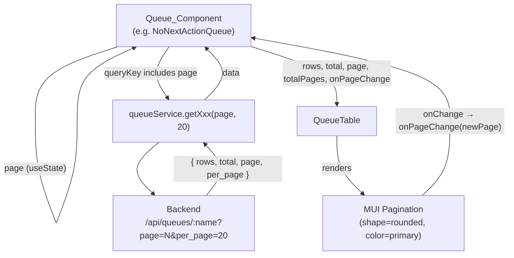

# Design Document: Queue Pagination

## Overview

This feature adds consistent, MUI-based pagination to all seven Actionable Lead Command Center work queues. The backend already supports paginated responses (`{ rows, total, page, per_page }`), but the frontend currently hard-codes page 1 and never exposes navigation controls, leaving the vast majority of leads unreachable (e.g. 68,565 leads in the No Next Action queue).

The change is confined entirely to the frontend. No backend or API changes are required. All pagination state lives in the Queue_Component layer, flows down to `QueueTable` as props, and the `QueueTable` renders the MUI `Pagination` component. The shared `QueueTable` becomes the single implementation point for all pagination UI, guaranteeing visual and behavioral consistency across every queue.

---

## Architecture

The data flow follows the existing unidirectional pattern used by sorting:

```
Queue_Component
  ├── useState(page, setPage)         ← local state, initialized to 1
  ├── useQuery([queryKey, page], fn)  ← page in key forces refetch on change
  ├── derives totalPages = Math.ceil(total / per_page)
  └── renders QueueTable
        ├── props: rows, total, page, totalPages, onPageChange
        └── renders MUI Pagination below the table (when totalPages > 1)
```

There are no new services, no new routes, and no changes to `queueService` — all seven service methods already accept `page` and `per_page` parameters.

### Mermaid Component Diagram



---

## Components and Interfaces

### 1. `QueueTable` — prop additions

The existing `QueueTableProps` interface gains three optional props:

```typescript
export interface QueueTableProps {
  // ... existing props ...

  /** Current 1-based page number. Required when totalPages is provided. */
  page?: number
  /** Total number of pages, computed as Math.ceil(total / per_page). */
  totalPages?: number
  /** Called with the new page number when the user changes page. */
  onPageChange?: (page: number) => void
}
```

All three are optional so existing call-sites compile without changes. The rendered pagination block appears only when `totalPages > 1`.

### 2. `QueueTable` — pagination render block

Added below the existing "Total count" caption, inside the outer `<Box>`:

```tsx
{/* Pagination controls */}
{(totalPages ?? 0) > 1 && (
  <Box
    sx={{ mt: 2, display: 'flex', alignItems: 'center', gap: 2 }}
    aria-label="queue pagination"
    data-testid="queue-pagination"
  >
    <Typography variant="caption" color="text.secondary" data-testid="queue-page-label">
      Page {page} of {totalPages}
    </Typography>
    <Pagination
      count={totalPages}
      page={page}
      shape="rounded"
      color="primary"
      onChange={(_event, value) => onPageChange?.(value)}
      aria-label="queue pagination"
    />
  </Box>
)}
```

**Design decisions:**
- `aria-label="queue pagination"` appears on both the wrapping `<Box>` and the `<Pagination>` component to satisfy requirements 7.1 and 7.2 while matching MUI's own accessibility pattern.
- MUI's `Pagination` component automatically disables the Previous arrow on page 1 and the Next arrow on the last page when `page` and `count` are provided (requirements 7.3, 7.4).
- The label is positioned to the left of the pagination control so it reads naturally left-to-right.

### 3. Queue_Components — state changes

Six components already have `const [page] = useState(1)` but the setter is never exposed. All six need the setter wired up. `TodaysActionQueue` needs the state added from scratch.

The unified pattern for all seven:

```typescript
// State
const [page, setPage] = useState(1)

// Derived value
const totalPages = (data?.total ?? 0) > 0
  ? Math.ceil((data?.total ?? 0) / (data?.per_page ?? 20))
  : 0

// Query — page in queryKey
const { data } = useQuery({
  queryKey: ['queue-<name>', page],
  queryFn: () => queueService.getXxx(page, 20),
  refetchInterval: 60_000,
  refetchIntervalInBackground: false,
})

// Page change handler — clamp to [1, totalPages]
const handlePageChange = (newPage: number) => {
  setPage(Math.min(Math.max(1, newPage), Math.max(1, totalPages)))
}

// Row action callbacks — reset to page 1 after invalidation
const handleXxx = async (row: QueueRow) => {
  await someService.doAction(row.id)
  queryClient.invalidateQueries({ queryKey: ['queue-<name>'] })
  setPage(1)  // ← added to every success path
}

// QueueTable call — conditional pagination props
<QueueTable
  rows={rows}
  total={total}
  rowActions={rowActions}
  {...(totalPages > 1 ? { page, totalPages, onPageChange: handlePageChange } : {})}
/>
```

**Spreading pagination props conditionally** (vs. always passing them) is the chosen approach to satisfy requirements 2.4 and 2.5 cleanly. When `totalPages <= 1`, `QueueTable` receives neither `page` nor `totalPages`, so it never renders pagination — the component's internal guard (`totalPages ?? 0 > 1`) is a second layer of defense.

### 4. `PreviouslyWarmQueue` — existing anomaly

`PreviouslyWarmQueue` already has `useQueryClient` imported and uses it for row actions, but its query key is `['queue-previously-warm']` (no page). It also has no `page` state variable in the current code. It will be aligned to the same pattern as the other six.

---

## Data Models

No new data models are introduced. The `QueuePage` interface already captures all necessary fields:

```typescript
export interface QueuePage {
  rows: QueueRow[];
  total: number;   // used to compute totalPages
  page: number;    // echoed back from backend (not used for display, but available)
  per_page: number; // used as denominator for totalPages
}
```

**`totalPages` derivation** (computed in each Queue_Component, not stored in a type):

```
totalPages = total > 0 ? Math.ceil(total / per_page) : 0
```

| `total` | `per_page` | `totalPages` |
|---------|-----------|--------------|
| 0       | 20        | 0 (no pages) |
| 1       | 20        | 1 (single page, no controls) |
| 20      | 20        | 1 (single page, no controls) |
| 21      | 20        | 2 (controls appear) |
| 68,565  | 20        | 3,429 |

---

## Correctness Properties

*A property is a characteristic or behavior that should hold true across all valid executions of a system — essentially, a formal statement about what the system should do. Properties serve as the bridge between human-readable specifications and machine-verifiable correctness guarantees.*

### Property 1: Pagination renders with correct content for all valid page positions

*For any* `totalPages > 1` and any `page` in `[1, totalPages]`, rendering `QueueTable` with those props should produce a DOM element with `aria-label="queue pagination"` that contains a text node matching `"Page {page} of {totalPages}"` and a `Pagination` component with `count={totalPages}` and `page={page}`.

**Validates: Requirements 1.2, 1.4, 6.1**

### Property 2: Page change callback delivers the correct page number

*For any* `totalPages > 1` and any page button index `i` in `[1, totalPages]`, clicking the corresponding page button in `QueueTable`'s Pagination_Controls should invoke `onPageChange` with exactly the value `i`.

**Validates: Requirements 1.5**

### Property 3: Page clamping holds for all integer inputs

*For any* `totalPages >= 1` and any integer `requestedPage`, the clamping function `clampPage(requestedPage, totalPages)` should return a value in `[1, totalPages]`. Specifically: values below 1 clamp to 1, values above `totalPages` clamp to `totalPages`, and values within range are returned unchanged.

**Validates: Requirements 2.6, 3.3, 3.4**

### Property 4: totalPages computation is correct for all positive totals

*For any* integer `total > 0` and integer `per_page > 0`, the computed `totalPages` should equal `Math.ceil(total / per_page)`. Additionally, for `total = 0`, `totalPages` should equal `0`.

**Validates: Requirements 3.1, 3.2**

### Property 5: Successful row action resets page to 1

*For any* Queue_Component and any initial `page` value `> 1`, when a row action completes successfully (resolves without error), the component's `page` state should be reset to `1`.

**Validates: Requirements 4.1**

### Property 6: Failed row action leaves page unchanged

*For any* Queue_Component and any initial `page` value, when a row action fails (rejects with an error), the component's `page` state should remain at the value it held before the action was triggered.

**Validates: Requirements 4.2**

---

## Error Handling

### Loading state during page transitions

React Query handles this naturally. When `page` changes, the query key changes and a new fetch is triggered. The previous page's data remains visible (`keepPreviousData` is not configured, so `data` will briefly be `undefined`). The existing `rows = data?.rows ?? []` fallback in every Queue_Component renders an empty table during the transition rather than crashing — this is acceptable and consistent with the current initial-load behavior.

If the desired behavior is to keep previous data visible during transition, `placeholderData: keepPreviousData` can be added to `useQuery` — this is deferred to implementation preference.

### totalPages becomes stale after a mutation

When a row action removes a lead from the queue (e.g. Suppress, Reactivate), the total count decreases. The page reset to 1 after `invalidateQueries` ensures the component re-fetches fresh data, resolving any stale `totalPages` value automatically.

### User navigates to a page that no longer exists

If the user is on page 5 and another session removes enough leads that page 5 no longer exists, the backend will return an empty `rows` array for the out-of-range page but will still return a valid `total`. The component will show the empty state rather than an error. On the next successful row action in any queue, the page resets to 1. This edge case is acceptable given the polling interval (60s) will also refresh the total.

### Service errors

Error handling for the fetch itself is unchanged — React Query's `retry` configuration in `queryConfig` handles transient network errors. The existing per-row error display in `QueueTable` covers action failures.

---

## Testing Strategy

### Unit tests (Vitest + React Testing Library)

**`QueueTable.test.tsx` — new test group: pagination**

| Test | What it verifies |
|------|-----------------|
| Renders pagination wrapper when `totalPages > 1` | Req 1.2 |
| Does not render pagination when `totalPages = 1` | Req 1.3 |
| Does not render pagination when `totalPages` is not provided | Req 1.3 |
| Renders "Page X of Y" label for specific (page, totalPages) values | Req 6.1 |
| Clicking a page button calls `onPageChange` with the correct page | Req 1.5 |
| `aria-label="queue pagination"` on the wrapping element | Req 7.1, 7.2 |
| Does not render pagination when `total = 0` | Req 6.2 |

**`NoNextActionQueue.test.tsx` (representative; pattern repeated for all 7)**

| Test | What it verifies |
|------|-----------------|
| Renders pagination controls when service returns `total > per_page` | Req 2.4, 5.1 |
| Does not render pagination when `total <= per_page` | Req 2.5 |
| Page change updates the query call to the service | Req 2.2, 2.3 |
| Successful row action resets page to 1 | Req 4.1 |
| Failed row action leaves page unchanged | Req 4.2 |

**`TodaysActionQueue.test.tsx`**

| Test | What it verifies |
|------|-----------------|
| Fetches with page=1 on mount | Req 2.1 |
| (same set as other queues for pagination behavior) | — |

### Property-based tests (Vitest + fast-check)

**Library:** [fast-check](https://fast-check.io/) — the standard PBT library for TypeScript/JavaScript. Already widely used in the JS ecosystem and well-suited for React component testing with arbitrary inputs.

Each property test must run a minimum of **100 iterations**. Tag format: `// Feature: queue-pagination, Property {N}: {property_text}`

| Property | Test file | Generator |
|----------|-----------|-----------|
| P1: Pagination renders with correct content | `QueueTable.test.tsx` | `fc.integer({ min: 2, max: 100 })` for `totalPages`, `fc.integer({ min: 1 })` mapped to `[1, totalPages]` for `page` |
| P2: Page change delivers correct page number | `QueueTable.test.tsx` | Same as P1 |
| P3: Page clamping holds for all integers | `clampPage.test.ts` (pure function unit) | `fc.integer()` for `requestedPage`, `fc.integer({ min: 1 })` for `totalPages` |
| P4: totalPages computation is correct | `paginationUtils.test.ts` (pure function unit) | `fc.integer({ min: 0, max: 1_000_000 })` for `total`, `fc.integer({ min: 1, max: 100 })` for `per_page` |
| P5: Successful action resets page | `NoNextActionQueue.test.tsx` (representative) | `fc.integer({ min: 2, max: 50 })` for initial `page` |
| P6: Failed action leaves page unchanged | `NoNextActionQueue.test.tsx` (representative) | `fc.integer({ min: 1, max: 50 })` for initial `page` |

**Extraction of pure functions for PBT:**

Properties P3 and P4 test pure arithmetic. These functions should be extracted to a utility module (`frontend/src/utils/pagination.ts`) to make them directly testable without mounting React components:

```typescript
// frontend/src/utils/pagination.ts
export function computeTotalPages(total: number, perPage: number): number {
  return total > 0 ? Math.ceil(total / perPage) : 0
}

export function clampPage(page: number, totalPages: number): number {
  return Math.min(Math.max(1, page), Math.max(1, totalPages))
}
```

Properties P1, P2, P5, and P6 test React component behavior and require rendering in jsdom via React Testing Library.

### Accessibility verification

MUI's `Pagination` component renders a `<nav>` element with `aria-label` and individual page buttons as `<button>` elements with `aria-label="page N"` and `aria-current="true"` for the active page. The disabled state on Previous/Next at boundaries is handled by MUI via `aria-disabled`. These are verified by the example tests for requirements 7.1–7.4.
