# Faster Deploy: Tiered Sync + Incremental Rescore

**Status:** In progress — `feature/faster-deploy` branch.

**Created:** 2026-06-30  
**Context:** Local dev was blocked by empty DB (resolved via GitHub Actions prod dump + `dev.py` auto-restore in PR #82). Granular outreach scoring (`recommended_contact_method`) remains in progress on the feature branch.

---

## Summary

Yes — incremental/tiered post-deploy work is a major opportunity to speed up deploys. **Bulk rescore does not block the GitHub Deploy SSH step today** (it runs async after deploy returns). The plan targets:

1. **GitHub Actions wall-clock time** — sync steps in `deploy.sh` (especially pre-deploy backup + B2 upload)
2. **Post-deploy VPS load** — full HubSpot pipeline + ~75k lead rescoring on every deploy

---

## What happens today

```mermaid
flowchart LR
  subgraph sync_blocks_ssh [Blocks GitHub Deploy SSH session]
    backup["backup.sh --pre-deploy\npg_dump + B2 rclone"]
    pip["pip install"]
    migrate["flask db upgrade"]
    health["Gunicorn health poll\nup to ~260s"]
    celery_restart["Celery restart"]
    dispatch["post_deploy_sync.py\n~seconds"]
  end
  subgraph async_after [Runs after deploy returns]
    pipeline["Full HubSpot pipeline"]
    match["matching - all records"]
    enrich["enrich - live HubSpot API per match"]
    signals["signal extract - all interactions"]
    rescore["bulk_rescore - ALL ~75k leads"]
  end
  backup --> pip --> migrate --> health --> celery_restart --> dispatch
  dispatch --> pipeline --> match --> enrich --> signals --> rescore
```



**Bulk rescore:** Every post-deploy run ends with `run_rescore_leads_after_import()` calling `bulk_rescore(user_id)` with **no `lead_ids` filter** — every lead is recomputed (`backend/app/tasks/hubspot_tasks.py` → `backend/app/services/lead_scoring_engine.py`).

**Not a diff adjustment:** Full recompute from current DB state (lead fields + HubSpot signals + weights). Upstream steps may refresh HubSpot data first; the rescore pass still touches all rows.

**Deploy SSH vs async:** Step 8 in `scripts/deploy.sh` only **dispatches** the pipeline (`backend/scripts/post_deploy_sync.py` → Celery/subprocess). Long "Deploy" steps on GitHub are almost certainly **sync** work:

| Sync blocker | Where | Typical impact |
|---|---|---|
| Pre-deploy backup | `deploy.sh` step 0 → `backup.sh --pre-deploy` | pg_dump ~60MB + `pg_restore --list` + **B2 rclone (up to 3 retries × 300s delay)** |
| Memory wait loop | `deploy.sh` lines 94–107 | Up to **5 min** if RAM low |
| `pip install` | step 2 | Every deploy, even if requirements unchanged |
| Gunicorn health poll | step 6 | Up to **~260s** |
| Deploy concurrency | `.github/workflows/deploy.yml` `deploy-production` group | Second deploy **pending** until first SSH session finishes |

The async pipeline still matters on a 2GB VPS: overlaps nightly Celery jobs (`backend/celery_worker.py` beat) and can slow the *next* deploy via memory pressure.

---

## Phase 1 — GitHub Actions / SSH deploy time

### 1a. Slim pre-deploy backup (largest sync win)

**Problem:** Every deploy runs full backup + optional blocking B2 upload (`scripts/backup.sh` steps 6–11).

**Change:**

- Add `--pre-deploy-fast` used only from `scripts/deploy.sh`:
  - Always run local `pg_dump` (safety)
  - **Skip blocking B2 upload** — background upload or rely on scheduled backups (3×/day per `docs/vps-config.md`)
  - Optionally skip backup if a successful scheduled dump exists within last N hours (e.g. 8h) — configurable
- Keep full blocking backup for manual/scheduled runs

**Expected savings:** minutes to **15+ minutes** when B2 retries fire.

### 1b. Skip redundant `pip install`

Store `requirements.txt` hash at `/home/deploy/.requirements-hash`; skip `pip install` when unchanged.

**Expected savings:** 30s–2min per deploy.

### 1c. Tighten health-check loops

Worst-case ~260s localhost + ~500s public health in `deploy.sh` and `deploy.yml`. Reduce ceiling now that SHA verification exists.

---

## Phase 2 — Post-deploy pipeline: run less

**Problem:** Every deploy dispatches the **full** pipeline (`backend/app/services/hubspot_pipeline_runner.py`):

1. matching (all HubSpot records)
2. enrich (live HubSpot API per confirmed match)
3. convert activities (all engagements)
4. task sync
5. signal extraction (all `hubspot_import` interactions)
6. **bulk rescore all leads**

Most code-only deploys (frontend, docs, local-dev scripts) do not need steps 1–5.

### 2a. Pass deploy context from CI → VPS

In `.github/workflows/deploy.yml`, compute changed paths and pass to deploy:

```bash
bash /home/deploy/deploy.sh '$TARGET_SHA' --changed-paths 'backend/app/services/lead_scoring_engine.py,...'
```

### 2b. Tiered `post_deploy_sync` modes

| Changed paths | Action |
|---|---|
| No HubSpot/scoring paths | **Skip pipeline** (hourly engagement sync may suffice) |
| `lead_scoring_engine*`, `outreach_method*`, `action_engine*`, score-column migrations | **`rescore_only`** — full or column-backfill rescore |
| `hubspot_*`, `hubspot_tasks`, webhooks | **Full pipeline** (current behavior) |
| Migrations + scoring | `rescore_only` after migrate |

Store `last_pipeline_completed_at` in Redis to skip redundant full runs within N hours.

### 2c. Remove duplicate engagement sync

`post_deploy_sync.py` queues `hubspot.scheduled_engagement_sync` in addition to the full pipeline — redundant when enrichment/task sync already ran.

---

## Phase 3 — Incremental rescore (when pipeline runs)

Thread `affected_lead_ids` through pipeline steps; call `bulk_rescore(user_id, lead_ids=affected)` (`lead_scoring_engine.py` already supports `lead_ids`).

**Fallback:** Empty affected set but scoring code version changed → full rescore.

---

## Phase 4 — Safety nets (already exist)

Nightly/hourly Celery jobs already cover catch-up:

- `hubspot-nightly-signal-extraction` + `hubspot-nightly-rescore`
- `hubspot-scheduled-engagement-sync` (hourly)
- `action-engine-nightly-recompute` (4:30 UTC)

Skipping full pipeline on code-only deploys is safe if these remain healthy. Log `last_pipeline_completed_at` and `last_rescore_count`.

---

## Implementation checklist

- [x] **1a** — `backup.sh --pre-deploy-fast`; wire from `deploy.sh`
- [x] **2b** — Tiered post-deploy in `hubspot_pipeline_runner` + `post_deploy_sync`
- [x] **3** — Incremental `affected_lead_ids` → `bulk_rescore`
- [x] **1b** — `pip install` hash skip
- [x] **2a** — Changed-paths manifest from `deploy.yml`
- [x] **2c** — Drop duplicate engagement sync on full pipeline
- [x] **Tests** — `test_post_deploy_sync.py`, `test_hubspot_pipeline_runner.py`, incremental rescore test
- [x] **Metrics** — Redis `last_pipeline_completed_at`

**Recommended order:** 1a → 2b → 3 → 1b → 2c + health tuning

---

## What we should NOT do

- Remove pre-deploy local `pg_dump` without another restore point
- Skip rescore after **scoring logic** deploys (granular outreach needs full or column-backfill rescore once)
- Block deploy on post-deploy pipeline completion (keep async dispatch)

---

## Key files

| File | Role |
|------|------|
| `scripts/deploy.sh` | VPS deploy orchestration (sync blockers) |
| `scripts/backup.sh` | Pre-deploy pg_dump + B2 |
| `.github/workflows/deploy.yml` | CI deploy + health checks |
| `backend/scripts/post_deploy_sync.py` | Post-deploy dispatch |
| `backend/app/services/hubspot_pipeline_runner.py` | Full pipeline definition |
| `backend/app/tasks/hubspot_tasks.py` | `run_rescore_leads_after_import` |
| `backend/app/services/lead_scoring_engine.py` | `bulk_rescore` |
| `backend/celery_worker.py` | Nightly/hourly catch-up jobs |
